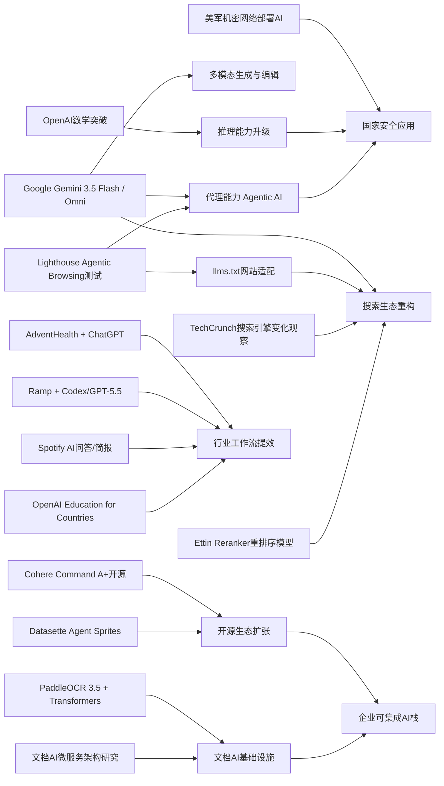

> AI 早报 · 每日早读 · 全网深度聚合

## **今日摘要**

1. 本周AI动态显示，开源与产品落地同步加速：Cohere开源最强模型Command A+，AdventHealth用ChatGPT优化医疗流程，轻量化开源代理工具也在持续迭代。  
2. 前沿方面，Google I/O发布Gemini 3.5 Flash与Omni、强化代理和多模态能力，企业则用Codex等工具显著提速代码评审，同时PaddleOCR 3.5提升了文档识别与现代AI系统的兼容性。  
3. 行业层面，AI正重塑互联网基础设施与信息入口，Google开始测试网站对AI代理的兼容性，而搜索引擎生态也因AI摘要和代理式交互加快洗牌。

### 🔵 产品与功能更新

1. **Cohere开源最强模型Command A+。**  
Cohere发布了目前最强的语言模型（擅长理解和生成文本的AI）Command A+，并采用Apache 2.0许可证开源。对企业和开发者来说，这意味着可以更自由地部署、修改和商用。开源也有助于加快生态建设，让更多应用基于这一模型落地。🚀  
[开源模型发布解读(briefing)](https://the-decoder.com/cohere-open-sources-its-strongest-model-yet/)

2. **AdventHealth用ChatGPT优化医疗流程。**  
AdventHealth正在使用面向医疗场景的ChatGPT，来简化工作流程并减少行政负担。核心目标不是替代医生，而是把更多时间还给患者护理。对普通用户来说，这类应用更接近“医院里的智能助手”，帮助整理信息、提升协作效率。🚀  
[医疗场景应用更新(briefing)](https://openai.com/index/adventhealth)

3. **Datasette Agent Sprites发布0.1a0版本。**  
这是Datasette Agent生态中的一个新组件版本更新，延续了AI代理（可自动执行任务的软件助手）工具链的扩展方向。虽然摘要信息有限，但可以看出开发者仍在快速迭代相关插件能力。对关注轻量化AI工具的人来说，这代表开源代理工具正在持续成形。🚀  
[插件版本更新速览(briefing)](https://simonwillison.net/2026/May/21/datasette-agent-sprites/#atom-everything)

### 🟢 前沿研究

1. **Google I/O发布Gemini 3.5 Flash与Omni。**  
Google在I/O 2026上把Gemini进一步定位为消费者AI与开发者平台，并推出Gemini 3.5 Flash、Gemini Omni以及扩展后的代理技术栈。Gemini 3.5 Flash强调更快的代理式任务与编程表现，Omni则主打多模态（同时处理文字、图片、视频等）生成与编辑。Google还披露其月处理量达到3.2千万亿token（模型处理文本的基本单位），显示出平台规模正迅速扩大。🚀  
[谷歌发布重点汇总(briefing)](https://news.smol.ai/issues/26-05-19-not-much/)

2. **Ramp工程团队用Codex加速代码评审。**  
Ramp介绍了工程师如何使用Codex与GPT-5.5进行代码评审，把原本数小时的反馈缩短到几分钟。这里的代码评审可以理解为“上线前的质量检查”，AI负责先给出结构化建议。对于企业研发团队，这类工具价值在于缩短开发周期，同时提升改动质量。🚀  
[代码评审案例解析(briefing)](https://openai.com/index/ramp)

3. **PaddleOCR 3.5接入Transformers后端。**  
PaddleOCR 3.5开始支持基于Transformers（当前主流深度学习架构）后端运行光学字符识别和文档解析任务。简单说，就是让“看懂扫描件、表格和文档”的能力更容易与现代AI系统衔接。对企业文档处理、票据识别和知识管理来说，这会提升兼容性与部署灵活度。🚀  
[文档识别能力更新(briefing)](https://huggingface.co/blog/PaddlePaddle/paddleocr-transformers)

### 🟡 行业展望与社会影响

1. **Google测试网站对AI代理的兼容性。**  
Google正在Lighthouse分析工具中测试“Agentic Browsing”新类别，用来检查网站是否适合AI代理访问与操作。它还会关注llms.txt这类面向大模型的站点说明文件。对网站运营者来说，这意味着未来不仅要服务人类用户，也要考虑如何让AI助手顺畅读取和执行任务。🚀  
[网站兼容性测试动向(briefing)](https://the-decoder.com/google-tests-websites-for-llms-txt-and-agent-compatibility/)

2. **搜索引擎生态因AI重塑加速变化。**  
TechCrunch盘点了六个值得尝试的搜索引擎，背景是Google搜索结果正被AI概览功能显著改变。对普通用户来说，这不只是界面变化，而是“找信息的方式”正在转向由AI先总结、再给链接。文章反映出一个行业趋势：用户开始重新评估搜索入口与信息可信度。🚀  
[搜索格局变化观察(briefing)](https://techcrunch.com/2026/05/21/six-search-engines-worth-trying-now-that-google-isnt-really-google-anymore/)

3. **OpenAI推进Education for Countries计划。**  
OpenAI宣布推进面向各国教育系统的合作计划，重点包括学校AI应用、教师培训和学习工具落地。其目标是帮助更多教育机构把AI纳入日常教学与管理。对社会层面而言，这类计划会影响未来学生获取知识与老师设计课堂的方式。🚀  
[教育合作计划进展(briefing)](https://openai.com/index/the-next-phase-of-education-for-countries)

### 🟣 开源TOP项目

1. **OlmoEarth v1.1发布更高效地球观测模型。**  
AllenAI发布OlmoEarth v1.1，这是一组更高效的地球观测模型，可用于分析遥感影像（由卫星或航空设备获取的地表图像）。这类模型通常服务于环境监测、农业分析和灾害评估等场景。版本升级强调效率，意味着在实际部署中更省算力、更易落地。🚀  
[地球观测模型更新(briefing)](https://huggingface.co/blog/allenai/olmoearth-v1-1)

2. **文档AI生产化架构研究公开。**  
这篇论文提出了一种面向生产环境的微服务架构，用于整合OCR（文字识别）、分类和大语言模型流程。它关注的不只是模型效果，而是如何把文档AI真正稳定地跑在企业系统里。对行业来说，这类工作补上了“实验室模型”到“生产系统”之间的重要一环。🚀  
[文档AI架构方案(briefing)](https://arxiv.org/abs/2605.18818)

3. **OpenAI模型攻克离散几何重要猜想。**  
OpenAI表示，其模型解决了一个持续80年的单位距离问题，并推翻了离散几何中的一个重要猜想。简单理解，这是AI首次在高难度数学研究中取得被广泛关注的突破。它显示出推理模型（强调多步思考与证明能力的模型）正在从“会答题”走向“能参与研究”。🚀  
[数学突破官方说明(briefing)](https://openai.com/index/model-disproves-discrete-geometry-conjecture)

### 🔴 社媒分享

1. **美军网络司令部加速在机密网络部署AI。**  
美国网络司令部已成立专项团队，推动OpenAI、Google等公司的模型进入最高机密网络。报道提到，先进AI在发现安全漏洞方面可能已接近顶尖人类黑客水平。对外界来说，这说明AI正在快速进入国家安全与网络攻防核心场景。🚀  
[机密网络部署动向(briefing)](https://the-decoder.com/us-cyber-command-races-to-deploy-ai-on-top-secret-networks/)

2. **Spotify为播客加入AI问答与简报功能。**  
Spotify正在为播客增加AI驱动的问答和简报生成功能，用户可基于提示词获得每日或每周内容摘要。简单说，平台希望把长音频变得更容易浏览和消费。对普通用户而言，这会降低追更播客和提取重点信息的门槛。🚀  
[播客AI功能更新(briefing)](https://techcrunch.com/2026/05/21/spotify-adds-ai-powered-qa-and-briefing-generation-features-to-podcasts/)

3. **Ettin Reranker家族亮相。**  
Ettin Reranker是一组重排序模型，用于在搜索或问答系统中把更相关的结果排到前面。虽然它不像聊天机器人那样直接面向用户，但会显著影响“搜到的内容准不准”。这类基础能力的进步，常常会间接提升搜索、推荐和企业知识库体验。🚀  
[重排序模型发布解读(briefing)](https://huggingface.co/blog/ettin-reranker)

---

📊 行业洞察

1. 事实  
   Cohere将最强模型Command A+以Apache 2.0许可证开源；Datasette Agent Sprites持续迭代代理（Agent，可自动执行任务的软件助手）工具链；PaddleOCR 3.5接入Transformers（主流深度学习架构）后端；文档AI生产化架构研究公开，强调OCR（光学字符识别）+分类+大语言模型的微服务落地。  
   【洞察】AI产业正从“单一大模型竞争”转向“开源组件化基础设施竞争”。模型、代理、文档解析、生产架构开始形成可拼装技术栈，企业采购重点会从“谁的模型更强”转向“谁更易集成、可控、可商用、能进生产环境”。

2. 事实  
   Google I/O发布Gemini 3.5 Flash与Omni，强化多模态（同时处理文本、图像、视频等）与代理能力，并披露超大规模token处理量；Google同时在Lighthouse中测试Agentic Browsing（代理式浏览）与llms.txt兼容性；TechCrunch指出搜索入口正因AI概览而被重塑；Ettin Reranker重排序模型发布。  
   【洞察】“搜索”正在升级为“代理可执行的信息操作层”。未来竞争不只是谁能返回答案，而是谁能让AI先理解页面、再筛选结果、最后完成操作。网站、搜索引擎与内容平台都将围绕“可被AI读取、排序、调用和执行”重构分发逻辑。

3. 事实  
   AdventHealth用ChatGPT减少医疗行政负担；Ramp用Codex与GPT-5.5把代码评审从数小时压缩到几分钟；Spotify为播客加入AI问答与简报；OpenAI推进Education for Countries计划。  
   【洞察】AI商业化重心已明显转向“工作流嵌入式提效”，而非单纯聊天入口。医疗、研发、教育、内容平台都在验证同一件事：只要AI能嵌入高频流程并压缩时间成本，就能快速形成ROI（投资回报率）与组织级采购理由。

4. 事实  
   OpenAI模型攻克离散几何重要猜想；美军网络司令部加速在最高机密网络部署OpenAI、Google等模型，并称其漏洞发现能力接近顶尖黑客；Google持续强化代理与编程能力。  
   【洞察】前沿模型能力正同时向“科研推理”和“高敏感安全场景”两端外溢，意味着AI已从效率工具升级为战略能力资产。接下来行业分化将加剧：一端是面向大众的低门槛应用，另一端是围绕科研、国防、安全的高壁垒闭环部署与治理体系。

🗺️ 今日关系图

