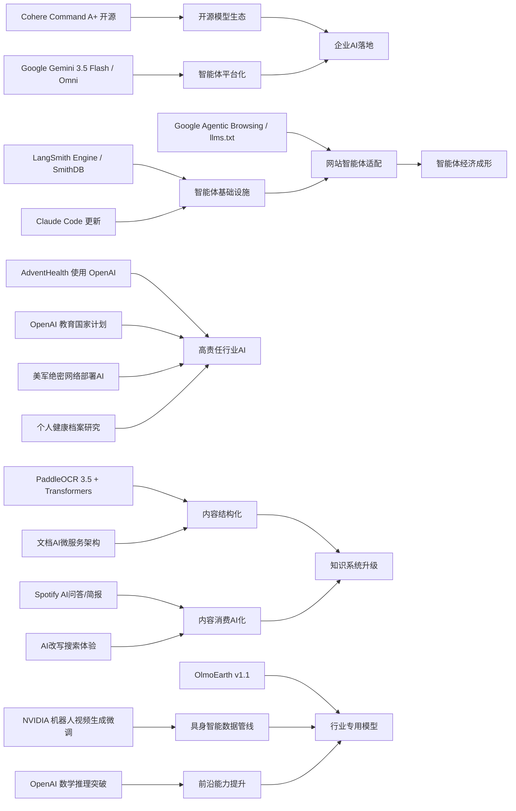

> AI 早报 · 每日早读 · 全网深度聚合

## **今日摘要**

本周AI动态显示，产品落地与开源并进：Cohere开源最强模型Command A+，AdventHealth将OpenAI用于医疗流程减负，LangSmith、Claude Code等工具则在加速智能体开发与部署。  
前沿研究方面，Google推出更快的Gemini 3.5 Flash和多模态Gemini Omni，PaddleOCR 3.5进一步融入Transformers生态，NVIDIA也在探索用高效微调方法支持机器人视频生成。  
行业趋势上，AI正从“模型能力提升”走向“基础设施与生态重构”，例如Google开始测试网站对智能体的友好度，说明未来企业不仅要服务用户，也要面向AI智能体优化内容与流程。

### 🔵 产品与功能更新

1. **Cohere开源最强模型Command A+。**  
Cohere发布了目前最强的语言模型（能理解和生成文本的AI）Command A+，并采用Apache 2.0许可开源。对企业和开发者来说，这意味着可以更灵活地部署、修改和商用，不必完全依赖闭源服务。开源也有助于推动本地化落地和行业定制，让更多团队能基于强模型构建自己的AI产品。🚀  
[查看模型开源动态(briefing)](https://the-decoder.com/cohere-open-sources-its-strongest-model-yet/)

2. **AdventHealth将OpenAI用于医疗流程。**  
AdventHealth正在使用面向医疗场景的ChatGPT，目标是简化工作流程、减少行政负担，并把更多时间还给临床照护。对非技术读者来说，这类应用通常不是替代医生，而是帮助处理文书、信息整理和流程协同。医疗机构若能把AI用在“减负”而非“添乱”上，往往更容易看到实际价值。🚀  
[了解医疗落地案例(briefing)](https://openai.com/index/adventhealth)

3. **LangSmith与Claude Code强化智能体开发。**  
一篇行业汇总显示，面向智能体（能自主执行多步任务的AI程序）的基础设施正在加快完善。LangSmith Engine提供类似CI/CD（持续集成/持续交付）的闭环，帮助团队更稳定地测试和部署智能体；SmithDB则强调低延迟查询，用于可观测性（监控系统运行状态）。同时，Anthropic也在改进Claude Code，让其更适合大型代码库，包括提示缓存诊断和更快模式。🚀  
[查看今日产品盘点(briefing)](https://news.smol.ai/issues/26-05-18-not-much/)

### 🟢 前沿研究

1. **Google发布Gemini 3.5 Flash与Omni。**  
在Google I/O 2026上，Google把Gemini进一步定位为面向消费者和开发者的平台。Gemini 3.5 Flash主打更快的智能体任务和编程任务，Gemini Omni则强调多模态（可同时处理文本、图像、视频等）生成与编辑能力。Google还扩展了其智能体技术栈，显示出其正把模型、工具和平台整合成一体化方案。🚀  
[速览Google I/O发布(briefing)](https://news.smol.ai/issues/26-05-19-not-much/)

2. **PaddleOCR 3.5接入Transformers后端。**  
PaddleOCR 3.5支持用Transformers（当前主流神经网络架构）后端运行文字识别和文档解析任务。这意味着文档AI（处理扫描件、表格、票据等的AI）与大模型生态的结合更紧密，部署和扩展也可能更方便。对企业来说，这类能力直接关系到发票处理、合同提取、档案数字化等场景。🚀  
[查看文档识别更新(briefing)](https://huggingface.co/blog/PaddlePaddle/paddleocr-transformers)

3. **NVIDIA探索机器人视频生成微调。**  
NVIDIA分享了如何用LoRA/DoRA（参数高效微调方法）微调Cosmos Predict 2.5，用于机器人视频生成。简单说，就是通过更省资源的方式，让模型更适配机器人训练或模拟场景中的视频需求。此类研究有助于降低机器人视觉数据生成成本，并加快训练迭代。🚀  
[了解机器人视频生成(briefing)](https://huggingface.co/blog/nvidia/cosmos-fine-tuning-for-robot-video-generation)

### 🟡 行业展望与社会影响

1. **Google测试网站的“智能体友好度”。**  
Google正在Lighthouse分析工具中测试“Agentic Browsing”新分类，用来检查网站对AI智能体访问是否友好。报道提到，Google会关注llms.txt这类文件，帮助网站向大模型或智能体表达访问规则与内容偏好。如果这一方向普及，未来网站优化对象可能不只是人类读者，还包括会“读网页、做任务”的AI。🚀  
[查看网站适配趋势(briefing)](https://the-decoder.com/google-tests-websites-for-llms-txt-and-agent-compatibility/)

2. **OpenAI推进“面向国家的教育计划”。**  
OpenAI宣布推进Education for Countries，扩大学校中的AI采用，包括新合作、教师培训以及教学工具。其核心目标是帮助教育系统更系统地引入AI，而不只是零散试点。对社会层面来说，这反映出AI竞争正从企业应用走向国家级人才与教育基础设施建设。🚀  
[了解教育计划进展(briefing)](https://openai.com/index/the-next-phase-of-education-for-countries)

3. **搜索引擎市场因AI改写体验。**  
TechCrunch讨论了在Google搜索体验持续AI化之后，用户还可以尝试哪些替代搜索引擎。文章背后的核心信号是：AI摘要和答案式搜索正在改变人们获取信息的方式，也可能改变流量分配和用户习惯。对于普通用户，未来“搜索”可能越来越像“提问”；但对内容网站来说，这也带来新的可见性压力。🚀  
[看看搜索格局变化(briefing)](https://techcrunch.com/2026/05/21/six-search-engines-worth-trying-now-that-google-isnt-really-google-anymore/)

### 🟣 开源TOP项目

1. **OpenAI模型攻克离散几何难题。**  
OpenAI表示，其模型推翻了离散几何（研究点、线、图形离散结构的数学分支）中的一个重要猜想，解决了存在80年的单位距离问题。这被视为AI在数学推理上的里程碑，说明模型不仅能复述知识，也开始在部分前沿问题上提出新证明路径。对开源与研究社区而言，这会进一步刺激自动化推理工具的发展。🚀  
[查看数学突破原文(briefing)](https://openai.com/index/model-disproves-discrete-geometry-conjecture)

2. **OlmoEarth v1.1提升地球观测效率。**  
AllenAI介绍了OlmoEarth v1.1，这是一组更高效的地球观测模型。此类模型主要用于卫星影像等遥感数据分析，可支持农业、灾害监测、环境变化追踪等任务。效率提升通常意味着更低的计算成本和更广泛的实际部署可能。🚀  
[了解地球观测模型(briefing)](https://huggingface.co/blog/allenai/olmoearth-v1-1)

3. **文档AI生产架构走向微服务化。**  
一篇arXiv论文提出了把OCR（光学字符识别）和大模型流程以微服务架构组织起来的生产方案。它关注的不是单个模型多强，而是如何让分类、识别、抽取等多个环节在真实业务中稳定协作。对企业来说，这类架构型工作往往决定AI能否从实验室走进大规模生产。🚀  
[查看文档AI架构(briefing)](https://arxiv.org/abs/2605.18818)

### 🔴 社媒分享

1. **美军网络司令部加速在绝密网络部署AI。**  
报道称，美国网络司令部已成立专项力量，准备在五角大楼和美国国家安全局的绝密网络中运行来自OpenAI、Google等公司的模型。推动因素之一是，先进AI在发现安全漏洞上的速度可能已接近甚至超过顶尖人工专家。这个趋势说明，AI正快速进入高敏感度的国家安全场景。🚀  
[查看绝密网络动向(briefing)](https://the-decoder.com/us-cyber-command-races-to-deploy-ai-on-top-secret-networks/)

2. **Spotify为播客加入AI问答与简报。**  
Spotify正在为播客加入AI驱动的问答和简报生成功能，用户可以基于提示词生成每日或每周内容摘要。对普通听众来说，这能降低播客内容获取门槛，让长音频更容易被快速消费。对平台而言，这也是把AI从“推荐”推进到“内容理解与整理”的一步。🚀  
[了解播客新功能(briefing)](https://techcrunch.com/2026/05/21/spotify-adds-ai-powered-qa-and-briefing-generation-features-to-podcasts/)

3. **个人健康档案或提升健康AI个性化。**  
一篇arXiv研究评估了个人健康记录（由患者管理的健康信息）对个性化健康AI的作用。研究关注的是，当模型获得更多个人临床背景后，是否能更好回答用户健康问题。虽然这类方向潜力很大，但也直接涉及隐私、安全和医学准确性等高敏感议题。🚀  
[查看健康AI研究(briefing)](https://arxiv.org/abs/2605.18937)

---

📊 行业洞察

1. 事实  
   Cohere开源最强模型Command A+，采用Apache 2.0许可；Google在I/O上发布Gemini 3.5 Flash与Gemini Omni，并持续扩展智能体技术栈。  
   【洞察】基础模型竞争正从“单纯拼性能”转向“开放性+平台化”双线博弈：一边是Cohere用开源与宽松商用许可降低企业二次开发门槛，另一边是Google把模型、工具、智能体框架打包成平台。未来企业选型的关键，不只是模型能力，而是谁能提供更低迁移成本、更强生态锁定和更快落地速度。

2. 事实  
   LangSmith Engine与SmithDB强化智能体开发、测试与可观测性（监控系统运行状态）；Google开始在Lighthouse测试“Agentic Browsing”，关注llms.txt等网站对智能体的适配；Anthropic也在改进Claude Code以支持大型代码库。  
   【洞察】智能体（能自主执行多步任务的AI程序）正从“Demo阶段”走向“工程化阶段”。行业焦点已不再只是让智能体“能做事”，而是让其“可测试、可监控、可部署、可访问外部环境”。这意味着下一轮竞争高地将落在智能体基础设施、网站适配标准和开发工作流上，类似早期云计算中的DevOps（开发运维一体化）基础设施机会正在出现。

3. 事实  
   AdventHealth将OpenAI用于医疗流程减负；OpenAI推进“Education for Countries”计划；美军网络司令部加速在绝密网络部署OpenAI、Google等模型；个人健康档案研究显示更丰富的个体数据可能提升健康AI个性化。  
   【洞察】AI落地正在从互联网和办公场景，全面进入“高责任行业”（如医疗、教育、国防）。这些领域的共同特征不是追求炫技，而是追求流程增效、决策辅助和体系级部署。因此，未来行业壁垒将更多体现在数据治理、合规审计、私有化部署和安全隔离，而不是通用聊天能力本身。

4. 事实  
   PaddleOCR 3.5接入Transformers后端；文档AI生产架构走向微服务化（将OCR、分类、抽取等能力拆分部署）；Spotify为播客加入AI问答与简报；搜索引擎市场因AI摘要和答案式搜索而重塑体验。  
   【洞察】AI价值链正在从“生成内容”延伸到“理解内容—重组内容—分发内容”。无论是文档、播客还是网页，核心趋势都是把非结构化数据转成可检索、可摘要、可交互的资产。这将推动企业加速建设内容中台、知识库与多模态检索系统（支持文本/图像/音频联合检索），并重塑流量分发与内容变现逻辑。

🗺️ 今日关系图

