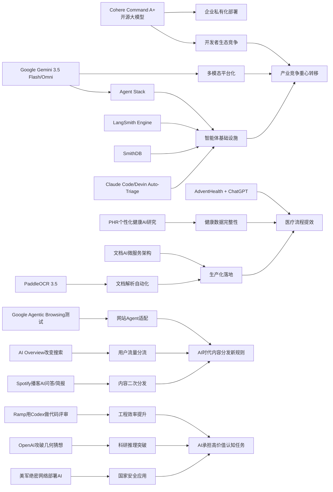

> AI 早报 · 每日早读 · 全网深度聚合

## **今日摘要**

近期AI进展主要体现在三方面：一是产品层面，Cohere开源最强模型Command A+、医疗机构开始用ChatGPT优化流程、智能体基础设施也在快速升级。  
二是研究与应用层面，Google发布更快更强的Gemini新版本，PaddleOCR 3.5结合Transformer提升文档处理能力，OpenAI则展示了AI在代码评审中的提效价值。  
三是行业趋势上，网站开始考虑如何适配AI智能体访问，同时AI也正进一步进入教育、医疗、开发等真实业务场景，显示竞争重点正从“模型能力”转向“实际落地”。

### 🔵 产品与功能更新

1. **Cohere开源最强模型Command A+。**  
Cohere发布了目前最强的语言模型Command A+，并采用Apache 2.0许可证开源，意味着企业和开发者可以更自由地商用与二次开发。对非技术团队来说，这类“开源大模型”通常代表更低的接入门槛和更可控的部署方式。它也反映出头部厂商正在把高性能模型能力进一步向社区释放。🚀  
[查看开源模型动态(briefing)](https://the-decoder.com/cohere-open-sources-its-strongest-model-yet/)

2. **AdventHealth用ChatGPT优化医疗流程。**  
AdventHealth正在使用面向医疗场景的ChatGPT，目标是简化工作流、减少行政负担，并把更多时间还给患者护理。对医院而言，这类应用更偏向“提效工具”，而不是替代医生本身。它说明生成式AI（可生成文本内容的人工智能）正持续进入真实医疗运营环节。🚀  
[了解医疗落地案例(briefing)](https://openai.com/index/adventhealth)

3. **LangSmith Engine与SmithDB推动智能体基础设施升级。**  
当天的行业观察提到，面向智能体（Agent，可自主执行任务的软件助手）的基础设施正在快速推进。LangSmith Engine主打CI/CD循环（持续集成/持续交付，帮助系统持续测试和上线），SmithDB则聚焦低延迟查询与可观测性（方便监控系统运行状态）。同时，Cognition的Devin Auto-Triage和Anthropic对Claude Code的改进，也显示“让AI稳定处理复杂工作”正在成为产品竞争重点。🚀  
[速览智能体新进展(briefing)](https://news.smol.ai/issues/26-05-18-not-much/)

### 🟢 前沿研究

1. **Google发布Gemini 3.5 Flash与Omni。**  
Google在I/O 2026上把Gemini进一步定位为面向消费者和开发者的平台，并推出Gemini 3.5 Flash、Gemini Omni以及扩展后的Agent Stack（智能体技术栈）。其中Flash强调速度和代码任务，Omni则面向多模态生成（同时处理文本、图片、视频等内容）与编辑。这说明大模型竞争正从“更聪明”转向“更快、更全能、更适合做事”。🚀  
[查看Google重磅发布(briefing)](https://news.smol.ai/issues/26-05-19-not-much/)

2. **PaddleOCR 3.5接入Transformers后端。**  
PaddleOCR 3.5开始支持基于Transformers（主流深度学习模型架构）的后端，用于OCR（光学字符识别）和文档解析任务。这有助于把传统文档识别与新一代大模型能力结合起来，提升复杂版面和多步骤处理的效果。对企业来说，票据、合同、表单等处理流程可能因此变得更自动化。🚀  
[了解文档识别升级(briefing)](https://huggingface.co/blog/PaddlePaddle/paddleocr-transformers)

3. **Ramp工程团队用Codex加速代码评审。**  
OpenAI介绍了Ramp工程师如何结合Codex与GPT-5.5进行代码评审，把原本数小时的反馈缩短到几分钟。这里的重点不只是“写代码”，而是让AI在开发流程中承担更早期、更高频的审查工作。对研发团队而言，这种变化可能直接影响交付速度和工程质量。🚀  
[查看代码评审案例(briefing)](https://openai.com/index/ramp)

### 🟡 行业展望与社会影响

1. **Google测试网站是否适配AI智能体访问。**  
Google正在Lighthouse分析工具中测试“Agentic Browsing”实验分类，用来检查网站对AI智能体访问是否友好，也会关注llms.txt这类规范文件。简单说，未来网站不仅要对人类访客友好，也要对AI访问和理解友好。这个变化可能影响内容分发、网站建设和搜索优化的新规则。🚀  
[查看网站适配趋势(briefing)](https://the-decoder.com/google-tests-websites-for-llms-txt-and-agent-compatibility/)

2. **OpenAI推进“Education for Countries”计划。**  
OpenAI宣布其面向各国教育体系的计划进入下一阶段，将通过新合作、教师培训和工具支持推动学校采用AI。重点不只是部署工具，而是把AI真正嵌入教学与学习流程。对社会层面而言，教育场景正成为AI普及速度最快、影响最深的领域之一。🚀  
[了解教育计划进展(briefing)](https://openai.com/index/the-next-phase-of-education-for-countries)

3. **搜索引擎格局因AI改写引发用户分流。**  
TechCrunch盘点了六个值得尝试的搜索引擎，背景是Google搜索正在被AI Overview（AI摘要结果）深度改变。文章反映出一个更广泛趋势：当搜索结果被AI重组后，部分用户开始主动寻找替代方案。对内容平台和品牌来说，流量入口正在发生结构性变化。🚀  
[查看搜索变局观察(briefing)](https://techcrunch.com/2026/05/21/six-search-engines-worth-trying-now-that-google-isnt-really-google-anymore/)

### 🟣 开源TOP项目

1. **OlmoEarth v1.1发布更高效遥感模型。**  
AllenAI推出OlmoEarth v1.1，这是一组更高效的地球观测模型，面向遥感影像等任务。此类模型可用于环境监测、农业分析和灾害响应等领域。对开源社区来说，垂直领域模型持续成熟，说明AI能力正在从通用走向专业。🚀  
[查看遥感模型更新(briefing)](https://huggingface.co/blog/allenai/olmoearth-v1-1)

2. **OpenAI模型攻破80年离散几何猜想。**  
OpenAI公布，其模型解决了一个存在80年的单位距离问题，并推翻了离散几何中的一个重要猜想。这个结果被视为AI数学推理的重要里程碑，说明模型不只是做题，更开始参与真正的前沿发现。它也让外界重新评估AI在科研中的角色边界。🚀  
[阅读数学突破详情(briefing)](https://openai.com/index/model-disproves-discrete-geometry-conjecture)

3. **文档AI生产化架构研究聚焦微服务方案。**  
一篇新论文讨论了如何用微服务架构（把大系统拆成多个小服务协同运行）来落地文档AI生产系统，整合分类、OCR和大语言模型（LLM）流水线。相比只关注模型精度，这项工作更强调“怎么真正跑起来并稳定服务业务”。对企业实践而言，这类研究比单纯模型榜单更接近现实价值。🚀  
[查看文档AI架构研究(briefing)](https://arxiv.org/abs/2605.18818)

### 🔴 社媒分享

1. **美军网络司令部加速在绝密网络部署AI。**  
美国网络司令部已组建专项团队，计划在五角大楼和美国国家安全局的绝密网络中运行OpenAI、Google等公司的模型。推动因素之一是，先进AI系统在发现安全漏洞方面已接近顶尖人类黑客水平。这表明AI在国家安全与网络攻防中的战略意义正迅速上升。🚀  
[查看绝密网络新动向(briefing)](https://the-decoder.com/us-cyber-command-races-to-deploy-ai-on-top-secret-networks/)

2. **Spotify为播客加入AI问答与简报功能。**  
Spotify正在给播客加入AI驱动的问答和简报生成功能，用户可按提示词生成每日或每周内容摘要。对普通用户而言，这会让长内容消费更高效，也更个性化。对平台来说，AI正在从推荐系统进一步深入到内容理解与再加工。🚀  
[了解播客AI新功能(briefing)](https://techcrunch.com/2026/05/21/spotify-adds-ai-powered-qa-and-briefing-generation-features-to-podcasts/)

3. **个人健康档案或提升个性化健康AI效果。**  
一篇新研究评估了个人健康记录（PHR，由患者自己管理的健康档案）在个性化健康AI中的作用。结果关注的是，当模型获得更完整的临床数据后，是否能更好回答用户的健康问题。它提示我们，未来健康AI的价值不仅取决于模型本身，也取决于数据是否完整、可用且易理解。🚀  
[查看健康AI研究摘要(briefing)](https://arxiv.org/abs/2605.18937)

---

📊 行业洞察

1. 事实  
   Cohere开源最强模型Command A+，并采用Apache 2.0许可证开放商用与二次开发；Google在I/O 2026发布Gemini 3.5 Flash、Gemini Omni和扩展后的Agent Stack（智能体技术栈）；LangSmith Engine、SmithDB、Claude Code、Devin Auto-Triage等基础设施与工程工具同步升级。  
   【洞察】判断  
   大模型竞争正在从“单点模型能力”转向“模型开放性 + 智能体工程化 + 平台生态”的三线竞争。开源许可证降低了企业私有化部署门槛，Google则用平台化产品强化开发者锁定，LangSmith/SmithDB这类基础设施补齐了Agent生产环境中最关键的可观测性（监控系统状态）、低延迟与CI/CD（持续集成/持续交付）短板。未来头部厂商的胜负手，不再只是参数规模，而是谁能率先把“可用的智能体系统”变成标准化供给。

2. 事实  
   AdventHealth用医疗版ChatGPT优化医院行政流程；个人健康档案PHR（患者自主管理健康记录）研究显示，更完整数据有助于提升个性化健康AI效果；文档AI生产化架构论文强调以微服务架构整合OCR（光学字符识别）、分类和LLM（大语言模型）流水线；PaddleOCR 3.5接入Transformers后端，强化复杂文档解析能力。  
   【洞察】判断  
   医疗AI正从“对话入口”走向“数据与流程深整合”。医院场景的核心价值已不只是问答助手，而是将病历、表单、票据、PHR等非结构化数据转化为可被工作流直接消费的机器可读资产。谁能打通文档解析、数据治理和合规部署，谁就更可能拿下医疗AI的真实预算。换言之，医疗行业下一阶段比拼的是“系统集成能力”，而非单纯模型演示效果。

3. 事实  
   Google测试网站对Agentic Browsing（智能体式浏览）的适配，并关注llms.txt等规范；Google搜索因AI Overview（AI摘要结果）改写而引发用户分流，TechCrunch盘点替代搜索引擎；Spotify为播客加入AI问答与简报功能，让平台直接重组长内容消费方式。  
   【洞察】判断  
   内容分发规则正在从“搜索引擎优化”升级为“AI可访问性优化”。未来网站、媒体和内容平台不仅要争夺人类点击，还要争夺被AI抓取、理解、摘要和二次分发的资格。llms.txt、结构化内容、可供Agent调用的页面设计，可能成为新的流量基础设施。对于品牌和出版商而言，流量入口正从“搜索结果页”迁移到“AI生成界面”，内容价值链将被重新分配。

4. 事实  
   Ramp工程团队结合Codex与GPT-5.5将代码评审从数小时缩短到几分钟；OpenAI模型攻破80年离散几何猜想；美国网络司令部加速在绝密网络中部署OpenAI、Google等模型，用于网络安全与漏洞发现。  
   【洞察】判断  
   AI能力边界正在从“辅助生成”扩展到“高价值认知劳动”。代码评审属于高频工程决策，数学猜想突破属于前沿科研推理，绝密网络部署则对应国家级安全场景——三者共同说明，AI已开始进入对准确性、时效性和可信度要求极高的任务链条。这意味着企业对AI的评估指标将从“能不能用”升级为“能否承担关键职责”，并进一步推动审计、验证、安全隔离等可信AI能力成为采购重点。

🗺️ 今日关系图

