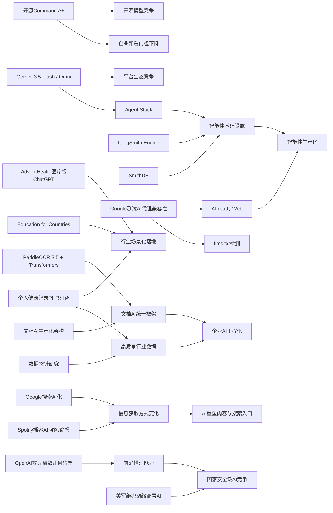

> AI 早报 · 每日早读 · 全网深度聚合

## **今日摘要**

本次更新显示，AI正同时在三条线快速推进：一是Cohere开源最强模型Command A+、Google发布Gemini 3.5 Flash与Omni，说明模型能力与开放生态都在加速升级。  
二是AdventHealth用ChatGPT减轻医疗行政负担、PaddleOCR 3.5接入Transformers、LangSmith Engine与SmithDB完善智能体基础设施，表明AI正在从实验走向更稳定的企业落地。  
三是Google测试网站的AI代理兼容性、OpenAI推进全球教育计划，以及“数据探针”研究关注高价值训练数据，意味着AI的影响正从技术产品扩展到网络规则、教育体系和长期产业竞争。

### 🔵 产品与功能更新

1. **Cohere开源最强模型Command A+。**
Cohere发布了目前最强的语言模型（能理解和生成文本的AI）Command A+，并采用Apache 2.0开源许可。对企业和开发者来说，这意味着可以更自由地部署、改造和集成该模型。开源也有助于更多团队验证性能、降低使用门槛。🚀  
[查看开源模型详情(briefing)](https://the-decoder.com/cohere-open-sources-its-strongest-model-yet/)

2. **AdventHealth用ChatGPT减轻医疗行政负担。**
AdventHealth正在使用面向医疗场景的ChatGPT，目标是简化工作流程、减少文书与行政压力。官方表述强调，这能把更多时间还给医生和护理人员，用于直接服务患者。对于非技术行业来说，这类案例显示AI正从“试点”走向更明确的业务落地。🚀  
[了解医疗落地案例(briefing)](https://openai.com/index/adventhealth)

3. **LangSmith Engine与SmithDB强化智能体基础设施。**
当天的行业汇总显示，智能体（可自主执行任务的AI系统）基础设施正在快速完善。LangSmith Engine主打给智能体提供CI/CD（持续集成/持续交付）闭环，SmithDB则用于低延迟查询与可观测性（监控系统运行状态）。这意味着企业未来部署AI助手时，不只是“能用”，还会更强调稳定性、调试和持续优化。🚀  
[浏览产品更新汇总(briefing)](https://news.smol.ai/issues/26-05-18-not-much/)

### 🟢 前沿研究

1. **Google发布Gemini 3.5 Flash与Omni。**
在Google I/O 2026上，Google进一步把Gemini定位为面向消费者和开发者的平台。Gemini 3.5 Flash更偏向快速智能体与编程任务，Gemini Omni则强调多模态（同时处理文字、图片、音频、视频）生成与编辑能力。配合扩展后的Agent Stack（智能体技术栈），Google正试图把模型、工具和工作流整合成一套完整生态。🚀  
[查看I/O发布梳理(briefing)](https://news.smol.ai/issues/26-05-19-not-much/)

2. **PaddleOCR 3.5接入Transformers后端。**
PaddleOCR 3.5展示了用Transformers（当前主流神经网络架构）后端运行OCR（文字识别）与文档解析任务的方案。它反映出文档AI正在朝统一模型框架靠拢，减少过去多套工具分裂使用的问题。对企业用户来说，这会提升部署一致性，也更利于后续与大模型串联。🚀  
[查看文档识别更新(briefing)](https://huggingface.co/blog/PaddlePaddle/paddleocr-transformers)

3. **数据探针研究聚焦“什么数据真正有用”。**
这篇论文提出应发展“数据探针”，从根本上理解不同数据如何影响大语言模型（LLM，大型语言模型）的训练、微调和对齐效果。作者认为，目前行业过度依赖大规模试验，却缺少系统性的解释工具。若这一方向成熟，未来训练模型不一定只靠“堆更多数据”，而是更精准地判断哪些数据真正带来能力提升。🚀  
[阅读数据探针论文(briefing)](https://arxiv.org/abs/2605.18801)

### 🟡 行业展望与社会影响

1. **Google开始测试网站的AI代理兼容性。**
Google正在Lighthouse网站分析工具中测试“Agentic Browsing”实验分类，用来检查网站是否适配AI代理（可代替用户浏览和执行操作的AI）。其中包括对llms.txt这类面向模型的站点说明文件进行检测。这个变化说明，未来网站优化对象可能不再只有“人类访客”和“搜索引擎”，还要考虑“AI访问者”。🚀  
[了解网站兼容测试(briefing)](https://the-decoder.com/google-tests-websites-for-llms-txt-and-agent-compatibility/)

2. **OpenAI推进“Education for Countries”新阶段。**
OpenAI宣布扩展“Education for Countries”计划，继续推动AI在学校体系中的应用。重点包括新合作伙伴、教师培训和教学工具，希望提升全球教育效果。它反映出AI竞争已从模型能力延伸到公共服务与国家级教育基础设施。🚀  
[查看教育项目进展(briefing)](https://openai.com/index/the-next-phase-of-education-for-countries)

3. **当Google搜索越来越像AI产品，替代搜索引擎受关注。**
TechCrunch梳理了6款值得尝试的搜索引擎，背景是Google搜索正因AI Overview（AI生成摘要）而发生明显变化。对普通用户而言，这不只是界面更新，而是获取信息方式的变化：从“自己筛选网页”转向“先看AI给的总结”。这也让搜索市场再次出现重新分流的可能。🚀  
[看看搜索替代选择(briefing)](https://techcrunch.com/2026/05/21/six-search-engines-worth-trying-now-that-google-isnt-really-google-anymore/)

### 🟣 开源TOP项目

1. **OlmoEarth v1.1提升地球观测模型效率。**
AllenAI发布OlmoEarth v1.1，这是一组更高效的地球观测模型，面向遥感与环境数据分析等场景。此类模型可帮助研究者和机构更快处理卫星图像、土地变化等任务。对开源社区来说，专用模型家族的持续更新，意味着AI正更深入进入垂直科研领域。🚀  
[查看遥感模型更新(briefing)](https://huggingface.co/blog/allenai/olmoearth-v1-1)

2. **文档AI生产化架构论文给出落地方案。**
这篇论文讨论如何用微服务架构（把系统拆成多个独立服务）部署文档AI，把分类、OCR（文字识别）和大语言模型串成生产流水线。它试图弥合学术界“模型很强”和企业界“系统难上线”之间的落差。对于正在做票据、合同、表单处理的团队，这类工程化方法比单一模型分数更有参考价值。🚀  
[阅读文档AI架构(briefing)](https://arxiv.org/abs/2605.18818)

3. **OpenAI模型攻克80年离散几何猜想。**
OpenAI表示，其模型成功解决了一个存在80年的单位距离问题，并推翻了离散几何中的一个重要猜想。该成果被视为AI数学推理的重要里程碑，显示模型不仅能做题，还可能参与真正的前沿研究。对开源与学术社区而言，这也会推动大家重新评估AI在数学发现中的角色。🚀  
[查看数学突破原文(briefing)](https://openai.com/index/model-disproves-discrete-geometry-conjecture)

### 🔴 社媒分享

1. **美军网络司令部加速在绝密网络部署AI。**
报道称，美国网络司令部已成立专项团队，计划在五角大楼和NSA的最高机密网络中运行OpenAI、Google等公司的模型。推动因素之一是，AI已被认为能比顶尖人工黑客更快发现部分安全漏洞。此事说明，AI竞赛正在快速延伸到国家安全和网络战层面。🚀  
[查看绝密网络动向(briefing)](https://the-decoder.com/us-cyber-command-races-to-deploy-ai-on-top-secret-networks/)

2. **Spotify为播客加入AI问答与简报生成功能。**
Spotify正在为播客加入AI驱动的问答和简报功能，用户可按提示词生成每日或每周内容摘要。这让播客消费从“被动收听”转向“按需提炼信息”。对内容平台来说，AI正在成为提升留存和内容再加工能力的重要工具。🚀  
[了解播客AI新功能(briefing)](https://techcrunch.com/2026/05/21/spotify-adds-ai-powered-qa-and-briefing-generation-features-to-podcasts/)

3. **个人健康记录或提升个性化健康AI效果。**
这篇论文评估了个人健康记录（PHR，患者自行管理的健康档案）在个性化健康AI中的价值。研究关注当大语言模型结合临床数据后，是否能更有效回答用户的健康问题。它提示我们，医疗AI的关键不仅在模型本身，也在于高质量、可用的个人数据输入。🚀  
[阅读健康AI研究(briefing)](https://arxiv.org/abs/2605.18937)

---

📊 行业洞察

1. 事实  
   Cohere开源最强模型Command A+，采用Apache 2.0许可；同时Google在I/O上发布Gemini 3.5 Flash、Gemini Omni，并扩展Agent Stack（智能体技术栈）。  
   【洞察】大模型竞争正在从“单点模型能力”升级为“开源策略+平台生态”的双线战争。Cohere通过开源降低企业采用门槛，抢占开发者心智；Google则通过模型、工具链、工作流一体化提高生态锁定效应。未来企业选型将不只看基准测试，而会更看重“可控性（便于私有化部署）”与“生态完备度（工具、工作流、集成能力）”。

2. 事实  
   LangSmith Engine与SmithDB补强智能体CI/CD（持续集成/持续交付）、低延迟查询和可观测性；Google开始测试网站的AI代理兼容性，包括llms.txt检测；Google Gemini也同步强化Agent Stack。  
   【洞察】智能体正在从“能演示”走向“可生产化”。这表明行业瓶颈已从模型推理能力转向基础设施成熟度，包括观测、调试、部署闭环，以及外部环境适配。接下来会形成新一轮B2B机会：一端是“AgentOps（智能体运维）”工具，另一端是“AI-ready Web（面向AI代理优化的网站基础设施）”。谁能先打通这两端，谁就更可能成为企业级智能体落地的关键入口。

3. 事实  
   AdventHealth使用医疗版ChatGPT减轻行政负担；OpenAI推进“Education for Countries”进入新阶段；个人健康记录（PHR，个人健康档案）研究显示高质量数据可增强个性化健康AI。  
   【洞察】AI在公共服务和强监管行业的落地逻辑，正从“通用助手提效”转向“场景化系统重构”。医疗和教育的共同点是：模型本身不是全部，真正壁垒来自工作流嵌入、数据治理、培训体系和机构协同。对产业而言，这意味着下一阶段赢家未必是模型最强者，而是能把AI做成“行业基础设施”的平台方与解决方案商。

4. 事实  
   PaddleOCR 3.5接入Transformers后端，推动OCR与文档解析统一到主流模型框架；文档AI生产化架构论文强调用微服务（模块化独立服务）串联分类、OCR和LLM；数据探针研究则提出应精确识别“什么数据真正有用”。  
   【洞察】企业AI正在从“堆模型”转向“重数据、重系统、重集成”的工程阶段。文档AI与数据探针两类进展共同说明，未来竞争力不只来自更大的模型，而来自统一框架、可复用流水线以及更高质量的数据选择机制。换言之，AI生产力提升的核心，将越来越体现在“数据资产运营能力”而非单纯算力投入。

🗺️ 今日关系图

