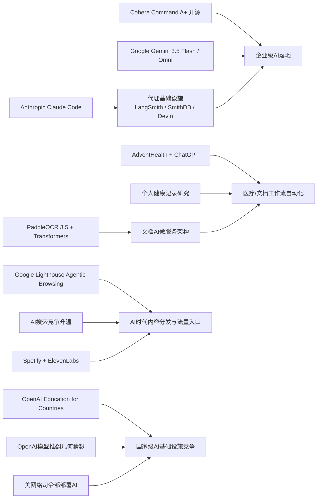

> AI 早报 · 每日早读 · 全网深度聚合

## **今日摘要**

Cohere开源了其最强模型Command A+，Google发布Gemini 3.5 Flash与Omni，说明高性能大模型与多模态平台竞争都在加速。  
与此同时，AI正更深入落地到医疗、教育和文档处理等实际场景，比如AdventHealth用ChatGPT减轻行政负担、OpenAI推进国家级教育计划、PaddleOCR升级文档理解能力。  
行业层面，代理式AI相关基础设施和网站适配正在快速推进，意味着未来不仅软件开发流程会更自动化，网站和服务也需要开始为AI代理优化。

### 🔵 产品与功能更新

1. **Cohere开源最强模型Command A+。**  
Cohere发布了目前最强的语言模型（能理解和生成文本的AI）Command A+，并采用Apache 2.0开源许可，方便企业和开发者直接使用与二次开发。对市场来说，这意味着高性能大模型的可获取性又提升了一步。对于非技术用户，开源通常也意味着后续会更快看到更多基于它的应用与服务。🚀  
[查看开源模型详情(briefing)](https://the-decoder.com/cohere-open-sources-its-strongest-model-yet/)

2. **AdventHealth用ChatGPT减轻医疗行政负担。**  
AdventHealth正在将ChatGPT for Healthcare引入医疗流程，用于简化工作流、减少文书与行政操作，让医护人员把更多时间留给患者。这个方向并不是替代医生，而是优先处理重复性强、耗时长的辅助工作。对普通人来说，最直接的影响可能是就医体验和响应效率的提升。🚀  
[了解医疗场景应用(briefing)](https://openai.com/index/adventhealth)

3. **Anthropic与代理基础设施持续升级。**  
当天虽然“没有大新闻”，但AI代理（可自主执行多步任务的系统）基础设施更新不少。LangSmith Engine加入更完整的CI/CD闭环（持续集成/持续交付，便于反复测试和上线），SmithDB强调低延迟观测查询，Cognition的Devin Auto-Triage则把缺陷分流自动化做得更持续。Anthropic也在改进Claude Code，使其在大代码库中运行更快、诊断更清晰。🚀  
[浏览代理工具更新(briefing)](https://news.smol.ai/issues/26-05-18-not-much/)

### 🟢 前沿研究

1. **Google I/O发布Gemini 3.5 Flash与Omni。**  
Google在I/O 2026上把Gemini进一步定位为面向消费者与开发者的平台，并推出Gemini 3.5 Flash、Gemini Omni以及扩展后的代理技术栈。Gemini 3.5 Flash主打快速任务与编程场景，Omni则强调多模态（可同时处理文字、图像、音频、视频）生成与编辑能力。Google还披露其每月处理的Token（模型处理的文本单位）规模已大幅增长，显示平台化竞争正在加速。🚀  
[查看I/O重点发布(briefing)](https://news.smol.ai/issues/26-05-19-not-much/)

2. **OpenAI推进“面向国家的教育计划”。**  
OpenAI宣布其Education for Countries进入下一阶段，重点包括学校合作、教师培训和教育工具落地。核心目标是帮助更多国家把AI能力融入教学体系，改善学习效果。对公众来说，这说明AI教育竞争已从单点产品走向更系统化的国家级合作。🚀  
[了解教育计划进展(briefing)](https://openai.com/index/the-next-phase-of-education-for-countries)

3. **PaddleOCR 3.5接入Transformers后端。**  
PaddleOCR 3.5展示了如何用Transformers（主流深度学习模型架构）后端来运行文字识别（OCR）和文档解析任务。它反映出文档AI正在从单一识别走向更统一的理解式处理。对企业用户而言，这类能力有助于更高效地处理票据、表单、合同等文档。🚀  
[查看文档识别更新(briefing)](https://huggingface.co/blog/PaddlePaddle/paddleocr-transformers)

### 🟡 行业展望与社会影响

1. **Google测试网站对AI代理的兼容性。**  
Google正在Lighthouse分析工具中测试“Agentic Browsing（代理式浏览）”类别，用来检查网站是否适配AI代理访问，包括是否支持llms.txt等规则。这个变化说明，未来网站不仅要服务人类访客，也要开始面向AI访问者优化。对内容平台和企业官网来说，新的“被AI读取方式”可能会成为重要流量入口。🚀  
[了解代理浏览审计(briefing)](https://the-decoder.com/google-tests-websites-for-llms-txt-and-agent-compatibility/)

2. **搜索引擎竞争因AI改版再升温。**  
TechCrunch指出，随着Google搜索越来越深度整合AI概览，用户可能会重新考虑其他搜索引擎。文章列出六个值得尝试的替代方案，反映出搜索市场正在因为AI界面变化而重新洗牌。对于普通用户，这不只是工具选择问题，也关系到信息获取方式是否更透明、可控。🚀  
[查看搜索替代方案(briefing)](https://techcrunch.com/2026/05/21/six-search-engines-worth-trying-now-that-google-isnt-really-google-anymore/)

3. **OpenAI模型推翻80年几何猜想。**  
OpenAI表示，其模型在离散几何（研究点、线、距离等离散结构的数学分支）中解决了一个存在80年的单位距离问题，并推翻了一项重要猜想。这不仅是AI数学能力的重要节点，也会进一步引发学界对“机器是否能参与原创研究”的讨论。对社会层面而言，AI的影响正从效率工具扩展到知识生产本身。🚀  
[查看数学突破解读(briefing)](https://openai.com/index/model-disproves-discrete-geometry-conjecture)

### 🟣 开源TOP项目

1. **OlmoEarth v1.1发布更高效地球观测模型。**  
AllenAI发布OlmoEarth v1.1，这是一组面向地球观测的模型，强调更高效率。此类模型通常用于卫星图像分析、环境监测和地表变化识别。对产业来说，更轻量高效意味着更容易在实际项目中落地。🚀  
[查看地球观测模型(briefing)](https://huggingface.co/blog/allenai/olmoearth-v1-1)

2. **文档AI生产化微服务架构公开。**  
这篇论文提出了一种面向生产环境的微服务架构，用于组织OCR（光学字符识别）与大语言模型流水线。它试图弥合“实验室模型”与“企业级部署”之间的落差，让文档分类、识别和理解更容易稳定运行。对于需要处理大量文档的企业，这类架构参考价值很高。🚀  
[了解文档AI架构(briefing)](https://arxiv.org/abs/2605.18818)

3. **Ramp分享用Codex加速代码审查。**  
Ramp工程团队介绍了如何结合Codex与GPT-5.5来完成代码审查，把原本按小时计算的反馈缩短到分钟级。重点不只是提速，还包括让工程师更快拿到有实质意义的修改建议。对企业研发团队来说，这展示了AI在软件协作流程中的现实价值。🚀  
[查看代码审查实践(briefing)](https://openai.com/index/ramp)

### 🔴 社媒分享

1. **美网络司令部加速在绝密网络部署AI。**  
美国网络司令部已成立专项小组，推动在五角大楼和美国国家安全局的绝密网络中运行来自OpenAI、Google等公司的模型。背后的推动力是，先进AI系统在发现安全漏洞上的速度可能已接近甚至超过顶级人工专家。这个消息在社交媒体上很容易引发关于国家安全、AI军用化和监管节奏的广泛讨论。🚀  
[查看军方部署动态(briefing)](https://the-decoder.com/us-cyber-command-races-to-deploy-ai-on-top-secret-networks/)

2. **Spotify上线ElevenLabs有声书制作工具。**  
Spotify正在推出由ElevenLabs驱动的有声书制作工具，帮助内容创作者更方便地生成音频版本。它降低了有声内容的制作门槛，也可能让更多中小作者进入这一市场。对普通用户而言，未来可听内容的数量和类型都可能快速增加。🚀  
[了解有声书新工具(briefing)](https://techcrunch.com/2026/05/21/spotify-launches-an-elevenlabs-powered-audiobook-creation-tool/)

3. **个人健康记录或提升个性化健康AI。**  
这篇研究评估了个人健康记录（由患者管理的健康资料）在个性化健康AI中的实际作用，并测试大语言模型在理解相关健康问题时的表现。研究说明，如果数据组织得当，AI有机会帮助用户更好理解自身健康信息。与此同时，隐私、安全和回答准确性仍是绕不开的前提。🚀  
[查看健康AI研究(briefing)](https://arxiv.org/abs/2605.18937)

---

📊 行业洞察

1. 事实  
  - Cohere开源Command A+，采用Apache 2.0许可，降低企业二次开发与商用门槛。  
  - Google I/O发布Gemini 3.5 Flash、Gemini Omni，并强化Gemini代理技术栈与平台定位。  
  - Anthropic、LangSmith Engine、SmithDB、Cognition等同步推进代理基础设施、观测与自动分流能力。  
  【洞察】大模型竞争正从“单点模型性能”转向“开源模型+平台生态+代理基础设施”的三层竞争。开源权重释放了模型获取权，平台厂商通过多模态（同时处理文本、图像、音频、视频）与代理工作流锁定开发者，而CI/CD（持续集成/持续交付）、可观测性（对系统运行状态的监控与分析）和自动分流能力，正在成为企业级AI落地的真实护城河。

2. 事实  
  - AdventHealth将ChatGPT for Healthcare引入医疗流程，重点减轻文书与行政负担。  
  - 个人健康记录研究显示，若数据组织得当，大语言模型可提升个性化健康理解，但隐私、安全、准确性仍是前提。  
  - PaddleOCR 3.5接入Transformers后端，文档AI开始从OCR（光学字符识别）走向统一理解式处理。  
  - 文档AI生产化微服务架构论文进一步补足企业级稳定部署路径。  
  【洞察】医疗AI正从“通用问答”升级为“数据管道+文档理解+流程自动化”的系统工程。未来医院和健康平台的核心差异，不只是接入了哪个模型，而是谁能把病历、表单、个人健康记录等非结构化数据转成可审计、可调用、可持续优化的工作流，这将决定医疗AI能否真正进入高频业务核心。

3. 事实  
  - Google在Lighthouse中测试Agentic Browsing（代理式浏览）兼容性，涉及llms.txt等面向AI访问者的规则。  
  - Google搜索深度整合AI概览，引发外界重新审视替代搜索引擎。  
  - Spotify上线ElevenLabs驱动的有声书制作工具，扩大AI生成内容供给。  
  【洞察】互联网流量入口正在从“人类点击网页”转向“AI代理读取、总结与分发内容”。这意味着SEO（搜索引擎优化）将逐步演化为AEO（Agent Engine Optimization，面向AI代理的内容优化）：网站需要被代理正确抓取，内容需要适配摘要和引用场景，平台则通过音频、搜索、问答等新界面重新切分分发权。

4. 事实  
  - OpenAI推进Education for Countries，进入学校合作、教师培训和工具落地的新阶段。  
  - OpenAI模型在离散几何中推翻80年猜想，显示AI向知识生产环节渗透。  
  - 美国网络司令部推动在绝密网络部署OpenAI、Google等模型，用于漏洞发现等安全任务。  
  【洞察】AI竞争已从商业产品竞争上升为“国家能力基础设施”竞争，覆盖教育体系、科研产出与国防安全三大核心领域。谁能率先把模型能力嵌入人才培养、原创研究和安全体系，谁就更可能在下一阶段形成长期制度红利；这也意味着AI治理将越来越接近科技政策与国家战略层面。

🗺️ 今日关系图

