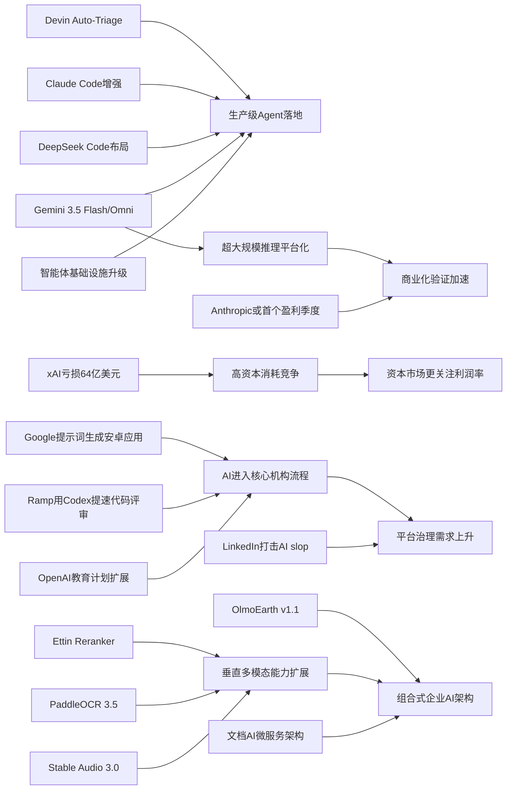

> AI 早报 · 每日早读 · 全网深度聚合

## **今日摘要**

本周 AI 领域的重点，一是智能体基础设施持续升级，包括开发运维、自动缺陷分流、代码大库支持等，整体更贴近真实生产环境，同时 Stable Audio 3.0 和 OpenAI 教育计划也分别推动了长音频生成与 AI 教育落地。  
二是前沿研究与平台能力同步突破，Google 在 I/O 发布 Gemini 3.5 Flash 与 Omni 强化智能体和多模态能力，PaddleOCR 3.5 则显示文档理解正与 Transformer 深度融合。  
三是最具标志性的进展来自 OpenAI 声称模型攻破了离散几何一个 80 年猜想，这预示 AI 正从辅助工具逐步走向参与科学发现。

### 🔵 产品与功能更新

1. **智能体基础设施继续升级。**  
今天产品层面最集中的变化，来自面向“智能体（Agent，可自主执行多步任务的AI系统）”的开发工具更新。LangSmith Engine 提供了适合智能体的 CI/CD（持续集成/持续交付）闭环，SmithDB 则强调低延迟可观测性查询，方便团队排查问题。Cognition 也推出 Devin Auto-Triage，把缺陷分流自动化做成持续运行的流程，并加入记忆与子智能体结构。Anthropic 则继续增强 Claude Code，在大代码库场景下加入提示词缓存诊断和更快模式，整体都在朝“更适合真实生产环境”推进。🚀  
[智能体工具更新汇总(briefing)](https://news.smol.ai/issues/26-05-18-not-much/)

2. **Stable Audio 3.0支持生成六分钟音频。**  
Stability AI 发布 Stable Audio 3.0，新一代音频模型可生成最长六分钟的音乐内容。值得注意的是，其中三款模型开放了权重（即模型参数可供外部下载和部署），同时公司表示训练数据全部来自授权素材。对内容创作者和音频产品团队来说，这意味着更长内容生成与更灵活的本地化使用空间。🚀  
[六分钟音频模型发布(briefing)](https://the-decoder.com/stability-ai-launches-stable-audio-3-0-with-up-to-six-minute-tracks-and-open-weights/)

3. **OpenAI推进“面向国家的教育计划”。**  
OpenAI 宣布扩展 Education for Countries 项目，继续推动 AI 在学校系统中的落地。新阶段重点包括与各方建立合作、培训教师，以及提供改善学习结果的工具。对非技术读者而言，这更像是一套“教育数字化+AI教学辅助”的组合方案，而不只是单一产品发布。🚀  
[教育合作计划扩展(briefing)](https://openai.com/index/the-next-phase-of-education-for-countries)

### 🟢 前沿研究

1. **Google I/O发布Gemini 3.5 Flash与Omni。**  
Google 在 I/O 2026 上把 Gemini 明确定位为消费者 AI 与开发者/智能体平台，并同步推出 Gemini 3.5 Flash、Gemini Omni 以及扩展后的 Antigravity 2.0。Gemini 3.5 Flash 主打更快的智能体与编程任务，Omni 则面向多模态（文本、图像、视频等多种信息形式）生成与编辑。Google 还披露其每月处理 token（模型处理的文本单位）已超过 3.2 千万亿，显示其平台规模正在快速扩大。🚀  
[谷歌智能体栈更新(briefing)](https://news.smol.ai/issues/26-05-19-not-much/)

2. **OpenAI模型攻破离散几何80年猜想。**  
OpenAI 表示，其模型已解决“单位距离问题”，从而推翻离散几何中的一个核心猜想。这一成果之所以重要，不只是因为题目历史悠久，更因为它展示了 AI 在数学研究中的角色正在从“辅助计算”走向“参与发现”。如果后续得到学界广泛验证，这将成为 AI 驱动数学突破的里程碑事件。🚀  
[模型挑战几何猜想(briefing)](https://openai.com/index/model-disproves-discrete-geometry-conjecture)

3. **PaddleOCR 3.5接入Transformer后端。**  
PaddleOCR 3.5 发布，强调可用 Transformer（擅长理解上下文关系的模型架构）后端来完成 OCR（光学字符识别）与文档解析任务。对企业和开发者来说，这意味着传统文档识别流程正在更深地与大模型技术融合。文档 AI 不再只是“识字”，而是向结构化理解和更复杂的信息提取迈进。🚀  
[文档识别框架升级(briefing)](https://huggingface.co/blog/PaddlePaddle/paddleocr-transformers)

### 🟡 行业展望与社会影响

1. **DeepSeek酝酿代码智能体新产品。**  
DeepSeek 正在北京组建团队开发“Deepseek Code”，目标直指 Claude Code、Codex 和 Cursor。招聘要求中提到 agent loops（智能体任务循环）、MCP（模型上下文协议）和 context engineering（上下文工程），说明产品方向不是普通补全工具，而是更自主的软件开发助手。代码智能体赛道正在从少数头部玩家竞争，转向更多公司正面入场。🚀  
[DeepSeek布局代码助手(briefing)](https://the-decoder.com/deepseek-wants-to-take-on-claude-code-and-openais-codex-with-deepseek-code/)

2. **Anthropic称即将迎来首个盈利季度。**  
Anthropic 向投资者表示，公司第二季度营收将增长到约 109 亿美元，并有望迎来首个盈利季度。对整个 AI 行业来说，这释放出一个强信号：大模型公司不再只是“烧钱换增长”，而开始证明商业模式可以走向自我造血。资本市场接下来可能更关注谁先建立可持续利润，而不只是模型能力排名。🚀  
[Anthropic盈利在望(briefing)](https://techcrunch.com/2026/05/20/anthropic-says-its-about-to-have-its-first-profitable-quarter/)

3. **Ramp用Codex把代码评审提速到分钟级。**  
OpenAI 分享了 Ramp 工程团队如何使用 Codex 与 GPT-5.5 做代码评审。原本需要数小时的实质性反馈，如今可以在几分钟内完成。这个案例说明，AI 对企业软件开发的影响，正在从“写一点代码”转向“重塑工程协作流程”。🚀  
[企业代码评审提速(briefing)](https://openai.com/index/ramp)

### 🟣 开源TOP项目

1. **OlmoEarth v1.1发布更高效遥感模型。**  
AllenAI 发布 OlmoEarth v1.1，这是一组更高效的地球观测模型。它面向遥感（通过卫星等方式获取地表信息）场景，强调效率提升，适合需要处理大量地理与环境数据的研究和应用。对开源社区而言，这类模型有助于把 AI 能力扩展到气候、农业和地理监测等实际问题。🚀  
[遥感开源模型更新(briefing)](https://huggingface.co/blog/allenai/olmoearth-v1-1)

2. **文档AI生产架构走向微服务化。**  
一篇新论文提出了面向生产环境的文档 AI 微服务架构，把分类、OCR 和大语言模型流水线封装进可扩展系统。它关注的不是单个模型精度，而是“如何真正跑起来”这一落地问题。对企业团队来说，这类架构思路比单点模型升级更接近真实价值。🚀  
[文档AI架构方案(briefing)](https://arxiv.org/abs/2605.18818)

3. **新型重排模型Ettin家族亮相。**  
Hugging Face 博客介绍了 Ettin Reranker Family，这是一组用于重排（对候选结果再次排序）的模型。重排模型通常用于搜索、问答和检索增强生成（RAG，先检索再生成）的最后一公里，决定哪些结果最该呈现给用户。虽然看起来不如大模型“显眼”，但它常常直接影响真实产品体验。🚀  
[重排模型家族发布(briefing)](https://huggingface.co/blog/ettin-reranker)

### 🔴 社媒分享

1. **Google测试“提示词生成原生安卓应用”。**  
Google AI Studio 现在可以根据提示词直接生成原生 Android 应用，使用 Kotlin 与 Jetpack Compose 构建，还能在浏览器模拟器中测试。对于简单工具类应用，这可能让“先想法、后上架”的门槛大幅下降。文章甚至提出，应用商店未来的角色可能因此被重新定义。🚀  
[谷歌测试生成应用(briefing)](https://the-decoder.com/google-tests-the-app-version-of-the-saaspocalypse/)

2. **xAI去年烧掉64亿美元引发热议。**  
根据 SpaceX 的 IPO 文件，xAI 在 2025 年亏损 64 亿美元，同时还计划继续大规模扩张 Grok。这个数字让外界首次更具体地看到马斯克 AI 业务的财务压力，也反映出顶级模型竞争依然是极度烧钱的游戏。社交平台上的讨论焦点，集中在“巨额投入能否换来长期护城河”。🚀  
[xAI巨额投入曝光(briefing)](https://techcrunch.com/2026/05/20/xai-burned-6-4b-last-year-spacexs-ipo-filing-shows-why-the-spending-is-far-from-over/)

3. **LinkedIn开始打击“AI垃圾内容”。**  
LinkedIn 正在收紧对 AI 生成低质内容的治理，测试中称可 94% 准确识别这类“AI slop（AI灌水内容）”。这件事之所以引发讨论，是因为平台母公司微软本身也在积极推动 AI 使用。它折射出的现实是：当生成门槛越来越低，平台内容质量与分发机制会面临更大压力。🚀  
[领英治理AI灌水(briefing)](https://the-decoder.com/linkedins-war-on-ai-slop-is-not-just-a-policy-update-it-is-an-admission-that-the-platform-lost-control-of-its-feed/)

---

📊 行业洞察

1. 事实  
   LangSmith Engine、SmithDB、Devin Auto-Triage、Claude Code 同日集中更新，重点都围绕 CI/CD（持续集成/持续交付）、可观测性（Observability，对系统运行状态的监控与诊断）、记忆、子智能体与大代码库适配；同时 Google I/O 发布 Gemini 3.5 Flash，强调更快的智能体与编程任务，DeepSeek 也在招聘中明确指向 agent loops（智能体循环）、MCP（模型上下文协议）和 context engineering（上下文工程）。  
   【洞察】判断：智能体竞争正在从“模型能力展示”转向“工程化基础设施竞赛”。下一阶段胜负手不只是基础模型更强，而是谁能把调试、部署、协作、上下文管理和任务闭环做成标准化生产系统。代码智能体将首先成为这一轮商业化最清晰的落地入口。

2. 事实  
   Anthropic 表示有望迎来首个盈利季度；与此同时，SpaceX 文件披露 xAI 去年亏损 64 亿美元、仍将继续重投扩张；Google 则披露 Gemini 月处理 token 已超过 3.2 千万亿，显示超大规模推理（Inference，模型实际提供服务的计算过程）已经形成平台级吞吐。  
   【洞察】判断：AI 行业正加速分化为“两种公司”——一类进入规模化变现阶段，验证收入与利润模型；另一类仍处于高资本消耗换市场位置阶段。资本市场接下来会更重视“单位算力产出”和“推理业务利润率”，而不再仅凭参数规模或融资额给估值溢价。

3. 事实  
   OpenAI 扩展 Education for Countries，把 AI 推进到国家教育体系；Ramp 用 Codex 与 GPT-5.5 将代码评审从数小时压缩到分钟级；Google AI Studio 可按提示词生成原生 Android 应用；LinkedIn 则开始高强度治理 AI slop（AI低质灌水内容）。  
   【洞察】判断：AI 正从“辅助工具”升级为“流程操作系统（Operating System，承载核心工作流的基础层）”，一边深入教育、软件开发等高频场景，一边倒逼平台治理同步升级。未来真正的竞争不是“能不能生成”，而是“生成内容是否能进入正式流程、被审计、被信任、被规模化管理”。

4. 事实  
   Stable Audio 3.0 可生成最长六分钟音频，并开放部分权重，且强调训练数据来自授权素材；PaddleOCR 3.5 接入 Transformer 后端，推动 OCR 向文档理解演进；Ettin 重排模型、文档 AI 微服务架构、OlmoEarth 遥感模型等开源项目同步活跃。  
   【洞察】判断：行业创新正在从通用大模型扩散到“中间层与垂直层”——包括音频生成、文档理解、检索重排、遥感等专用能力模块。开源与授权数据的结合，意味着企业未来更可能采用“通用底座 + 垂直组件”的组合式 AI 架构，而不是单押一个超级模型。

🗺️ 今日关系图

