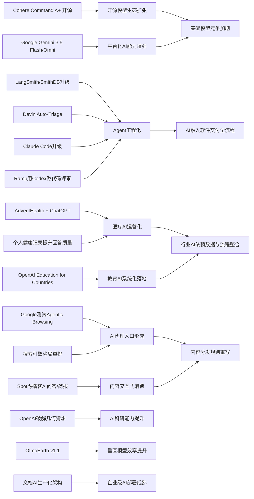

> AI 早报 · 每日早读 · 全网深度聚合

## **今日摘要**

近期AI进展主要集中在三方面：Cohere开源最强模型Command A+、医疗机构开始用ChatGPT优化文书与流程，以及LangSmith、Devin、Claude Code等Agent基础设施持续升级，说明AI正更快走向工程化和常规应用。  
前沿研究与产品侧，Google发布Gemini 3.5 Flash与Omni并强化Agent与多模态能力，PaddleOCR 3.5接入Transformers推动文档AI升级，Ramp则用Codex和GPT-5.5显著加快代码评审。  
行业层面，Google开始测试网站对AI代理的兼容性，预示未来网站不仅要做SEO，还可能要面向AI访问做优化，而搜索与流量入口格局也可能因此被AI重新塑造。

### 🔵 产品与功能更新

1. **Cohere开源最强模型Command A+。**
Cohere发布了目前最强的语言模型（处理文本的AI模型）Command A+，并采用Apache 2.0许可证开源，意味着企业和开发者可以更自由地使用与改造。对市场来说，这会进一步加速高性能大模型的普及，也给闭源产品带来更强竞争。对于非技术团队，开源通常意味着更低的试用门槛和更灵活的定制空间。🚀  
[查看开源模型发布](https://the-decoder.com/cohere-open-sources-its-strongest-model-yet/)

2. **AdventHealth用ChatGPT优化医疗流程。**
AdventHealth正在使用面向医疗场景的ChatGPT，目标是简化工作流程、减少行政负担，并把更多时间还给临床护理。对于医院来说，这类应用通常先从文书、总结和信息整理等环节切入，而不是直接替代医生判断。它反映出生成式AI（可自动生成文本内容的AI）在医疗机构中的落地正在从试点走向更常规的运营工具。🚀  
[查看医疗合作案例](https://openai.com/index/adventhealth)

3. **LangSmith等Agent基础设施持续升级。**
当天虽然“没有大事”，但智能体（Agent，可自主完成多步任务的AI程序）基础设施更新密集。摘要提到LangSmith Engine提供面向智能体的CI/CD闭环（持续集成与持续交付），SmithDB则支持更低延迟的可观测性查询；同时Cognition的Devin Auto-Triage可持续处理缺陷分流。Anthropic也提升了Claude Code在大型代码库中的表现，说明AI编程工具正朝更稳定、更工程化方向前进。🚀  
[查看基础设施汇总](https://news.smol.ai/issues/26-05-18-not-much/)

### 🟢 前沿研究

1. **Google发布Gemini 3.5 Flash与Omni。**
在Google I/O 2026上，Google把Gemini重新定位为面向消费者和开发者的平台，并推出Gemini 3.5 Flash、Gemini Omni以及升级后的Agent技术栈。Gemini 3.5 Flash主打更快的智能体与编程任务，Omni则强调多模态（可同时处理文字、图像、视频等）生成与编辑。Google还披露其每月处理的tokens（模型读写的文本单位）已超过3.2千万亿，显示平台规模快速扩大。🚀  
[查看Google发布汇总](https://news.smol.ai/issues/26-05-19-not-much/)

2. **PaddleOCR 3.5接入Transformers后端。**
PaddleOCR 3.5展示了如何基于Transformers（目前主流的深度学习模型架构）来运行OCR（光学字符识别）和文档解析任务。对普通用户来说，这类进展会让扫描件、表格、票据和复杂文档的提取更稳定，也更容易接入统一的AI工作流。它体现出“文档AI”正逐步从单点识别走向更完整的信息理解。🚀  
[查看文档AI更新](https://huggingface.co/blog/PaddlePaddle/paddleocr-transformers)

3. **Ramp用Codex把代码评审提速。**
Ramp工程团队分享了如何结合Codex与GPT-5.5做代码评审，让原本可能要几小时的反馈缩短到几分钟。这里的重点不只是“更快”，而是让工程师更早拿到有实质性的建议，从而加快产品迭代。对企业研发来说，这类能力正在把AI从“辅助写代码”延伸到“辅助软件交付流程”。🚀  
[查看代码评审案例](https://openai.com/index/ramp)

### 🟡 行业展望与社会影响

1. **Google测试网站的AI代理兼容性。**
Google正在Lighthouse分析工具中测试“Agentic Browsing”新类别，用来检查网站对AI代理（可代替用户执行浏览任务的AI）是否友好，并关注llms.txt这类面向模型的说明文件。对网站运营者来说，这意味着未来不仅要考虑搜索引擎优化，还要考虑“AI访问体验”。如果AI代理成为重要流量入口，网站内容结构和权限设计都可能随之变化。🚀  
[查看兼容性测试](https://the-decoder.com/google-tests-websites-for-llms-txt-and-agent-compatibility/)

2. **搜索引擎市场或因AI重排格局。**
TechCrunch讨论了在Google越来越被AI概览重塑后，用户还可以尝试哪些替代搜索引擎。背后的信号很明确：当搜索结果页被AI总结深度改写，用户对“原始网页入口”和“可控搜索体验”的需求会重新浮现。AI不仅在升级搜索，也在迫使整个信息分发市场重新洗牌。🚀  
[查看搜索替代趋势](https://techcrunch.com/2026/05/21/six-search-engines-worth-trying-now-that-google-isnt-really-google-anymore/)

3. **OpenAI推进Education for Countries计划。**
OpenAI宣布推进“Education for Countries”下一阶段，内容包括学校合作、教师培训和教学工具扩展，目标是提升全球学习成效。对于教育系统而言，真正的挑战并不只是接入工具，而是如何把AI合理嵌入教学、评估和教师支持体系。该计划说明AI教育应用正从单个产品试用转向更系统化的国家级合作。🚀  
[查看教育计划进展](https://openai.com/index/the-next-phase-of-education-for-countries)

### 🟣 开源TOP项目

1. **OpenAI模型破解80年几何猜想。**
OpenAI表示，其推理模型（擅长多步思考的模型）在离散几何中解决了一个存在80年的单位距离问题，并推翻了一项重要猜想。这一结果被视为AI数学能力的重要里程碑，说明模型不仅能复述已知知识，也可能参与前沿发现。对科研界而言，更值得关注的是AI是否能成为真正的研究合作者。🚀  
[查看官方研究说明](https://openai.com/index/model-disproves-discrete-geometry-conjecture)

2. **OlmoEarth v1.1提升地球观测效率。**
AllenAI发布OlmoEarth v1.1，这是一个更高效的地球观测模型家族，用于处理遥感（通过卫星等设备远距离采集地表信息）相关任务。此类模型可帮助分析土地、气候、灾害和环境变化，在公共治理和科研中都有广泛用途。效率提升通常意味着更低计算成本与更大规模部署潜力。🚀  
[查看遥感模型更新](https://huggingface.co/blog/allenai/olmoearth-v1-1)

3. **文档AI生产化架构论文受关注。**
一篇新论文提出了将OCR（文字识别）、分类模型和大语言模型组合起来的微服务架构，用于在生产环境中运行文档AI。它试图弥合“实验室模型效果”和“企业实际可部署性”之间的差距。对很多机构来说，真正难点往往不是模型本身，而是如何稳定、可维护地把它接入业务系统。🚀  
[查看文档AI架构论文](https://arxiv.org/abs/2605.18818)

### 🔴 社媒分享

1. **美军网络司令部加速部署机密网络AI。**
美国网络司令部已成立专项团队，计划把OpenAI、Google等公司的模型部署到最高机密网络中。推动这一进程的重要原因，是AI在发现安全漏洞方面可能比顶尖人工黑客更快。该动态表明，AI在国家安全与网络攻防中的角色正在迅速上升。🚀  
[查看军方部署动态](https://the-decoder.com/us-cyber-command-races-to-deploy-ai-on-top-secret-networks/)

2. **Spotify为播客加入AI问答与简报。**
Spotify正在为播客增加AI驱动的问答和简报生成功能，用户可以根据自己的提示词生成每日或每周内容摘要。对听众来说，这会让信息获取更个性化，也更适合碎片化阅读和收听。对于平台而言，这类功能能把播客从“被动消费”变成更可交互的内容体验。🚀  
[查看播客AI新功能](https://techcrunch.com/2026/05/21/spotify-adds-ai-powered-qa-and-briefing-generation-features-to-podcasts/)

3. **个人健康记录可提升健康AI回答质量。**
一篇研究评估了个人健康记录（由患者自己管理的健康资料）在个性化健康AI中的作用。结果聚焦于：当模型获得更完整的临床背景后，是否能更好回答用户的健康问题。对普通用户而言，这类研究说明未来健康AI的价值，可能越来越依赖高质量、可授权的数据输入。🚀  
[查看健康AI研究](https://arxiv.org/abs/2605.18937)

---

📊 行业洞察

1. 事实  
   Cohere开源最强模型Command A+并采用Apache 2.0许可证；Google在I/O发布Gemini 3.5 Flash、Gemini Omni及升级后的Agent技术栈，同时披露月处理tokens已超3.2千万亿。  
   【洞察】基础模型市场正同步走向“两极竞争”——一端是Cohere代表的开放生态加速渗透，另一端是Google代表的超大平台化规模优势继续扩大。对企业采购而言，选型标准会从“模型强不强”转向“开放性 + 平台配套 + 运行成本”的综合比较，闭源厂商的溢价空间将持续被压缩。

2. 事实  
   LangSmith Engine、SmithDB、Devin Auto-Triage、Claude Code等Agent基础设施集中升级；Ramp用Codex与GPT-5.5将代码评审从数小时压缩到几分钟。  
   【洞察】AI开发正从“单点生成”进入“软件工程化”阶段。市场竞争焦点不再只是代码补全，而是覆盖CI/CD（持续集成/持续交付）、可观测性（observability，系统运行状态监控）、缺陷分流与评审协同的完整交付链路。谁能把模型能力嵌入研发流程闭环，谁就更可能建立企业级护城河。

3. 事实  
   AdventHealth用ChatGPT优化医疗流程；OpenAI推进Education for Countries国家级教育合作；研究显示个人健康记录可提升健康AI回答质量。  
   【洞察】AI落地正在从“工具试用”升级为“行业系统集成”。无论医疗还是教育，真正决定效果的已不只是模型本身，而是数据权限、流程嵌入、人员培训与合规治理。未来行业项目的中标能力，将越来越取决于“模型 + 数据 + 组织变革”一体化交付能力，而非单纯API调用能力。

4. 事实  
   Google测试网站的AI代理兼容性与llms.txt；TechCrunch讨论AI重塑搜索格局后的替代搜索机会；Spotify为播客加入AI问答与简报功能。  
   【洞察】内容分发入口正从“人搜索网页”转向“AI代理与AI摘要中介内容”。这意味着SEO（搜索引擎优化）将逐步外溢为AEO（Agent Engine Optimization，面向AI代理的内容优化）/ GEO（Generative Engine Optimization，面向生成式引擎的优化）竞争。平台、媒体与品牌需要重新设计内容结构、授权方式和交互接口，以争夺未来AI入口流量。

🗺️ 今日关系图

