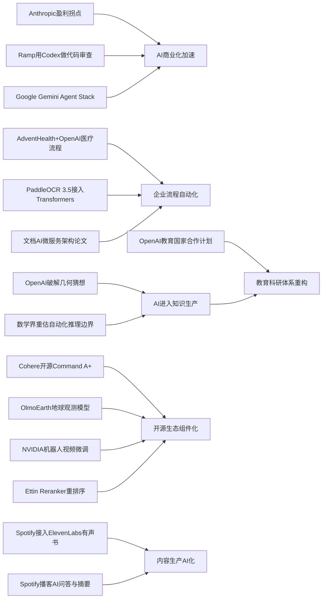

> AI 早报 · 每日早读 · 全网深度聚合

## **今日摘要**

Anthropic 预计将在本季度实现运营盈利，AdventHealth 与 OpenAI、NVIDIA 等案例则显示，AI 正从“烧钱讲故事”走向在编程、医疗流程和垂直视频生成等场景中真正创造商业价值。  
前沿研究方面，OpenAI 宣称模型推翻了一个存在 80 年的几何猜想，Google 也在 I/O 上强化 Gemini 多模态与智能体平台布局，说明 AI 正同时提升科学推理能力与产品化能力。  
整体来看，AI 行业正在进入一个新阶段：一边是商业模式逐渐跑通、基础设施持续完善，另一边是 AI 对科研、文档处理和社会分工的影响开始变得更深、更现实。

### 🔵 产品与功能更新

1. **Anthropic 接近成为首家盈利的 AI 实验室。**  
   据《华尔街日报》消息，Anthropic 预计在本季度实现运营利润，收入增长主要来自编程工具和智能体（Agent，可自主执行任务的 AI）产品。这个变化说明，AI 公司开始从“烧钱扩张”走向“靠产品赚钱”。对市场来说，这也是生成式 AI 商业模式逐步跑通的重要信号🚀  
   [盈利拐点将至简报(briefing)](https://the-decoder.com/anthropic-is-about-to-become-the-first-profitable-ai-lab/)

2. **AdventHealth 与 OpenAI 用 ChatGPT 优化医疗流程。**  
   AdventHealth 正在使用面向医疗场景的 ChatGPT，目标是减少行政事务负担，把更多时间还给医护人员和患者。相比“替代医生”的夸张叙事，这类应用更聚焦在流程提效与文书处理。对普通用户而言，这意味着 AI 在医院里更可能先做“幕后助手”🚀  
   [医疗场景落地简报(briefing)](https://openai.com/index/adventhealth)

3. **NVIDIA 发布机器人视频生成微调方案。**  
   这篇 Hugging Face 博客介绍了如何基于 NVIDIA Cosmos Predict 2.5，利用 LoRA/DoRA（低成本微调方法）训练机器人视频生成模型。简单说，就是让开发者用更少算力，把现成模型调成更懂机器人动作和场景的视频工具。它反映出“专用 AI 视频模型”正从通用演示走向垂直应用🚀  
   [机器人视频微调简报(briefing)](https://huggingface.co/blog/nvidia/cosmos-fine-tuning-for-robot-video-generation)

### 🟢 前沿研究

1. **OpenAI 模型推翻一道存在 80 年的几何猜想。**  
   OpenAI 表示，其模型在离散几何（研究点、线、距离等离散结构的数学分支）中解决了“单位距离问题”，推翻了一个长期猜想。这不仅是一次数学结果，更代表 AI 开始在高难度推理中产出可检验的新知识。对研究界来说，这类成果让“AI 参与科学发现”变得更现实🚀  
   [几何猜想突破简报(briefing)](https://openai.com/index/model-disproves-discrete-geometry-conjecture)

2. **Google I/O 2026 聚焦 Gemini 3.5 Flash、Omni 与 Agent Stack。**  
   Google 在 I/O 上把 Gemini 明确定位为面向消费者和开发者的 AI 平台，并推出更快的 Gemini 3.5 Flash、多模态（可处理文字、图像、视频等多种内容）模型 Gemini Omni，以及更完整的智能体工具栈。Google 还披露其月度处理 token（模型处理的文本单位）规模大幅增长。整体看，Google 正把模型能力、应用入口和开发基础设施一起推进🚀  
   [谷歌智能体升级简报(briefing)](https://news.smol.ai/issues/26-05-19-not-much/)

3. **PaddleOCR 3.5 接入 Transformers 后端。**  
   PaddleOCR 3.5 介绍了如何在 Transformers（主流深度学习模型框架）后端上运行文字识别和文档解析任务。对企业来说，这有助于把票据、合同、表单等非结构化文档更顺畅地接入现代 AI 工作流。它体现出 OCR（光学字符识别）正与大模型生态进一步融合🚀  
   [文档识别升级简报(briefing)](https://huggingface.co/blog/PaddlePaddle/paddleocr-transformers)

### 🟡 行业展望与社会影响

1. **AI 数学突破引发“研究门槛重估”讨论。**  
   The Decoder 对 OpenAI 数学成果的解读指出，多位专家正在重新评估 AI 在自动化推理（让机器按逻辑步骤解决复杂问题）中的边界。菲尔兹奖得主 Tim Gowers 甚至称其为“AI 数学的里程碑”。这意味着，未来部分前沿数学研究可能会越来越依赖人机协作，而不仅是纯人工直觉🚀  
   [数学研究新拐点简报(briefing)](https://the-decoder.com/openai-shifts-the-boundary-of-automated-reasoning-with-a-milestone-in-ai-mathematics-that-experts-are-now-unpacking/)

2. **Spotify 推出 ElevenLabs 驱动的有声书制作工具。**  
   Spotify 正引入基于 ElevenLabs 的语音生成能力，帮助创作者更方便地制作有声书。这会降低内容音频化门槛，让更多文本作品快速变成可收听版本。与此同时，它也会继续推动关于声音版权、配音职业和内容真实性的讨论🚀  
   [有声书 AI 化简报(briefing)](https://techcrunch.com/2026/05/21/spotify-launches-an-elevenlabs-powered-audiobook-creation-tool/)

3. **OpenAI 推进“Education for Countries”教育合作计划。**  
   OpenAI 宣布扩展面向各国教育系统的合作，包括教师培训、学校 AI 工具引入和新伙伴关系。重点不只是把 AI 放进课堂，而是尝试形成制度化应用路径。对社会层面而言，AI 教育普及将越来越取决于国家级协调，而非单点学校试验🚀  
   [国家教育合作简报(briefing)](https://openai.com/index/the-next-phase-of-education-for-countries)

### 🟣 开源TOP项目

1. **OlmoEarth v1.1 发布更高效的地球观测模型。**  
   AllenAI 在 Hugging Face 介绍了 OlmoEarth v1.1，这是一组面向地球观测的模型，强调更高效率。此类模型可用于卫星影像分析、环境监测和灾害研判等场景。开源地理 AI 工具的持续进步，正在降低科研和行业应用门槛🚀  
   [地球观测模型简报(briefing)](https://huggingface.co/blog/allenai/olmoearth-v1-1)

2. **文档 AI 生产化架构论文聚焦 OCR 与大模型流水线。**  
   这篇 arXiv 论文提出一种微服务（把系统拆成多个独立小服务的架构）方案，用于把分类、OCR 和大语言模型串成可落地的文档处理系统。它关注的不只是模型效果，更是生产环境中的扩展性与稳定性。对企业技术团队来说，这类研究比单纯刷榜更接近真实需求🚀  
   [文档流水线架构简报(briefing)](https://arxiv.org/abs/2605.18818)

3. **Ramp 工程团队用 Codex 加速代码审查。**  
   OpenAI 分享了 Ramp 工程师如何借助 Codex 和 GPT-5.5，在几分钟内获得有实质内容的代码审查反馈。代码审查原本是软件开发中最耗协作时间的环节之一，而 AI 的介入正在改变这一步的节奏。它展示了“AI 编程助手”从写代码走向理解和评估代码🚀  
   [代码审查提速简报(briefing)](https://openai.com/index/ramp)

### 🔴 社媒分享

1. **Cohere 开源目前最强模型 Command A+。**  
   Cohere 宣布将其最新语言模型 Command A+ 以 Apache 2.0 许可证开源。对开发者和企业来说，这意味着更容易基于高性能模型做定制化部署，也减少了对闭源 API 的依赖。开源阵营在高端模型上的动作，正在持续拉近与头部闭源公司的距离🚀  
   [Cohere 开源新模简报(briefing)](https://the-decoder.com/cohere-open-sources-its-strongest-model-yet/)

2. **Spotify 为播客加入 AI 问答与摘要生成功能。**  
   Spotify 正为播客提供 AI 问答和 briefing（简报）生成功能，让用户能按提示词获取日更或周更内容整理。对听众来说，这会把长音频消费变得更接近“可检索、可提问”的知识产品。播客平台也因此更像内容搜索与学习入口，而不仅是播放器🚀  
   [播客问答摘要简报(briefing)](https://techcrunch.com/2026/05/21/spotify-adds-ai-powered-qa-and-briefing-generation-features-to-podcasts/)

3. **Ettin Reranker 系列发布，强化搜索排序能力。**  
   Hugging Face 博客介绍了 Ettin Reranker 家族，这类模型主要用于重排序（在候选结果中重新判断谁更相关）。虽然名字技术感较强，但它背后的作用很直接：让搜索、问答和推荐结果更靠谱。对很多 AI 应用来说，排序质量往往直接决定最终体验🚀  
   [搜索重排序模型简报(briefing)](https://huggingface.co/blog/ettin-reranker)

---

📊 行业洞察

1. 事实  
   Anthropic 接近成为首家实现运营利润的 AI 实验室，收入主要来自编程工具与智能体（Agent，可自主执行任务的 AI）产品；同时，OpenAI 分享 Ramp 用 Codex/GPT-5.5 加速代码审查，Google I/O 也重点推进 Gemini 3.5 Flash、Omni 与 Agent Stack（智能体开发工具栈）。  
   【洞察】AI 商业化正在从“模型能力竞赛”转向“高频工作流变现”。编程、代码审查、任务执行等场景具备明确ROI（投资回报率），因此成为最先跑通收入模型的入口；未来头部厂商的竞争焦点，将是“模型+工具链+企业流程嵌入”的一体化交付能力，而不只是单一模型参数领先。

2. 事实  
   AdventHealth 与 OpenAI 用 ChatGPT 优化医疗行政流程；PaddleOCR 3.5 接入 Transformers（主流深度学习模型框架）后端，文档 AI 生产化架构论文则强调 OCR（光学字符识别）+大语言模型的微服务（模块化服务架构）流水线。  
   【洞察】企业级AI落地正集中在“非结构化信息处理”这一中间层，先改造文档、表单、票据、病历与流程，而不是直接替代核心专业决策。医疗、金融、政务等行业会优先采购“可审计、可接入、可扩展”的文档智能与流程自动化方案，这类能力比通用聊天机器人更接近大规模预算释放点。

3. 事实  
   OpenAI 模型推翻一道存在80年的离散几何猜想，并引发学界对自动化推理（按逻辑步骤解决复杂问题）边界的重新评估；与此同时，OpenAI 推进“Education for Countries”计划，Google 也在强化面向开发者和消费者的 Gemini 平台。  
   【洞察】AI 正从“知识调用工具”升级为“知识生产参与者”，这会倒逼教育与科研体系同步重构。短期看，数学、编程、科研辅助会成为人机协作最先深化的领域；中长期看，国家级教育合作、开发者平台和科研工具的结合，将形成新的技术人才培养基础设施（Infrastructure，底层支撑体系）。

4. 事实  
   Cohere 开源 Command A+，AllenAI 发布更高效的地球观测模型 OlmoEarth v1.1，NVIDIA 推出基于 Cosmos Predict 2.5 的机器人视频生成微调方案，Ettin Reranker 则强化搜索重排序能力。  
   【洞察】开源生态的竞争重点，正从“通用大模型替代闭源”转向“垂直组件化能力完善”。未来企业真正采购和集成的，往往不是单个万能模型，而是重排序、OCR、地理观测、机器人视频、语音生成等模块化能力栈；这意味着AI产业链将更像软件基础设施市场，而非单点模型市场。

🗺️ 今日关系图

