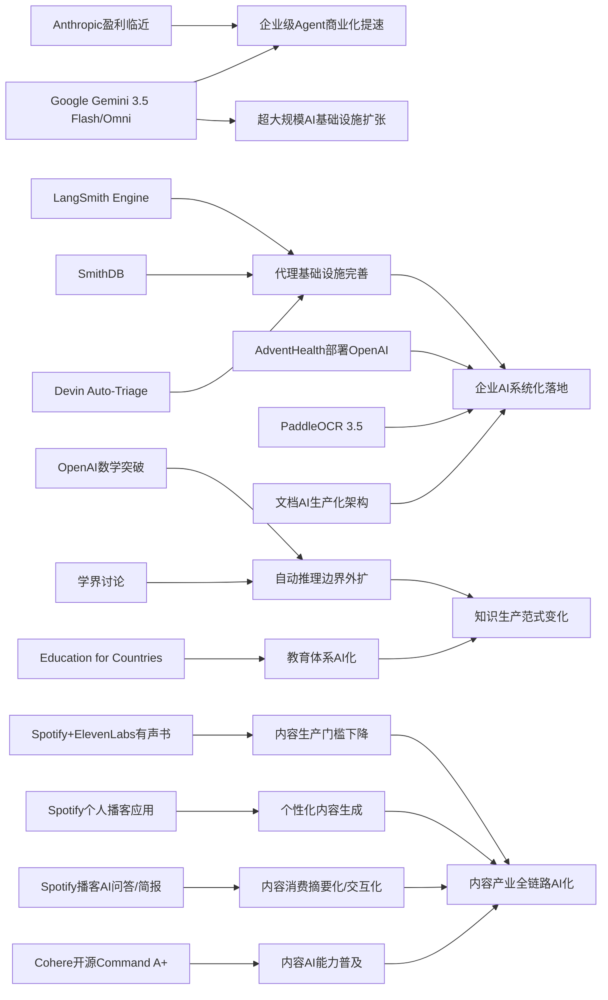

> AI 早报 · 每日早读 · 全网深度聚合

## **今日摘要**

Anthropic据报道接近实现首个盈利季度，医疗、编程与企业代理等场景也显示出AI正从通用能力快速走向可商业化、可落地的行业应用。  
与此同时，OpenAI在离散几何中取得可推翻重要猜想的数学突破，Google I/O发布Gemini 3.5 Flash、Omni及新代理工具栈，PaddleOCR 3.5则体现了文档理解与多模态能力的持续增强。  
整体来看，AI一边在代理基础设施、行业工作流和大模型平台上加速成熟，一边也开始深入科研与知识生产领域，推动社会重新思考自动推理与人机分工的边界。

### 🔵 产品与功能更新

1. **Anthropic接近成为首个盈利的AI实验室。**  
Anthropic据报道正接近迎来首个盈利季度，预计单季营收达109亿美元，营业利润约5.59亿美元。推动增长的核心产品是编程工具和更具代理能力（可自主执行多步任务）的Claude服务。文章还提到，需求一度高到超过可用算力（计算资源）上限，说明企业级AI工具的商业化正在明显提速🚀  
[盈利拐点看Anthropic简报](https://the-decoder.com/anthropic-is-about-to-become-the-first-profitable-ai-lab/)

2. **AdventHealth用OpenAI改善医疗工作流。**  
AdventHealth正在部署面向医疗场景的ChatGPT，用来简化流程、减少行政负担，并把更多时间还给医护人员和患者。对非技术用户来说，这类应用的价值不在“更炫的模型”，而在减少重复记录、信息整理和沟通成本。也说明AI正从通用助手走向更明确的行业落地🚀  
[医疗场景落地简报](https://openai.com/index/adventhealth)

3. **LangSmith Engine、SmithDB与Devin Auto-Triage推进代理基础设施。**  
这则汇总显示，面向AI代理（能持续执行任务的软件助手）的基础设施正在快速完善。LangSmith Engine主打CI/CD（持续集成与持续交付）闭环，帮助代理应用更稳定地测试和上线；SmithDB则强调低延迟查询，用于可观测性（追踪系统运行状态）。同时，Cognition的Devin Auto-Triage把“自动分派和处理软件缺陷”做成持续化流程，带有记忆和子代理结构🚀  
[代理基建进展简报](https://news.smol.ai/issues/26-05-18-not-much/)

### 🟢 前沿研究

1. **OpenAI模型推翻离散几何中的核心猜想。**  
OpenAI表示，其模型解决了存在80年的“单位距离问题”，并推翻了离散几何中的一个重要猜想。这被视为AI参与数学研究的重要里程碑，因为它不只是“辅助计算”，而是直接产出具有研究价值的新结果。对大众而言，这意味着AI正从内容生成进一步走向高难度科学发现🚀  
[数学突破官方简报](https://openai.com/index/model-disproves-discrete-geometry-conjecture)

2. **Google I/O发布Gemini 3.5 Flash、Omni和新代理栈。**  
Google在I/O大会上把Gemini重新定位为同时面向消费者与开发者的平台，并推出Gemini 3.5 Flash、Gemini Omni和升级后的代理工具栈。Gemini 3.5 Flash强调更快的代理式任务与编程表现，Omni则覆盖多模态（文字、图像、视频等多种输入输出）生成与编辑。Google还披露其月度处理量已超过3.2千万亿token，显示大模型基础设施规模正在继续扩张🚀  
[Google I/O要点简报](https://news.smol.ai/issues/26-05-19-not-much/)

3. **PaddleOCR 3.5接入Transformers后端。**  
PaddleOCR 3.5展示了将OCR（光学字符识别）与文档解析任务运行在Transformers（主流深度学习模型架构）后端上的方案。对用户来说，这类升级意味着票据、合同、表格等文档处理可能更容易与大模型能力结合。它也反映出“看懂文档”正在成为AI应用链条中的基础能力🚀  
[PaddleOCR升级简报](https://huggingface.co/blog/PaddlePaddle/paddleocr-transformers)

### 🟡 行业展望与社会影响

1. **OpenAI数学突破引发学界对自动推理边界的讨论。**  
围绕OpenAI推翻Erdős相关猜想的成果，学界正在重新评估AI在数学研究中的角色。报道提到，专家认为这不仅是一次单点突破，还可能意味着未来人类更难仅凭直觉判断哪些问题“只有人能做”。这类变化会持续影响科研分工、教育方式与知识生产模式🚀  
[学界反应深度简报](https://the-decoder.com/openai-shifts-the-boundary-of-automated-reasoning-with-a-milestone-in-ai-mathematics-that-experts-are-now-unpacking/)

2. **Spotify上线ElevenLabs驱动的有声书制作工具。**  
Spotify正在推出由ElevenLabs支持的有声书生成工具，进一步降低音频内容制作门槛。对作者和出版方来说，这意味着更快把文本内容转换成可分发的音频版本。它也会继续推动“AI配音”进入主流内容产业，并带来关于质量、版权与创作者收益的新讨论🚀  
[有声书AI制作简报](https://techcrunch.com/2026/05/21/spotify-launches-an-elevenlabs-powered-audiobook-creation-tool/)

3. **OpenAI推进“Education for Countries”新阶段。**  
OpenAI宣布扩大“Education for Countries”计划，通过新合作、教师培训和工具支持来推动学校采用AI。重点不只是给学生一个聊天机器人，而是把AI整合进教学支持、教师备课与学习成效改进。对社会层面而言，这预示着各国教育体系将更系统地面对AI融入课堂的问题🚀  
[教育项目进展简报](https://openai.com/index/the-next-phase-of-education-for-countries)

### 🟣 开源TOP项目

1. **OlmoEarth v1.1发布更高效的地球观测模型家族。**  
AllenAI发布OlmoEarth v1.1，主打更高效的地球观测模型，面向遥感（通过卫星等方式观测地表）相关任务。虽然这是偏专业方向的模型，但它关联到气候、农业、灾害监测等现实场景。开源模型在这些领域的推进，有助于更多研究者和机构低成本试验与部署🚀  
[地球观测模型简报](https://huggingface.co/blog/allenai/olmoearth-v1-1)

2. **文档AI生产化架构探索OCR与大模型流水线。**  
这篇论文提出了一个面向生产环境的微服务架构，用于整合分类、OCR和大语言模型处理文档任务。相比只展示单个模型效果，它更关注“如何真正跑起来”，包括模块拆分、扩展性与稳定性。对企业来说，这类工程化方案比单纯模型刷新更接近实际落地🚀  
[文档AI架构简报](https://arxiv.org/abs/2605.18818)

3. **Ettin Reranker家族发布，强化检索排序能力。**  
Ettin Reranker是一组重排序模型，主要用于在检索结果中重新判断“哪些内容最相关”。这类模型通常出现在搜索、问答和知识库系统中，是提升答案质量的重要一环。虽然不如聊天机器人直观，但它决定了AI能否先“找对信息”，再“说对内容”🚀  
[重排序模型简报](https://huggingface.co/blog/ettin-reranker)

### 🔴 社媒分享

1. **Cohere开源其最强模型Command A+。**  
Cohere宣布将目前最强的语言模型Command A+以Apache 2.0许可证开源。对开发者和企业来说，开源许可证意味着更宽松的商用与二次开发空间。社交平台上，这类消息往往会迅速引发对“闭源大厂与开源社区谁更快”的新一轮讨论🚀  
[最强开源模型简报](https://the-decoder.com/cohere-open-sources-its-strongest-model-yet/)

2. **Spotify推出可生成个人播客的新桌面应用。**  
Spotify发布一款桌面应用研究预览版，用户可以据此创建“个人播客”。从产品方向看，它明显在靠近AI驱动的内容整理与表达工具，试图把信息消费变成可定制的音频输出。这样的产品也让“每个人都有自己的AI电台”更接近现实🚀  
[个人播客应用简报](https://techcrunch.com/2026/05/21/spotify-debuts-a-new-desktop-app-for-creating-personal-podcasts/)

3. **Spotify为播客加入AI问答与简报生成功能。**  
Spotify还为播客加入AI问答和briefing（简报）生成功能，允许用户基于提示生成每日或每周摘要。对普通用户来说，这会把长内容消费进一步变成“按需提炼”的体验。社媒上，这类功能通常很容易被拿来和NotebookLM等信息整理工具比较🚀  
[播客AI新功能简报](https://techcrunch.com/2026/05/21/spotify-adds-ai-powered-qa-and-briefing-generation-features-to-podcasts/)

---

📊 行业洞察

1. 事实  
   Anthropic接近成为首个盈利的AI实验室，增长主要由编程工具与更强代理能力（Agentic AI，能自主执行多步任务的系统）的Claude驱动；同时Google I/O披露Gemini月度处理量已超过3.2千万亿token，并推出更适合代理式任务的新模型与代理工具栈。  
   【洞察】大模型竞争正从“参数/榜单竞争”转向“代理工作流商业化竞争”。一端是Anthropic用企业编程与自动化场景验证收入闭环，另一端是Google用超大规模基础设施和平台化工具抢占开发生态，说明行业进入“谁能把模型嵌入真实生产流程，谁就先兑现利润”的阶段。

2. 事实  
   LangSmith Engine、SmithDB、Devin Auto-Triage集中补齐代理基础设施；AdventHealth部署面向医疗场景的ChatGPT以减少行政负担；文档AI生产化架构和PaddleOCR 3.5也在强化文档解析与工程落地能力。  
   【洞察】AI落地瓶颈正在从“模型不够强”转向“系统能否稳定接入业务”。可观测性（Observability，对系统运行状态的追踪）、CI/CD（持续集成与持续交付）和文档处理流水线正在成为企业级AI的关键中间层，意味着未来行业壁垒将更多体现在工程整合、稳定性与合规部署，而不仅是底模能力。

3. 事实  
   OpenAI模型推翻离散几何重要猜想，并引发学界对自动推理边界的再评估；OpenAI同时推进“Education for Countries”新阶段，希望把AI系统性整合进教学支持、教师培训与学习成效改进。  
   【洞察】AI正在同时改写“知识生产”与“知识传播”两端：前者是从辅助工具升级为科研发现参与者，后者是从课堂助手升级为教育基础设施。这意味着各国未来讨论AI时，将不再只围绕效率提升，而会进一步触及科研分工、课程设计和人才培养范式重构。

4. 事实  
   Spotify上线ElevenLabs驱动的有声书制作工具，并推出个人播客生成应用、播客AI问答与简报功能；与此同时，Cohere开源Command A+，降低了开发者构建内容产品的模型门槛。  
   【洞察】内容产业的AI化正从“生成单点能力”走向“生成—分发—交互”全链路重构。Spotify的连续动作说明平台方正在把AI变成内容供给和消费体验的基础层，而开源模型降低了复制类似能力的门槛，未来竞争焦点将转向版权治理、内容质量控制与平台生态粘性。

🗺️ 今日关系图

