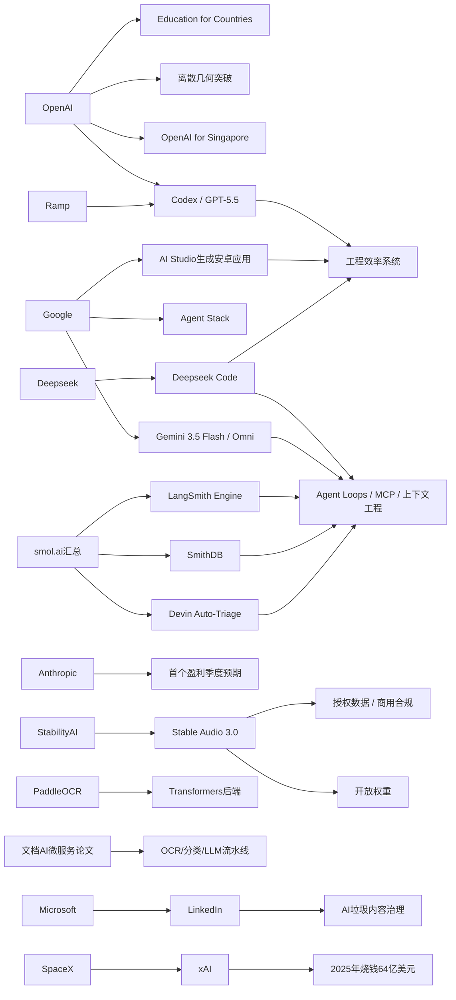

> AI 早报 · 每日早读 · 全网深度聚合

## **今日摘要**

Stable Audio 3.0、OpenAI 教育计划升级，以及 LangSmith/SmithDB 等工具更新，显示 AI 正同时向更长音频创作、教育基础设施和智能体工程化快速推进。  
在研究前沿，OpenAI 模型推翻离散几何重要猜想、Google I/O 聚焦 Gemini 3.5 Flash 与 Omni、PaddleOCR 3.5 引入 Transformers 后端，说明 AI 正从内容生成扩展到科学发现、统一平台和文档理解。  
行业层面，Deepseek 正筹备代码智能体 Deepseek Code，进一步表明 AI 编程助手竞争加剧，智能体能力正成为下一阶段关键战场。

### 🔵 产品与功能更新

1. **Stable Audio 3.0发布，可生成最长六分钟音轨。**  
Stability AI 推出新一代音频模型，其中有三款提供开放权重（可下载并自行部署的模型参数）。新版本支持生成最长六分钟的音乐片段，相比常见的短音频生成更适合完整作品创作。公司还表示，这批模型完全基于授权数据训练，更强调商用合规性。🚀  
[稳定音频新版本解读(briefing)](https://the-decoder.com/stability-ai-launches-stable-audio-3-0-with-up-to-six-minute-tracks-and-open-weights/)

2. **OpenAI推进“面向各国的教育计划”。**  
OpenAI 宣布其 Education for Countries 进入下一阶段，重点是把 AI 工具更系统地带入学校场景。计划内容包括与更多国家和机构建立合作、开展教师培训，以及提供用于提升学习效果的工具。对非技术用户来说，这代表 AI 正从“可选工具”走向教育基础设施的一部分。🚀  
[教育计划新阶段速览(briefing)](https://openai.com/index/the-next-phase-of-education-for-countries)

3. **LangSmith Engine与SmithDB补强智能体基础设施。**  
来自 smol.ai 的汇总显示，AI 智能体（能自主执行多步任务的系统）配套工具正在快速完善。LangSmith Engine 主打 CI/CD（持续集成/持续交付）式循环，帮助团队更稳定地测试和上线智能体；SmithDB 则强调低延迟查询，方便做可观测性（运行状态监控）分析。Cognition 的 Devin Auto-Triage 还把自动化缺陷分流做成持久流程，加入记忆和子智能体结构。🚀  
[智能体基建更新汇总(briefing)](https://news.smol.ai/issues/26-05-18-not-much/)

### 🟢 前沿研究

1. **OpenAI模型推翻离散几何中的一个核心猜想。**  
OpenAI 表示，其模型解决了已有80年历史的单位距离问题，并推翻了该领域一个重要猜想。这个成果被视为 AI 参与数学研究的里程碑，因为它不只是“辅助计算”，而是直接推动理论突破。对普通读者来说，这说明 AI 正从内容生成走向更高门槛的科学发现。🚀  
[几何猜想突破简报(briefing)](https://openai.com/index/model-disproves-discrete-geometry-conjecture)

2. **Google I/O 2026集中展示Gemini 3.5 Flash与Omni。**  
Google 在 I/O 上把 Gemini 重新定位为面向消费者和开发者的统一 AI 平台。核心更新包括适合快速任务与编程场景的 Gemini 3.5 Flash、支持多模态（文字、图像、视频等多种信息）生成与编辑的 Gemini Omni，以及扩展后的 Agent Stack（智能体工具链）。Google 还披露其每月处理 token（模型处理的文本单位）规模已达 3.2 quadrillion，显示平台使用量明显上升。🚀  
[谷歌I/O核心发布解读(briefing)](https://news.smol.ai/issues/26-05-19-not-much/)

3. **PaddleOCR 3.5引入Transformers后端。**  
PaddleOCR 3.5 更新聚焦 OCR（光学字符识别）和文档解析任务，并开始采用 Transformers 后端架构。对用户而言，这意味着传统文档识别流程正与当前主流大模型技术路线更紧密结合。文档理解、表格提取和复杂版面处理等场景，未来有望获得更统一的模型支持。🚀  
[PaddleOCR更新看点(briefing)](https://huggingface.co/blog/PaddlePaddle/paddleocr-transformers)

### 🟡 行业展望与社会影响

1. **Deepseek筹备“Deepseek Code”挑战Codex与Claude Code。**  
据 The Decoder 报道，Deepseek 正在北京组建团队开发自家的 AI 代码智能体，暂定名为 Deepseek Code。招聘信息显示，团队希望候选人熟悉 agent loops（智能体循环执行机制）、MCP（模型上下文协议）和上下文工程等能力。行业信号很明确：AI 编程助手的竞争，正从模型能力转向产品形态和工作流整合。🚀  
[Deepseek编程助手动向(briefing)](https://the-decoder.com/deepseek-wants-to-take-on-claude-code-and-openais-codex-with-deepseek-code/)

2. **Anthropic称即将迎来首个盈利季度。**  
TechCrunch 报道称，Anthropic 已向投资人表示，公司将在第二季度把收入提升至约 109 亿美元，并有望实现首个盈利季度。若这一目标达成，将说明前沿大模型公司开始从高投入阶段进入更可持续的商业化阶段。对行业来说，这也会强化“高端模型服务能否真正赚钱”的信心。🚀  
[Anthropic盈利信号解读(briefing)](https://techcrunch.com/2026/05/20/anthropic-says-its-about-to-have-its-first-profitable-quarter/)

3. **Ramp工程团队用Codex加速代码审查。**  
OpenAI 分享了 Ramp 工程师使用 Codex 与 GPT-5.5 进行代码审查的案例。核心变化是把原本需要数小时的实质性反馈缩短到几分钟，从而更快完成修改和上线。对企业管理者来说，这类案例正在把 AI 从“写代码工具”推进为“工程效率系统”。🚀  
[Ramp代码审查案例(briefing)](https://openai.com/index/ramp)

### 🟣 开源TOP项目

1. **OlmoEarth v1.1发布，更高效的地球观测模型家族。**  
AllenAI 在 Hugging Face 上发布 OlmoEarth v1.1，主打更高效的地球观测模型。它面向遥感（通过卫星或航空设备获取地表信息）等任务，适合处理大规模环境与地理数据。对于关注开源 AI 的读者，这类项目说明专业垂直模型仍在快速演进。🚀  
[地球观测模型更新(briefing)](https://huggingface.co/blog/allenai/olmoearth-v1-1)

2. **文档AI生产落地论文提出微服务架构。**  
这篇 arXiv 论文聚焦文档 AI 在真实生产环境中的部署问题，而不只是单个模型效果。作者提出一种微服务架构，把分类、OCR 和大语言模型流水线拆分成可独立运行的服务。对企业技术团队来说，这类方案更接近“怎么把 AI 跑起来并稳定交付”的实际需求。🚀  
[文档AI架构论文速读(briefing)](https://arxiv.org/abs/2605.18818)

3. **OpenAI for Singapore启动多年合作。**  
OpenAI 宣布面向新加坡推出多年期合作计划，内容包括扩大 AI 部署、培养本地人才，并支持企业和公共服务场景使用 AI。虽然这不是单一开源项目，但它体现了 AI 生态建设正向区域合作和本地能力建设延伸。对于亚洲市场观察者，这是值得关注的落地信号。🚀  
[新加坡合作计划简报(briefing)](https://openai.com/index/introducing-openai-for-singapore)

### 🔴 社媒分享

1. **Google AI Studio开始从提示词生成原生安卓应用。**  
The Decoder 报道称，Google AI Studio 现在可以直接根据提示词生成原生 Android 应用，使用 Kotlin 与 Jetpack Compose，并可在浏览器模拟器中测试。对于简单的工具类应用，这可能降低上架前的开发门槛，甚至冲击传统应用商店分发逻辑。文章还提到，Apple 目前对这类“vibe coding”（凭感觉快速生成应用）产品采取更谨慎态度。🚀  
[谷歌生成安卓应用观察(briefing)](https://the-decoder.com/google-tests-the-app-version-of-the-saaspocalypse/)

2. **SpaceX文件揭示xAI去年烧掉64亿美元。**  
TechCrunch 根据 SpaceX 的 IPO 文件披露，xAI 在 2025 年亏损达到 64 亿美元，同时还在为 Grok 的大规模扩张继续投入。对外界来说，这是首次较系统地看到马斯克 AI 业务的财务轮廓。它也再次说明，大模型竞争不仅是技术赛跑，更是资本消耗战。🚀  
[xAI烧钱规模速览(briefing)](https://techcrunch.com/2026/05/20/xai-burned-6-4b-last-year-spacexs-ipo-filing-shows-why-the-spending-is-far-from-over/)

3. **LinkedIn开始打击“AI垃圾内容”。**  
LinkedIn 正加强对 “AI slop”（低质量 AI 批量生成内容）的治理，并称早期测试中对泛化、空洞帖文的识别准确率达到 94%。这件事之所以引发讨论，是因为平台母公司 Microsoft 本身也在积极推动 AI 使用。对社交平台而言，AI 生成内容的繁荣与内容质量失控，正在变成必须同时面对的一体两面。🚀  
[领英整治AI内容风波(briefing)](https://the-decoder.com/linkedins-war-on-ai-slop-is-not-just-a-policy-update-it-is-an-admission-that-the-platform-lost-control-of-its-feed/)

---

📊 行业洞察

1. 事实  
   OpenAI 一边推进 Education for Countries，把 AI 更系统地嵌入学校、教师培训和学习工具；另一边又宣布模型在离散几何中推翻 80 年核心猜想；同时 OpenAI for Singapore 也在推进区域级多年合作。  
   【洞察】头部模型厂商正在从“卖模型能力”升级为“输出国家级 AI 基础设施 + 科研能力背书”的双轮模式。教育合作、新加坡式本地化落地、数学突破共同说明，OpenAI 竞争点已不只是产品使用率，而是争夺“制度入口、人才入口和高端认知入口”。这会提升其在公共部门、科研机构和教育体系中的平台黏性。

2. 事实  
   Google I/O 展示 Gemini 3.5 Flash、Gemini Omni 与 Agent Stack（智能体工具链），并披露月度 token 处理量达 3.2 quadrillion；LangSmith Engine、SmithDB 和 Devin Auto-Triage 则集中补齐智能体的 CI/CD（持续集成/持续交付）、可观测性（系统运行监控）和持久化流程；Deepseek 也在筹备 Deepseek Code。  
   【洞察】AI 竞争正在从“单次对话模型效果”转向“智能体工程化平台”竞争。模型本身仍是核心，但真正拉开差距的开始变成工作流编排、测试发布、低延迟检索、记忆机制和组织级集成能力。谁能把 Agent（智能体）从演示产品变成可维护、可审计、可持续运行的软件系统，谁就更可能拿下企业级预算。

3. 事实  
   Ramp 用 Codex 与 GPT-5.5 将代码审查反馈从数小时压缩到几分钟；Google AI Studio 已能从提示词生成原生 Android 应用；Deepseek Code 直指 Codex 与 Claude Code；Anthropic 则释放出即将迎来首个盈利季度的信号。  
   【洞察】AI 编程赛道正从“辅助写代码”进入“吞并软件生产流程”阶段。代码生成、代码审查、缺陷分流、应用原型生成正在连成闭环，商业价值也更容易被企业直接量化。Anthropic 的盈利预期进一步说明，开发者工具可能是最早跑通大模型商业化的高确定性场景之一，未来比拼重点将是端到端工程效率提升，而非单点补全能力。

4. 事实  
   Stable Audio 3.0 强调开放权重（可下载并自部署的模型参数）与授权数据训练，支持最长六分钟音轨生成；PaddleOCR 3.5 引入 Transformers（主流大模型架构）后端；文档 AI 生产落地论文提出微服务架构；LinkedIn 则开始大规模打击 AI slop（低质量 AI 批量内容）。  
   【洞察】行业正在形成“生成能力扩张”与“治理/交付能力补课”并行的新平衡。一方面，多模态生成和垂直任务能力继续快速增强；另一方面，商用合规、架构可部署性、内容治理和质量控制正在成为落地前提。未来企业采购 AI，不会只看模型上限，也会越来越看训练数据来源、系统架构成熟度和内容风险管理能力。

🗺️ 今日关系图

