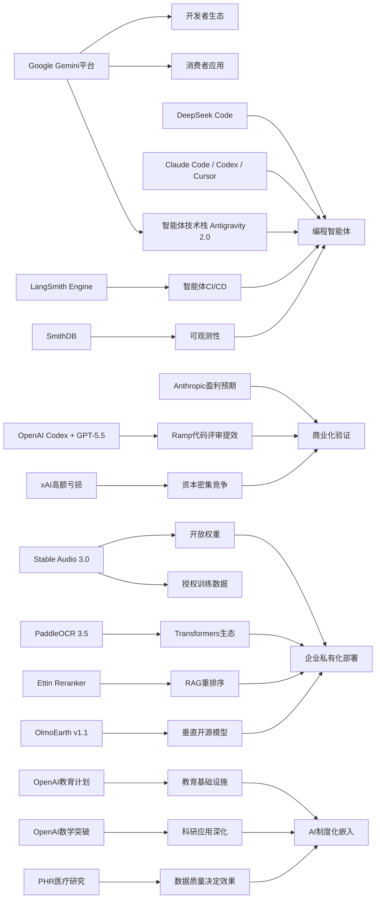

> AI 早报 · 每日早读 · 全网深度聚合

## **今日摘要**

近期 AI 领域一方面在产品化上持续加速：智能体基础设施、音频生成和教育合作都在升级，说明 AI 正从单点模型能力走向可部署、可运营、可落地的系统化应用。  
另一方面，前沿研究也在快速突破，Google 继续扩张 Gemini 平台，OpenAI 模型甚至推翻了离散几何中的长期猜想，而 PaddleOCR 3.5 则增强了与主流模型生态的兼容性。  
从行业趋势看，像 DeepSeek 这类公司正加码 AI 编程智能体，预示竞争重点将从“会对话”进一步转向“能执行、能协作、能融入工程流程”的智能体能力。

### 🔵 产品与功能更新

1. **AI智能体基础设施继续升级。**  
LangSmith Engine 开始提供面向 AI 智能体的 CI/CD（持续集成/持续交付）闭环，帮助团队更系统地测试、部署和迭代智能体。SmithDB 则主打低延迟查询，方便做可观测性（运行状态监控）分析。与此同时，Cognition 推出 Devin Auto-Triage，用带记忆能力和子智能体结构的方式自动处理 bug 分流；Anthropic 也持续优化 Claude Code，提升其处理大型代码库时的速度与诊断能力🚀  
[智能体工具升级(briefing)](https://news.smol.ai/issues/26-05-18-not-much/)

2. **Stability AI 发布 Stable Audio 3.0。**  
这一代音频模型可生成最长 6 分钟的音乐内容，明显提升了可用时长。Stability AI 表示其中 3 个模型将开放权重（可下载模型参数），方便开发者自行部署与微调。公司还强调训练数据全部来自授权内容，这对商业应用的合规性更友好🚀  
[音频模型新版本(briefing)](https://the-decoder.com/stability-ai-launches-stable-audio-3-0-with-up-to-six-minute-tracks-and-open-weights/)

3. **OpenAI 推进“面向国家的教育计划”新阶段。**  
OpenAI 正通过新的合作伙伴关系，把 AI 工具进一步带入学校和教育体系。重点包括教师培训、教学工具落地，以及帮助不同国家提升学习效果。相比单纯发布模型，这更像是把 AI 从产品能力推进到教育基础设施层面🚀  
[教育合作再推进(briefing)](https://openai.com/index/the-next-phase-of-education-for-countries)

### 🟢 前沿研究

1. **Google I/O 2026 进一步明确 Gemini 平台路线。**  
Google 在 I/O 上把 Gemini 重新定位为同时面向消费者和开发者的 AI 平台，并发布 Gemini 3.5 Flash、Gemini Omni 以及扩展后的 Antigravity 2.0 智能体技术栈。Gemini 3.5 Flash 侧重更快的智能体与编程任务，Gemini Omni 则强化多模态（文本、图像、视频等多种输入输出）生成与编辑。Google 还披露其每月处理超过 3.2 千万亿 token（模型处理的文本单位），显示平台规模正快速扩大🚀  
[谷歌Gemini新布局(briefing)](https://news.smol.ai/issues/26-05-19-not-much/)

2. **OpenAI 模型推翻离散几何核心猜想。**  
OpenAI 宣布，其模型解决了存在 80 年之久的单位距离问题，并推翻了离散几何中的一个重要猜想。这意味着 AI 不再只是辅助数学研究，而开始直接参与提出并验证关键结论。对基础科学来说，这是 AI 进入高难度理论研究的重要标志🚀  
[AI突破数学猜想(briefing)](https://openai.com/index/model-disproves-discrete-geometry-conjecture)

3. **PaddleOCR 3.5 引入 Transformers 后端。**  
PaddleOCR 3.5 现在可在 Transformers（主流深度学习模型框架）后端上运行 OCR（光学字符识别）与文档解析任务。这样做有助于和更广泛的模型生态兼容，也方便开发者把文档理解流程接入现有 AI 管线。对企业文档处理、票据识别和知识管理等场景，这类能力会更容易落地🚀  
[文档识别新方案(briefing)](https://huggingface.co/blog/PaddlePaddle/paddleocr-transformers)

### 🟡 行业展望与社会影响

1. **DeepSeek 正筹备自家 AI 编程智能体。**  
DeepSeek 正在北京组建新团队，开发暂名为“Deepseek Code”的 AI 编程助手，目标直指 Claude Code、Codex 和 Cursor。招聘信息显示，团队会重点关注 agent loops（智能体循环执行机制）、MCP（模型上下文协议）和 context engineering（上下文工程）等方向。这表明 AI 编程工具的竞争正从聊天式辅助，转向更强的自动执行与工程化能力🚀  
[DeepSeek入局编程(briefing)](https://the-decoder.com/deepseek-wants-to-take-on-claude-code-and-openais-codex-with-deepseek-code/)

2. **Anthropic 称即将迎来首个盈利季度。**  
Anthropic 向投资人表示，公司第二季度收入将增长到约 109 亿美元，较此前大幅翻倍，并可能迎来首个盈利季度。对仍处在高投入阶段的基础模型公司来说，盈利预期意味着商业化能力开始被验证。这也会加剧市场对“谁能先跑通 AI 大模型生意”的关注🚀  
[Anthropic盈利在望(briefing)](https://techcrunch.com/2026/05/20/anthropic-says-its-about-to-have-its-first-profitable-quarter/)

3. **Ramp 用 Codex 缩短代码评审时间。**  
OpenAI 介绍了 Ramp 工程团队如何使用 Codex 与 GPT-5.5 辅助代码评审，把原本数小时的反馈缩短到几分钟。重点不只是效率提升，而是让工程师更快拿到“有实质内容”的修改建议。这个案例说明，AI 在软件团队中的角色正从简单补全，扩展到更完整的研发协作流程🚀  
[AI加速代码评审(briefing)](https://openai.com/index/ramp)

### 🟣 开源TOP项目

1. **OlmoEarth v1.1 发布更高效的地球观测模型。**  
AllenAI 介绍了 OlmoEarth v1.1，这是一组更高效的地球观测模型，面向遥感（通过卫星或航空设备获取地表信息）等任务。效率提升通常意味着更低的部署成本和更广的实际应用空间。对于环境监测、农业分析和灾害评估等方向，这类开源模型尤其有价值🚀  
[地球观测模型升级(briefing)](https://huggingface.co/blog/allenai/olmoearth-v1-1)

2. **文档 AI 生产化架构研究给出微服务方案。**  
这篇论文提出了一种面向生产环境的微服务架构，用来承载 OCR（光学字符识别）、分类和大语言模型流水线。它试图弥合“学术界擅长做模型、工业界更关注稳定部署”之间的落差。对希望把文档理解真正落地到企业系统中的团队，这类架构设计比单一模型指标更有参考价值🚀  
[文档AI架构参考(briefing)](https://arxiv.org/abs/2605.18818)

3. **Ettin Reranker 家族亮相。**  
Hugging Face 介绍了 Ettin Reranker 系列模型，主要用于 reranking（重排序），即在搜索或检索到候选结果后再做一次精排。重排序模型常被用于提升问答、搜索和检索增强生成（RAG，把外部资料接入模型回答）的结果质量。对构建知识库问答或企业搜索产品的团队来说，这是很实用的一类开源能力🚀  
[重排序模型上新(briefing)](https://huggingface.co/blog/ettin-reranker)

### 🔴 社媒分享

1. **Google 测试“用提示词生成原生安卓应用”。**  
Google AI Studio 现在可以根据一句提示词生成原生 Android 应用，代码使用 Kotlin 与 Jetpack Compose，并可直接在浏览器模拟器中测试。对于追踪器、清单等简单工具类应用，这可能让“先上应用商店再分发”的传统路径受到冲击。文章认为，这像是在测试应用市场版的“SaaS 末日”场景🚀  
[谷歌尝试生成App(briefing)](https://the-decoder.com/google-tests-the-app-version-of-the-saaspocalypse/)

2. **xAI 去年烧掉 64 亿美元，扩张还远未结束。**  
SpaceX 的 IPO 文件首次较完整地揭示了 xAI 的财务情况：xAI 在 2025 年亏损 64 亿美元，同时还在筹划更大规模的 Grok 扩张。文件让外界首次更清楚地看到马斯克 AI 业务的成本结构和投入力度。也再次说明，大模型竞争仍是一个极度烧钱的赛道🚀  
[xAI烧钱细节曝光(briefing)](https://techcrunch.com/2026/05/20/xai-burned-6-4b-last-year-spacexs-ipo-filing-shows-why-the-spending-is-far-from-over/)

3. **个人健康档案对个性化健康 AI 的价值被评估。**  
这篇研究考察了个人健康记录（PHR，患者自行管理的健康档案）在个性化健康 AI 中的实际作用。作者使用大语言模型，在提供临床数据的前提下回答用户健康问题，以评估其帮助程度。结果指向一个关键现实：医疗 AI 的效果不只取决于模型能力，也高度依赖输入数据是否完整且易于理解🚀  
[健康档案与医疗AI(briefing)](https://arxiv.org/abs/2605.18937)

---

📊 行业洞察

1. 事实  
   Google 在 I/O 进一步把 Gemini 定位为同时面向消费者与开发者的 AI 平台，发布 Gemini 3.5 Flash、Gemini Omni 和 Antigravity 2.0；LangSmith Engine 补上 AI 智能体的 CI/CD（持续集成/持续交付）闭环，SmithDB 强化可观测性（运行状态监控）；DeepSeek 也在组建团队开发编程智能体，关注 agent loops（智能体循环执行机制）、MCP（模型上下文协议）和 context engineering（上下文工程）。  
   【洞察】AI 竞争焦点正从“单模型能力”转向“智能体平台工程化”。胜负手不再只是参数规模或榜单成绩，而是谁能提供从模型、执行框架、测试发布到监控迭代的完整栈。未来企业采购 AI 时，也会更看重“可部署、可治理、可持续优化”的平台能力，而非单点模型表现。

2. 事实  
   Anthropic 表示即将迎来首个盈利季度；OpenAI 展示 Ramp 使用 Codex 与 GPT-5.5 将代码评审从数小时压缩到数分钟；与此同时，xAI 去年亏损 64 亿美元，仍在继续高投入扩张。  
   【洞察】基础模型行业正在进入“商业化分层”阶段：一部分公司开始证明高价值场景可以带来真实收入和利润，另一部分公司仍停留在“以资本换规模”的阶段。编程、研发协作这类高频高 ROI（投资回报率）场景，正成为大模型最先跑通商业闭环的主战场，也会加速市场对利润率与单位经济模型（unit economics，单个客户/任务的盈利能力）的重新估值。

3. 事实  
   Stability AI 发布 Stable Audio 3.0，支持最长 6 分钟音乐生成，并开放部分权重（模型参数），强调训练数据来自授权内容；PaddleOCR 3.5 接入 Transformers（主流深度学习模型框架）后端；Ettin Reranker、OlmoEarth 等开源项目继续丰富检索、遥感等垂直能力。  
   【洞察】开源生态正在从“通用模型替代”转向“垂直工作流拼装”。企业真正需要的，不只是一个大模型，而是可组合的 OCR（光学字符识别）、重排序（reranking）、音频生成、遥感分析等模块化能力。开放权重与框架兼容性正在成为 adoption（采用）加速器，尤其在合规要求高、私有化部署强的行业里，开源方案的战略价值会继续上升。

4. 事实  
   OpenAI 推进面向国家的教育计划，把 AI 工具嵌入学校体系；OpenAI 模型推翻离散几何核心猜想，显示 AI 开始参与高难度理论研究；关于个人健康档案（PHR，患者自行管理的健康档案）的研究则表明，医疗 AI 效果高度依赖高质量输入数据。  
   【洞察】AI 正从“工具层渗透”走向“制度层嵌入”。一端是教育、科研、医疗等公共领域开始把 AI 视为基础能力设施，另一端也暴露出数据质量、可解释性和应用规范的重要性。这意味着下一阶段竞争不仅是模型突破，更是谁能构建可信数据体系、行业流程适配和长期治理框架。

🗺️ 今日关系图

