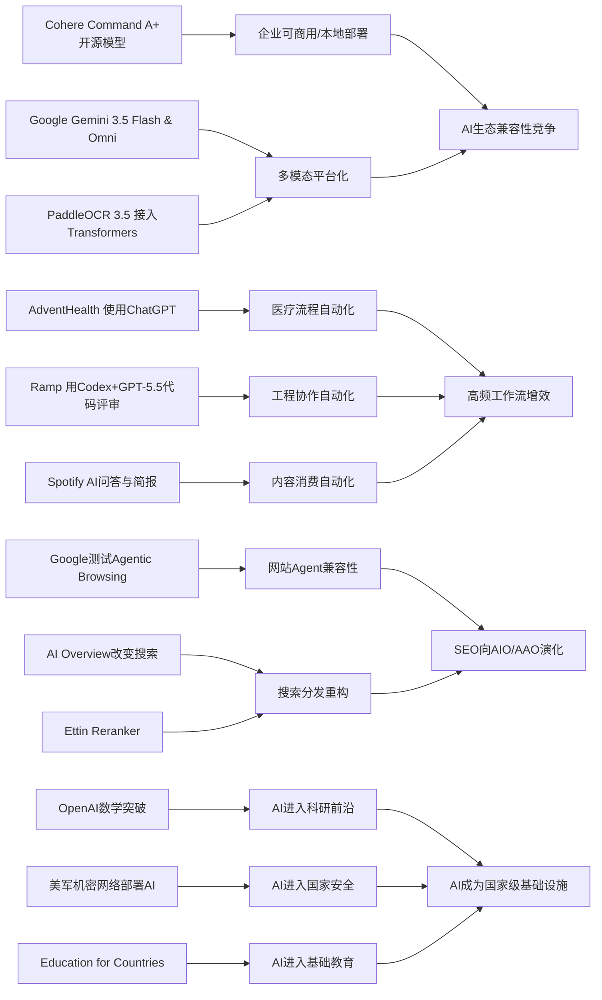

> AI 早报 · 每日早读 · 全网深度聚合

## **今日摘要**

Cohere开源了最强模型 Command A+，Google发布 Gemini 3.5 Flash/Omni 并扩展代理工具栈，说明开源与多模态平台化正成为大模型发展的两大主线。  
AI应用也在加速落地：AdventHealth用 ChatGPT 优化医院行政流程，Ramp 用 Codex 缩短代码评审时间，PaddleOCR 3.5 则更方便接入主流 AI 生态处理文档。  
与此同时，行业开始关注更广泛的基础设施与社会影响，比如 Google 测试网站对 AI 代理的兼容性、Datasette 补齐 Agent 组件，以及 OpenAI 推进面向国家的教育计划。

### 🔵 产品与功能更新

1. **Cohere开源最强模型Command A+。**
Cohere发布了目前最强的语言模型（处理文本的AI模型）Command A+，并采用Apache 2.0开源许可，方便企业和开发者直接使用与二次开发。对市场来说，这意味着又多了一款可商用、可本地部署的大模型选择。开源也通常会加快生态建设，让更多工具、插件和行业方案围绕它出现。🚀  
[开源模型发布详情(briefing)](https://the-decoder.com/cohere-open-sources-its-strongest-model-yet/)

2. **AdventHealth将ChatGPT用于医疗流程。**
AdventHealth正在使用面向医疗场景的ChatGPT，目标是减少行政类重复工作，把更多时间还给医生和患者。对非技术读者来说，这类应用更像“智能助手”进入医院后台，而不是直接替代医生做诊断。重点价值在于提升文书、流程和沟通效率，缓解医疗系统中的事务负担。🚀  
[医疗AI应用进展(briefing)](https://openai.com/index/adventhealth)

3. **Datasette推出agent-sprites新组件。**
datasette-agent-sprites 0.1a0发布，属于Datasette Agent生态中的新组件。虽然原文信息较少，但从命名看，它面向智能代理（Agent，可自动执行任务的AI程序）相关能力扩展。对于关注轻量级AI工具链的人来说，这类小版本更新往往是在补齐可视化或交互能力。🚀  
[组件更新简报(briefing)](https://simonwillison.net/2026/May/21/datasette-agent-sprites/#atom-everything)

### 🟢 前沿研究

1. **Google发布Gemini 3.5 Flash与Omni。**
Google在I/O 2026上进一步把Gemini定位为面向消费者和开发者的平台，并推出Gemini 3.5 Flash、Gemini Omni以及升级后的Agent Stack（代理工具栈）。其中Flash偏向快速响应与编程任务，Omni则强调多模态（可同时处理文字、图片、视频等）生成与编辑。Google还披露其月处理token（模型读取的文本单位）规模大幅增长，显示其AI基础设施正在迅速扩张。🚀  
[谷歌AI发布总览(briefing)](https://news.smol.ai/issues/26-05-19-not-much/)

2. **Ramp用Codex加速代码评审。**
OpenAI介绍了Ramp工程师如何结合Codex与GPT-5.5进行代码评审，把原本数小时的反馈周期缩短到几分钟。对普通读者来说，这相当于让AI先做一轮“技术审稿”，帮助工程师更快发现问题、给出修改建议。它反映出AI正在从写代码走向更深入的软件协作环节。🚀  
[代码评审案例解析(briefing)](https://openai.com/index/ramp)

3. **PaddleOCR 3.5接入Transformers后端。**
PaddleOCR 3.5宣布可在Transformers（常见模型框架）后端上运行OCR（光学字符识别）和文档解析任务。简单说，就是让识别扫描件、表格、票据和复杂文档的能力更容易与主流AI模型生态对接。对企业和开发者而言，这有助于把文档处理流程整合进更完整的AI应用中。🚀  
[文档识别能力升级(briefing)](https://huggingface.co/blog/PaddlePaddle/paddleocr-transformers)

### 🟡 行业展望与社会影响

1. **Google测试网站对AI代理的兼容性。**
Google正在Lighthouse分析工具中测试“Agentic Browsing”（代理式浏览）新类别，用来检查网站对AI代理访问的适配程度，也会关注llms.txt这类面向大模型的说明文件。对网站运营者来说，这意味着未来不仅要考虑搜索引擎优化，还要考虑“AI是否看得懂、用得顺”。这可能推动新一轮面向AI访问的网页规范建设。🚀  
[网站适配新趋势(briefing)](https://the-decoder.com/google-tests-websites-for-llms-txt-and-agent-compatibility/)

2. **OpenAI推进Education for Countries计划。**
OpenAI宣布推进Education for Countries项目，通过新合作、教师培训和工具引入，扩大AI在学校中的应用。它关注的不只是给学生一个聊天机器人，而是把AI嵌入教学支持、课程资源和教育体系建设中。对社会层面来说，这会加快各国把AI视为基础教育能力的一部分。🚀  
[全球教育计划进展(briefing)](https://openai.com/index/the-next-phase-of-education-for-countries)

3. **搜索引擎格局因AI概览功能变化。**
TechCrunch讨论了在Google搜索越来越“不是原来的Google”之后，值得尝试的其他搜索引擎。核心背景是AI Overview（AI概览）正在改变用户获取信息的方式，也改变了传统“输入关键词、点链接”的搜索体验。对普通用户来说，这意味着搜索工具的选择正在重新变得重要。🚀  
[搜索市场变化观察(briefing)](https://techcrunch.com/2026/05/21/six-search-engines-worth-trying-now-that-google-isnt-really-google-anymore/)

### 🟣 开源TOP项目

1. **OpenAI模型推翻离散几何重要猜想。**
OpenAI宣布，其模型解决了一个存在80年的单位距离问题，并推翻了离散几何中的一个重要猜想。简单理解，这是AI首次在高水平数学研究中给出具有里程碑意义的成果。它显示AI不再只是“会算题”，而开始进入提出和验证深层数学思路的阶段。🚀  
[数学突破官方解读(briefing)](https://openai.com/index/model-disproves-discrete-geometry-conjecture)

2. **AI数学成果获顶级期刊级关注。**
The Decoder进一步报道，这一成果被视为首个达到数学顶级期刊水准的AI证明案例之一。专家评价认为，这可能只是开始，未来数学家将越来越难区分哪些关键突破来自人类、哪些来自AI辅助。对科研界而言，这不只是单点新闻，更像研究范式变化的信号。🚀  
[专家解读AI证明(briefing)](https://the-decoder.com/openai-shifts-the-boundary-of-automated-reasoning-with-a-milestone-in-ai-mathematics-that-experts-are-now-unpacking/)

3. **OlmoEarth v1.1升级地球观测模型。**
AllenAI发布OlmoEarth v1.1，这是一组更高效的地球观测模型，可用于处理遥感（通过卫星等远距离采集信息）相关任务。相比只追求更大参数量，这次更新强调效率与实际使用价值。对气候、农业、土地监测等场景来说，这类模型有望降低使用门槛。🚀  
[遥感模型更新说明(briefing)](https://huggingface.co/blog/allenai/olmoearth-v1-1)

### 🔴 社媒分享

1. **美军网络司令部加速在机密网络部署AI。**
美国网络司令部已成立专项团队，计划在五角大楼和国家安全局的高机密网络中部署来自OpenAI、Google等公司的模型。报道提到，推动因素之一是AI在发现安全漏洞上的速度可能已接近甚至超过顶尖人工专家。对公众来说，这说明AI竞赛正迅速延伸到国家安全层面。🚀  
[机密网络部署动向(briefing)](https://the-decoder.com/us-cyber-command-races-to-deploy-ai-on-top-secret-networks/)

2. **Spotify为播客加入AI问答与简报。**
Spotify将为播客加入AI驱动的问答和简报生成功能，用户可以按自己的提示词生成每日或每周摘要。对普通听众而言，这相当于把长音频内容变得更“可检索、可总结、可定制”。这也说明音频平台正在把AI当成内容分发和消费的新入口。🚀  
[播客AI功能一览(briefing)](https://techcrunch.com/2026/05/21/spotify-adds-ai-powered-qa-and-briefing-generation-features-to-podcasts/)

3. **Ettin Reranker发布重排序模型家族。**
Hugging Face介绍了Ettin Reranker系列，这类模型主要用于重排序（把初步搜索结果按相关性重新排好）。虽然它不如聊天机器人直观，但在搜索、问答和推荐系统中非常关键。更好的重排序能力，通常意味着用户能更快看到真正有用的结果。🚀  
[重排序模型发布(briefing)](https://huggingface.co/blog/ettin-reranker)

---

📊 行业洞察

1. 事实  
   Cohere开源最强模型Command A+并采用Apache 2.0许可；Google发布Gemini 3.5 Flash、Gemini Omni和升级版Agent Stack（代理工具栈）；PaddleOCR 3.5接入Transformers（主流模型框架）后端。  
   【洞察】大模型竞争正在从“单点模型能力”转向“可嵌入企业流程的生态兼容性”竞争。开源许可、本地部署、框架兼容、多模态与文档解析能力的打通，意味着企业采购标准会从“哪个模型最强”升级为“哪个技术栈最容易接入现有系统并形成复用”。这将利好具备平台化能力的厂商，也会压缩纯模型层的差异化溢价。

2. 事实  
   AdventHealth将ChatGPT用于医疗行政流程；Ramp用Codex与GPT-5.5把代码评审周期从数小时压缩到数分钟；Spotify为播客加入AI问答与简报功能。  
   【洞察】AI商业化正在进入“高频工作流自动化”阶段，而非停留在演示型助手。医疗后台、软件工程、音频内容消费都体现出同一趋势：AI优先切入重复性高、反馈链条长、信息密集的环节，先做“增效层”再逐步向核心决策延伸。这说明2026年的落地重点已不是证明AI能用，而是证明AI能稳定融入业务SOP（标准作业流程）。

3. 事实  
   Google在Lighthouse中测试Agentic Browsing（代理式浏览）与llms.txt适配；Google搜索的AI Overview正在改变传统搜索体验；Ettin Reranker发布重排序模型家族。  
   【洞察】搜索与网页分发正在从“面向人类点击”转向“同时面向AI代理读取、理解与执行”。未来SEO（搜索引擎优化）将演化为AIO（AI优化）或AAO（Agent优化）：网站不仅要争取排名，还要争取被代理正确解析、调用和重组内容。重排序模型和网页代理兼容标准会成为新流量入口的基础设施，搜索产业链的价值重心将从索引扩展到“代理可用性”。

4. 事实  
   OpenAI模型推翻离散几何重要猜想并获得顶级期刊级关注；美国网络司令部加速在高机密网络部署OpenAI、Google等模型；OpenAI推进Education for Countries计划。  
   【洞察】AI正同时进入“科研突破、国家安全、基础教育”三类高战略价值领域，标志着其角色从生产力工具升级为国家级能力基础设施。数学证明代表前沿认知生产，机密网络部署代表安全与主权竞争，教育计划代表未来人才与制度配套。三者共同说明，AI竞争的下一阶段不只是商业市场份额之争，而是科研能力、制度适配与国家战略资源配置之争。

🗺️ 今日关系图

