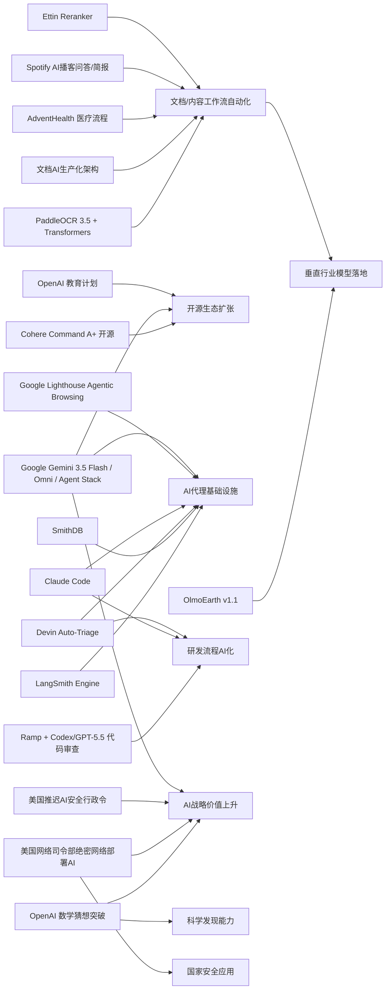

> AI 早报 · 每日早读 · 全网深度聚合

## **今日摘要**

Cohere开源最强模型Command A+、Google发布Gemini 3.5 Flash与Omni，显示大模型能力持续提升，同时通过开源和平台化进一步降低开发与应用门槛。  
在应用层，AdventHealth用ChatGPT优化医疗流程，OpenAI推进国家级教育计划，PaddleOCR接入Transformers，说明AI正加速进入医疗、教育和企业文档处理等具体场景。  
与此同时，AI代理基础设施持续升级，Google开始测试网站对AI代理的兼容性，而美国则在AI安全监管上有所推迟，反映出行业正同时面临技术演进、生态重构与政策博弈。

### 🔵 产品与功能更新
1. **Cohere开源最强模型Command A+。**
Cohere发布了目前最强的语言模型（擅长理解和生成文本的AI）Command A+，并采用Apache 2.0开源许可，意味着企业和开发者可以更自由地使用与二次开发。对市场来说，这不仅降低了先进模型的使用门槛，也会加快各类AI应用的落地速度。开源策略还可能推动更多围绕该模型的工具链和社区生态形成。🚀  
[查看开源模型发布](https://the-decoder.com/cohere-open-sources-its-strongest-model-yet/)

2. **AdventHealth用ChatGPT改善医疗流程。**
AdventHealth正在使用面向医疗场景的ChatGPT，来简化工作流程并减少行政负担。对医院来说，这类工具的价值不只是“能回答问题”，更在于帮助医护人员节省文书和协调时间，把更多精力放回患者照护。医疗AI正在从试点走向更具体的业务流程优化。🚀  
[了解医疗合作细节](https://openai.com/index/adventhealth)

3. **AI代理基础设施持续升级。**
当天虽然“整体动静不大”，但AI代理（可自动执行任务的AI系统）基础设施在继续进化。LangSmith Engine开始提供面向代理的CI/CD循环（持续集成/持续交付，指自动测试与部署流程），SmithDB则强调低延迟可观测性查询；同时Cognition的Devin Auto-Triage尝试把缺陷分流自动化做成持续运行的能力。Anthropic也在改进Claude Code，让它更适合处理大型代码库。🚀  
[查看产品动态综述](https://news.smol.ai/issues/26-05-18-not-much/)

### 🟢 前沿研究
1. **Google I/O发布Gemini 3.5 Flash与Omni。**
Google在I/O大会上进一步把Gemini定位为面向消费者与开发者的平台，并带来Gemini 3.5 Flash、Gemini Omni以及更新后的Agent Stack（代理开发栈）。其中Flash偏向更快的编码与代理任务，Omni则强调多模态（可同时处理文本、图像、视频等）生成与编辑。Google还披露其月处理量已超过3.2千万亿tokens，显示出平台规模正在迅速扩大。🚀  
[查看I/O核心发布](https://news.smol.ai/issues/26-05-19-not-much/)

2. **OpenAI推进“面向国家的教育计划”。**
OpenAI宣布扩展Education for Countries，继续推动AI在学校体系中的采用。新阶段包括更多合作、教师培训以及面向学习结果改进的工具建设。对于教育领域来说，重点不只是“把AI带进课堂”，而是如何把教师支持、课程实践和工具使用一起做成体系。🚀  
[了解教育计划进展](https://openai.com/index/the-next-phase-of-education-for-countries)

3. **PaddleOCR 3.5接入Transformers后端。**
PaddleOCR 3.5开始支持基于Transformers（当前主流深度学习模型架构）的后端，用于文字识别与文档解析任务。这意味着OCR（光学字符识别）与大模型生态之间的衔接会更顺畅，也更利于统一部署和调用。对企业文档处理、表单识别和知识录入等场景会有直接帮助。🚀  
[查看OCR新版本说明](https://huggingface.co/blog/PaddlePaddle/paddleocr-transformers)

### 🟡 行业展望与社会影响
1. **Google测试网站是否适配AI代理访问。**
Google正在Lighthouse分析工具中测试“Agentic Browsing”实验分类，用来检查网站对AI代理访问的兼容性，包括是否提供llms.txt。这个变化意味着，未来网站优化可能不再只面向搜索引擎和人类访客，也要开始考虑AI代理是否“读得懂、用得顺”。网站运营和内容分发规则可能因此发生新变化。🚀  
[查看代理浏览测试](https://the-decoder.com/google-tests-websites-for-llms-txt-and-agent-compatibility/)

2. **美国推迟AI安全行政令。**
特朗普推迟签署原本要求AI模型发布前进行政府安全审查的行政命令，并表示不希望阻碍美国领先地位。这个表态反映出政策层仍在“安全监管”和“产业竞争”之间拉扯。对AI企业而言，短期内监管压力可能放缓，但政策不确定性依然存在。🚀  
[了解政策延期背景](https://techcrunch.com/2026/05/21/trump-delays-ai-security-executive-order-i-dont-want-to-get-in-the-way-of-that-leading/)

3. **OpenAI模型推翻80年几何猜想。**
OpenAI称其模型解决了离散几何中的“单位距离问题”，推翻了一个存在80年的重要猜想。这不仅是数学研究上的突破，也让外界重新评估AI在高难度科学推理中的潜力。社会层面的影响在于，AI正从“辅助整理信息”逐步走向“参与原创发现”。🚀  
[查看数学突破解读](https://openai.com/index/model-disproves-discrete-geometry-conjecture)

### 🟣 开源TOP项目
1. **OlmoEarth v1.1发布更高效地球观测模型。**
AllenAI发布OlmoEarth v1.1，这是一组更高效的地球观测模型，面向遥感（通过卫星等手段获取地表信息）任务。此类模型可用于环境监测、土地利用分析和灾害响应等场景。效率提升意味着更低的计算成本，也更有利于在实际项目中部署。🚀  
[查看模型更新详情](https://huggingface.co/blog/allenai/olmoearth-v1-1)

2. **文档AI生产化架构论文公开。**
一篇新论文提出了面向生产环境的文档AI微服务架构，把分类、OCR和大语言模型流程串联起来。它试图解决学术界“只讲模型、不讲落地”的断层问题，展示如何把文档理解系统真正跑在业务环境中。对企业团队来说，这类架构经验往往比单一模型指标更有参考价值。🚀  
[查看文档AI架构](https://arxiv.org/abs/2605.18818)

3. **Ramp用Codex加速代码审查。**
Ramp分享了工程团队如何使用Codex与GPT-5.5进行代码审查，把原本需要数小时的反馈缩短到几分钟。虽然这不是传统意义上的开源项目，但它展示了AI编码助手在真实研发流程中的实际价值。对开发团队来说，重点是把AI嵌入审查环节，而不是只用于写代码。🚀  
[了解代码审查实践](https://openai.com/index/ramp)

### 🔴 社媒分享
1. **美国网络司令部加速在绝密网络部署AI。**
美国网络司令部已成立专项团队，计划把OpenAI、Google等公司的模型运行在五角大楼和NSA的绝密网络中。推动这一动作的原因是，先进AI在发现安全漏洞方面已经表现出接近顶级人类黑客的能力。这个消息在社交与舆论层面很容易引发对“AI军事化”和网络攻防升级的讨论。🚀  
[查看绝密网络部署](https://the-decoder.com/us-cyber-command-races-to-deploy-ai-on-top-secret-networks/)

2. **Spotify为播客加入AI问答与简报。**
Spotify正在为播客加入AI驱动的问答和简报生成功能，用户可基于自己的提示词生成每日或每周摘要。对普通用户来说，这会让长音频内容变得更易消费，也可能改变播客的发现和回顾方式。AI正在把“听内容”逐步改造成“和内容互动”。🚀  
[查看播客功能更新](https://techcrunch.com/2026/05/21/spotify-adds-ai-powered-qa-and-briefing-generation-features-to-podcasts/)

3. **Ettin Reranker家族发布。**
Hugging Face博客介绍了Ettin Reranker系列模型，用于重排序（在初步检索结果中再筛出更相关内容）。这类模型通常用于搜索、问答和检索增强生成（先搜再答的AI流程）等系统中，决定最终结果是否更贴近用户需求。虽然偏底层，但它对实际AI产品体验影响很大。🚀  
[了解重排序模型](https://huggingface.co/blog/ettin-reranker)

---

📊 行业洞察

1. 事实  
   Cohere开源最强模型Command A+，采用Apache 2.0许可；Google在I/O发布Gemini 3.5 Flash、Gemini Omni与Agent Stack，并披露月处理量超3.2千万亿tokens（模型处理的文本单位）；同时OpenAI持续推进面向国家的教育计划。  
   【洞察】基础模型市场正从“单点模型能力竞争”转向“开源+平台规模+行业入口”的三线竞争。Cohere用开源降低采用门槛，Google用超大规模推高平台黏性，OpenAI则通过教育体系提前锁定长期用户心智，说明头部厂商的护城河正在从模型分数转向生态位占领。

2. 事实  
   LangSmith Engine提供面向AI代理的CI/CD（持续集成/持续交付）循环，SmithDB强调低延迟可观测性（对系统运行状态的追踪与分析）查询；Cognition推出Devin Auto-Triage自动缺陷分流，Anthropic持续改进Claude Code以适配大型代码库；Google同时测试网站对Agentic Browsing（代理式浏览）的兼容性，包括llms.txt。  
   【洞察】AI代理正在从“能演示”进入“可运维、可部署、可访问”的工程化阶段。上游是代理开发栈和运维基础设施成熟，中游是代码与任务执行能力强化，下游则是网站开始为代理访问重构接口与规范，这意味着2026年的竞争重点将不只是“谁有代理”，而是谁先建立代理原生（Agent-native）的软件基础设施。

3. 事实  
   AdventHealth使用医疗版ChatGPT优化行政流程；PaddleOCR 3.5接入Transformers后端，提升OCR（光学字符识别）与大模型生态衔接；同时有论文公开文档AI生产化微服务架构，将分类、OCR与大语言模型流程串联；Spotify也为播客加入AI问答与摘要。  
   【洞察】企业AI落地正在从“通用聊天助手”升级为“内容流与工作流自动化”。无论是医院文书、企业文档处理，还是播客内容消费，核心都不是单个模型更聪明，而是非结构化内容（文本、语音、文档）被重构为可检索、可总结、可执行的业务流程，文档AI与多模态处理正成为ROI（投资回报率）最清晰的落地方向。

4. 事实  
   美国推迟AI安全行政令，短期放缓模型发布前政府安全审查；与此同时，美国网络司令部正推动OpenAI、Google等模型部署到绝密网络；OpenAI还宣布模型推翻80年几何猜想，显示其在高难度科学推理中的潜力。  
   【洞察】AI的战略价值正在同时向“国家安全资产”与“科学创新基础设施”两端延展。监管放缓有利于美国企业加速竞争，而军方部署和科学突破则进一步强化了先进模型的双重属性：既是提升国家能力的战略工具，也是推动前沿研究的通用发现引擎，未来政策博弈会更集中于“领先优势优先”而非“普遍风险约束”。

🗺️ 今日关系图

