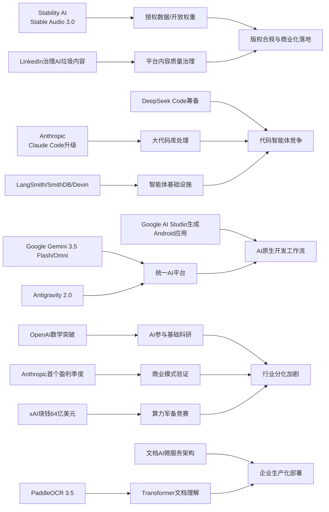

> AI 早报 · 每日早读 · 全网深度聚合

## **今日摘要**

Stable Audio 3.0、Claude Code及相关智能体基础设施迎来升级，显示生成音频与大代码库开发工具正朝着更长内容、更高效率和更强工程化能力快速演进。  
前沿研究方面，OpenAI称其模型推翻了一个有80年历史的离散几何猜想，Google I/O 2026则发布Gemini 3.5 Flash与Omni、PaddleOCR 3.5引入Transformer后端，反映AI正同时深入基础科学、多模态平台和企业文档处理。  
行业层面，DeepSeek正在筹备代码智能体Deepseek Code，说明代码助手竞争已从简单补全转向具备自主执行、记忆和工具协作能力的智能体生态。

### 🔵 产品与功能更新

1. **Stability AI发布Stable Audio 3.0。**
新一代音频模型可生成最长6分钟的音乐片段，比以往更接近完整歌曲的长度🚀  
其中有3个模型开放权重（可下载并自行部署的模型参数），对开发者和创作者都更友好。  
官方还强调训练数据全部来自授权内容，这有助于缓解版权争议。  
[稳定音频升级解读(briefing)](https://the-decoder.com/stability-ai-launches-stable-audio-3-0-with-up-to-six-minute-tracks-and-open-weights/)

2. **Claude Code等智能体基础设施继续升级。**
当天产品更新虽不算爆发，但“智能体基础设施”明显在加速，包括LangSmith Engine提供面向智能体的CI/CD（持续集成/持续交付）闭环🚀  
SmithDB则主打低延迟查询，帮助团队做可观测性（系统运行状态追踪）分析。  
Cognition的Devin Auto-Triage进一步把缺陷分流自动化，强调记忆能力和子智能体协作。  
[智能体工具更新速览(briefing)](https://news.smol.ai/issues/26-05-18-not-much/)

3. **Anthropic强化Claude Code大代码库体验。**
Anthropic正在改进Claude Code，让它更适合处理大型代码库场景🚀  
更新点包括提示缓存诊断，帮助开发者理解哪些上下文被复用，从而优化成本与速度。  
同时还加入更快的运行模式，提升代码分析和修改时的响应效率。  
[Claude Code更新摘要(briefing)](https://news.smol.ai/issues/26-05-18-not-much/)

### 🟢 前沿研究

1. **OpenAI模型推翻离散几何核心猜想。**
OpenAI表示，其模型解决了有80年历史的“单位距离问题”，并推翻了离散几何中的一个重要猜想🚀  
这类成果意味着AI不再只是辅助计算，也可能参与真正的数学发现。  
如果结论经学界进一步验证，这将成为AI参与基础数学研究的重要里程碑。  
[几何猜想突破详情(briefing)](https://openai.com/index/model-disproves-discrete-geometry-conjecture)

2. **Google I/O发布Gemini 3.5 Flash与Omni。**
谷歌在I/O 2026上把Gemini进一步定位为面向消费者和开发者的统一AI平台🚀  
其中Gemini 3.5 Flash主打快速智能体任务和编程，Gemini Omni则面向多模态（文本、图片、音频、视频等多种输入输出）生成与编辑。  
同时扩展的Antigravity 2.0智能体技术栈，也显示谷歌正把“模型+工具链”一起推进。  
[谷歌I/O要点梳理(briefing)](https://news.smol.ai/issues/26-05-19-not-much/)

3. **PaddleOCR 3.5接入Transformer后端。**
PaddleOCR 3.5展示了如何用Transformer（擅长处理序列信息的神经网络架构）后端完成OCR（文字识别）和文档解析任务🚀  
这意味着传统文档识别流程正进一步向通用大模型架构靠拢。  
对企业场景来说，票据、表单、合同等复杂文档处理的可扩展性有望增强。  
[PaddleOCR新版介绍(briefing)](https://huggingface.co/blog/PaddlePaddle/paddleocr-transformers)

### 🟡 行业展望与社会影响

1. **DeepSeek正筹备代码智能体Deepseek Code。**
DeepSeek据称正在北京组建新团队，开发代号为“Deepseek Code”的AI代码智能体🚀  
目标直指Claude Code、Codex和Cursor，说明代码助手竞争正从“补全工具”升级为“自主执行任务的代理”。  
招聘信息提到agent loops、MCP和context engineering，显示行业正在围绕新型开发工作流重建能力栈。  
[DeepSeek代码布局观察(briefing)](https://the-decoder.com/deepseek-wants-to-take-on-claude-code-and-openais-codex-with-deepseek-code/)

2. **Anthropic称即将迎来首个盈利季度。**
Anthropic向投资者表示，公司即将实现首个盈利季度，且季度收入预计将超过翻倍至约109亿美元🚀  
这说明顶级大模型公司正在从“高投入讲故事”走向“验证商业模式”。  
如果兑现，这会显著增强市场对AI基础模型公司可持续性的信心。  
[Anthropic盈利信号(briefing)](https://techcrunch.com/2026/05/20/anthropic-says-its-about-to-have-its-first-profitable-quarter/)

3. **OpenAI推进“面向国家的教育计划”。**
OpenAI宣布其Education for Countries进入下一阶段，继续扩大AI在学校体系中的应用🚀  
重点包括新的合作伙伴关系、教师培训以及教学工具部署，目标是改善全球学习成果。  
这也反映出AI公司正把教育视为重要的公共服务与长期市场。  
[教育合作新阶段(briefing)](https://openai.com/index/the-next-phase-of-education-for-countries)

### 🟣 开源TOP项目

1. **OlmoEarth v1.1提升地球观测模型效率。**
AllenAI发布OlmoEarth v1.1，带来更高效的一组地球观测模型🚀  
这类模型可用于卫星图像分析、环境监测和土地变化识别等任务。  
“更高效”意味着在计算成本与部署门槛上可能更适合实际应用和研究复现。  
[地球观测模型更新(briefing)](https://huggingface.co/blog/allenai/olmoearth-v1-1)

2. **文档AI生产化微服务架构公开。**
这篇论文聚焦如何把OCR（文字识别）与大语言模型流水线真正跑在生产环境中，而不是只停留在模型论文层面🚀  
作者提出微服务架构，把分类、OCR和大模型处理拆分成可独立扩展的模块。  
对企业团队来说，这类方案更接近“怎么把文档AI稳定上线”的现实问题。  
[文档AI架构论文(briefing)](https://arxiv.org/abs/2605.18818)

3. **PaddleOCR 3.5展示文档解析新路线。**
PaddleOCR 3.5不仅是功能更新，也体现了开源文档理解项目与Transformer架构融合的新方向🚀  
它覆盖OCR和文档解析任务，适合关注开源生产工具链的团队参考。  
对于非研究型团队，这类成熟开源项目往往比从零训练模型更有落地价值。  
[开源OCR方案速览(briefing)](https://huggingface.co/blog/PaddlePaddle/paddleocr-transformers)

### 🔴 社媒分享

1. **Google AI Studio开始生成原生Android应用。**
Google AI Studio现在可以通过提示词直接生成原生Android应用，代码基于Kotlin和Jetpack Compose，还能在浏览器模拟器中测试🚀  
这让简单工具类应用的制作门槛进一步降低，甚至可能削弱应用商店在某些场景下的价值。  
文章将其称为“应用市场版SaaSocalypse”，强调软件分发方式可能被改写。  
[谷歌生成应用观察(briefing)](https://the-decoder.com/google-tests-the-app-version-of-the-saaspocalypse/)

2. **xAI去年烧掉64亿美元。**
根据SpaceX IPO文件披露，xAI在2025年亏损64亿美元，而Grok扩张计划仍在继续🚀  
这份材料首次较系统地展示了马斯克AI业务的财务状况，也说明前沿模型竞争依旧极其烧钱。  
社交媒体上，这一数字也再次引发关于“算力军备竞赛”可持续性的讨论。  
[xAI财务曝光解读(briefing)](https://techcrunch.com/2026/05/20/xai-burned-6-4b-last-year-spacexs-ipo-filing-shows-why-the-spending-is-far-from-over/)

3. **LinkedIn开始打击“AI垃圾内容”。**
LinkedIn正在加强对AI生成低质内容的治理，并称早期测试中可正确识别94%的泛化帖子🚀  
这件事之所以在社媒上引发讨论，是因为平台母公司微软本身也一直在推动AI使用。  
某种程度上，这像是在承认平台信息流已被大量模板化AI内容稀释。  
[领英整治AI内容(briefing)](https://the-decoder.com/linkedins-war-on-ai-slop-is-not-just-a-policy-update-it-is-an-admission-that-the-platform-lost-control-of-its-feed/)

---

📊 行业洞察

1. 事实  
   Stability AI发布Stable Audio 3.0，支持最长6分钟音乐生成，并开放3个模型权重（可下载并自行部署的模型参数）；同时强调训练数据来自授权内容。  
   LinkedIn开始打击“AI垃圾内容”，并称可识别94%的泛化帖子。  
   【洞察】生成式AI正在从“能力竞赛”转向“内容治理+版权合规”双重竞争。无论是音频生成还是社交内容分发，平台与模型厂商都在补齐“可商用性”短板：前者靠授权数据降低知识产权（Intellectual Property, IP）风险，后者靠内容质量治理维护平台生态。这意味着未来AI产品的核心壁垒，不再只是模型效果，还包括合规数据供应链与内容审核基础设施。

2. 事实  
   Anthropic强化Claude Code的大代码库体验，加入提示缓存诊断与更快运行模式。  
   DeepSeek正筹备代码智能体Deepseek Code，招聘信息聚焦agent loops（智能体循环）、MCP（模型上下文协议）和context engineering（上下文工程）。  
   同时，LangSmith Engine、SmithDB、Devin Auto-Triage等工具持续升级智能体基础设施。  
   【洞察】代码AI赛道已从“代码补全”升级到“工程自动化智能体”竞争。竞争焦点正从单点模型能力，转向工作流编排、上下文管理、可观测性（observability，系统运行状态追踪）和持续交付（CI/CD，持续集成/持续交付）闭环。谁能更稳定地接入真实软件工程流程，谁更可能占据企业开发平台入口。

3. 事实  
   Google I/O发布Gemini 3.5 Flash与Gemini Omni，并扩展Antigravity 2.0智能体技术栈。  
   Google AI Studio开始支持通过提示词直接生成原生Android应用，并可在浏览器模拟器中测试。  
   【洞察】谷歌正在把“模型层”优势快速下沉到“开发与分发层”。从多模态模型、智能体工具链到直接生成可运行Android应用，谷歌的目标并非单一聊天助手，而是构建覆盖消费者、开发者和终端生态的统一AI平台。这种“模型+IDE（集成开发环境）+运行环境”一体化布局，可能重塑移动应用开发门槛，并强化安卓生态的AI原生属性。

4. 事实  
   OpenAI模型据称推翻了一个80年历史的离散几何猜想。  
   Anthropic称即将迎来首个盈利季度。  
   xAI去年烧掉64亿美元，显示前沿模型竞争仍极其烧钱。  
   【洞察】大模型行业正出现“科研突破、商业验证、资本消耗”三线并行的分化格局。一方面，头部模型开始冲击基础数学等高认知任务，提升技术叙事高度；另一方面，Anthropic的盈利信号说明部分厂商已接近商业化拐点；但xAI的高额亏损也提醒市场，前沿模型仍是重资本（capital-intensive，高资金投入）行业。未来行业将更明显分化为“能自我造血的平台型公司”与“依赖持续融资追赶的技术玩家”。

🗺️ 今日关系图

