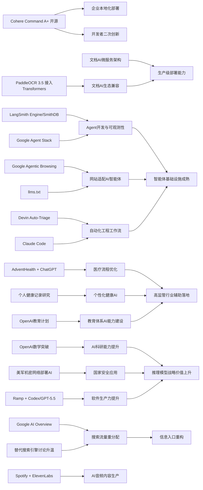

> AI 早报 · 每日早读 · 全网深度聚合

## **今日摘要**

Cohere开源最强模型Command A+、AdventHealth用ChatGPT优化医疗行政流程，以及LangSmith、Devin、Claude Code等更新，显示企业级生成式AI正加速走向可部署、可观测、可持续运营的实用阶段。  
研究与平台层面，OpenAI模型推翻了一个存在80年的离散几何猜想，Google发布Gemini 3.5 Flash、Omni和Agent Stack，PaddleOCR 3.5接入Transformers后端，说明AI正在同时强化科研推理能力、多模态平台能力和产业兼容性。  
行业影响方面，Google开始测试网站对AI智能体的兼容性，预示未来数字基础设施不仅要服务人，也要服务AI代理，AI生态正从“模型竞争”走向“系统与环境协同”。

### 🔵 产品与功能更新

1. **Cohere开源最强模型Command A+。**  
Cohere发布了目前最强的语言模型（能理解和生成文字的AI模型）Command A+，并采用Apache 2.0许可证开源。对企业和开发者来说，这意味着可以更自由地部署、修改和集成模型能力。开源也有助于推动本地化应用、成本控制和二次创新。对于关注可控性和数据隐私的团队，这类开源进展尤其值得留意🚀  
[查看模型开源详情(briefing)](https://the-decoder.com/cohere-open-sources-its-strongest-model-yet/)

2. **AdventHealth用ChatGPT优化医疗流程。**  
AdventHealth正在使用面向医疗场景的ChatGPT，来简化工作流程并减少行政负担。核心价值不在“替代医生”，而是在把更多时间还给患者护理，让医护人员少做重复性文书工作。这个案例显示，生成式AI（可生成文本内容的人工智能）正在更务实地进入医院运营环节🚀  
[阅读医疗落地案例(briefing)](https://openai.com/index/adventhealth)

3. **LangSmith Engine与Devin等推动智能体基础设施升级。**  
当天的产品更新重点集中在智能体（可自动执行多步任务的AI系统）基础设施。LangSmith Engine强调为智能体提供CI/CD（持续集成与持续交付）闭环，SmithDB则改善可观测性（便于追踪系统状态）的低延迟查询能力。与此同时，Cognition的Devin Auto-Triage开始把缺陷分流自动化做成更持久的工作流，Anthropic也在持续强化Claude Code处理大型代码库的能力🚀  
[浏览当日产品汇总(briefing)](https://news.smol.ai/issues/26-05-18-not-much/)

### 🟢 前沿研究

1. **OpenAI模型推翻80年离散几何猜想。**  
OpenAI表示，其模型解决了存在80年的“单位距离问题”，并推翻了离散几何中的一个核心猜想。这个成果的意义不只是“会做题”，而是AI开始在数学研究中提出真正的新结论。对科研界而言，这说明推理模型（擅长多步思考的AI）正从辅助工具走向研究伙伴🚀  
[了解数学突破原文(briefing)](https://openai.com/index/model-disproves-discrete-geometry-conjecture)

2. **Google发布Gemini 3.5 Flash、Omni与Agent Stack。**  
在Google I/O 2026上，Google把Gemini进一步定位为面向消费者和开发者的平台。Gemini 3.5 Flash主打更快的智能体与编程任务，Gemini Omni则强调多模态（可同时处理文本、图像、视频等）生成与编辑能力。配套升级的Agent Stack意味着Google正在把模型、工具和执行框架打包成更完整的AI开发体系🚀  
[查看Google I/O要点(briefing)](https://news.smol.ai/issues/26-05-19-not-much/)

3. **PaddleOCR 3.5接入Transformers后端。**  
PaddleOCR 3.5宣布可在Transformers（流行的深度学习模型框架）后端上运行文字识别和文档解析任务。这样做有助于统一模型调用方式，也更方便和主流AI生态衔接。对企业文档处理、票据识别和知识入库等场景来说，这类兼容性升级很实用🚀  
[查看OCR升级说明(briefing)](https://huggingface.co/blog/PaddlePaddle/paddleocr-transformers)

### 🟡 行业展望与社会影响

1. **Google测试网站对AI智能体的兼容性。**  
Google正在Lighthouse分析工具中测试“Agentic Browsing”新类别，用来检查网站是否适合AI智能体访问和操作。它还会关注llms.txt这类面向大模型的说明文件，帮助AI更好理解站点规则。若这一方向推进，网站未来可能不仅要对人类访客友好，也要对AI访问者友好🚀  
[了解网站新审计方向(briefing)](https://the-decoder.com/google-tests-websites-for-llms-txt-and-agent-compatibility/)

2. **OpenAI推进面向国家的教育计划。**  
OpenAI宣布继续推进“Education for Countries”，通过新合作、教师培训和工具支持来扩大AI在学校中的应用。重点不只是投放产品，而是尝试把AI纳入更系统的教育能力建设中。对各国教育体系而言，这预示AI将越来越多地影响教学方式与学习资源分配🚀  
[查看教育计划进展(briefing)](https://openai.com/index/the-next-phase-of-education-for-countries)

3. **搜索引擎格局因AI改版迎来新变量。**  
随着Google搜索结果越来越强调AI Overview（AI摘要式回答），外界开始重新讨论替代搜索引擎的机会。TechCrunch整理了6个值得尝试的搜索产品，反映出用户对传统搜索体验变化的敏感度。AI正在重塑“找信息”的入口，也可能重新分配流量与注意力🚀  
[阅读搜索格局观察(briefing)](https://techcrunch.com/2026/05/21/six-search-engines-worth-trying-now-that-google-isnt-really-google-anymore/)

### 🟣 开源TOP项目

1. **OlmoEarth v1.1发布更高效地球观测模型。**  
AllenAI发布了OlmoEarth v1.1，这是一组更高效的地球观测模型。此类模型主要面向遥感（通过卫星等设备远距离采集地表信息）分析，可用于环境监测、土地利用判断等任务。效率提升意味着在相近资源下能支持更广泛的研究和应用部署🚀  
[查看地球观测模型(briefing)](https://huggingface.co/blog/allenai/olmoearth-v1-1)

2. **文档AI生产化架构聚焦OCR与大模型流水线。**  
这篇论文提出了一种微服务架构（把系统拆成多个独立小服务）来承载OCR（光学字符识别）和大模型文档处理流程。它关注的不是单个模型精度，而是如何把分类、识别、理解等多个环节稳定跑在生产环境里。对真正要上线文档AI能力的团队来说，这种工程化经验比单点模型提升更有参考价值🚀  
[阅读文档AI架构论文(briefing)](https://arxiv.org/abs/2605.18818)

3. **Ramp用Codex加速代码审查。**  
Ramp分享了工程团队如何使用Codex与GPT-5.5进行代码审查，把原本数小时的反馈缩短到几分钟。重点在于让工程师更快获得“有内容”的修改建议，而不是只做浅层检查。这个案例说明，AI编程助手的价值正在从写代码延伸到协作与质量保障环节🚀  
[查看代码审查案例(briefing)](https://openai.com/index/ramp)

### 🔴 社媒分享

1. **美军网络司令部加速在最高机密网络部署AI。**  
美国网络司令部已成立专项小组，计划在五角大楼和美国国家安全局的最高机密网络中运行OpenAI、Google等公司的模型。推动这一进程的原因是，先进AI在发现安全漏洞方面已展现出接近顶尖人类黑客的能力。此事凸显AI正快速进入国家级网络安全核心场景🚀  
[查看军方部署动态(briefing)](https://the-decoder.com/us-cyber-command-races-to-deploy-ai-on-top-secret-networks/)

2. **Spotify推出ElevenLabs驱动的有声书制作工具。**  
Spotify发布了一款由ElevenLabs技术支持的有声书创作工具，继续扩展其AI音频内容版图。对内容创作者来说，这有望降低配音与制作门槛，让更多作品更快转成可听版本。AI语音（可自动生成自然语音的技术）正在加速进入出版与音频分发环节🚀  
[了解有声书新工具(briefing)](https://techcrunch.com/2026/05/21/spotify-launches-an-elevenlabs-powered-audiobook-creation-tool/)

3. **个人健康记录或提升个性化健康AI实用性。**  
这篇研究评估了个人健康记录（由患者自行管理的健康资料）在个性化健康AI中的作用。结果聚焦于：当大模型获得更完整的临床数据时，是否能更有效回答用户健康问题。对于未来患者自助问答、健康管理和辅助决策，这类方向有现实意义🚀  
[阅读健康AI研究(briefing)](https://arxiv.org/abs/2605.18937)

---

📊 行业洞察

1. 事实  
  Cohere将最强模型Command A+以Apache 2.0许可证开源；PaddleOCR 3.5接入Transformers后端；文档AI生产化架构论文强调OCR与大模型流水线的微服务部署。  
  【洞察】企业级AI正从“买闭源API能力”转向“开源模型+标准框架+工程化部署”的组合范式。开源许可证（Apache 2.0）降低了商用集成门槛，Transformers后端提升了生态兼容性，而微服务架构说明竞争焦点已从单模型性能转向可部署性、可维护性和总体拥有成本（TCO, Total Cost of Ownership）。

2. 事实  
  LangSmith Engine、SmithDB、Devin Auto-Triage、Claude Code都在强化智能体基础设施；Google发布Gemini 3.5 Flash、Gemini Omni与Agent Stack；Google还测试网站的Agentic Browsing与llms.txt兼容性。  
  【洞察】智能体（Agent）竞争正在从“模型谁更强”升级为“执行环境谁更完整”。一端是开发侧的CI/CD（持续集成/持续交付）、可观测性（Observability）和自动分流工作流，另一端是互联网侧开始为AI访问重构站点规范，这意味着Agent经济的下一阶段是“基础设施—工具链—外部环境”协同成熟，而不是单点模型升级。

3. 事实  
  AdventHealth用ChatGPT优化医疗行政流程；个人健康记录研究显示更完整数据可提升个性化健康AI价值；OpenAI推进面向国家的教育计划。  
  【洞察】AI落地正明显进入“高监管行业的辅助运营层”，优先替代的是文书、问答、资源分发与流程协调，而非核心专业判断。医疗和教育两个场景共同表明，现阶段最先释放ROI（投资回报率）的不是完全自动化，而是“人机协同+数据增强”的增效模式；谁能先解决隐私、权限和责任边界，谁就更可能形成规模化落地。

4. 事实  
  OpenAI模型推翻80年离散几何猜想；美军网络司令部加速在最高机密网络部署OpenAI、Google等模型；Ramp用Codex与GPT-5.5把代码审查从数小时缩短到数分钟。  
  【洞察】前沿模型的战略价值已从内容生成扩展到“科研突破+安全攻防+软件生产”三类高杠杆领域。也就是说，推理模型（Reasoning Model）正在成为一种通用认知基础设施：上可进入数学研究，下可进入国防网络与工程流程。这会进一步强化头部模型厂商在国家安全、科研合作和企业软件栈中的平台地位。

🗺️ 今日关系图

