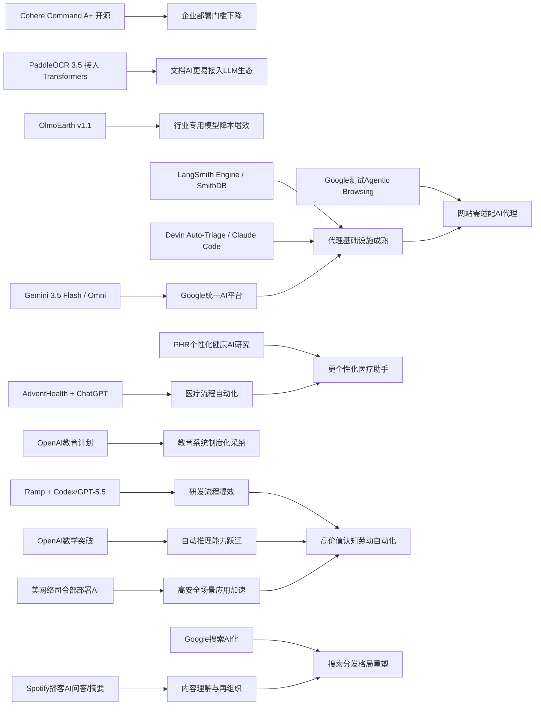

> AI 早报 · 每日早读 · 全网深度聚合

## **今日摘要**

Cohere开源最强模型Command A+、AdventHealth将ChatGPT用于医疗流程、以及LangSmith等代理基础设施加速成熟，显示AI正从模型能力走向更易部署、更适合企业落地的应用阶段。  
同时，Google发布Gemini 3.5 Flash与Omni、Ramp用Codex提升代码评审效率、PaddleOCR 3.5接入Transformers，说明多模态、编程辅助和文档AI都在持续快速进化。  
行业层面上，Google开始测试网站对AI代理的兼容性，而搜索产品的AI化也可能推动用户重新关注替代搜索引擎，反映出AI正在重塑网页生态与信息获取方式。

### 🔵 产品与功能更新

1. **Cohere开源最强模型Command A+。**  
加拿大AI公司Cohere宣布，将目前最强的语言模型Command A+以Apache 2.0许可协议开源。对企业和开发者来说，这意味着可以更灵活地部署、改造和商用这一模型。开源也有助于降低试用门槛，让更多团队评估其在客服、知识问答和内容生成中的表现🚀  
[查看开源模型详情(briefing)](https://the-decoder.com/cohere-open-sources-its-strongest-model-yet/)

2. **AdventHealth把ChatGPT用于医疗流程。**  
AdventHealth正在使用面向医疗场景的ChatGPT，目标是简化工作流程并减少行政负担。对医院而言，这类工具主要价值不在“替代医生”，而在于节省记录、整理和沟通上的时间。官方表述显示，这些效率提升最终希望把更多时间还给患者护理🚀  
[了解医疗应用案例(briefing)](https://openai.com/index/adventhealth)

3. **LangSmith Engine等代理基础设施在推进。**  
这则汇总提到，面向AI代理（可自动执行任务的智能程序）的基础设施正在快速成熟。比如LangSmith Engine提供类似CI/CD（持续集成/持续交付）的闭环，帮助团队持续测试和更新代理；SmithDB则强调低延迟观测查询，方便排查系统状态。与此同时，Cognition的Devin Auto-Triage和Anthropic对Claude Code的改进，也都在推动“更能长期工作、更适合大代码库”的代理产品落地🚀  
[浏览今日产品动态(briefing)](https://news.smol.ai/issues/26-05-18-not-much/)

### 🟢 前沿研究

1. **Google I/O发布Gemini 3.5 Flash与Omni。**  
Google在I/O 2026上进一步把Gemini定位为面向消费者和开发者的统一AI平台。其中Gemini 3.5 Flash主打更快的代理式任务与编程任务，Gemini Omni则聚焦多模态（可同时处理文本、图像、音频、视频）生成与编辑。再加上扩展后的代理技术栈，Google显然在加速把大模型能力从聊天工具推向完整应用平台🚀  
[查看I/O发布汇总(briefing)](https://news.smol.ai/issues/26-05-19-not-much/)

2. **Ramp用Codex把代码评审提速到分钟级。**  
OpenAI介绍了金融科技公司Ramp如何让工程团队使用Codex与GPT-5.5辅助代码评审。核心变化是，开发者能更快获得“有实质内容”的反馈，而不是等待数小时的人力审查。对研发团队来说，这类工具正在从“写代码助手”延伸到“改进交付流程的助手”🚀  
[阅读代码评审案例(briefing)](https://openai.com/index/ramp)

3. **PaddleOCR 3.5接入Transformers后端。**  
PaddleOCR 3.5展示了如何用Transformers（主流深度学习模型框架）运行OCR（光学字符识别）和文档解析任务。这样的升级意味着文档AI工具更容易与当前流行的大模型生态兼容。对企业场景而言，票据、合同、表单等非结构化文档处理有望变得更顺滑🚀  
[查看OCR升级说明(briefing)](https://huggingface.co/blog/PaddlePaddle/paddleocr-transformers)

### 🟡 行业展望与社会影响

1. **Google测试网站对AI代理的兼容性。**  
Google正在Lighthouse分析工具中测试“Agentic Browsing（代理式浏览）”新类别，用来检查网站是否适合AI代理访问和操作。其中包括是否支持llms.txt，这是一种帮助大模型理解网站内容边界与说明的文件。若这类检查普及，网站未来不仅要对搜索引擎友好，也要对AI代理友好🚀  
[了解代理浏览审计(briefing)](https://the-decoder.com/google-tests-websites-for-llms-txt-and-agent-compatibility/)

2. **Google搜索变化推动替代搜索引擎关注。**  
TechCrunch指出，随着Google搜索越来越深度整合AI概览，用户体验将明显变化。对不喜欢AI总结结果的用户来说，重新尝试其他搜索引擎可能成为现实选择。这反映出一个更大的行业趋势：AI正在重塑信息分发方式，也在重新定义“搜索”本身🚀  
[查看搜索格局变化(briefing)](https://techcrunch.com/2026/05/21/six-search-engines-worth-trying-now-that-google-isnt-really-google-anymore/)

3. **OpenAI推进面向国家的教育计划。**  
OpenAI宣布其“Education for Countries”进入下一阶段，将通过新合作、教师培训和工具落地来扩大AI在学校中的使用。重点不只是提供软件，而是推动教育系统层面的采纳与能力建设。对各国教育部门来说，AI正从试点工具转向制度化应用议题🚀  
[查看教育计划进展(briefing)](https://openai.com/index/the-next-phase-of-education-for-countries)

### 🟣 开源TOP项目

1. **OpenAI模型推翻80年离散几何猜想。**  
OpenAI表示，其模型解决了“单位距离问题”，推翻了一个存在约80年的离散几何核心猜想。这个结果被视为AI数学能力的重要里程碑，因为模型不仅给出答案，还进入了高度抽象的证明过程。对科研界而言，这意味着AI正开始触及过去被视为“只属于顶尖数学家”的领域🚀  
[查看官方研究说明(briefing)](https://openai.com/index/model-disproves-discrete-geometry-conjecture)

2. **The Decoder解读AI数学里程碑意义。**  
The Decoder进一步报道了这项数学突破，指出这是首批有望达到顶级数学期刊标准的AI证明之一。报道还提到，专家认为这不会是最后一次，未来AI在自动推理（让模型自主完成严密逻辑推导）上的进展可能持续加速。它传递出的信号是：AI不再只是“解题”，而是开始影响知识发现本身🚀  
[阅读外媒深度解读(briefing)](https://the-decoder.com/openai-shifts-the-boundary-of-automated-reasoning-with-a-milestone-in-ai-mathematics-that-experts-are-now-unpacking/)

3. **OlmoEarth v1.1提升地球观测模型效率。**  
AllenAI发布OlmoEarth v1.1，这是一组更高效的地球观测模型。此类模型可用于处理卫星遥感等数据，服务气候、农业、环境监测等任务。虽然面向专业应用，但“更高效”意味着训练和部署成本可能进一步下降，有助于扩大实际使用范围🚀  
[查看模型更新介绍(briefing)](https://huggingface.co/blog/allenai/olmoearth-v1-1)

### 🔴 社媒分享

1. **美网络司令部加速在绝密网络部署AI。**  
报道称，美国网络司令部已成立专项团队，推动OpenAI、Google等公司的模型运行在五角大楼和NSA的最高机密网络中。背后的紧迫感来自一个判断：先进AI系统发现安全漏洞的速度，已经接近顶尖人类黑客。若类似能力在未来6到24个月内广泛可得，网络安全竞争将进一步升级🚀  
[查看军方部署动态(briefing)](https://the-decoder.com/us-cyber-command-races-to-deploy-ai-on-top-secret-networks/)

2. **Spotify为播客加入AI问答与摘要生成功能。**  
Spotify正在为播客加入AI驱动的问答与briefing（简报）生成功能，用户还能基于提示词生成每日或每周内容整理。这会让长播客内容更容易被快速消费，也有助于提升发现效率。平台正在把AI从“推荐”进一步延伸到“内容理解与再组织”🚀  
[了解播客AI新功能(briefing)](https://techcrunch.com/2026/05/21/spotify-adds-ai-powered-qa-and-briefing-generation-features-to-podcasts/)

3. **个人健康档案或提升健康AI个性化。**  
这篇论文评估了个人健康记录PHR（由患者自主管理的健康档案）在个性化健康AI中的实用性。研究关注的是，当大模型拿到临床数据后，能否更有效回答用户的健康问题。对普通人来说，这类方向若成熟，未来健康助手可能不只是“通用问答”，而会更贴近个人真实情况🚀  
[查看健康AI研究摘要(briefing)](https://arxiv.org/abs/2605.18937)

---

📊 行业洞察

1. 事实  
   Cohere将最强模型Command A+以Apache 2.0协议开源；PaddleOCR 3.5接入Transformers（主流深度学习模型框架）后端；AllenAI发布更高效的OlmoEarth v1.1。  
   【洞察】基础模型、文档AI、行业专用模型正在同时走向“开放+兼容+降本”，说明AI竞争已从单点模型能力转向生态可接入性与部署效率。未来企业采购不只看榜单性能，还会更重视许可证友好度、框架兼容性和行业适配速度。

2. 事实  
   LangSmith Engine、SmithDB、Devin Auto-Triage、Claude Code等代理基础设施持续成熟；Google I/O发布Gemini 3.5 Flash与Omni并扩展代理技术栈；Google还在Lighthouse中测试Agentic Browsing（代理式浏览）与llms.txt兼容性。  
   【洞察】AI代理（可自动执行任务的智能程序）正在从“模型能力问题”升级为“系统工程问题”。这意味着下一阶段竞争焦点不再只是模型会不会做事，而是代理能否被持续测试、观测、集成并在真实网站和应用中稳定执行任务。代理产业链已经开始形成，从模型层延伸到开发运维（DevOps，开发运维一体化）、浏览器/网站标准和生产监控层。

3. 事实  
   AdventHealth把ChatGPT用于医疗流程以减少行政负担；OpenAI推进面向国家的教育计划；个人健康档案PHR（患者自主管理健康档案）被研究用于提升健康AI个性化。  
   【洞察】AI在医疗和教育中的落地路径越来越清晰：先切入低风险、高重复、流程型环节，再逐步进入更个性化、更制度化的核心场景。这表明公共部门与强监管行业的采用逻辑不是“全面自动化”，而是“先增效、后决策支持、再体系化嵌入”。谁能做好合规、培训和数据闭环，谁更可能拿到长期市场。

4. 事实  
   Ramp用Codex与GPT-5.5将代码评审提速到分钟级；OpenAI模型推翻80年离散几何猜想并被认为接近顶级数学期刊标准；美国网络司令部正推动先进模型进入绝密网络。  
   【洞察】前沿模型价值正在从“内容生成”快速扩展到“高价值认知劳动”——包括研发流程优化、科学发现、网络安全攻防。这意味着AI的商业化天花板被进一步抬高：真正具备壁垒的，不再只是聊天体验，而是能否进入高专业门槛、高责任、高安全要求的知识工作流。

🗺️ 今日关系图

