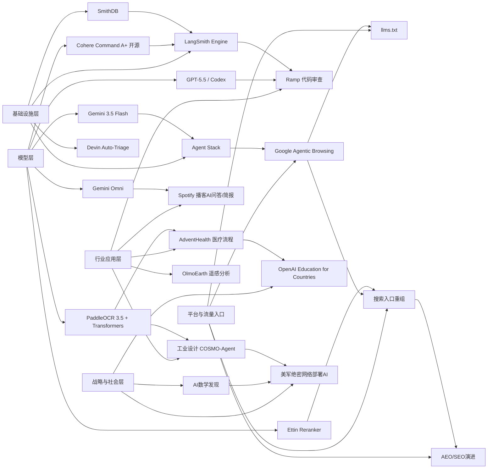

> AI 早报 · 每日早读 · 全网深度聚合

## **今日摘要**

本期重点显示，AI正同时在“模型能力、行业应用、智能体基础设施”三条线上快速推进：Cohere开源最强模型Command A+，医疗机构AdventHealth将ChatGPT用于流程优化，LangSmith、SmithDB和Devin等工具则在加强智能体开发与运维底座。  
前沿方面，Google通过Gemini 3.5 Flash与Omni强化其多模态和智能体平台布局，Ramp用Codex把代码审查提速到分钟级，PaddleOCR 3.5接入Transformers后端也提升了复杂文档处理的可扩展性。  
从行业趋势看，AI不仅在改变企业软件和搜索体验，也开始影响网站建设标准，未来产品设计将越来越需要同时面向人类用户、搜索引擎和AI智能体。

### 🔵 产品与功能更新

1. **Cohere开源最强模型Command A+。**  
Cohere发布了目前最强的语言模型（能理解和生成文字的AI）Command A+，并采用Apache 2.0开源协议开放。对企业和开发者来说，这意味着可以更低门槛地部署、改造和商用。开源也会加速围绕该模型的工具生态和行业应用落地。🚀  
[开源最强模型解读(briefing)](https://the-decoder.com/cohere-open-sources-its-strongest-model-yet/)

2. **AdventHealth将ChatGPT用于医疗流程。**  
AdventHealth正在使用面向医疗场景的ChatGPT，帮助简化工作流程并减少行政负担。对一线医护而言，这类工具的价值不只是“更快写文档”，更是把时间重新还给患者照护。它也说明生成式AI（可自动生成文本内容的AI）正在从通用办公走向垂直行业。🚀  
[医疗场景应用观察(briefing)](https://openai.com/index/adventhealth)

3. **LangSmith Engine与SmithDB推进智能体基础设施。**  
当天的汇总信息显示，智能体（可自主执行多步任务的AI程序）基础设施持续升级，其中LangSmith Engine强调CI/CD循环（持续集成与持续交付），帮助智能体更稳定迭代。SmithDB则主打低延迟查询，用于可观测性（观察系统运行状态）分析。Cognition的Devin Auto-Triage也在推进自动分派和处理缺陷工单，让软件团队把重复性问题交给AI。🚀  
[智能体底座更新汇总(briefing)](https://news.smol.ai/issues/26-05-18-not-much/)

### 🟢 前沿研究

1. **Google I/O发布Gemini 3.5 Flash与Omni。**  
Google在I/O上把Gemini进一步定位为面向消费者与开发者的平台，并推出Gemini 3.5 Flash和Gemini Omni。前者强调更快的智能体与编程任务处理，后者则聚焦多模态（同时处理文字、图片、音频、视频）生成与编辑。配合扩展后的Agent Stack（智能体工具栈），Google正试图把模型能力直接转化为完整应用平台。🚀  
[谷歌模型平台速览(briefing)](https://news.smol.ai/issues/26-05-19-not-much/)

2. **Ramp用Codex把代码审查提速到分钟级。**  
Ramp工程团队分享了如何借助Codex与GPT-5.5进行代码审查，把原本需要数小时的反馈缩短到几分钟。这里的重点不是完全替代人工，而是先由AI给出有实质内容的第一轮建议。对软件团队来说，这种“先加速、再人工把关”的模式，正成为AI编程的主流落地路径。🚀  
[代码审查提效案例(briefing)](https://openai.com/index/ramp)

3. **PaddleOCR 3.5接入Transformers后端。**  
PaddleOCR 3.5开始支持基于Transformers（擅长理解上下文关系的模型架构）后端来运行文字识别和文档解析任务。这样做有助于统一OCR（光学字符识别）与更先进模型的调用方式，也便于开发者在复杂文档场景中扩展能力。对企业文档数字化、表单处理和档案分析等场景都有直接意义。🚀  
[文档识别能力升级(briefing)](https://huggingface.co/blog/PaddlePaddle/paddleocr-transformers)

### 🟡 行业展望与社会影响

1. **Google测试网站的“智能体友好度”。**  
Google正在Lighthouse分析工具中测试“Agentic Browsing”新分类，用来检查网站对AI智能体访问是否友好。它还会关注llms.txt这类声明文件，帮助AI更好理解站点可被读取和使用的方式。这意味着未来网站优化对象不再只是搜索引擎，也包括会“替人操作网页”的AI助手。🚀  
[网站迎接AI助手(briefing)](https://the-decoder.com/google-tests-websites-for-llms-txt-and-agent-compatibility/)

2. **AI正在重塑搜索入口选择。**  
TechCrunch整理了6个值得尝试的搜索引擎，背景是Google搜索结果正因AI概览而发生明显变化。对普通用户而言，这不只是界面变化，而是获取信息方式、信任机制和点击路径的变化。搜索市场可能因此进入新一轮分流与重组。🚀  
[搜索格局变化观察(briefing)](https://techcrunch.com/2026/05/21/six-search-engines-worth-trying-now-that-google-isnt-really-google-anymore/)

3. **OpenAI推进“Education for Countries”计划。**  
OpenAI宣布推进面向各国教育体系的合作计划，重点包括学校AI采用、教师培训和学习工具建设。它传递出的信号是，AI教育不再只围绕单个产品，而是开始进入国家层面的系统性部署。对教育公平、教师角色和课程设计都可能带来长期影响。🚀  
[国家级教育AI计划(briefing)](https://openai.com/index/the-next-phase-of-education-for-countries)

### 🟣 开源TOP项目

1. **OpenAI模型推翻离散几何重要猜想。**  
OpenAI表示，其模型解决了持续约80年的单位距离问题，并推翻了离散几何中的一个重要猜想。对数学界而言，这不仅是单一结果，更象征AI推理（让模型进行多步逻辑思考）的能力跨入更高门槛领域。它也让“AI能否参与原创科学发现”这个问题进入更现实的阶段。🚀  
[几何猜想突破解读(briefing)](https://openai.com/index/model-disproves-discrete-geometry-conjecture)

2. **OlmoEarth v1.1提升地球观测模型效率。**  
AllenAI发布OlmoEarth v1.1，这是一组更高效的地球观测模型。它面向遥感（通过卫星等设备远距离采集地表信息）等任务，强调在性能与资源消耗之间取得更好平衡。对环境监测、农业分析和灾害预警等方向有较高应用价值。🚀  
[地球观测模型更新(briefing)](https://huggingface.co/blog/allenai/olmoearth-v1-1)

3. **COSMO-Agent瞄准工业设计闭环优化。**  
这篇论文提出COSMO-Agent，用工具增强型智能体连接设计、仿真和优化流程，目标是打通CAD与CAE之间的协作断点。简单说，就是让AI根据仿真反馈自动修改设计，再持续迭代。对于工业研发来说，这代表AI正从“给建议”走向“参与完整工程闭环”。🚀  
[工业智能体论文速览(briefing)](https://arxiv.org/abs/2605.20190)

### 🔴 社媒分享

1. **美军网络司令部加速在绝密网络部署AI。**  
美国网络司令部已成立专项力量，计划把OpenAI、Google等公司的模型部署到五角大楼和NSA的高保密网络中。推动这一进程的原因是，先进模型在寻找安全漏洞方面已经表现出接近顶尖人工专家的能力。若相关工具在未来一两年普及，网络攻防的门槛与节奏都可能被改写。🚀  
[绝密网络AI部署(briefing)](https://the-decoder.com/us-cyber-command-races-to-deploy-ai-on-top-secret-networks/)

2. **Spotify为播客加入AI问答与简报功能。**  
Spotify正在为播客增加AI问答和简报生成功能，用户可基于提示词生成日更或周更摘要。对内容平台来说，这是一种把长音频快速转成可消费信息流的方式。它也可能改变播客内容的发现、复习和二次传播习惯。🚀  
[播客AI摘要新功能(briefing)](https://techcrunch.com/2026/05/21/spotify-adds-ai-powered-qa-and-briefing-generation-features-to-podcasts/)

3. **Ettin Reranker发布重排序模型家族。**  
Ettin Reranker Family是一组用于重排序（先粗筛信息，再精排相关性）的模型。它通常用于搜索、问答和检索增强生成（先查资料再回答）的最后一步，帮助系统把更相关的结果放在前面。虽然这类技术不常被普通用户直接感知，但往往决定了AI回答是否“答得准”。🚀  
[重排序模型家族(briefing)](https://huggingface.co/blog/ettin-reranker)

---

📊 行业洞察

1. 事实  
   Cohere开源Command A+，采用Apache 2.0协议；Google I/O发布Gemini 3.5 Flash、Gemini Omni，并扩展Agent Stack（智能体工具栈）；LangSmith Engine、SmithDB、Devin Auto-Triage等智能体基础设施同步升级。  
   【洞察】大模型竞争正在从“单点模型性能”转向“开源模型 + 智能体基础设施 + 应用平台”的体系化竞争。开源降低模型采用门槛，平台化能力决定开发者留存，而CI/CD（持续集成与持续交付）、可观测性、低延迟数据层等基础设施将成为企业级智能体落地的关键护城河。

2. 事实  
   AdventHealth将ChatGPT用于医疗流程，减少行政负担；Ramp用Codex与GPT-5.5将代码审查压缩到分钟级；PaddleOCR 3.5接入Transformers后端，强化复杂文档解析能力。  
   【洞察】生成式AI正在进入“深流程改造”阶段，不再只是聊天助手，而是嵌入医疗、研发、文档处理等高频业务链路。当前最成功的落地模式并非完全替代人工，而是“AI完成第一轮处理 + 人类复核”，这类人机协同（Human-in-the-loop）路径更容易形成可衡量ROI（投资回报率）。

3. 事实  
   Google测试网站“Agentic Browsing”与llms.txt兼容性；TechCrunch指出AI概览正在改变搜索入口与用户选择；Spotify为播客加入AI问答与简报功能；Ettin发布重排序模型家族。  
   【洞察】信息分发体系正从“搜索引擎优化”演进到“面向AI代理与摘要引擎优化”。未来内容平台、网站和知识库不仅要争夺用户点击，还要争夺被AI抓取、理解、重排序和引用的优先级，AEO（Agent Engine Optimization，智能体引擎优化）可能成为继SEO（搜索引擎优化）后的新运营范式。

4. 事实  
   OpenAI推进“Education for Countries”计划，进入国家级教育体系合作；OpenAI模型推翻离散几何重要猜想；美军网络司令部加速在绝密网络部署AI；COSMO-Agent推进工业设计闭环优化。  
   【洞察】AI正从“效率工具”升级为国家级基础能力，开始同时渗透教育、科研、国防和工业研发等战略领域。这意味着产业竞争的焦点将从应用创新进一步上移到“谁能把模型能力制度化、基础设施化、行业标准化”，AI治理、主权部署和专用场景适配将变得与模型性能同样重要。

🗺️ 今日关系图

