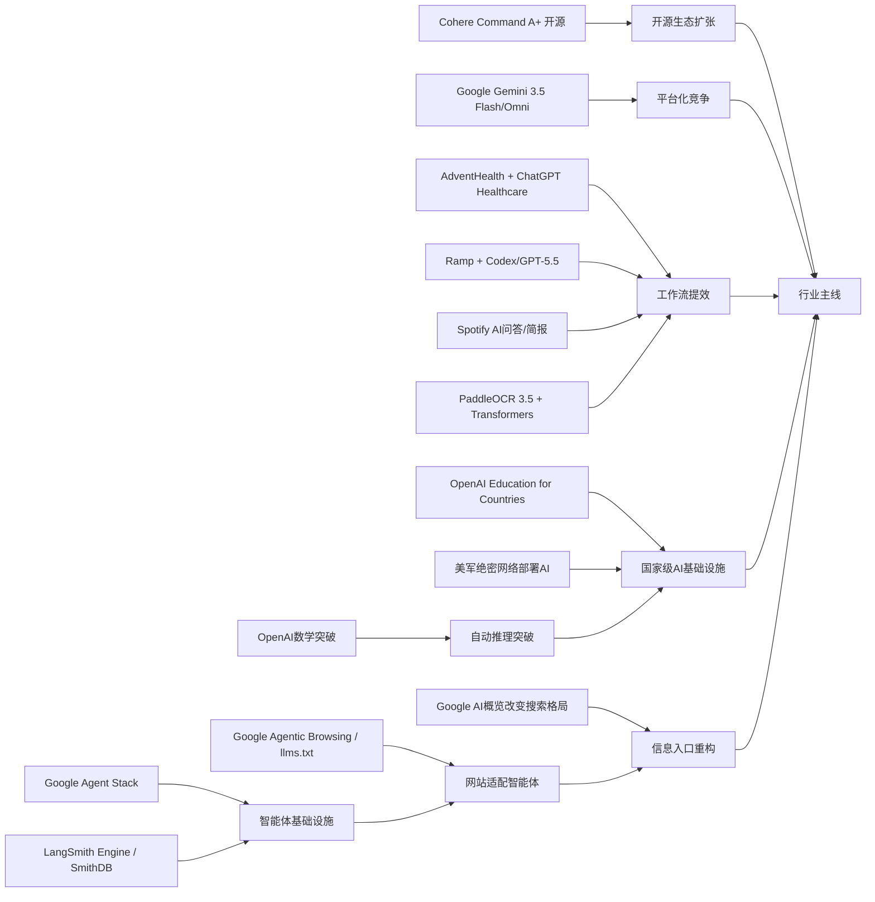

> AI 早报 · 每日早读 · 全网深度聚合

## **今日摘要**

本期动态显示，AI正同时在三条线上加速：一是产品层面，Cohere开源最强模型Command A+、医疗机构用ChatGPT减轻行政负担、智能体基础设施持续完善，说明AI正更开放也更深入真实业务。  
二是研究与工程层面，Google发布Gemini 3.5 Flash、Omni和Agent栈，Ramp用Codex把代码审查压缩到分钟级，PaddleOCR 3.5接入Transformers后端，反映出多模态、智能体和开发效率工具正在快速成熟。  
三是行业与社会层面，Google开始测试网站对AI智能体的适配能力，OpenAI推进面向国家的教育AI计划，说明未来互联网和公共服务都会越来越围绕AI使用方式来重构。

### 🔵 产品与功能更新

1. **Cohere开源最强模型Command A+。**  
Cohere发布了目前最强的语言模型（可生成和理解文本的AI模型）Command A+，并采用Apache 2.0开源许可。对企业和开发者来说，这意味着可以更灵活地部署、改造和商用。开源也会加速生态扩张，让更多团队在同一底座上开发应用。🚀  
[查看开源模型详情](https://the-decoder.com/cohere-open-sources-its-strongest-model-yet/)

2. **AdventHealth用ChatGPT减轻医疗行政负担。**  
AdventHealth正在把ChatGPT for Healthcare用于医疗工作流（医院内部处理流程），目标是减少文书和重复性行政事务。这样一来，医护人员可以把更多时间还给病人护理，而不是花在系统操作上。对普通用户来说，这类落地说明生成式AI正从“聊天工具”走向真实医疗辅助。🚀  
[了解医疗场景应用](https://openai.com/index/adventhealth)

3. **LangSmith Engine与SmithDB推动智能体基础设施升级。**  
一则行业汇总显示，面向智能体（能自动执行任务的AI系统）的基础设施正在快速成熟。LangSmith Engine主打CI/CD（持续集成与持续交付，帮助自动测试和上线）闭环，SmithDB则强化可观测性（监控系统运行状态）的低延迟查询能力。与此同时，Devin Auto-Triage、Claude Code等产品也在提升代码修复、调试和大项目协作效率。🚀  
[查看产品动态汇总](https://news.smol.ai/issues/26-05-18-not-much/)

### 🟢 前沿研究

1. **Google发布Gemini 3.5 Flash与Omni及Agent栈。**  
Google在I/O 2026上把Gemini重新定位为面向消费者和开发者的平台，并推出了Gemini 3.5 Flash、Gemini Omni以及升级后的Agent Stack（智能体开发工具栈）。其中Flash强调快速任务执行，Omni强调多模态（同时处理文本、图片、视频等）生成与编辑。Google还披露其月处理量已达3.2千万亿token（模型处理的文本单位），显示大模型应用规模正在急速扩大。🚀  
[查看谷歌发布汇总](https://news.smol.ai/issues/26-05-19-not-much/)

2. **Ramp工程团队用Codex把代码审查缩短到分钟级。**  
OpenAI案例显示，Ramp工程师正借助Codex和GPT-5.5进行代码审查（检查程序修改是否合理）。过去可能需要数小时的人力反馈，现在能在几分钟内得到较有价值的建议。对企业研发团队而言，这意味着AI正越来越像“随叫随到的技术搭档”。🚀  
[了解代码审查实践](https://openai.com/index/ramp)

3. **PaddleOCR 3.5接入Transformers后端。**  
PaddleOCR 3.5开始支持Transformers后端（基于主流深度学习架构的运行方式），可处理OCR（文字识别）和文档解析任务。这有助于统一文档AI的开发体验，让文字抽取、结构识别和后续问答衔接得更顺畅。对于企业文档数字化、票据处理和知识归档场景尤其有价值。🚀  
[查看文档解析更新](https://huggingface.co/blog/PaddlePaddle/paddleocr-transformers)

### 🟡 行业展望与社会影响

1. **Google测试网站是否适配AI智能体浏览。**  
Google正在Lighthouse分析工具中测试“Agentic Browsing”新类别，用来评估网站对AI智能体访问的友好程度。它还会检查网站是否提供llms.txt（一种帮助大模型理解站点规则的文本文件）。这说明未来网站优化不再只面向搜索引擎，也要开始面向AI助手和自动化代理。🚀  
[查看网站适配测试](https://the-decoder.com/google-tests-websites-for-llms-txt-and-agent-compatibility/)

2. **OpenAI推进面向国家的教育AI计划。**  
OpenAI宣布扩展“Education for Countries”项目，通过新合作、教师培训和工具部署推动学校采用AI。其核心目标是改善教学效率、扩大教育资源可及性，并提升整体学习成果。对社会层面而言，AI教育基础设施正逐渐成为各国数字化竞争的一部分。🚀  
[了解教育项目进展](https://openai.com/index/the-next-phase-of-education-for-countries)

3. **搜索引擎格局因AI概览而加速变化。**  
TechCrunch指出，随着Google搜索越来越多引入AI概览，用户体验和信息分发方式都在变化，部分用户也开始重新考虑替代搜索引擎。这反映出AI不仅在改造搜索界面，更在影响流量入口与内容生态。未来“去哪里找信息”可能不再像过去那样由单一巨头主导。🚀  
[查看搜索趋势观察](https://techcrunch.com/2026/05/21/six-search-engines-worth-trying-now-that-google-isnt-really-google-anymore/)

### 🟣 开源TOP项目

1. **OpenAI模型推翻离散几何重要猜想。**  
OpenAI宣布，其模型解决了一个持续80年的单位距离问题，并推翻了离散几何中的一个重要猜想。这个成果被视为AI数学推理的重要里程碑，说明模型不仅会“算题”，还可能参与真正的前沿研究。对科研圈来说，这类突破可能改变未来发现新定理的方式。🚀  
[查看数学突破说明](https://openai.com/index/model-disproves-discrete-geometry-conjecture)

2. **AI数学证明首次达到顶级期刊水准。**  
The Decoder进一步报道指出，这次成果可能是首个足以进入数学顶级期刊的AI证明。数学家既感到兴奋，也意识到AI正在进入过去高度依赖人类直觉的领域。它释放出的信号是：自动推理（让AI自己完成严密推导）正在跨过关键门槛。🚀  
[阅读专家解读报道](https://the-decoder.com/openai-shifts-the-boundary-of-automated-reasoning-with-a-milestone-in-ai-mathematics-that-experts-are-now-unpacking/)

3. **OlmoEarth v1.1提升地球观测模型效率。**  
AllenAI发布OlmoEarth v1.1，这是一组更高效的地球观测模型，面向遥感影像（由卫星等设备采集的地表图像）理解任务。效率提升意味着在环境监测、农业分析和灾害响应等场景中，模型更容易落地。开源路线也有助于研究者和机构共享能力。🚀  
[查看遥感模型更新](https://huggingface.co/blog/allenai/olmoearth-v1-1)

### 🔴 社媒分享

1. **美军网络司令部加速在绝密网络部署AI。**  
报道显示，美国网络司令部已启动专项团队，准备在五角大楼和国家安全局的绝密网络中运行OpenAI、Google等公司的模型。推动这一进程的关键原因是，先进AI已展现出比顶尖人类黑客更快发现漏洞的能力。军事与安全系统对AI的争夺，正在成为新一轮技术竞赛焦点。🚀  
[查看绝密网络动向](https://the-decoder.com/us-cyber-command-races-to-deploy-ai-on-top-secret-networks/)

2. **Spotify为播客加入AI问答和简报生成。**  
Spotify正在给播客加入AI问答和简报生成功能，用户可根据自己的提示词生成每日或每周内容摘要。对听众来说，这能降低信息筛选成本；对平台来说，则进一步强化了“个性化陪伴式消费”。音频平台与生成式AI的结合正越来越深。🚀  
[了解播客新功能](https://techcrunch.com/2026/05/21/spotify-adds-ai-powered-qa-and-briefing-generation-features-to-podcasts/)

3. **个人健康记录有望提升个性化健康AI。**  
一篇新论文评估了个人健康记录（由患者自行管理的健康资料）在个性化健康AI中的实际价值。研究关注大模型在获得临床数据后，能否更好回答用户健康问题。若这一路径成熟，未来医疗AI可能更懂“你的具体情况”，而不只是给出泛化建议。🚀  
[查看健康AI研究](https://arxiv.org/abs/2605.18937)

---

📊 行业洞察

1. 事实  
  Cohere开源Command A+并采用Apache 2.0许可；Google在I/O 2026发布Gemini 3.5 Flash、Gemini Omni和Agent Stack（智能体开发工具栈），并披露月处理量达到3.2千万亿token。  
  【洞察】大模型竞争正从“单点模型能力”转向“开源底座 + 平台生态 + 规模运营”三线并进。Cohere用开源许可抢企业开发者心智，Google则用多模态（同时处理文本、图片、视频等）平台和超大调用规模强化生态锁定，说明行业护城河正在从参数与榜单，迁移到分发、工具链和开发者网络效应。

2. 事实  
  LangSmith Engine与SmithDB强化智能体的CI/CD（持续集成与持续交付）和可观测性（监控系统运行状态）；Google测试网站的Agentic Browsing与llms.txt适配；同时Google升级Agent Stack。  
  【洞察】智能体正在从“能演示”走向“能生产”。一端是开发侧基础设施补齐测试、上线、观测闭环，另一端是互联网入口开始为AI代理改造交互规范，意味着智能体商业化的瓶颈正从模型本身，转向工程可靠性与外部环境适配。未来“Agent-ready（适配智能体）”会像今天的“Mobile-ready（适配移动端）”一样成为新标准。

3. 事实  
  AdventHealth将ChatGPT for Healthcare用于医疗工作流；Ramp借助Codex和GPT-5.5把代码审查缩短到分钟级；Spotify为播客加入AI问答与简报生成；PaddleOCR 3.5支持Transformers后端以衔接文档解析与问答。  
  【洞察】生成式AI的价值实现路径已从通用助手转为“嵌入式工作流提效”。无论是医疗行政、软件研发、内容消费还是文档处理，AI都不再以独立入口取胜，而是作为现有系统中的增强层（augmentation layer）直接压缩时间成本、降低操作摩擦。这意味着下一阶段最具商业价值的不是最会聊天的模型，而是最能嵌入垂直流程的产品。

4. 事实  
  OpenAI模型推翻离散几何重要猜想，并被认为可能达到顶级期刊水准；美国网络司令部加速在绝密网络部署AI；OpenAI推进“Education for Countries”项目。  
  【洞察】AI正同时进入“高认知门槛领域”和“高主权敏感领域”。前者体现为自动推理（让AI完成严密推导）开始逼近科研前沿，后者体现为教育、国防等国家级基础设施加速采纳。行业由此进入“能力突破 + 制度重构”并行阶段：谁不仅拥有模型，还能掌握可信部署、人才培训与主权级场景落地，谁就更可能在下一轮竞争中占据优势。

🗺️ 今日关系图

