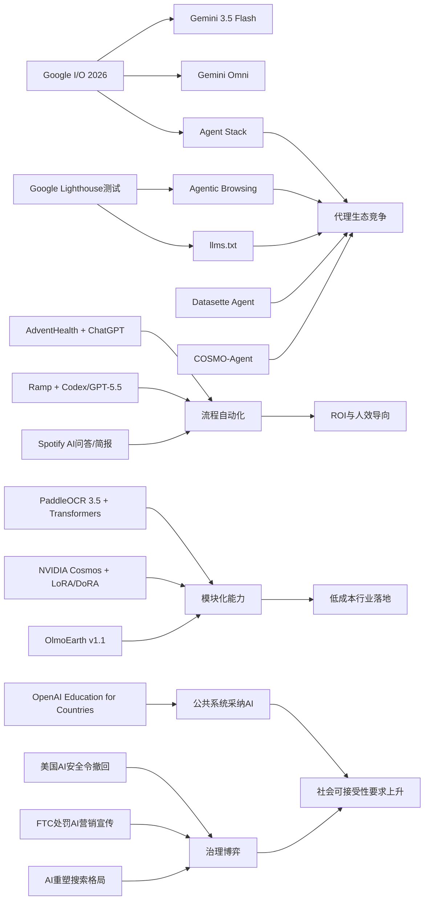

> AI 早报 · 每日早读 · 全网深度聚合

## **今日摘要**

本周动态显示，生成式 AI 正从“实验性工具”快速走向实际应用：例如 AdventHealth 用 ChatGPT 优化医疗流程、Datasette Agent 让用户用对话方式操作数据、NVIDIA 通过低成本微调推进机器人视频生成。  
同时，前沿技术生态也在加速升级，Google 在 I/O 2026 集中更新 Gemini 与 Agent 体系，PaddleOCR 3.5 强化文档理解能力，Ramp 则展示了 AI 在代码评审和团队协作中的直接效率价值。  
在行业层面，AI 的发展已不仅是技术竞赛，也深度牵动监管、教育和社会治理等议题，说明未来竞争将同时发生在产品落地、平台生态与政策博弈三个层面。

## 🔵 产品与功能更新

1. **AdventHealth用ChatGPT优化医疗流程。**  
AdventHealth 正在把 ChatGPT for Healthcare 用于医疗场景，重点是减少行政事务、简化工作流，并把更多时间还给医护人员和患者。对非技术读者来说，这类工具更像“智能助手”，主要帮忙整理信息、加快文书处理，而不是替代医生判断。医疗机构率先落地，也说明生成式AI正从实验走向日常运营。🚀  
[医疗AI落地案例(briefing)](https://openai.com/index/adventhealth)

2. **Datasette Agent发布，面向数据交互。**  
Datasette Agent 是一个围绕 Datasette 的智能代理项目，重点在于让用户以更自然的方式与数据进行交互。Datasette 本身是一个轻量级数据发布与查询工具，这意味着新产品方向正在朝“用对话方式使用数据库”推进。虽然原文摘要很短，但可看出这类工具正在把数据分析门槛继续拉低。🚀  
[数据代理工具更新(briefing)](https://simonwillison.net/2026/May/21/datasette-agent/#atom-everything)

3. **NVIDIA发布机器人视频生成微调方案。**  
NVIDIA 介绍了如何用 Cosmos Predict 2.5 配合 LoRA/DoRA（低成本微调方法）来做机器人视频生成。简单说，就是在不重新训练整个大模型的前提下，让模型更快适应机器人相关任务。对于机器人研发者，这意味着训练成本和试错门槛都有机会下降。🚀  
[机器人视频生成方案(briefing)](https://huggingface.co/blog/nvidia/cosmos-fine-tuning-for-robot-video-generation)

## 🟢 前沿研究

1. **Google在I/O 2026集中更新Gemini与Agent生态。**  
Google 在 I/O 2026 上发布了 Gemini 3.5 Flash、Gemini Omni，以及升级后的 Agent Stack（智能代理技术栈）。Gemini 3.5 Flash 主打更快的智能代理与编程任务，Omni 则面向多模态（文字、图片、视频等多种输入输出）生成与编辑。Google 还披露其每月处理超 3.2 千万亿 token（模型处理的文本单位），显示其平台化布局正在加速。🚀  
[谷歌Gemini新布局(briefing)](https://news.smol.ai/issues/26-05-19-not-much/)

2. **PaddleOCR 3.5接入Transformers后端。**  
PaddleOCR 3.5 宣布可在 Transformers（主流模型框架）后端上运行文字识别与文档解析任务。对普通用户而言，这意味着票据、合同、表格等文档信息提取有望更高效，也更容易融入现有AI工作流。文档AI正在从单点识别，走向更完整的“读懂文档”。🚀  
[文档识别能力升级(briefing)](https://huggingface.co/blog/PaddlePaddle/paddleocr-transformers)

3. **Ramp工程团队用Codex加速代码评审。**  
Ramp 分享了工程团队如何借助 Codex 与 GPT-5.5 进行代码评审，把原本数小时的反馈缩短到几分钟。代码评审可以理解为程序员互相检查代码质量与风险的过程，而AI正在承担第一轮“快速审阅者”的角色。这类实践说明，AI编程工具的价值已不止于写代码，更在于提升团队协作效率。🚀  
[AI代码评审实践(briefing)](https://openai.com/index/ramp)

## 🟡 行业展望与社会影响

1. **美国AI安全行政令临门撤回。**  
报道称，特朗普在最后时刻撤回了一项AI安全行政令，此前马斯克、扎克伯格和David Sacks曾与其沟通。该行政令原本计划建立前沿模型的自愿审查机制，并要求在发布前留出90天窗口。事件反映出，AI监管正在成为科技公司、政府与公众之间高度敏感的博弈议题。🚀  
[美国AI监管博弈(briefing)](https://the-decoder.com/trump-pulls-ai-safety-order-after-last-minute-calls-from-musk-zuckerberg-and-sacks/)

2. **OpenAI推进“Education for Countries”新阶段。**  
OpenAI 宣布继续推进面向各国教育体系的 AI 项目，核心包括学校合作、教师培训和教育工具部署。对社会层面而言，这意味着AI正更系统地进入公共教育，而不只是零散的课堂尝试。未来焦点将不仅是“能不能用”，还包括“如何公平、安全、有效地用”。🚀  
[全球教育AI计划(briefing)](https://openai.com/index/the-next-phase-of-education-for-countries)

3. **搜索引擎格局因AI重塑引发讨论。**  
TechCrunch 盘点了六个值得尝试的搜索引擎，背景是 Google 搜索结果正越来越多地加入 AI Overview（AI总结结果）。这反映出用户正在重新思考“搜索”到底应是链接导航，还是由AI直接给答案。随着AI介入信息分发，搜索体验、流量分配与信息可信度都会受到影响。🚀  
[AI时代搜索变局(briefing)](https://techcrunch.com/2026/05/21/six-search-engines-worth-trying-now-that-google-isnt-really-google-anymore/)

## 🟣 开源TOP项目

1. **OlmoEarth v1.1提升地球观测模型效率。**  
OlmoEarth v1.1 是 AllenAI 推出的新一代地球观测模型系列，重点在于提升效率。地球观测模型通常用于分析卫星影像、环境变化和地理信息，这类开源项目能帮助研究机构和企业更低成本地处理遥感数据。对开源社区而言，效率提升往往意味着更广的落地空间。🚀  
[地球观测模型升级(briefing)](https://huggingface.co/blog/allenai/olmoearth-v1-1)

2. **Google测试网站对AI代理的兼容性。**  
Google 正在 Lighthouse 中测试 “Agentic Browsing”（智能代理浏览）审计能力，并检查网站是否支持 llms.txt。llms.txt 可以理解为面向AI系统的站点说明文件，类似告诉模型“哪些内容可读、怎么读”。这说明开源与开放网络生态，正在为“AI代理访问网页”建立新的兼容标准。🚀  
[AI代理网页标准(briefing)](https://the-decoder.com/google-tests-websites-for-llms-txt-and-agent-compatibility/)

3. **COSMO-Agent瞄准工业设计闭环优化。**  
COSMO-Agent 是一项结合工具调用与强化学习（通过反馈不断试错优化）的智能代理研究，用于工业设计、仿真与建模协同。它试图解决设计软件与仿真软件之间的“语义鸿沟”，让系统能根据仿真结果自动调整设计。虽然仍属研究阶段，但很贴近真实工业流程。🚀  
[工业智能代理研究(briefing)](https://arxiv.org/abs/2605.20190)

## 🔴 社媒分享

1. **OpenAI数学突破在社媒持续发酵。**  
OpenAI 模型推翻一个存在80年的离散几何猜想，这一成果正引发学界与社交媒体密集讨论。报道提到，专家认为这可能是 AI 数学推理的重要里程碑，也意味着未来人类可能更难独自完整验证某些复杂证明。对大众来说，这类事件让“AI会不会推动基础科学突破”变得更具体了。🚀  
[AI数学里程碑热议(briefing)](https://the-decoder.com/openai-shifts-the-boundary-of-automated-reasoning-with-a-milestone-in-ai-mathematics-that-experts-are-now-unpacking/)

2. **Spotify为播客加入AI问答与简报功能。**  
Spotify 正在为播客加入 AI 驱动的问答与简报生成功能，用户可基于提示词生成每日或每周摘要。对普通听众而言，这能降低长内容消费门槛，也让播客从“听完整期”变成“先看重点再决定是否听”。AI正在把音频平台变成更主动的信息整理平台。🚀  
[播客AI摘要功能(briefing)](https://techcrunch.com/2026/05/21/spotify-adds-ai-powered-qa-and-briefing-generation-features-to-podcasts/)

3. **FTC处罚“主动监听”AI营销宣传。**  
美国联邦贸易委员会（FTC）要求 Cox Media Group 等三家公司支付近100万美元，以和解其在“主动监听”AI营销服务上的误导性宣传。所谓“主动监听”，通常让人联想到设备持续偷听用户，但监管机构认为相关说法具有欺骗性。此事提醒市场，AI营销叙事若过度夸张，可能直接触发监管风险。🚀  
[AI营销监管案例(briefing)](https://simonwillison.net/2026/May/22/ftc-active-listening/#atom-everything)

---

📊 行业洞察

1. 事实  
   AdventHealth将 ChatGPT for Healthcare 用于减少行政事务、简化医疗工作流；Ramp 工程团队用 Codex 与 GPT-5.5 将代码评审从数小时压缩到几分钟；Spotify 为播客加入 AI 问答与简报功能。  
   【洞察】生成式AI正从“内容生成工具”升级为“流程压缩引擎”，价值重心转向具体业务环节的时延削减与人效提升。医疗、研发、内容平台三类场景共同表明，企业采购AI的核心依据，正在从模型参数与演示能力，转为工作流嵌入深度、可衡量ROI（投资回报率）和组织协同效率。

2. 事实  
   Google 在 I/O 2026 发布 Gemini 3.5 Flash、Gemini Omni 与 Agent Stack（智能代理技术栈）；Google 还在 Lighthouse 测试 Agentic Browsing（智能代理浏览）审计能力并检查 llms.txt；Datasette Agent 推进“用对话方式使用数据库”；COSMO-Agent 尝试打通工业设计与仿真闭环。  
   【洞察】AI行业正在从“单模型竞争”转入“代理生态竞争”。竞争焦点不再只是模型本身，而是模型+工具调用（tool use）+网页兼容标准+企业数据接口的系统能力。谁能率先建立代理可执行的基础设施层，谁就更可能占据下一阶段入口，而不仅仅是提供一个聊天界面。

3. 事实  
   PaddleOCR 3.5 接入 Transformers（主流模型框架）后端以强化文档解析；NVIDIA 用 Cosmos Predict 2.5 配合 LoRA/DoRA（低成本微调方法）降低机器人视频生成适配成本；OlmoEarth v1.1 提升地球观测模型效率。  
   【洞察】AI基础能力正在走向“模块化+低成本适配”，行业落地门槛持续下降。无论是文档AI、机器人训练还是遥感场景，主流趋势都是通过统一框架、参数高效微调（PEFT，参数高效微调）和效率优化，把过去高成本、强定制的能力变成可复用组件。这将利好垂直行业ISV（独立软件供应商）和集成商，但也会压缩仅靠“模型封装”获得溢价的厂商空间。

4. 事实  
   美国一项AI安全行政令在最后时刻被撤回；OpenAI 推进 “Education for Countries” 面向各国教育体系部署AI；FTC 对“主动监听”AI营销宣传开出罚单；搜索引擎因 AI Overview（AI总结结果）重塑信息分发而引发讨论。  
   【洞察】AI治理进入“高渗透、强分化”阶段：一方面，教育等公共系统正在加速采纳AI；另一方面，监管对安全审查、营销表述、信息分发影响的介入也更直接。这意味着企业未来不能只做技术合规，还要建立“社会可接受性”能力，包括透明披露、风险沟通、默认安全策略与公众信任管理。

🗺️ 今日关系图

