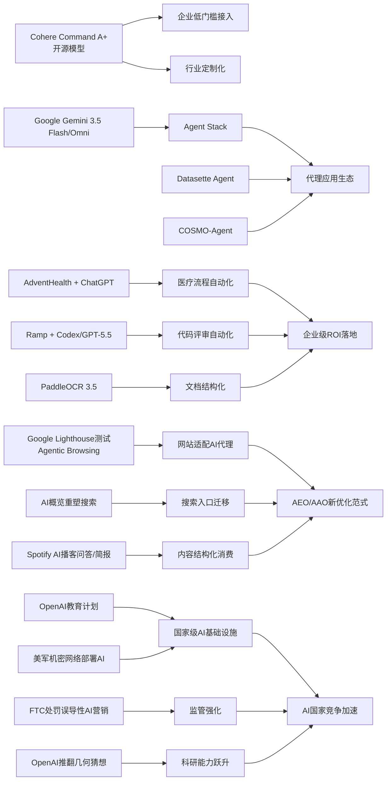

> AI 早报 · 每日早读 · 全网深度聚合

## **今日摘要**

近期AI领域一方面在产品落地上加速推进，比如Cohere开源高性能模型Command A+、AdventHealth用ChatGPT优化医疗流程、Datasette Agent探索更自然的数据问答交互。  
另一方面，前沿研究和企业实践也在升级，Google发布更强的Gemini 3.5 Flash与Omni、Ramp用Codex显著提速代码评审、PaddleOCR 3.5提升了文档识别与结构化处理能力。  
同时，AI正在重塑行业基础设施与用户习惯，例如网站开始为AI代理适配，搜索引擎格局也因Google的AI概览功能而出现新的变化。

### 🔵 产品与功能更新

1. **Cohere开源最强模型Command A+。**  
Cohere发布了目前最强的语言模型（擅长理解和生成文字的AI）Command A+，并采用Apache 2.0开源许可，意味着企业和开发者可以更自由地使用与修改。对非技术团队来说，这降低了接入高性能大模型的门槛，也有助于控制成本。开源策略还可能推动更多行业定制版本出现，扩大实际落地范围🚀  
[开源模型发布解读(briefing)](https://the-decoder.com/cohere-open-sources-its-strongest-model-yet/)

2. **AdventHealth将ChatGPT用于医疗流程。**  
AdventHealth正在使用面向医疗场景的ChatGPT，来简化工作流程并减少行政负担。核心价值不在“替代医生”，而在于把更多时间还给患者护理，例如减少文书处理和重复性操作。对医疗机构而言，这类应用更像“效率助手”，有望改善医护体验与服务响应速度🚀  
[医疗应用案例速览(briefing)](https://openai.com/index/adventhealth)

3. **Datasette Agent探索数据问答代理。**  
Datasette Agent是一项围绕数据查询与交互的代理（可自动执行任务的AI程序）尝试，目标是让用户更自然地和数据打交道。虽然原文信息较简略，但它延续了“让AI直接连接数据工具”的趋势。对普通用户来说，这意味着未来查询数据库、生成结果或整理信息时，可能不再依赖复杂命令🚀  
[数据代理项目一览(briefing)](https://simonwillison.net/2026/May/21/datasette-agent/#atom-everything)

### 🟢 前沿研究

1. **Google发布Gemini 3.5 Flash与Omni。**  
Google在I/O 2026上继续强化Gemini平台定位，同时面向消费者与开发者推进产品布局。其中Gemini 3.5 Flash主打更快的代理式任务与编程任务，Gemini Omni则强调多模态（可同时处理文字、图片、视频等）生成与编辑能力。Google还扩展了Agent Stack（代理技术栈），显示其正在把AI从单一聊天工具推向更完整的应用平台🚀  
[谷歌新模型速读(briefing)](https://news.smol.ai/issues/26-05-19-not-much/)

2. **Ramp工程团队用Codex加速代码评审。**  
Ramp工程师正在使用Codex配合GPT-5.5进行代码评审，把原本需要数小时的反馈压缩到几分钟。这里的代码评审，指的是在软件上线前检查代码质量、错误风险和改进空间。对企业而言，这说明AI开始从“写代码”进一步延伸到“审代码”，提升开发速度与质量控制能力🚀  
[代码评审实践案例(briefing)](https://openai.com/index/ramp)

3. **PaddleOCR 3.5接入Transformers后端。**  
PaddleOCR 3.5支持通过Transformers（当前主流的神经网络架构）完成文字识别与文档解析任务。简单说，就是让扫描件、票据、表格和复杂文档更容易被AI读懂和结构化整理。对办公、金融、政务等场景来说，这类升级通常会直接带来更省人工的文档处理流程🚀  
[文档识别能力升级(briefing)](https://huggingface.co/blog/PaddlePaddle/paddleocr-transformers)

### 🟡 行业展望与社会影响

1. **Google测试网站的AI代理兼容性。**  
Google正在其Lighthouse分析工具中测试“Agentic Browsing（代理式浏览）”新类别，用来检查网站是否适合AI代理访问和操作。它还会关注llms.txt这类面向大模型的说明文件，帮助AI更准确理解网站内容与规则。这意味着未来网站优化对象不再只有“人”和“搜索引擎”，还要开始面向“AI代理”设计🚀  
[网站适配AI新趋势(briefing)](https://the-decoder.com/google-tests-websites-for-llms-txt-and-agent-compatibility/)

2. **搜索引擎格局因AI概览功能生变。**  
随着Google搜索界面被AI概览深度改造，越来越多用户开始重新考虑搜索工具选择。TechCrunch盘点了六个值得尝试的搜索引擎，反映出用户对传统搜索体验变化的真实反应。对普通网民来说，AI正在改变“找信息”的入口，也可能重塑流量分配与内容发现方式🚀  
[搜索替代方案盘点(briefing)](https://techcrunch.com/2026/05/21/six-search-engines-worth-trying-now-that-google-isnt-really-google-anymore/)

3. **OpenAI推进面向国家的教育计划。**  
OpenAI正在扩展“Education for Countries”计划，通过新合作、教师培训和工具部署推动学校采用AI。重点并不只是提供软件，而是帮助教育系统建立使用方法和实践能力。对社会层面而言，这显示AI竞争正从企业应用走向国家教育基础设施建设🚀  
[全球教育合作进展(briefing)](https://openai.com/index/the-next-phase-of-education-for-countries)

### 🟣 开源TOP项目

1. **OpenAI模型推翻80年几何猜想。**  
OpenAI公布，其模型解决了离散几何中的“单位距离问题”，并推翻了一项存在约80年的重要猜想。离散几何可以理解为研究点、线、距离等组合关系的数学分支，这次成果被视为AI数学推理的重要里程碑。对外界来说，这说明AI不再只是辅助计算，也开始在高难度理论研究中提出原创性突破🚀  
[数学突破官方说明(briefing)](https://openai.com/index/model-disproves-discrete-geometry-conjecture)

2. **OlmoEarth v1.1发布更高效地球观测模型。**  
AllenAI发布OlmoEarth v1.1，这是一组面向地球观测任务的模型，强调更高效率。地球观测模型通常用于分析卫星图像，服务气候、农业、灾害监测等领域。更高效意味着更低计算成本，也更有利于实际部署到研究机构与行业场景中🚀  
[地球观测模型更新(briefing)](https://huggingface.co/blog/allenai/olmoearth-v1-1)

3. **COSMO-Agent瞄准工业闭环优化。**  
论文提出COSMO-Agent，用AI代理连接建模、仿真与优化流程，服务工业设计中的闭环迭代。所谓闭环优化，就是根据模拟结果不断修改设计方案，直到达到更优表现。若这类方法成熟，未来复杂工程设计可能更依赖AI在多工具之间自动协调🚀  
[工业代理研究速览(briefing)](https://arxiv.org/abs/2605.20190)

### 🔴 社媒分享

1. **美军网络司令部加速在机密网络部署AI。**  
美国网络司令部已成立专项小组，推动OpenAI、Google等公司的模型进入最高机密网络环境。背景是新一代AI系统在发现安全漏洞方面速度极快，甚至接近顶尖人类黑客水平。这表明AI能力正快速进入国家安全核心领域，也会进一步放大技术竞争与治理压力🚀  
[机密网络部署动态(briefing)](https://the-decoder.com/us-cyber-command-races-to-deploy-ai-on-top-secret-networks/)

2. **Spotify为播客加入AI问答与简报功能。**  
Spotify正在为播客增加AI驱动的问答与简报生成功能，用户可按自己的提示生成每日或每周内容摘要。对听众来说，这能降低内容筛选成本，让长播客更容易被快速消费。对平台而言，则是在把音频内容进一步结构化，提升推荐和互动效率🚀  
[播客AI功能更新(briefing)](https://techcrunch.com/2026/05/21/spotify-adds-ai-powered-qa-and-briefing-generation-features-to-podcasts/)

3. **FTC处罚“主动监听”AI营销误导宣传。**  
美国联邦贸易委员会（FTC）要求Cox Media Group等三家公司支付近100万美元，以和解其在“主动监听”AI营销服务上的误导性宣传争议。所谓“主动监听”，容易让消费者误以为设备会持续窃听隐私信息，因此监管部门对此格外敏感。这一事件提醒市场：AI营销叙事如果夸大或模糊边界，可能迅速面临合规风险🚀  
[监管处罚事件速看(briefing)](https://simonwillison.net/2026/May/22/ftc-active-listening/#atom-everything)

---

📊 行业洞察

1. 事实  
  Cohere开源最强模型Command A+，采用Apache 2.0许可；Google同步发布Gemini 3.5 Flash、Gemini Omni并扩展Agent Stack（代理技术栈）；Datasette Agent与COSMO-Agent分别探索数据问答、工业闭环优化中的代理化执行。  
  【洞察】大模型竞争正从“单点模型性能”转向“模型开放度 + 代理工作流 + 工具链整合”的平台战。开源许可降低企业二次开发门槛，Google则用平台化技术栈强化生态控制，说明未来护城河不只是谁的模型更强，而是谁更快形成“模型—工具—代理—场景”的完整闭环。

2. 事实  
  AdventHealth将ChatGPT用于医疗流程减负；Ramp用Codex与GPT-5.5将代码评审从数小时压缩到几分钟；PaddleOCR 3.5接入Transformers后端，强化文档识别与结构化能力。  
  【洞察】企业级AI落地已明显进入“流程改造期”，重点从通用聊天助手转向可量化ROI（投资回报率）的任务环节，如文书、审查、解析、录入。医疗、软件工程、文档处理三类案例共同表明，最先持续释放价值的不是“替代专家决策”，而是嵌入高频流程的“副驾驶型自动化”。

3. 事实  
  Google在Lighthouse中测试Agentic Browsing（代理式浏览）兼容性，并关注llms.txt；与此同时，Google搜索被AI概览重塑后，用户开始尝试替代搜索引擎；Spotify也在把播客转为可问答、可生成简报的结构化内容。  
  【洞察】互联网入口正在从“搜索框 + 网页列表”迁移到“代理访问 + 答案直达 + 内容结构化”。这意味着网站、媒体与平台未来优化对象将从SEO（搜索引擎优化）进一步扩展到AEO（答案引擎优化）和AAO（代理可访问优化），流量分发规则可能被重新定义。

4. 事实  
  OpenAI推进面向国家的教育计划；美军网络司令部推动OpenAI、Google模型进入最高机密网络；FTC处罚“主动监听”AI营销误导宣传；OpenAI模型还在离散几何中推翻80年猜想。  
  【洞察】AI正在同时成为国家能力基础设施、科研生产力工具与监管高敏感对象。教育和国防说明AI已上升到国家级竞争层面，而FTC案例表明市场扩张不能脱离合规边界；再叠加数学突破，行业已进入“能力跃升快于治理成熟”的阶段，未来政策、信任与算力将共同决定竞争格局。

🗺️ 今日关系图

