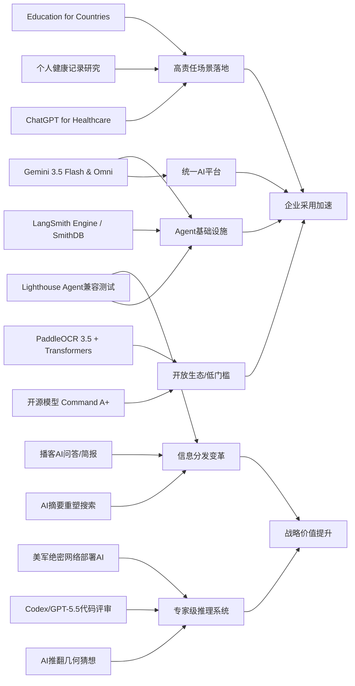

> AI 早报 · 每日早读 · 全网深度聚合

## **今日摘要**

Cohere开源了高性能模型Command A+，Google也在推进Gemini 3.5 Flash与Omni，说明AI模型正朝着更强能力、更开放生态和多模态平台化方向快速发展。  
与此同时，AdventHealth、Ramp等案例表明，生成式AI已经从“演示工具”走向医疗、代码评审、文档处理等真实业务流程，重点在于提升效率、减轻重复劳动。  
更长期来看，围绕Agent的基础设施、网站对AI代理的适配，以及企业级可运维能力都在加速成熟，预示AI将更深地嵌入软件系统和组织运作方式中。

### 🔵 产品与功能更新

1. **Cohere开源最强模型Command A+。**  
Cohere发布了目前最强的语言模型（擅长理解和生成文字的AI）Command A+，并采用Apache 2.0许可开源，意味着企业和开发者可以更自由地使用与二次开发。对市场来说，这类高性能开源模型会进一步降低AI应用门槛，也会加剧闭源与开源路线的竞争。对于非技术团队，这通常意味着未来会出现更多低成本、可定制的AI产品。🚀  
[查看开源模型发布](https://the-decoder.com/cohere-open-sources-its-strongest-model-yet/)

2. **AdventHealth用ChatGPT优化医疗流程。**  
AdventHealth正在将ChatGPT for Healthcare用于医疗场景，以简化工作流、减少行政事务负担，并把更多时间还给患者护理。这里的重点不是替代医生，而是让AI承担文书、信息整理等重复性工作。对医院管理者和患者来说，这代表生成式AI（可自动生成文本内容的AI）正更深入进入真实医疗体系。🚀  
[查看医疗合作案例](https://openai.com/index/adventhealth)

3. **LangSmith Engine与SmithDB推动Agent基础设施升级。**  
这则汇总信息显示，面向Agent（可自主执行多步任务的AI助手）的基础设施正在快速成熟。LangSmith Engine提供类似CI/CD（持续集成/持续交付，帮助软件快速迭代）的闭环能力，SmithDB则支持低延迟观测查询，方便团队监控Agent表现。与此同时，Devin Auto-Triage、Claude Code等产品也在提升大规模代码库处理和自动化排错能力，显示AI开发工具正朝“更稳定可运维”方向发展。🚀  
[查看今日产品汇总](https://news.smol.ai/issues/26-05-18-not-much/)

### 🟢 前沿研究

1. **Google发布Gemini 3.5 Flash与Omni。**  
在Google I/O 2026上，Google进一步把Gemini定位为面向消费者和开发者的统一AI平台。Gemini 3.5 Flash主打更快的Agent式任务和编程体验，Gemini Omni则强调多模态（同时处理文字、图片、音频、视频）生成与编辑能力。配合升级后的Agent技术栈，Google正在把模型、工具和平台整合成更完整的AI生态。🚀  
[查看Google发布汇总](https://news.smol.ai/issues/26-05-19-not-much/)

2. **PaddleOCR 3.5接入Transformers后端。**  
PaddleOCR 3.5开始支持基于Transformers（当前主流深度学习模型架构）的后端，用于OCR（光学字符识别）和文档解析任务。这意味着文档AI在识别、理解和结构化处理上，有望获得更统一的模型能力与部署体验。对企业而言，票据、合同、表格等文档自动化处理会更容易接入现代AI工作流。🚀  
[查看文档解析更新](https://huggingface.co/blog/PaddlePaddle/paddleocr-transformers)

3. **Ramp工程团队用Codex加速代码评审。**  
Ramp分享了工程团队如何结合Codex与GPT-5.5，在几分钟内获得原本需要数小时的代码评审反馈。这里体现的研究价值在于，大模型（能处理复杂语言与代码任务的AI）不只是在“写代码”，还正在进入软件质量控制环节。随着评审效率提升，开发团队有机会把更多精力投入架构设计和高价值改进。🚀  
[查看代码评审案例](https://openai.com/index/ramp)

### 🟡 行业展望与社会影响

1. **Google测试网站的Agent兼容性。**  
Google正在Lighthouse分析工具中测试“Agentic Browsing”新类别，用来检查网站对AI代理访问的适配情况，并关注llms.txt这类面向大模型的站点说明文件。这说明未来网站优化对象可能不只是搜索引擎，也包括能直接访问、理解和执行任务的AI代理。对内容平台和企业官网来说，面向“AI可读性”的新一轮基础设施建设可能正在开始。🚀  
[查看网站审计变化](https://the-decoder.com/google-tests-websites-for-llms-txt-and-agent-compatibility/)

2. **OpenAI推进“Education for Countries”计划。**  
OpenAI宣布推进面向各国教育系统的AI合作计划，重点包括学校落地、教师培训以及提升学习成效的工具支持。其意义不止于产品推广，更关系到AI如何进入公共教育体系。对政策制定者而言，这类合作将影响未来教育公平、数字能力培养和课堂治理方式。🚀  
[查看教育计划进展](https://openai.com/index/the-next-phase-of-education-for-countries)

3. **搜索引擎格局因AI摘要功能发生变化。**  
TechCrunch盘点了在Google搜索体验日益被AI概览重塑后，值得尝试的六款替代搜索引擎。文章反映出一个更大的社会趋势：用户正在重新评估“搜索”到底是链接导航工具，还是AI直接给答案的入口。随着AI介入信息分发，平台权力、内容曝光和用户选择习惯都可能持续改变。🚀  
[查看搜索替代趋势](https://techcrunch.com/2026/05/21/six-search-engines-worth-trying-now-that-google-isnt-really-google-anymore/)

### 🟣 开源TOP项目

1. **OpenAI模型推翻80年离散几何猜想。**  
OpenAI宣布，其模型解决了一个80年的单位距离问题，并推翻了离散几何中的重要猜想。这个进展被视为AI数学推理的重要里程碑，因为它不只是复述已有知识，而是产出了新的研究结果。对科学界来说，这意味着AI正开始从“辅助工具”走向“知识发现参与者”。🚀  
[查看数学突破详情](https://openai.com/index/model-disproves-discrete-geometry-conjecture)

2. **顶级数学期刊迎来首个值得刊登的AI证明。**  
The Decoder的报道进一步指出，这次AI数学成果可能是首个达到顶级数学期刊关注级别的AI证明。专家认为，这不仅是单次成功，也可能预示自动化推理（让机器独立完成复杂论证）的时代正在到来。对于学术界和研发机构，这会带来研究流程、评价标准和合作方式的深层变化。🚀  
[查看专家解读分析](https://the-decoder.com/openai-shifts-the-boundary-of-automated-reasoning-with-a-milestone-in-ai-mathematics-that-experts-are-now-unpacking/)

3. **OlmoEarth v1.1提升地球观测模型效率。**  
AllenAI发布OlmoEarth v1.1，这是一组更高效的地球观测模型，可用于处理卫星图像等遥感数据。更高效率意味着在环境监测、灾害响应和资源管理等场景中，AI分析有望更快、更省算力。对于开源社区来说，这类模型也有助于推动气候与地理信息应用的普及。🚀  
[查看地球观测模型](https://huggingface.co/blog/allenai/olmoearth-v1-1)

### 🔴 社媒分享

1. **美军网络司令部加速在绝密网络部署AI。**  
美国网络司令部已成立专项团队，计划在五角大楼和国家安全局的绝密网络中运行OpenAI、Google等公司的模型。推动这一进程的核心原因是，先进AI在发现安全漏洞上的速度已接近甚至赶上顶尖人类黑客。此举显示，AI在国家安全和网络攻防领域的应用正迅速升级。🚀  
[查看绝密网络部署](https://the-decoder.com/us-cyber-command-races-to-deploy-ai-on-top-secret-networks/)

2. **Spotify为播客加入AI问答与简报生成功能。**  
Spotify正在为播客加入AI驱动的问答和简报功能，用户可以基于自己的提示词生成每日或每周内容摘要。这类功能把播客从“被动收听”变成更可交互的信息产品，也降低了长内容消费门槛。对于内容平台而言，AI正成为提升留存和个性化体验的重要工具。🚀  
[查看播客AI新功能](https://techcrunch.com/2026/05/21/spotify-adds-ai-powered-qa-and-briefing-generation-features-to-podcasts/)

3. **个人健康记录或提升个性化健康AI价值。**  
一篇新研究评估了个人健康记录（由患者管理的健康数据）在个性化健康AI中的作用。结果显示，当大模型获得临床数据支持时，可能更有机会给出对用户有帮助的健康答复，但同时也凸显了信息复杂度与可靠性挑战。对公众而言，这代表未来健康AI的效果，可能越来越依赖高质量、可授权的数据。🚀  
[查看健康AI研究](https://arxiv.org/abs/2605.18937)

---

📊 行业洞察

1. 事实  
   Cohere开源最强模型Command A+，采用Apache 2.0许可；Google发布Gemini 3.5 Flash与Omni，并强化统一AI平台；PaddleOCR 3.5接入Transformers（主流深度学习模型架构）后端。  
   【洞察】基础模型、文档AI、平台工具正在同时走向“开放标准化”。这意味着企业采购AI时，关注点正从“单一模型强不强”转向“是否易集成、可替换、可二次开发”。开源高性能模型与统一后端生态，会压缩闭源厂商的纯模型溢价，推动行业进入“模型能力 + 工程生态 + 部署自由度”的综合竞争阶段。

2. 事实  
   AdventHealth将ChatGPT for Healthcare用于医疗流程优化；个人健康记录研究显示，高质量临床数据可提升个性化健康AI效果；OpenAI推进“Education for Countries”进入公共教育体系。  
   【洞察】生成式AI正从通用助手迈向“高责任场景”深水区，落地前提已不再只是模型可用，而是“数据治理 + 场景流程 + 人类监督”三位一体。医疗和教育这类公共领域的共同趋势是：AI先接管低风险、高重复的认知劳动，再逐步嵌入正式制度流程。未来真正的竞争壁垒，不仅是模型性能，更是合规能力、行业数据连接能力和组织变革能力。

3. 事实  
   LangSmith Engine与SmithDB完善Agent（可自主执行多步任务的AI助手）运维基础设施；Google在Lighthouse中测试Agentic Browsing（面向AI代理访问的网站适配）类别；Gemini 3.5 Flash强调更快的Agent式任务体验。  
   【洞察】Agent正在从“演示型产品”走向“可运维系统”。这背后出现了两层基础设施升级：一是内部的软件工程栈，强调观测、评估、CI/CD（持续集成/持续交付）；二是外部的互联网接口层，网站开始为AI代理优化可访问性。行业信号非常明确：未来不只是人使用网页，越来越多任务会由Agent直接调用网页、工具和企业系统完成，“Agent-ready（面向代理可用）”将成为新的数字基础设施标准。

4. 事实  
   OpenAI模型推翻80年离散几何猜想，并获得顶级数学期刊级别关注；Ramp用Codex与GPT-5.5加速代码评审；美军网络司令部加速在绝密网络部署AI用于安全任务。  
   【洞察】AI能力边界正在从“内容生成”扩展到“高价值判断与发现”。无论是数学证明、代码质量控制，还是网络安全攻防，模型都开始进入结果可验证、价值密度更高的专业决策环节。这预示下一阶段AI商业化重心将从“提效型Copilot（辅助助手）”逐步转向“专家型Reasoning System（推理系统）”，其商业价值和战略敏感性都将显著提升。

🗺️ 今日关系图

