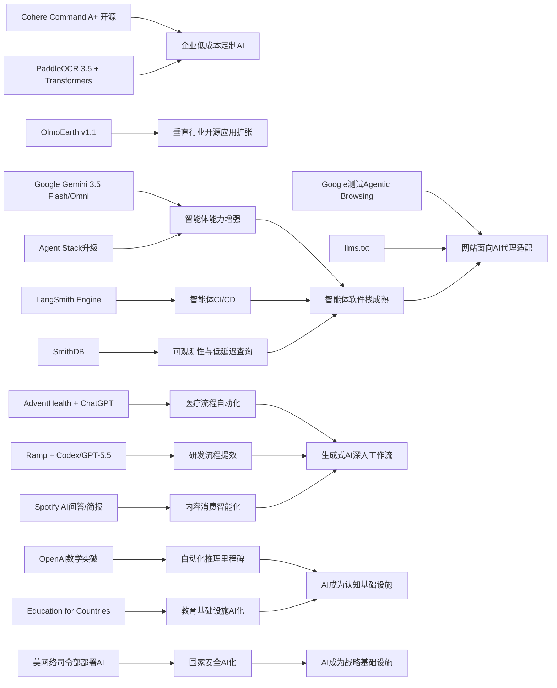

> AI 早报 · 每日早读 · 全网深度聚合

## **今日摘要**

Cohere开源最强模型Command A+、AdventHealth将ChatGPT用于医疗文书流程、以及LangSmith/SmithDB等工具升级，显示AI正同时在模型能力、行业落地和智能体基础设施上加速成熟。  
Google发布面向智能体与多模态任务的Gemini 3.5 Flash和Omni，Ramp用Codex提升代码评审效率，PaddleOCR 3.5接入Transformers后端，说明AI正在更深入地进入开发、办公和文档处理场景。  
与此同时，Google开始测试网站对AI代理的兼容性，OpenAI推进教育合作计划，反映出行业正从“模型竞赛”走向“生态建设”，AI对网络规则、教育体系和社会运行方式的影响将进一步扩大。

### 🔵 产品与功能更新

1. **Cohere开源最强模型Command A+。**  
Cohere发布了目前最强的语言模型Command A+，并采用Apache 2.0许可证开源，意味着企业和开发者都更容易直接使用与二次开发。对普通用户来说，这会推动更多低成本、可定制的AI应用出现。开源也有助于行业加速对比不同模型的真实表现。🚀  
[开源模型发布详情(briefing)](https://the-decoder.com/cohere-open-sources-its-strongest-model-yet/)

2. **AdventHealth用ChatGPT减轻医疗文书负担。**  
AdventHealth正在把ChatGPT for Healthcare用于医疗工作流程优化，目标是减少行政事务占用，让医护人员把更多时间留给患者。它的重点不是替代医生，而是协助整理信息、简化日常流程。对医疗机构来说，这类落地案例说明生成式AI（可自动生成文字内容的人工智能）正进入更实际的运营环节。🚀  
[医疗场景应用案例(briefing)](https://openai.com/index/adventhealth)

3. **LangSmith Engine与SmithDB推动智能体基础设施升级。**  
这则汇总显示，面向智能体（可自主执行任务的AI系统）的基础设施正在快速成熟。LangSmith Engine提供类似CI/CD（持续集成/持续交付）的循环能力，帮助团队更稳定地测试和上线智能体；SmithDB则强调低延迟查询，用于可观测性（观察系统运行状态）。同时，Cognition和Anthropic也在改进自动分流与大代码库协作能力，说明开发者工具链正在补齐。🚀  
[智能体工具链观察(briefing)](https://news.smol.ai/issues/26-05-18-not-much/)

### 🟢 前沿研究

1. **Google发布Gemini 3.5 Flash与Omni。**  
Google在I/O 2026上把Gemini重新定位为既面向消费者、也面向开发者和智能体的平台。Gemini 3.5 Flash主打更快的智能体任务与编程场景，Gemini Omni则强化多模态（可同时处理文字、图像、视频等多种信息）生成与编辑。再加上升级后的Agent Stack（智能体开发栈），Google显然在押注“AI直接执行任务”的下一阶段。🚀  
[谷歌I/O要点速览(briefing)](https://news.smol.ai/issues/26-05-19-not-much/)

2. **Ramp工程团队用Codex加速代码评审。**  
Ramp工程师正在使用Codex配合GPT-5.5进行代码评审，把原本可能需要数小时的反馈缩短到几分钟。对企业研发团队来说，这意味着AI不仅能写代码，也能在质量检查环节提供实质帮助。若这类流程稳定下来，软件交付速度和协作效率都可能进一步提升。🚀  
[代码评审实践分享(briefing)](https://openai.com/index/ramp)

3. **PaddleOCR 3.5接入Transformers后端。**  
PaddleOCR 3.5把OCR（光学字符识别，即让机器“读懂”图片文字）和文档解析任务运行在Transformers后端之上。对非技术用户来说，这意味着扫描件、票据、表格等文档处理能力有望更统一、更易部署。文档AI正在从单一识别，走向更完整的信息提取与理解。🚀  
[文档识别能力更新(briefing)](https://huggingface.co/blog/PaddlePaddle/paddleocr-transformers)

### 🟡 行业展望与社会影响

1. **Google测试网站对AI代理的兼容性。**  
Google正在Lighthouse分析工具中测试“Agentic Browsing”类别，用来检查网站是否适合AI代理（能代替人执行上网任务的系统）访问与操作。它还会关注llms.txt这类文件，帮助网站向AI说明可读取内容与规则。这意味着未来网站不仅要对人友好，也要开始面向AI“可访问”。🚀  
[网站兼容AI新动向(briefing)](https://the-decoder.com/google-tests-websites-for-llms-txt-and-agent-compatibility/)

2. **OpenAI推进Education for Countries计划。**  
OpenAI正在扩展面向各国教育体系的合作计划，内容包括学校引入AI、教师培训和提升学习成果的工具支持。对社会层面而言，这显示AI竞争正从企业生产力扩展到公共教育基础设施。教育系统如何安全、平衡地采用AI，可能会成为未来几年各国的重要议题。🚀  
[全球教育合作进展(briefing)](https://openai.com/index/the-next-phase-of-education-for-countries)

3. **搜索引擎进入“后Google体验”讨论期。**  
随着Google搜索界面越来越多地加入AI总结功能，外界开始认真讨论替代搜索引擎的选择。报道列出六个值得尝试的搜索产品，反映用户对“传统搜索是否正在被AI重塑”的担忧与好奇。对普通用户来说，未来搜索体验可能会更像“问答助手”，而不只是链接列表。🚀  
[搜索格局变化观察(briefing)](https://techcrunch.com/2026/05/21/six-search-engines-worth-trying-now-that-google-isnt-really-google-anymore/)

### 🟣 开源TOP项目

1. **OpenAI模型推翻离散几何重要猜想。**  
OpenAI表示，其模型解决了有80年历史的单位距离问题，并推翻了离散几何中的一个重要猜想。即使对非数学读者来说，这也代表AI在“高难度推理”上的能力跨过了一个标志性门槛。它不只是回答问题，而是在严肃学术问题上给出可能改变领域认知的新结果。🚀  
[数学突破官方说明(briefing)](https://openai.com/index/model-disproves-discrete-geometry-conjecture)

2. **AI数学证明获顶级期刊级别关注。**  
相关报道指出，这项AI数学成果被视为自动化推理（让AI进行严密逻辑证明）的里程碑，并可能不是最后一次。专家认为，AI开始在数学研究中提出人类意想不到的工具和路径。对科研界来说，这意味着AI正从辅助计算迈向参与发现。🚀  
[专家解读里程碑(briefing)](https://the-decoder.com/openai-shifts-the-boundary-of-automated-reasoning-with-a-milestone-in-ai-mathematics-that-experts-are-now-unpacking/)

3. **OlmoEarth v1.1提升地球观测模型效率。**  
AllenAI发布OlmoEarth v1.1，这是一个更高效的地球观测模型家族。它面向遥感（通过卫星或传感器远距离观测地球）等场景，可用于环境、农业和灾害分析等任务。开源地球观测模型效率提升，有助于更多机构以更低门槛使用相关能力。🚀  
[地球观测模型更新(briefing)](https://huggingface.co/blog/allenai/olmoearth-v1-1)

### 🔴 社媒分享

1. **美国网络司令部加速在机密网络部署AI。**  
美国网络司令部已组建专项团队，计划把OpenAI、Google等公司的模型运行在最高机密级别网络上。背后原因是，先进AI被认为能比顶尖人工黑客更快发现安全漏洞。这个动向说明，AI在网络安全与国家安全中的角色正在迅速升级。🚀  
[机密网络部署动态(briefing)](https://the-decoder.com/us-cyber-command-races-to-deploy-ai-on-top-secret-networks/)

2. **Spotify为播客加入AI问答与简报功能。**  
Spotify正在为播客加入AI驱动的问答和简报生成功能，用户可基于自己的提示词获得每日或每周摘要。对普通听众来说，这会让长音频内容更容易被快速理解和回顾。播客平台正从“收听工具”转向“内容理解助手”。🚀  
[播客AI功能更新(briefing)](https://techcrunch.com/2026/05/21/spotify-adds-ai-powered-qa-and-briefing-generation-features-to-podcasts/)

3. **Ettin Reranker家族瞄准检索排序。**  
Ettin Reranker Family是一组用于重排序（先找出候选内容，再重新按相关性排序）的模型。它适用于搜索、问答和知识库等场景，能帮助系统把最相关的信息排到前面。虽然概念偏技术，但它直接影响用户看到的答案是否更准、更贴题。🚀  
[重排序模型介绍(briefing)](https://huggingface.co/blog/ettin-reranker)

---

📊 行业洞察

1. 事实  
   Cohere开源最强模型Command A+，采用Apache 2.0许可证；同时AllenAI发布更高效的地球观测模型OlmoEarth v1.1，PaddleOCR 3.5接入Transformers后端，进一步降低文档AI部署门槛。  
   【洞察】判断：AI行业正从“闭源大模型竞赛”转向“开源能力层普及”。开源许可证、统一后端与高效模型家族的组合，正在把AI竞争重心从“谁有模型”转为“谁能更快把模型嵌入垂直场景并形成产品化优势”。这会压缩基础能力溢价，放大行业方案、数据资产和工程集成能力的价值。

2. 事实  
   Google发布Gemini 3.5 Flash、Omni和升级后的Agent Stack（智能体开发栈）；LangSmith Engine与SmithDB补齐智能体的测试、上线与可观测性（观察系统运行状态）基础设施；Google还在Lighthouse中测试Agentic Browsing并关注llms.txt。  
   【洞察】判断：智能体（Agent）正在从“模型功能”升级为“完整软件范式”。上游模型厂商提供更强任务执行能力，中游工具链补足CI/CD（持续集成/持续交付）、监控与低延迟查询，下游Web生态开始为AI代理改造可访问性标准。这意味着2026年的关键问题不再只是“模型能不能回答”，而是“智能体能不能稳定、安全、规模化执行任务”。

3. 事实  
   AdventHealth将ChatGPT for Healthcare用于医疗文书流程；Ramp工程团队用Codex配合GPT-5.5将代码评审从数小时缩短到数分钟；Spotify为播客加入AI问答与简报功能。  
   【洞察】判断：生成式AI的商业落地正进入“流程改造深水区”。其价值不再主要体现为单点内容生成，而是嵌入医疗、研发、内容消费等高频工作流，直接重构时间分配、协作方式和交付效率。未来企业采购AI时，评估标准会从模型参数转向ROI（投资回报率）、流程渗透率与组织采纳速度。

4. 事实  
   OpenAI模型推翻离散几何重要猜想，并被视为自动化推理（让AI进行严密逻辑证明）的里程碑；OpenAI同时推进Education for Countries计划；美国网络司令部加速在最高机密网络部署AI模型。  
   【洞察】判断：AI正同时进入“认知基础设施”和“国家基础设施”双重角色。一方面，它开始参与高阶科研发现，提升教育体系的知识生产与传播效率；另一方面，它被纳入网络安全与国家安全体系。行业影响将从商业效率外溢到科研竞争力、人才培养和战略安全，监管与主权AI（具备本地控制权的AI能力）议题会进一步升温。

🗺️ 今日关系图

