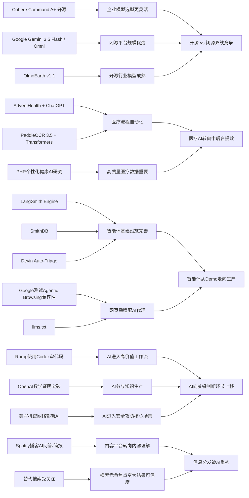

> AI 早报 · 每日早读 · 全网深度聚合

## **今日摘要**

近期AI动态可概括为三点：第一，产品层面上，Cohere开源最强模型Command A+、医疗机构AdventHealth将ChatGPT用于流程优化、智能体基础设施如LangSmith和SmithDB加速成熟，说明AI正从模型能力竞争走向更易部署、更能落地的阶段。  
第二，研究与平台层面，Google发布Gemini 3.5 Flash与Omni、PaddleOCR 3.5接入Transformers、Ramp用Codex提升代码审查效率，反映多模态、文档理解和软件开发正在成为AI应用的重要突破口。  
第三，行业趋势上，Google开始测试网站对AI代理的兼容性，OpenAI也推进国家级教育计划，意味着AI的影响正从单点工具扩展到网页标准、组织流程和公共基础设施。

### 🔵 产品与功能更新

1. **Cohere开源最强模型Command A+。**  
Cohere宣布将旗下目前最强的语言模型Command A+以Apache 2.0许可证开源，意味着企业和开发者可以更自由地部署与改造。对非技术团队来说，这类“开源大模型”通常意味着更低的使用门槛和更强的可控性。随着商业模型与开源模型差距缩小，企业选型会更灵活。🚀  
[开源模型发布解读(briefing)](https://the-decoder.com/cohere-open-sources-its-strongest-model-yet/)

2. **AdventHealth把ChatGPT用于医疗流程。**  
AdventHealth正在使用面向医疗场景的ChatGPT，目标是简化工作流、减少行政负担，并把更多时间还给临床照护。对医院来说，这类应用的价值不只是“聊天助手”，更在于处理文书、协调流程和辅助信息查询。若落地顺利，AI在医疗后台的普及速度可能会进一步加快。🚀  
[医疗流程应用案例(briefing)](https://openai.com/index/adventhealth)

3. **LangSmith Engine与SmithDB推进智能体基础设施。**  
smol.ai日报提到，面向智能体（Agent，可自主执行任务的软件系统）的基础设施正在快速完善，其中LangSmith Engine提供类似CI/CD（持续集成/持续交付）的闭环能力。SmithDB则强调低延迟查询，用于可观测性（即追踪系统运行状态）分析。再加上Cognition的Devin Auto-Triage自动处理缺陷分流，说明“让智能体稳定上线”正成为新产品重点。🚀  
[智能体工具进展综述(briefing)](https://news.smol.ai/issues/26-05-18-not-much/)

### 🟢 前沿研究

1. **Google I/O发布Gemini 3.5 Flash与Omni。**  
Google在I/O 2026上把Gemini进一步定位为消费级AI与开发者/智能体平台，并推出Gemini 3.5 Flash、Gemini Omni和新版智能体技术栈。Gemini 3.5 Flash强调快速任务与编程场景，Omni则面向多模态（文字、图像、视频等多种输入输出）生成与编辑。Google还披露月处理量已超过3.2千万亿token，显示其平台规模正迅速扩大。🚀  
[谷歌I/O核心发布(briefing)](https://news.smol.ai/issues/26-05-19-not-much/)

2. **PaddleOCR 3.5接入Transformers后端。**  
PaddleOCR 3.5展示了用Transformers（当前主流深度学习模型架构）后端来完成OCR（文字识别）和文档解析任务的能力。对企业用户来说，这意味着票据、表单、合同等文档处理流程有望更统一地接入现代AI框架。文档AI正在从“识别文字”走向“理解内容与结构”。🚀  
[文档识别能力升级(briefing)](https://huggingface.co/blog/PaddlePaddle/paddleocr-transformers)

3. **Ramp工程团队用Codex加速代码审查。**  
OpenAI分享了Ramp工程团队如何借助Codex与GPT-5.5完成代码审查，把原本数小时的反馈缩短到几分钟。这里的关键不是简单自动补全，而是让模型给出更实质性的审阅意见和改进建议。对软件团队来说，AI正在从“写代码”进一步进入“审代码”的高价值环节。🚀  
[代码审查实践案例(briefing)](https://openai.com/index/ramp)

### 🟡 行业展望与社会影响

1. **Google测试网站的AI代理兼容性。**  
Google正在Lighthouse分析工具中测试“Agentic Browsing（智能体浏览）”分类，用来检查网站是否支持AI代理访问，并关注llms.txt这类面向大模型的说明文件。对网站运营者而言，未来不仅要考虑搜索引擎优化，还要考虑“AI能否顺畅读取和操作页面”。这可能推动新一轮面向AI访问的网页规范建设。🚀  
[网站兼容AI新趋势(briefing)](https://the-decoder.com/google-tests-websites-for-llms-txt-and-agent-compatibility/)

2. **OpenAI推进面向国家的教育计划。**  
OpenAI宣布推进“Education for Countries”，通过新合作、教师培训和工具部署，扩大AI在学校中的应用。其重点不仅是给学生提供工具，也包括帮助教师掌握AI教学方法。若各国教育系统持续引入这类方案，AI素养可能会更早进入基础教育。🚀  
[全球教育合作进展(briefing)](https://openai.com/index/the-next-phase-of-education-for-countries)

3. **谷歌搜索变化促使替代搜索受关注。**  
TechCrunch盘点了在Google搜索越来越AI化之后，值得尝试的六个搜索引擎。背后的信号是：当搜索结果被AI摘要重塑，用户开始重新思考“我想看答案，还是想看原始网页”。搜索市场的竞争焦点，正从索引能力转向结果呈现方式与可信度。🚀  
[替代搜索引擎观察(briefing)](https://techcrunch.com/2026/05/21/six-search-engines-worth-trying-now-that-google-isnt-really-google-anymore/)

### 🟣 开源TOP项目

1. **OpenAI模型推翻离散几何重要猜想。**  
OpenAI表示，其模型解决了已有80年历史的单位距离问题，并推翻了离散几何中的一个重要猜想。这被视为AI数学推理的重要里程碑，因为模型不只是复述已知结论，而是给出了新的数学发现。对科研界来说，这类成果可能改变人们对“AI能否参与原创研究”的判断。🚀  
[数学突破官方说明(briefing)](https://openai.com/index/model-disproves-discrete-geometry-conjecture)

2. **数学顶刊级AI证明引发学界讨论。**  
The Decoder进一步解读称，这项成果可能是首个达到数学顶级期刊水准的AI证明之一。报道还提到，专家认为这不会是最后一次，AI在自动推理（让机器进行复杂逻辑证明）上的边界正在被重新定义。对外界而言，AI的价值正从“辅助计算”迈向“参与知识生产”。🚀  
[顶刊级证明深度解读(briefing)](https://the-decoder.com/openai-shifts-the-boundary-of-automated-reasoning-with-a-milestone-in-ai-mathematics-that-experts-are-now-unpacking/)

3. **OlmoEarth v1.1提升地球观测效率。**  
AllenAI发布OlmoEarth v1.1，这是一组更高效的地球观测模型，面向遥感（通过卫星等设备远距离观测地表）等任务。更高效率意味着在处理环境监测、灾害评估和土地变化时，模型部署成本可能更低。开源地球观测模型的成熟，也有助于科研和公共部门采用。🚀  
[地球观测模型更新(briefing)](https://huggingface.co/blog/allenai/olmoearth-v1-1)

### 🔴 社媒分享

1. **美军网络司令部加速在机密网络部署AI。**  
The Decoder报道称，美国网络司令部已成立专项小组，推动OpenAI、Google等公司的模型运行在最高机密网络中。其核心原因是，先进模型在发现安全漏洞方面已逼近顶尖人类黑客的效率。若这一趋势持续，AI将在网络攻防中扮演越来越直接的角色。🚀  
[机密网络部署动向(briefing)](https://the-decoder.com/us-cyber-command-races-to-deploy-ai-on-top-secret-networks/)

2. **Spotify为播客加入AI问答与简报。**  
Spotify正在为播客加入AI驱动的问答和简报生成功能，用户可以根据自己的提示词生成每日或每周内容摘要。对普通听众来说，这会降低获取播客重点信息的时间成本。音频平台也因此从“内容分发”走向“内容理解与再组织”。🚀  
[播客AI功能速览(briefing)](https://techcrunch.com/2026/05/21/spotify-adds-ai-powered-qa-and-briefing-generation-features-to-podcasts/)

3. **个人健康档案或提升健康AI个性化。**  
一篇arXiv论文评估了个人健康档案（PHR，由患者自行管理的健康记录）在个性化健康AI中的作用，并测试大模型回答健康问题的潜力。研究指出，临床数据虽然复杂，但若能被模型有效利用，可能帮助用户更好理解自身健康状况。这个方向也提醒行业：医疗AI的价值很大程度取决于高质量、可理解的数据输入。🚀  
[健康档案研究速读(briefing)](https://arxiv.org/abs/2605.18937)

---

📊 行业洞察

1. 事实  
   Cohere将最强模型Command A+以Apache 2.0许可证开源；Google在I/O发布Gemini 3.5 Flash与Omni，并披露月处理量超过3.2千万亿token；AllenAI也继续推进OlmoEarth v1.1等开源模型。  
   【洞察】大模型市场正从“闭源能力竞赛”转向“开放生态+平台规模”双线竞争。开源阵营通过许可证友好、可私有化部署、行业定制能力争夺企业客户；闭源阵营则依靠超大推理规模、多模态（文字/图像/视频等多种输入输出）能力和平台集成维持优势。未来企业选型将更像“基础模型组合采购”，而非单一押注某一家供应商。

2. 事实  
   AdventHealth把ChatGPT用于医疗流程以降低行政负担；PaddleOCR 3.5接入Transformers（主流深度学习模型架构）后端，强化文档解析；个人健康档案（PHR，患者自行管理的健康记录）研究显示，高质量医疗数据是个性化健康AI的关键。  
   【洞察】医疗AI正从“问答助手”升级为“流程操作系统”。其核心价值不在单次对话，而在文书处理、表单识别、病历理解、信息协调等后台流程自动化。谁能打通OCR（文字识别）、结构化数据、临床知识与合规部署，谁就更可能拿下医院场景的真实预算。医疗AI商业化正在从前台交互转向中后台提效。

3. 事实  
   LangSmith Engine与SmithDB补强智能体基础设施，强调类似CI/CD（持续集成/持续交付）的闭环和可观测性（追踪系统运行状态）；Cognition推出Devin Auto-Triage自动做缺陷分流；Google测试网站的Agentic Browsing（智能体浏览）兼容性，并关注llms.txt。  
   【洞察】智能体（Agent，可自主执行任务的软件系统）正在从“能演示”迈向“能上线”。这意味着行业焦点已不只是模型是否聪明，而是任务编排、故障回溯、低延迟查询、网页可访问性、标准接口等工程问题。接下来智能体赛道的竞争壁垒将更多体现在基础设施和生态标准，而非单点模型能力。

4. 事实  
   Ramp工程团队用Codex与GPT-5.5将代码审查反馈从数小时缩短到几分钟；OpenAI模型推翻离散几何重要猜想，并被解读为接近数学顶刊级证明；美国网络司令部正推动在最高机密网络中部署OpenAI、Google等模型。  
   【洞察】AI能力正在向“高价值决策环节”上移，从生成内容进入审查、推理、科研发现和安全攻防。相比早期“写文案、做摘要”的轻量应用，这些场景更接近组织核心生产力，也更容易形成高单价采购与长期依赖。行业下一阶段的关键，不是证明AI“会用”，而是证明AI“可信地参与关键判断”。

🗺️ 今日关系图

