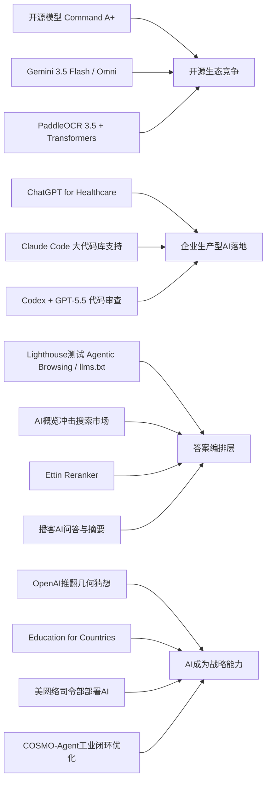

> AI 早报 · 每日早读 · 全网深度聚合

## **今日摘要**

本周AI动态显示，开源与企业落地同步加速：Cohere开源最强模型Command A+，AdventHealth将ChatGPT用于优化医疗流程，Anthropic也在增强Claude Code对大型代码库的支持。  
同时，前沿能力继续向平台化和生产化演进，Google发布Gemini 3.5 Flash与Omni并扩展Agent Stack，Ramp用Codex显著加快代码审查，PaddleOCR 3.5则提升了文档识别生态兼容性。  
从行业趋势看，AI正不仅改变软件开发和搜索体验，也开始影响网站如何适配AI代理，预示未来竞争将从“提供工具”进一步转向“构建面向AI的完整平台与基础设施”。

### 🔵 产品与功能更新

1. **Cohere开源最强模型Command A+。**  
Cohere发布了目前最强的语言模型Command A+，并采用Apache 2.0许可对外开源🚀  
这意味着企业和开发者可以更自由地下载、修改和商用，降低模型落地门槛。  
对普通用户来说，开源强模型的增加通常会带来更多可选AI产品，以及更快的功能迭代。  
[查看开源模型详情(briefing)](https://the-decoder.com/cohere-open-sources-its-strongest-model-yet/)

2. **AdventHealth用ChatGPT优化医疗流程。**  
AdventHealth正在把ChatGPT for Healthcare（医疗版聊天助手）用于简化工作流，减少行政负担🚀  
核心目标不是替代医生，而是把更多时间还给临床照护与患者沟通。  
这类实践说明，AI在医疗行业的价值正从“试验项目”走向“日常工具”。  
[了解医疗应用案例(briefing)](https://openai.com/index/adventhealth)

3. **Claude Code加强大代码库支持。**  
Anthropic正在改进Claude Code，让它更适合处理大型代码库（大型软件项目代码集合）🚀  
更新包括提示缓存诊断，以及更快的运行模式，帮助开发者更高效定位问题。  
对企业团队而言，这类提升会直接影响AI编程助手在真实生产环境中的可用性。  
[查看产品更新综述(briefing)](https://news.smol.ai/issues/26-05-18-not-much/)

### 🟢 前沿研究

1. **Google发布Gemini 3.5 Flash与Omni。**  
Google在I/O 2026上进一步把Gemini定位为消费者AI平台和开发者/智能体平台🚀  
其中Gemini 3.5 Flash主打快速智能体任务和编程，Gemini Omni则强调多模态（文字、图片、音频、视频）生成与编辑。  
同时，Google还扩展了Agent Stack（智能体开发栈），显示其正从“模型竞争”转向“平台竞争”。  
[查看I/O发布综述(briefing)](https://news.smol.ai/issues/26-05-19-not-much/)

2. **Ramp工程师用Codex加速代码审查。**  
Ramp工程团队正在使用Codex配合GPT-5.5完成代码审查，把原本数小时的反馈缩短到几分钟🚀  
这里的代码审查，是指在软件上线前检查质量、逻辑和风险的流程。  
案例说明，AI在研发环节的作用正从“写代码”进一步延伸到“审代码”和“提改进建议”。  
[阅读企业实践案例(briefing)](https://openai.com/index/ramp)

3. **PaddleOCR 3.5支持Transformers后端。**  
PaddleOCR 3.5开始支持Transformers后端，用于OCR（光学字符识别）和文档解析任务🚀  
这类升级有助于提升模型兼容性，也更方便接入当前主流AI开发生态。  
对企业和开发者而言，文档识别、票据处理、表单提取等场景有望更容易部署。  
[查看OCR技术更新(briefing)](https://huggingface.co/blog/PaddlePaddle/paddleocr-transformers)

### 🟡 行业展望与社会影响

1. **Google测试网站的AI代理兼容性。**  
Google正在Lighthouse分析工具中测试“Agentic Browsing（智能体浏览）”新分类，用来检查网站是否适配AI代理🚀  
其中包括对llms.txt的检测，这是一种帮助AI系统理解网站规则与内容边界的文件方案。  
这意味着未来网站不仅要对搜索引擎友好，还可能要对AI代理友好。  
[了解兼容性测试变化(briefing)](https://the-decoder.com/google-tests-websites-for-llms-txt-and-agent-compatibility/)

2. **搜索市场因AI概览面临新变化。**  
随着Google搜索结果越来越多加入AI概览，不少用户开始重新评估替代搜索引擎🚀  
这反映出，AI正在改变用户获取信息的方式，也改变了大家对“搜索结果是否可信、是否中立”的期待。  
如果AI总结继续普及，搜索产品的竞争重点可能从“索引网页”转向“组织答案”。  
[看看替代搜索趋势(briefing)](https://techcrunch.com/2026/05/21/six-search-engines-worth-trying-now-that-google-isnt-really-google-anymore/)

3. **OpenAI推进Education for Countries计划。**  
OpenAI宣布继续推进Education for Countries（面向国家的教育合作）计划，扩大AI在学校中的应用🚀  
项目内容包括教师培训、新合作伙伴关系，以及帮助改善学习效果的工具。  
从社会层面看，AI教育的重点正从单点试用，走向更系统化、规模化的基础设施建设。  
[查看教育计划进展(briefing)](https://openai.com/index/the-next-phase-of-education-for-countries)

### 🟣 开源TOP项目

1. **OpenAI模型推翻离散几何重要猜想。**  
OpenAI表示，其模型成功解决了一个已有约80年历史的单位距离问题，并推翻了离散几何中的一个重要猜想🚀  
这被视为AI数学推理的重要里程碑，说明模型不只是“复述知识”，还可能参与原创性研究。  
对公众来说，这类进展最值得关注的地方在于：AI正在从工具走向科研合作者。  
[查看官方研究说明(briefing)](https://openai.com/index/model-disproves-discrete-geometry-conjecture)

2. **OlmoEarth v1.1提升地球观测效率。**  
AllenAI发布OlmoEarth v1.1，这是一组更高效的地球观测模型🚀  
地球观测模型通常用于分析卫星图像，服务气候、农业、灾害监测等场景。  
效率提升意味着研究机构和行业用户能以更低成本处理更大规模的数据。  
[了解模型更新内容(briefing)](https://huggingface.co/blog/allenai/olmoearth-v1-1)

3. **COSMO-Agent瞄准工业闭环优化。**  
论文提出COSMO-Agent，用于把优化、仿真和建模编排到同一个闭环流程中🚀  
它试图解决工业设计中从仿真反馈到几何修改之间的“语义鸿沟”，也就是机器难以把结果直接转成可执行设计改动。  
如果这类方案成熟，可能显著提升复杂工程设计的自动化程度。  
[查看论文摘要原文(briefing)](https://arxiv.org/abs/2605.20190)

### 🔴 社媒分享

1. **美网络司令部加速在机密网络部署AI。**  
美国网络司令部已成立专项小组，推动在最高机密的五角大楼与国家安全局网络中运行AI模型🚀  
报道提到，驱动力之一是AI系统发现安全漏洞的速度，可能已接近顶尖人类黑客。  
这显示AI能力正在迅速进入国家安全与网络攻防的核心场景。  
[了解机密网络部署(briefing)](https://the-decoder.com/us-cyber-command-races-to-deploy-ai-on-top-secret-networks/)

2. **Spotify为播客加入AI问答与摘要。**  
Spotify正在为播客增加AI驱动的问答和briefing（简报）生成功能🚀  
用户可以根据自己的提示词生成每日或每周内容摘要，更快掌握节目重点。  
这类功能会让音频内容消费从“顺序收听”转向“按需提取信息”。  
[查看播客功能更新(briefing)](https://techcrunch.com/2026/05/21/spotify-adds-ai-powered-qa-and-briefing-generation-features-to-podcasts/)

3. **Ettin Reranker系列正式推出。**  
Hugging Face博客介绍了Ettin Reranker系列模型，用于重排序（从候选结果中重新挑选更相关内容）🚀  
重排序通常出现在搜索、问答和检索增强生成（让AI先查资料再回答）流程中，是影响答案质量的关键环节。  
虽然这项更新偏底层，但它会间接提升很多AI搜索与知识助手的最终体验。  
[了解重排序模型系列(briefing)](https://huggingface.co/blog/ettin-reranker)

---

📊 行业洞察

1. 事实  
   Cohere开源最强模型Command A+，采用Apache 2.0许可；Google在I/O 2026发布Gemini 3.5 Flash、Gemini Omni，并扩展Agent Stack（智能体开发栈）；PaddleOCR 3.5支持Transformers后端（主流深度学习模型接口生态）。  
   【洞察】AI竞争正从“单点模型能力”快速转向“开源模型+工具链+平台生态”的系统战。Cohere用开源许可降低企业采用门槛，Google则通过多模态模型和智能体开发栈争夺平台控制权，PaddleOCR接入Transformers说明垂直能力模块也在主动靠拢通用生态。未来企业选型的关键，不再只是模型排行榜，而是看生态兼容性、可二次开发能力和平台锁定风险。

2. 事实  
   AdventHealth将ChatGPT for Healthcare用于简化医疗工作流；Anthropic增强Claude Code对大型代码库支持；Ramp工程团队使用Codex配合GPT-5.5，将代码审查时间从数小时缩短到几分钟。  
   【洞察】生成式AI正在从“演示型助手”进入“生产型副驾（Copilot，辅助执行核心流程的AI）”阶段。无论是医疗行政流程，还是软件研发中的代码审查与大型代码库维护，价值都集中体现在“缩短高频高成本环节的时间”。这意味着2026年的企业AI采购逻辑将更重视可量化ROI（投资回报率）、流程嵌入深度和合规可控性，而非单纯追逐通用大模型参数规模。

3. 事实  
   Google在Lighthouse中测试Agentic Browsing（智能体浏览）兼容性，并检测llms.txt；Google搜索因AI概览变化引发用户重新评估替代搜索引擎；Hugging Face推出Ettin Reranker（重排序模型，用于提升检索结果相关性）；Spotify为播客加入AI问答与摘要。  
   【洞察】“搜索”正在演变为“答案编排层（Answer Orchestration Layer，将多源内容重组为直接答案的系统）”。前端上，用户从点链接转向直接消费AI摘要、问答和briefing；后端上，网站开始为AI代理优化可访问规则，检索系统则依赖重排序模型提升答案质量。内容平台、搜索引擎与AI助手的边界正在模糊，未来流量分发规则将从SEO（搜索引擎优化）扩展到AEO（答案引擎优化，面向AI答案系统的内容优化）。

4. 事实  
   OpenAI模型推翻离散几何重要猜想；OpenAI推进Education for Countries计划；美国网络司令部加速在机密网络部署AI；COSMO-Agent探索工业闭环优化。  
   【洞察】AI正同步进入“科研突破、国家基础设施、产业自动化”三条高价值赛道，角色从效率工具升级为战略能力。科研上，模型开始具备原创性推理潜力；教育上，AI正被纳入国家级教学基础设施；国防与工业上，AI则直接影响网络攻防和复杂工程设计。行业意义在于，AI的竞争优势将越来越体现为“制度嵌入能力”而非单次产品创新，谁能进入教育、国防、工业等长期系统，谁就更可能建立深护城河。

🗺️ 今日关系图

