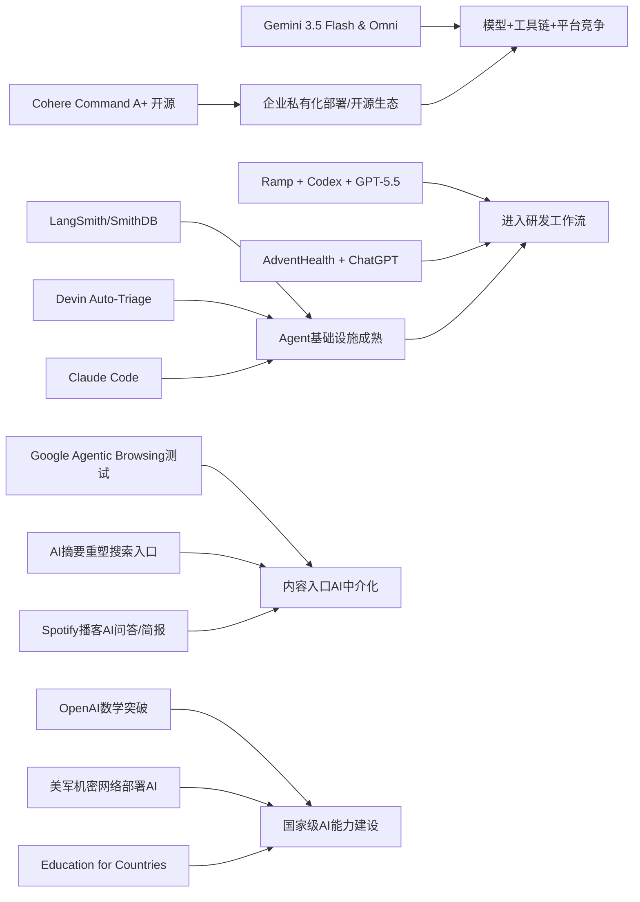

> AI 早报 · 每日早读 · 全网深度聚合

## **今日摘要**

Cohere开源了最强模型Command A+，Google发布Gemini 3.5 Flash与Omni，说明大模型竞争正从单纯比拼能力转向更开放、更完整的平台化布局。  
与此同时，AI正加速进入真实工作流：AdventHealth用ChatGPT减轻医疗文书负担，Ramp用Codex把代码审查从数小时压缩到数分钟，Agent基础设施也在持续升级。  
在更广泛的行业层面，Google开始测试网站对AI代理的兼容性，PaddleOCR等文档理解能力也在增强，预示未来企业系统、网站和信息入口都会越来越围绕AI重构。

### 🔵 产品与功能更新

1. **Cohere开源最强模型Command A+。**  
Cohere发布了目前最强的语言模型（擅长理解和生成文字的AI）Command A+，并采用Apache 2.0开源许可，对开发者和企业更友好。开源意味着更多团队可以直接下载、部署和二次开发，而不必完全依赖云端接口。对于希望自建AI能力的公司来说，这会降低试用和落地门槛。🚀  
[查看开源模型详情(briefing)](https://the-decoder.com/cohere-open-sources-its-strongest-model-yet/)

2. **AdventHealth用ChatGPT减轻医疗文书负担。**  
AdventHealth正在将ChatGPT for Healthcare用于医疗工作流（医院日常处理流程）优化，目标是减少医护人员的行政事务压力。官方强调，这类工具能帮助整理信息、简化流程，把更多时间还给病患照护。对非技术读者来说，这代表AI正从“演示工具”变成医院里的实用助手。🚀  
[了解医疗应用案例(briefing)](https://openai.com/index/adventhealth)

3. **LangSmith、Devin与Claude Code推动Agent基础设施升级。**  
当天的汇总显示，围绕Agent（可自主完成多步任务的AI助手）的基础设施正在快速完善。LangSmith Engine开始支持类似CI/CD（持续集成/持续交付）的闭环管理，SmithDB则强调低延迟观测查询；Cognition的Devin Auto-Triage可持续处理缺陷分流；Anthropic也在增强Claude Code对大型代码库的支持。这说明AI产品竞争正从“模型能力”转向“能否稳定进入工作流程”。🚀  
[查看Agent更新汇总(briefing)](https://news.smol.ai/issues/26-05-18-not-much/)

### 🟢 前沿研究

1. **Google在I/O 2026发布Gemini 3.5 Flash与Omni。**  
Google在I/O大会上把Gemini进一步定位为面向消费者和开发者的统一AI平台。新发布的Gemini 3.5 Flash主打更快的Agent任务和编程场景，Gemini Omni则面向多模态（可同时处理文字、图像、视频等）生成与编辑。再加上扩展后的Agent工具栈，Google显然在强化“从模型到应用平台”的整体布局。🚀  
[查看Google发布重点(briefing)](https://news.smol.ai/issues/26-05-19-not-much/)

2. **Ramp工程师用Codex把代码审查从数小时缩到数分钟。**  
OpenAI案例显示，Ramp工程团队正使用Codex配合GPT-5.5进行代码审查（检查程序是否存在问题与优化空间）。官方说，这让开发者能更快拿到有实质价值的反馈，而不是长时间等待人工审阅。对企业研发团队来说，这意味着AI开始直接影响软件交付速度。🚀  
[阅读企业实践案例(briefing)](https://openai.com/index/ramp)

3. **PaddleOCR 3.5接入Transformers后端。**  
PaddleOCR 3.5开始支持基于Transformers（当前主流深度学习架构）的后端，用于OCR（光学字符识别）和文档解析任务。简单说，就是让图片、扫描件、表格等非结构化文档更容易被AI读懂并转成可处理的数据。这类能力对于票据、合同、档案数字化等场景非常关键。🚀  
[查看文档识别进展(briefing)](https://huggingface.co/blog/PaddlePaddle/paddleocr-transformers)

### 🟡 行业展望与社会影响

1. **Google测试网站对AI代理的兼容性审计。**  
Google正在Lighthouse网站分析工具中测试“Agentic Browsing”实验分类，用来检查网站是否适合AI代理访问与使用。报道还提到llms.txt，这是一种帮助AI系统理解网站内容与访问规则的说明文件。若这一方向普及，网站未来可能不仅要为搜索引擎优化，也要为AI助手优化。🚀  
[查看网站审计变化(briefing)](https://the-decoder.com/google-tests-websites-for-llms-txt-and-agent-compatibility/)

2. **AI搜索改写网页入口，替代搜索引擎开始受关注。**  
TechCrunch指出，随着Google搜索结果越来越被AI摘要重塑，不少用户开始重新考虑替代搜索引擎。文章盘点了六个值得尝试的搜索产品，反映出用户对传统搜索体验变化的真实反应。这不只是工具选择问题，也意味着内容分发入口正在发生结构性变化。🚀  
[了解搜索市场变化(briefing)](https://techcrunch.com/2026/05/21/six-search-engines-worth-trying-now-that-google-isnt-really-google-anymore/)

3. **OpenAI推进“Education for Countries”教育合作。**  
OpenAI宣布推进“Education for Countries”项目，继续扩大AI在学校与教育体系中的应用。内容包括新的合作关系、教师培训以及帮助改善学习效果的工具。对社会层面而言，这表明AI竞争已经从企业办公延伸到国家级教育能力建设。🚀  
[查看教育项目进展(briefing)](https://openai.com/index/the-next-phase-of-education-for-countries)

### 🟣 开源TOP项目

1. **OpenAI模型推翻离散几何核心猜想。**  
OpenAI宣布，其模型解决了离散几何（研究点、线、距离等离散结构的数学分支）中的一个80年难题，并推翻了一项重要猜想。这被视为AI参与数学研究的里程碑，说明模型不仅能整理已知知识，还可能推动新发现出现。对开源与研究社区来说，这会进一步刺激对“AI做科研”边界的讨论。🚀  
[查看数学突破原文(briefing)](https://openai.com/index/model-disproves-discrete-geometry-conjecture)

2. **AI数学论文级成果引发学界震动。**  
The Decoder对上述成果进行了进一步解读，指出这是首个有望达到顶级数学期刊级别的AI证明成果。报道援引数学界人士观点称，这可能只是开始，未来人类理解和验证AI数学发现的难度都会上升。也就是说，AI在“推理与证明”上的进展，可能比大众预期更快进入前沿科研。🚀  
[阅读外媒深度解读(briefing)](https://the-decoder.com/openai-shifts-the-boundary-of-automated-reasoning-with-a-milestone-in-ai-mathematics-that-experts-are-now-unpacking/)

3. **OlmoEarth v1.1提升地球观测模型效率。**  
AllenAI发布OlmoEarth v1.1，这是一组更高效的地球观测模型，用于处理卫星与遥感相关任务。更高效率通常意味着更低算力成本、更快推理速度，也更利于大范围环境与地理数据分析。对关注气候、农业、灾害监测的人来说，这类开源模型有现实价值。🚀  
[查看地球观测模型(briefing)](https://huggingface.co/blog/allenai/olmoearth-v1-1)

### 🔴 社媒分享

1. **美军网络司令部加速在最高机密网络部署AI。**  
报道显示，美国网络司令部已成立专项团队，推动OpenAI、Google等公司的模型进入最高机密网络环境。背后的原因是，先进AI已经能比顶尖人类黑客更快发现安全漏洞。这个信号说明，AI在国家安全和网络攻防中的价值正被迅速放大。🚀  
[了解机密网络部署(briefing)](https://the-decoder.com/us-cyber-command-races-to-deploy-ai-on-top-secret-networks/)

2. **Spotify为播客加入AI问答与简报生成。**  
Spotify宣布为播客引入AI问答和简报生成功能，用户可以基于自己的提示词获得每日或每周摘要。简单理解，就是把长播客内容自动压缩成更易消费的信息流。对内容平台来说，这也是AI提升用户停留和内容再分发效率的典型动作。🚀  
[查看播客AI新功能(briefing)](https://techcrunch.com/2026/05/21/spotify-adds-ai-powered-qa-and-briefing-generation-features-to-podcasts/)

3. **个人健康档案或可提升个性化健康AI回答。**  
一篇新论文评估了个人健康记录（由患者管理的健康资料）在个性化健康AI中的作用。研究关注当大语言模型结合临床数据后，是否能更好回答用户健康问题。虽然这还属于研究阶段，但它展示了医疗AI从“通用回答”迈向“结合个人数据”的方向。🚀  
[查看健康AI研究(briefing)](https://arxiv.org/abs/2605.18937)

---

📊 行业洞察

1. 事实  
   Cohere开源最强模型Command A+，采用Apache 2.0许可；Google在I/O发布Gemini 3.5 Flash与Gemini Omni，并扩展Agent工具栈。  
   【洞察】AI竞争正在分化为“两条护城河”：一条是开源模型降低企业私有化部署门槛，推动本地化与可控落地；另一条是大厂通过“模型+工具链+平台”争夺开发者生态。未来企业选型将不再只看单次评测分数，而会更看重部署主权、集成成本与生态锁定能力。

2. 事实  
   LangSmith Engine、SmithDB、Devin Auto-Triage、Claude Code都在强化Agent基础设施；Ramp用Codex配合GPT-5.5将代码审查从数小时缩短到数分钟；AdventHealth将ChatGPT用于医疗文书流程。  
   【洞察】Agent（可自主完成多步任务的AI助手）正从“会做任务”进入“能稳定进流程”阶段。核心竞争点已从模型演示能力转向工程化闭环，包括观测（Observability，运行可视化监控）、分流、评测、持续交付（CI/CD，持续集成/持续交付）与行业工作流嵌入。谁先把AI纳入真实生产流程，谁就更可能形成可持续ROI（投资回报率）。

3. 事实  
   Google测试网站对Agentic Browsing（代理式浏览）的兼容性审计，并关注llms.txt；与此同时，AI摘要正在重塑Google搜索体验，替代搜索引擎受到更多关注；Spotify则为播客加入AI问答与简报生成。  
   【洞察】内容分发入口正在从“搜索框+链接点击”转向“AI中介层+答案消费”。这意味着网站、媒体和内容平台未来不仅要做SEO（搜索引擎优化），还要做AEO（Answer Engine Optimization，答案引擎优化）与Agent适配。谁能让内容更易被AI读取、摘要、调用，谁就更有机会保住流量与商业转化。

4. 事实  
   OpenAI模型推翻离散几何重要猜想，并被认为可能达到顶级数学期刊级别；美国网络司令部正推动OpenAI、Google模型进入最高机密网络；OpenAI也在推进“Education for Countries”教育合作。  
   【洞察】AI的战略价值正在从商业效率工具升级为“国家能力基础设施”，同时覆盖科研、国防、教育三大核心领域。这说明未来AI竞争不只是企业产品竞争，更是算力、模型、人才培养与制度协同的综合竞争。行业将加速向“国家级AI能力建设”演进。

🗺️ 今日关系图

