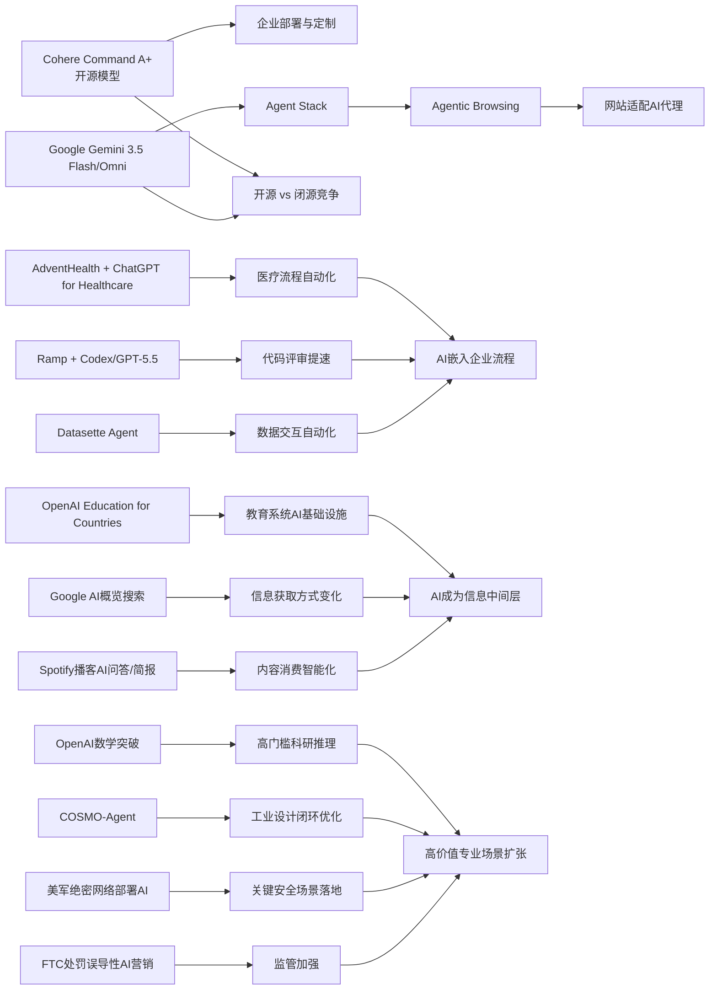

> AI 早报 · 每日早读 · 全网深度聚合

## **今日摘要**

Cohere开源最强模型Command A+、Google推出Gemini 3.5 Flash与Omni、PaddleOCR 3.5接入Transformer后端，说明AI产品正同时在大模型、多模态和文档处理上快速升级，并加速走向开发者和企业应用。  
在落地层面，AdventHealth用ChatGPT减轻医疗文书负担、Ramp用Codex加速代码评审、Datasette Agent探索自然语言操作数据，反映AI正从“生成内容”进一步进入医疗、研发和数据工作流。  
从行业趋势看，Google开始测试网站对AI代理的兼容性，OpenAI推进国家级教育计划，意味着AI的影响已从单点工具扩展到基础设施、教育体系和更广泛的社会协作方式。

### 🔵 产品与功能更新

1. **Cohere开源最强模型Command A+。**  
Cohere发布了目前最强的语言模型（可理解和生成文本的AI）Command A+，并采用Apache 2.0开源许可。对企业和开发者来说，这意味着可以更灵活地部署、定制和商用。开源也有助于它更快进入实际产品场景，与闭源大模型形成直接竞争。  
[查看开源模型详情(briefing)](https://the-decoder.com/cohere-open-sources-its-strongest-model-yet/)

2. **AdventHealth用ChatGPT减轻医疗文书负担。**  
AdventHealth正在把ChatGPT for Healthcare用于医疗工作流程，以减少行政事务带来的时间消耗。核心目标不是替代医生，而是把更多时间还给患者护理。对普通用户来说，这类应用最直接的变化会体现在更快的流程、更少的重复录入和更顺畅的就医体验。  
[了解医疗落地案例(briefing)](https://openai.com/index/adventhealth)

3. **Datasette Agent发布，面向数据交互场景。**  
Datasette Agent是一个围绕Datasette（轻量级数据发布工具）构建的AI代理（可自动执行任务的软件助手）项目。虽然原文信息有限，但它显示出AI正在更深入地进入数据查询、整理和分析流程。对非技术用户而言，这类工具的潜力在于用自然语言直接操作数据，而不是手写复杂查询。  
[查看项目原始介绍(briefing)](https://simonwillison.net/2026/May/21/datasette-agent/#atom-everything)

### 🟢 前沿研究

1. **Google发布Gemini 3.5 Flash与Omni。**  
Google在I/O 2026上把Gemini重新定位为面向消费者和开发者的平台，并推出Gemini 3.5 Flash和Gemini Omni。前者主打更快的智能体（可自主完成步骤的AI系统）与编程任务，后者强调多模态（同时处理文字、图片、视频等）生成和编辑。Google还扩展了Agent Stack（代理工具栈），显示其正在全面押注“AI助手+开发平台”路线。  
[回看Google发布重点(briefing)](https://news.smol.ai/issues/26-05-19-not-much/)

2. **Ramp工程团队用Codex加速代码评审。**  
Ramp介绍了工程团队如何结合Codex与GPT-5.5进行代码评审，把原本数小时的反馈缩短到几分钟。这里的价值不只是“更快”，还在于能更早发现问题、加速迭代。对于企业软件团队来说，AI正在从写代码进一步走向审代码、提改进建议的协作角色。  
[了解代码评审实践(briefing)](https://openai.com/index/ramp)

3. **PaddleOCR 3.5接入Transformer后端。**  
PaddleOCR 3.5开始支持基于Transformer（擅长理解上下文的神经网络架构）的后端，用于文字识别和文档解析。相比传统OCR（光学字符识别），这类升级有望提升复杂版面、长文档和结构化内容的处理能力。对企业文档数字化、票据处理和档案整理等场景尤其重要。  
[查看OCR升级说明(briefing)](https://huggingface.co/blog/PaddlePaddle/paddleocr-transformers)

### 🟡 行业展望与社会影响

1. **Google测试网站是否适配AI代理访问。**  
Google正在Lighthouse（网站质量分析工具）中测试“Agentic Browsing”新类别，用来检查网站对AI代理访问是否友好。它还会关注llms.txt这类面向大模型的站点说明文件。这个变化意味着，未来网站不仅要对人类访客友好，也要开始考虑如何让AI助手顺利读取和使用内容。  
[了解网站新审计方向(briefing)](https://the-decoder.com/google-tests-websites-for-llms-txt-and-agent-compatibility/)

2. **OpenAI推进“面向国家的教育计划”。**  
OpenAI宣布推进Education for Countries项目，通过新合作、教师培训和工具支持，扩大AI在学校中的应用。重点不只是把工具送进课堂，更包括如何提升教学质量和学习成果。对各国教育系统来说，AI正从试点工具逐渐走向基础能力建设。  
[查看教育项目进展(briefing)](https://openai.com/index/the-next-phase-of-education-for-countries)

3. **搜索引擎格局因AI概览功能再起变化。**  
TechCrunch关注到，随着Google搜索越来越深度整合AI概览，用户也开始重新考虑替代搜索引擎。文章反映的不是单一产品推荐，而是搜索体验正在发生结构性改变。对普通用户来说，未来搜索可能不再只是“找链接”，而是“先看AI总结，再决定是否点开来源”。  
[阅读搜索趋势观察(briefing)](https://techcrunch.com/2026/05/21/six-search-engines-worth-trying-now-that-google-isnt-really-google-anymore/)

### 🟣 开源TOP项目

1. **OlmoEarth v1.1提升地球观测模型效率。**  
AllenAI发布OlmoEarth v1.1，这是一组更高效的地球观测模型。它面向卫星图像等遥感数据处理，目标是在效率和性能之间取得更好平衡。对环境监测、农业分析和灾害响应等领域来说，这类开源模型有很强的现实价值。  
[查看地球模型更新(briefing)](https://huggingface.co/blog/allenai/olmoearth-v1-1)

2. **OpenAI模型推翻80年离散几何猜想。**  
OpenAI表示，其模型解决了一个存在80年的单位距离问题，并推翻了离散几何中的一个重要猜想。更值得关注的是，这被视为AI参与数学研究的重要里程碑，而不只是做题工具。它展示了推理模型（强调多步思考的AI）在高门槛科研问题上的潜力。  
[了解数学突破原文(briefing)](https://openai.com/index/model-disproves-discrete-geometry-conjecture)

3. **COSMO-Agent探索工业设计闭环优化。**  
COSMO-Agent是一种工具增强型智能体（可调用外部软件和工具的AI系统），目标是打通工业设计、仿真和建模之间的流程。论文聚焦CAD-CAE之间的“语义鸿沟”，也就是设计修改与仿真反馈难以顺畅衔接的问题。若这类方法成熟，未来复杂工业设计可能更接近“AI参与反复试验与优化”的新模式。  
[查看论文摘要信息(briefing)](https://arxiv.org/abs/2605.20190)

### 🔴 社媒分享

1. **美军网络司令部加速在绝密网络部署AI。**  
美国网络司令部已成立专项团队，计划在五角大楼和美国国家安全局的绝密网络中运行OpenAI、Google等公司的模型。推动这一进程的背景是，先进AI在发现安全漏洞方面可能已接近顶尖人工黑客。这个信号说明，AI在网络安全领域正快速从辅助工具升级为核心能力。  
[了解绝密网络部署(briefing)](https://the-decoder.com/us-cyber-command-races-to-deploy-ai-on-top-secret-networks/)

2. **Spotify为播客加入AI问答与简报生成。**  
Spotify正在为播客引入AI驱动的问答和简报生成功能，用户可根据提示词生成每日或每周内容摘要。对听众来说，这意味着播客消费会更“可定制”，从被动收听转向按兴趣获取重点。音频平台也因此更像个能理解内容的智能信息入口。  
[查看播客AI新功能(briefing)](https://techcrunch.com/2026/05/21/spotify-adds-ai-powered-qa-and-briefing-generation-features-to-podcasts/)

3. **FTC处罚“主动监听”AI营销误导宣传。**  
美国联邦贸易委员会（FTC）要求Cox Media Group等三家公司支付近100万美元，以和解其在“主动监听”AI营销服务上的误导指控。事件焦点在于企业是否夸大了AI监听和投放能力，并误导客户。对行业来说，这提醒市场在宣传AI能力时将面临更严格监管。  
[查看监管处罚事件(briefing)](https://simonwillison.net/2026/May/22/ftc-active-listening/#atom-everything)

---

📊 行业洞察

1. 事实  
   - Cohere开源最强模型Command A+，采用Apache 2.0许可。  
   - Google发布Gemini 3.5 Flash与Gemini Omni，并扩展Agent Stack（代理工具栈）。  
   - Google还在Lighthouse中测试“Agentic Browsing”，推动网站适配AI代理访问。  
   【洞察】大模型竞争正从“模型参数与能力比拼”升级为“开源模型+代理平台+入口标准”的体系化竞争。Cohere用开源降低企业采用门槛，Google则同时控制模型层、开发层与访问层，说明行业护城河正在从单点模型性能转向平台生态与代理兼容标准。

2. 事实  
   - AdventHealth将ChatGPT for Healthcare用于医疗工作流，减少文书负担。  
   - Ramp用Codex与GPT-5.5将代码评审从数小时压缩到几分钟。  
   - Datasette Agent面向数据查询、整理和分析流程。  
   【洞察】AI商业化正在从“生成内容”走向“嵌入流程”。医疗、软件工程、数据分析三个案例共同表明，企业采购重点已不再只是聊天能力，而是流程自动化、反馈提速和人机协作效率。这意味着B端（企业端）AI价值评估将越来越聚焦ROI（投资回报率）、流程重构深度与可审计性。

3. 事实  
   - OpenAI推进“Education for Countries”项目，强调教师培训与系统化落地。  
   - Google搜索深度整合AI概览，改变用户获取信息的方式。  
   - Spotify为播客加入AI问答与简报生成。  
   【洞察】AI正在成为新的信息分发中间层。无论是教育、搜索还是音频内容，用户都越来越先接触“AI整理后的信息”而非原始内容本身。这将重塑流量分配、内容消费路径与品牌触达方式，未来机构争夺的核心不只是内容生产能力，还有被AI正确理解、摘要和引用的能力。

4. 事实  
   - OpenAI模型推翻80年离散几何猜想。  
   - COSMO-Agent探索工业设计、仿真与建模闭环优化。  
   - 美国网络司令部加速在绝密网络部署AI，用于安全漏洞发现等任务。  
   - FTC处罚“主动监听”AI营销误导宣传。  
   【洞察】AI能力边界一边快速上探高价值专业领域，一边面临更强治理约束。科研推理、工业设计、网络安全显示AI正进入高门槛决策场景，但FTC处罚也说明，越是接近关键基础设施与专业判断，行业越需要验证机制、合规框架与真实能力披露，避免“能力跃迁”与“市场宣传”脱节。

🗺️ 今日关系图

