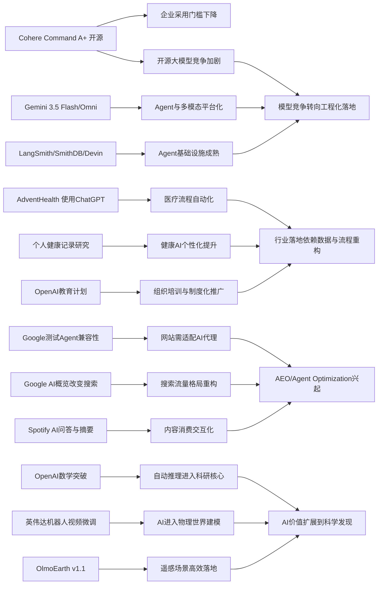

> AI 早报 · 每日早读 · 全网深度聚合

## **今日摘要**

本周AI进展的核心是：高性能开源模型和行业级应用正在加速落地，例如Cohere开源Command A+、AdventHealth将ChatGPT用于医疗流程，以及Agent基础设施逐步完善，说明AI正从“能用”走向“可规模化部署”。  
同时，前沿能力继续升级，Google发布更强调Agent与多模态能力的Gemini 3.5 Flash和Omni，PaddleOCR与英伟达的更新则显示文档理解、机器人视觉等关键技术正在变得更实用、更低成本。  
从行业趋势看，网站开始为AI代理适配、教育等国家级计划也在推进，表明AI的影响正从模型和工具层，进一步扩展到互联网规则、公共服务与社会基础设施层面。

### 🔵 产品与功能更新

1. **Cohere开源最强模型Command A+。**  
Cohere发布了目前最强的语言模型（能理解和生成文本的AI）Command A+，并采用Apache 2.0许可证开源，方便企业和开发者直接使用与改造。对市场来说，这意味着又一款高性能大模型进入“可商用、可二次开发”的开源阵营。对于非技术团队，开源通常也意味着更低的试用门槛和更灵活的部署方式。🚀  
[查看开源模型发布](https://the-decoder.com/cohere-open-sources-its-strongest-model-yet/)

2. **AdventHealth将ChatGPT用于医疗流程。**  
AdventHealth正在使用面向医疗场景的ChatGPT，重点是简化工作流、减少行政负担，并把更多时间还给医生和患者。这个案例说明，生成式AI（可自动生成文本内容的AI）正在从“写内容”走向更具体的行业流程优化。对普通用户而言，最直接的变化可能是更快的响应、更少的文书等待和更顺畅的就诊体验。🚀  
[查看医疗应用案例](https://openai.com/index/adventhealth)

3. **LangSmith与Devin补齐Agent基础设施。**  
一则行业简报显示，围绕Agent（可自主执行多步任务的AI助手）的基础设施正在快速完善。LangSmith Engine主打CI/CD（持续集成与持续交付）闭环和可观测性（方便追踪系统运行情况），SmithDB则强调低延迟查询；同时，Cognition的Devin Auto-Triage尝试把缺陷分流自动化做成持续运行的能力。这些更新虽然偏底层，但本质上是在让AI代理从“能演示”走向“能长期稳定使用”。🚀  
[查看Agent更新汇总](https://news.smol.ai/issues/26-05-18-not-much/)

### 🟢 前沿研究

1. **Google发布Gemini 3.5 Flash与Omni。**  
Google在I/O 2026上把Gemini进一步定位为面向消费者和开发者的平台，并推出Gemini 3.5 Flash与Gemini Omni。前者强调更快的Agent任务和编程支持，后者聚焦多模态（同时处理文字、图片、视频等多种信息）生成与编辑，包括视频能力。对外界而言，这反映出大厂正把模型能力与“Agent工具链”一起打包推进。🚀  
[查看Google发布汇总](https://news.smol.ai/issues/26-05-19-not-much/)

2. **PaddleOCR 3.5接入Transformers后端。**  
PaddleOCR 3.5开始支持基于Transformers（当前主流神经网络架构）的后端，用于OCR（光学字符识别）和文档解析任务。简单说，它让“看懂扫描件、表格、文档”的能力更容易融入现代AI工作流。对企业用户来说，这类能力是自动化处理合同、票据和档案的重要基础。🚀  
[查看文档解析更新](https://huggingface.co/blog/PaddlePaddle/paddleocr-transformers)

3. **英伟达探索机器人视频生成微调。**  
英伟达介绍了如何用LoRA/DoRA（参数高效微调方法，能以更低成本调整模型）微调Cosmos Predict 2.5，用于机器人视频生成。虽然听起来偏研究，但它关系到机器人如何通过视频学习动作、环境和任务。长远看，这类方法可能降低训练机器人视觉模型的成本和时间。🚀  
[查看机器人视频方案](https://huggingface.co/blog/nvidia/cosmos-fine-tuning-for-robot-video-generation)

### 🟡 行业展望与社会影响

1. **Google开始测试网站的Agent兼容性。**  
Google正在其Lighthouse分析工具中测试“Agentic Browsing”新分类，用来检查网站对AI代理访问的适配情况，包括是否支持llms.txt这类说明文件。这个变化意味着，未来网站不仅要对人类访客友好，也要对AI代理友好。对内容网站和电商平台来说，这可能成为新的流量与可见性竞争点。🚀  
[查看网站适配测试](https://the-decoder.com/google-tests-websites-for-llms-txt-and-agent-compatibility/)

2. **OpenAI推进面向国家的教育计划。**  
OpenAI宣布扩展“Education for Countries”项目，通过新合作、教师培训和工具部署，推动AI进入学校教育体系。其核心目标是提升教学效率和学习效果，同时帮助不同国家建立本地化应用能力。对社会层面来说，AI教育普及正在从单点试验转向更大范围的制度化推进。🚀  
[查看教育计划进展](https://openai.com/index/the-next-phase-of-education-for-countries)

3. **搜索引擎格局因AI概览持续变化。**  
TechCrunch盘点了在Google搜索持续加入AI概览功能后，值得尝试的其他搜索引擎。背后反映的是用户对“搜索结果被AI重写”这件事出现分化：有人觉得更方便，也有人担心信息来源被稀释。搜索体验正在从“列出链接”转向“先给答案”，这会持续影响用户习惯与流量分配。🚀  
[查看搜索替代趋势](https://techcrunch.com/2026/05/21/six-search-engines-worth-trying-now-that-google-isnt-really-google-anymore/)

### 🟣 开源TOP项目

1. **OpenAI模型推翻离散几何重要猜想。**  
OpenAI表示，其模型成功解决了一个持续80年的单位距离问题，并推翻了离散几何中的一个重要猜想。即便对非数学读者，这件事的意义也很清楚：AI不再只是“整理知识”，而是在某些高难度推理中开始产出新结论。它也可能成为AI参与数学研究的重要里程碑。🚀  
[查看数学突破原文](https://openai.com/index/model-disproves-discrete-geometry-conjecture)

2. **AI数学证明获顶级期刊级关注。**  
The Decoder进一步报道，这一AI证明成果被视为值得数学顶级期刊认真对待的里程碑，专家也开始讨论其方法和影响。报道提到，模型使用了数学家原本并不预期会在该问题中出现的工具。更广泛地看，这显示AI自动推理（让模型完成较长链条的逻辑思考）正在触碰科研核心地带。🚀  
[查看外界专家解读](https://the-decoder.com/openai-shifts-the-boundary-of-automated-reasoning-with-a-milestone-in-ai-mathematics-that-experts-are-now-unpacking/)

3. **OlmoEarth v1.1提升地球观测效率。**  
AllenAI发布OlmoEarth v1.1，这是一组更高效的地球观测模型，可用于遥感（通过卫星或航空设备获取地表信息）相关任务。此类模型有望帮助更快处理环境监测、土地变化和灾害分析等数据。开源发布也意味着研究机构和行业团队更容易在现实场景中落地使用。🚀  
[查看遥感模型更新](https://huggingface.co/blog/allenai/olmoearth-v1-1)

### 🔴 社媒分享

1. **美网络司令部加速在绝密网络部署AI。**  
报道称，美国网络司令部已成立专项小组，推动OpenAI、Google等公司的模型进入最高保密级别网络。其背景是，先进AI系统在发现安全漏洞方面可能越来越接近甚至超越顶尖人工专家。对公众而言，这说明AI在国家安全领域的采用速度正在明显加快。🚀  
[查看绝密网络部署](https://the-decoder.com/us-cyber-command-races-to-deploy-ai-on-top-secret-networks/)

2. **Spotify为播客加入AI问答与摘要。**  
Spotify正在给播客加入AI驱动的问答和briefing（简报）生成功能，用户可基于自己的提示词获得每日或每周内容摘要。对听众来说，这会降低长内容的获取门槛，也让播客从“被动收听”变得更可交互。平台层面，这也是AI提升内容消费效率的典型方向。🚀  
[查看播客AI功能](https://techcrunch.com/2026/05/21/spotify-adds-ai-powered-qa-and-briefing-generation-features-to-podcasts/)

3. **个人健康记录或提升健康AI个性化。**  
一篇新研究评估了个人健康记录（由患者自行管理的健康资料）在个性化健康AI中的作用。结果表明，当模型获得更完整的临床背景后，回答用户健康问题的潜力会提升。虽然这仍是研究阶段，但它凸显了医疗AI“数据是否完整、是否属于本人”对效果的重要影响。🚀  
[查看健康AI研究](https://arxiv.org/abs/2605.18937)

---

📊 行业洞察

1. 事实  
   Cohere开源最强模型Command A+，采用Apache 2.0许可证；Google发布Gemini 3.5 Flash与Gemini Omni，分别强化Agent任务、编程支持与多模态生成；LangSmith Engine、SmithDB和Devin Auto-Triage持续补齐Agent基础设施。  
   【洞察】大模型竞争正从“参数/能力竞赛”转向“模型开放性 + Agent工程化 + 平台化交付”的三位一体竞争。开源许可（Apache 2.0）降低企业采用门槛，Google则用模型家族绑定开发生态，而LangSmith/Devin类工具说明行业瓶颈已从“模型能不能做”转向“Agent能否稳定上线、持续迭代、可观测运维（observability，系统运行追踪能力）”。

2. 事实  
   AdventHealth将ChatGPT用于医疗流程以减少行政负担；个人健康记录研究显示，更完整的临床背景有助于提升健康AI个性化效果；OpenAI还在推进面向国家的教育计划，强调培训、部署和本地化能力建设。  
   【洞察】AI落地正在进入“行业深水区”，成败关键从通用问答能力转向“数据可用性 + 流程重构 + 组织培训”三要素。医疗案例表明，真正产生ROI（投资回报）的不是单次生成，而是嵌入工作流；教育项目进一步说明，未来行业扩散不只靠模型发布，而要靠制度化培训和本地部署能力共同推动。

3. 事实  
   Google开始测试网站的Agent兼容性，包括llms.txt与Agentic Browsing分类；Google搜索持续加入AI概览，引发用户对搜索结果被AI重写的分化；Spotify则为播客加入AI问答与摘要功能。  
   【洞察】互联网流量入口正在从“人类点击网页”转向“AI先理解、再分发内容”。这意味着SEO（搜索引擎优化）正演变为AEO/Agent Optimization（面向答案引擎与AI代理的优化）：内容平台未来既要争夺用户注意力，也要争夺被AI抓取、摘要、引用和推荐的资格，流量分配机制将进一步平台化。

4. 事实  
   OpenAI模型推翻离散几何重要猜想，并获得顶级数学界认真关注；英伟达展示基于LoRA/DoRA的机器人视频生成微调方案；OlmoEarth v1.1提升遥感任务效率。  
   【洞察】AI前沿价值正在从“内容生成”扩展到“知识发现 + 科学推理 + 专业世界建模”。数学证明显示自动推理（automated reasoning，让模型执行长链逻辑推导）已触碰科研核心；机器人视频微调和遥感模型则说明，AI正加速进入物理世界与科学计算场景。下一阶段，高价值壁垒将更多来自垂直数据、专业验证体系和领域工作流，而不只是通用聊天体验。

🗺️ 今日关系图

