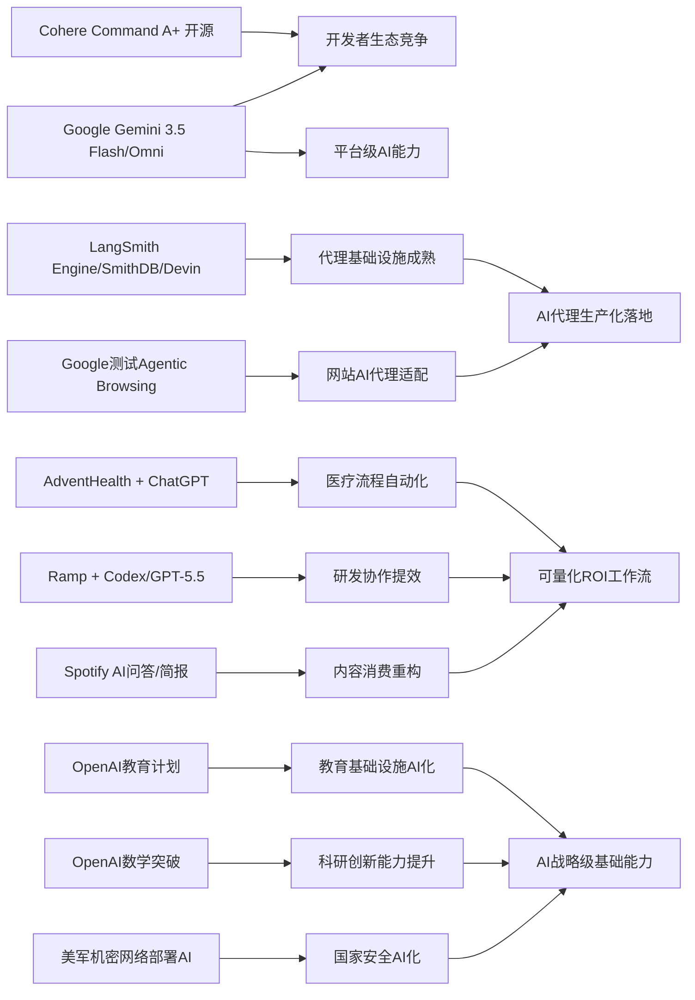

> AI 早报 · 每日早读 · 全网深度聚合

## **今日摘要**

近期AI领域的重点趋势是：一方面，Cohere开源最强模型Command A+、Google推出Gemini 3.5 Flash与Omni，说明大模型竞争正从单一产品走向开放生态与平台化能力建设。  
另一方面，AdventHealth用ChatGPT优化医疗流程、Ramp用Codex加速代码审查，以及代理基础设施和PaddleOCR能力升级，表明AI正快速进入医疗、研发和文档处理等真实生产场景。  
同时，Google测试网站的AI代理兼容性、OpenAI推进各国教育计划，也预示着社会基础设施将逐步从“对人友好”扩展到“对AI友好”，AI正在成为更广泛的行业与公共能力。

### 🔵 产品与功能更新

1. **Cohere开源最强模型Command A+。**  
Cohere发布了迄今最强的语言模型Command A+，并采用Apache 2.0许可证开放源代码，意味着企业和开发者可以更自由地使用与二次开发。对非技术用户来说，这类“开源大模型”通常会带来更低成本、更快落地的AI应用。它也反映出头部厂商正在通过开放策略争夺开发者生态🚀  
[开源模型发布解读(briefing)](https://the-decoder.com/cohere-open-sources-its-strongest-model-yet/)

2. **AdventHealth用ChatGPT优化医疗流程。**  
AdventHealth正在使用面向医疗场景的ChatGPT，来简化工作流程并减少行政负担。简单说，就是把医生和医护人员从繁杂文书工作中解放出来，腾出更多时间面对患者。这类应用说明，生成式AI（可自动生成文字内容的人工智能）正在从“助手”走向实际业务流程🚀  
[医疗场景应用案例(briefing)](https://openai.com/index/adventhealth)

3. **LangSmith Engine等代理基础设施加速落地。**  
今日候选信息显示，围绕AI代理（能自主执行任务的AI程序）的基础设施正在快速完善。LangSmith Engine主打代理的CI/CD（持续集成与持续交付）闭环，SmithDB则强调低延迟观测与查询，Cognition的Devin Auto-Triage则面向缺陷分流自动化。对普通读者而言，这意味着“会自己干活的AI”正从演示阶段走向更稳定、可管理的生产环境🚀  
[代理基础设施速览(briefing)](https://news.smol.ai/issues/26-05-18-not-much/)

### 🟢 前沿研究

1. **Google发布Gemini 3.5 Flash与Omni。**  
Google在I/O 2026上进一步把Gemini定位为面向消费者和开发者的平台，并推出Gemini 3.5 Flash与Gemini Omni。前者更适合快速代理任务和编程，后者强调多模态（可同时处理文字、图片、视频等多种信息）生成与编辑。对外界来说，这显示Google正把AI能力从聊天工具扩展为完整的平台级产品🚀  
[谷歌AI发布总览(briefing)](https://news.smol.ai/issues/26-05-19-not-much/)

2. **Ramp工程团队用Codex加速代码审查。**  
Ramp工程师借助Codex和GPT-5.5进行代码审查，把原本数小时的反馈缩短到几分钟。代码审查是软件开发中的关键环节，AI在这里扮演“先行评审员”的角色，帮助开发者更快发现问题和改进点。这说明AI编程助手正在从“写代码”进一步走向“参与团队协作”🚀  
[代码审查实践案例(briefing)](https://openai.com/index/ramp)

3. **PaddleOCR 3.5接入Transformers后端。**  
PaddleOCR 3.5支持在Transformers后端上运行OCR（光学字符识别）和文档解析任务。简单理解，就是让识别图片文字、理解表格和文档内容的能力更容易与主流AI模型体系结合。对企业办公、票据处理和知识管理等场景来说，这会提升文档智能化处理的灵活性🚀  
[文档识别能力更新(briefing)](https://huggingface.co/blog/PaddlePaddle/paddleocr-transformers)

### 🟡 行业展望与社会影响

1. **Google测试网站的AI代理兼容性。**  
Google正在Lighthouse分析工具中测试“Agentic Browsing”新类别，用来检查网站是否适配AI代理访问，包括是否提供llms.txt。对普通网站运营者来说，这可能像当年的SEO（搜索引擎优化）一样，逐步演变成新的基础能力建设。未来网站不仅要“对人友好”，也要“对AI友好”🚀  
[网站适配新趋势(briefing)](https://the-decoder.com/google-tests-websites-for-llms-txt-and-agent-compatibility/)

2. **OpenAI推进面向各国的教育计划。**  
OpenAI宣布推进“Education for Countries”下一阶段，重点包括学校中的AI采用、教师培训和教学工具合作。核心意义在于，AI不再只是科技公司的产品，而开始被视为教育基础设施的一部分。对社会层面而言，这会影响未来学生如何学习、教师如何备课，以及教育资源如何分配🚀  
[教育合作计划更新(briefing)](https://openai.com/index/the-next-phase-of-education-for-countries)

3. **搜索引擎进入“后Google式”选择期。**  
随着Google搜索页面越来越多引入AI概览，TechCrunch开始推荐值得尝试的其他搜索引擎。这个变化说明，搜索体验正在从“给你链接”转向“先给你答案”，但并非所有用户都欢迎这种转变。行业层面看，AI正在重塑信息分发入口，也为新搜索产品创造机会🚀  
[搜索格局变化观察(briefing)](https://techcrunch.com/2026/05/21/six-search-engines-worth-trying-now-that-google-isnt-really-google-anymore/)

### 🟣 开源TOP项目

1. **OlmoEarth v1.1发布更高效地球观测模型。**  
AllenAI发布OlmoEarth v1.1，这是一组更高效的地球观测模型。它主要面向遥感（通过卫星等远距离获取地表信息）等场景，可用于环境监测、农业分析和灾害评估。开源版本的持续更新，意味着相关研究和产业应用将更容易扩展🚀  
[地球观测模型更新(briefing)](https://huggingface.co/blog/allenai/olmoearth-v1-1)

2. **OpenAI模型攻破离散几何重要猜想。**  
OpenAI宣布其模型解决了一个有80年历史的单位距离问题，并推翻了离散几何中的一个重要猜想。对非专业读者来说，这代表AI不仅能写作和编程，还开始在高难度数学研究中给出原创性突破。这一进展被视为AI数学推理能力的里程碑事件🚀  
[数学突破官方说明(briefing)](https://openai.com/index/model-disproves-discrete-geometry-conjecture)

3. **COSMO-Agent探索工业设计闭环优化。**  
COSMO-Agent是一项面向工业设计、仿真和建模协同的研究工作，试图用工具增强型代理（可调用外部工具的AI系统）完成闭环优化。它关注的是如何把仿真反馈转化为有效的几何修改，从而减少人工反复调整。虽然偏研究，但这类方向对制造业智能设计有潜在价值🚀  
[工业代理论文速读(briefing)](https://arxiv.org/abs/2605.20190)

### 🔴 社媒分享

1. **美军网络司令部加速在机密网络部署AI。**  
美国网络司令部已成立专项任务组，计划在五角大楼和美国国家安全局的最高机密网络中运行OpenAI、Google等公司的模型。触发点在于，先进AI已经能比顶尖人工更快发现安全漏洞。这个消息在社交媒体语境下很容易引发讨论，因为它直接关联国家安全、攻防升级与AI军备竞赛🚀  
[机密网络部署动态(briefing)](https://the-decoder.com/us-cyber-command-races-to-deploy-ai-on-top-secret-networks/)

2. **Spotify为播客加入AI问答与简报。**  
Spotify将为播客引入AI驱动的问答和简报生成功能，用户可以根据提示词生成每日或每周摘要。对普通听众来说，这会让海量播客内容更容易被快速消费，也更有利于发现重点。它体现出音频平台正在把AI变成内容整理与分发层的一部分🚀  
[播客AI功能快览(briefing)](https://techcrunch.com/2026/05/21/spotify-adds-ai-powered-qa-and-briefing-generation-features-to-podcasts/)

3. **Ettin Reranker家族提升检索排序能力。**  
Ettin Reranker Family是一组新的重排序模型，用于在检索结果中重新判断“哪些内容更相关”。所谓重排序，就是先找出一批候选答案，再由更强的模型做第二轮精排。虽然技术味较浓，但它直接影响搜索、问答和知识库产品给出的答案质量🚀  
[检索排序模型介绍(briefing)](https://huggingface.co/blog/ettin-reranker)

---

📊 行业洞察

1. 事实  
   Cohere开源最强模型Command A+，采用Apache 2.0许可证；同时，Google发布Gemini 3.5 Flash与Gemini Omni，继续强化平台级AI能力。  
   【洞察】大模型竞争正在从“单点性能比拼”转向“开放生态 vs. 平台生态”的双轨博弈。Cohere用开源与宽松许可证争夺开发者入口，Google则依靠多模态平台能力和产品分发优势构建闭环。未来企业选型将更看重生态适配性、二次开发自由度和部署路径，而不只是模型榜单排名。

2. 事实  
   LangSmith Engine、SmithDB、Devin Auto-Triage等代理基础设施加速落地；Google开始测试网站的Agentic Browsing兼容性，并引入llms.txt相关检查。  
   【洞察】AI代理（Agent，能自主执行任务的AI系统）正在从“模型能力问题”转向“基础设施 + 外部环境适配问题”。一端是CI/CD（持续集成与持续交付）、观测（Observability，运行状态监控）和缺陷分流工具成熟，另一端是网站开始为代理访问做协议与结构适配，这意味着2026年可能成为“Agent Ready（代理就绪）”标准化元年，类似早期移动互联网的“Mobile Friendly（移动友好）”。

3. 事实  
   AdventHealth将ChatGPT用于医疗流程优化；Ramp用Codex和GPT-5.5把代码审查从数小时压缩到几分钟；Spotify为播客加入AI问答与简报。  
   【洞察】生成式AI正在批量进入“高频、可量化ROI（投资回报率）”的工作流环节，重点不再是炫技式内容生成，而是压缩流程时间、降低人工负担、提升信息提炼效率。医疗行政、软件审查、内容消费三类场景共同表明：AI商业化已从“助手试用期”进入“流程重构期”，采购决策将越来越依赖明确的效率指标而非概念验证。

4. 事实  
   OpenAI推进“Education for Countries”教育计划；OpenAI模型攻破离散几何重要猜想；美军网络司令部加速在机密网络部署AI。  
   【洞察】AI正同时被纳入教育基础设施、科研创新体系与国家安全体系，标志其角色从“通用软件工具”升级为“战略级基础能力”。这意味着未来AI竞争不只是企业产品竞争，更会演化为人才培养、科研产出和安全能力的系统性竞争，政策、算力和数据治理的重要性将持续上升。

🗺️ 今日关系图

