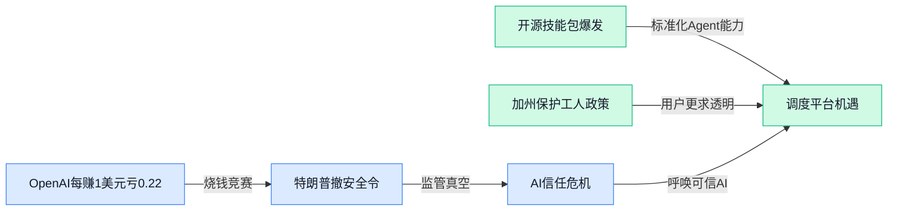

> AI 早报 · 每日早读 · 全网深度聚合

## **今日摘要**

```
```

### 🔵 产品与功能更新

1. **OpenAI 推出 ChatGPT 的 PowerPoint（微软幻灯片）插件，警告可能误删内容。**
OpenAI 正式发布了一个让 ChatGPT 直接操作 **PowerPoint 幻灯片**的插件 🚀，用户可以在聊天界面里让 AI 帮忙创建、编辑或排版演示文稿。不过官方也提醒说，这个插件偶尔会误删已有内容，建议使用时做好备份 💡。这是 ChatGPT 插件生态的又一扩展，意味着办公场景下的自动化协作又近了一步。详见 **[ChatGPT 插件官方报道(briefing)](https://the-decoder.com/openai-launches-a-chatgpt-powerpoint-plugin-and-warns-it-might-accidentally-delete-your-content/)**。


2. **维珍航空用 Codex（OpenAI 编程模型）加速移动应用交付，零重大缺陷上线。**
维珍航空分享了如何使用 **Codex**（OpenAI 推出的 AI 编程助手，能根据自然语言指令生成代码）重构移动应用的故事 ✈️。为了赶上圣诞旅游季的硬性截止日期，团队用 Codex 大幅提升了开发效率，最终实现了接近 **100% 的单元测试覆盖率**（每个代码模块都写了自动化测试，出 bug 概率大大降低），并且上线时 **零 P1 级缺陷**（最高优先级的严重 bug 一个都没有）。这个案例说明，AI 编码工具已经能在真实的大型项目里扛大梁了。详见 **[维珍航空官方案例(briefing)](https://openai.com/index/virgin-atlantic)**。

3. **低光行人检测新方法：Synthetic RAW Augmentations（合成未处理图像增强）让离散数据连续化。**
一篇新 arXiv 论文提出了 **Synthetic RAW Augmentations**（在模型训练中自动生成“伪 RAW 图像”的数据增广方法），专门解决低光环境下 **行人检测** 准确率差的问题 🌙。AI 视觉模型在光线不足时表现会断崖式下跌，因为真实低光数据集很难采集。这个方法通过模拟相机传感器对光信号的转换过程，生成更真实、更连续的训练数据，从而提升模型的泛化能力。对于监控安防、自动驾驶等场景的产品团队来说，这是个降低数据获取成本的有益思路。详见 **[arxiv 论文(briefing)](https://arxiv.org/abs/2605.22455)**。

### 🟢 前沿研究

1. **OpenAI 的 AI 证明首次达到顶级数学期刊水准，数学研究迎来新纪元。**
一条 AI 系统成功证明了**埃尔德什问题第90号**（一个长期未解决的组合数学难题），其证明质量被专家认为符合《数学年鉴》发表标准 🏆。这不仅是 AI 数学能力的里程碑，更意味着 **AI 从"辅助工具"向"独立发现者"转变**，未来可能真正成为数学家的研究伙伴。完整报道见 [OpenAI 数学证明里程碑(briefing)](https://the-decoder.com/openai-shifts-the-boundary-of-autom

### 🟡 行业展望与社会影响

1. **AI 被用来"复活"遇难飞行员的声音，NTSB 紧急封锁档案。**
有人利用AI从驾驶舱录音的**频谱图（spectrogram，将声音转换成图像显示频率和强度的技术）** 中重建了已故飞行员的声音，并公开发布。这一做法迫使美国国家运输安全委员会（NTSB）暂时关闭了其公共档案系统，以防止更多类似操作。事件引发了关于AI滥用逝者数据、以及技术突破与伦理边界之间冲突的激烈讨论。🚀 **[完整报道(briefing)](https://techcrunch.com/2026/05/22/ai-is-being-used-to-resurrect-the-voices-of-dead-pilots/)**


2. **特朗普在马斯克、扎克伯格等人最后一刻游说后，撤销了AI安全行政令。**
据报道，美国前总统特朗普在接到马斯克、扎克伯格等科技领袖的紧急电话后，撤销了一项旨在加强AI安全监管的行政命令。此举被认为削弱了政府对AI风险的审查力度，尤其是针对大型模型的安全评估要求。安全倡导者和部分立法者对此表示担忧，认为这将增加AI技术被滥用的风险。💡 **[完整报道(briefing)](https://the-decoder.com/trump-pulls-ai-safety-order-after-last-minute-calls-from-musk-zuckerberg-and-sacks/)**

3. **DeepSeek 据报优先押注通用人工智能（AGI）研究，而非快速盈利。**
尽管已获得数十亿美元融资，中国AI公司**DeepSeek**仍宣称将优先资源投入**AGI（通用人工智能，能像人类一样理解、学习和解决各种问题的AI）** 研究，而非急于推出商业化产品。这一长期主义策略在投资者中引发不同声音：有人看好其技术野心，也有人担心在烧钱竞赛中缺乏盈利支撑。🚀 **[完整报道(briefing)](https://the-decoder.com/deepseek-reportedly-prioritizes-agi-research-over-quick-profits-despite-billions-in-funding/)**


4. **OpenAI 每赚1美元就烧掉1.22美元，即使不算股权激励。**
根据财务分析，OpenAI 当前的运营成本依然高出收入，即便扣除了以股票形式支付的员工薪酬（股权激励），每获得1美元收入仍需支出1.22美元。这意味着顶级AI公司的盈利压力巨大，烧钱竞赛远未结束。该数据也引发业界对AI行业商业化可持续性的新一轮讨论。💡 **[完整报道(briefing)](https://the-decoder.com/openai-burned-through-1-22-per-dollar-earned-even-after-stripping-out-stock-based-compensation/)**

5. **加州州长签署全美首个行政令，保护工人免受AI失业冲击。**
加利福尼亚州州长签署了一项行政命令，要求州政府机构制定计划，帮助因AI自动化而可能失业的工人获得再培训和就业过渡支持。这是美国州级政府首次针对AI对劳动力市场的影响采取系统性措施，标志着政策制定者开始认真应对AI取代岗位的现实，并试图通过主动干预减少社会冲击。🚀 **[完整报道(briefing)](https://the-decoder.com/california-governor-signs-first-us-executive-order-to-protect-workers-from-ai-job-loss/)**

6. **Cloudflare CEO：创造者和销售者安全，但AI将瞄准"测量者"。**
**Cloudflare（全球最大的CDN和网络安全服务商）** CEO Matthew Prince 认为，未来AI最可能取代的不是“建造者”或“销售者”，而是以“测量”为核心的工作——例如数据分析、审计、绩效评估、质量检测等。他解释，这些工作容易被自动化是因为它们基于可量化的规则和指标。这一观点为职场人士提供了转型参考：与其害怕AI，不如让自己变成“创造者”或“连接者”。💡 **[完整报道(briefing)](https://the-decoder.com/cloudflare-ceo-prince-says-builders-and-sellers-are-safe-but-ai-is-coming-for-the-measurers/)**

### 🟣 开源TOP项目

1. **mattpocock/skills（一个面向 AI 编程助手的工程师技能集）火了。**
这个仓库来自知名 TypeScript 教育家 **mattpocock**，他从自己的 **.claude** 文件夹里公开了一套实打实的工程师技能（Skills），能让 Claude Code 等 AI **编码代理**（可以帮你写代码的 AI）干活更像老司机 🚗 效率直接拉满。项目主打“拿来就用”，适合想给自己的 AI 助手加点“真本事”的开发者。**[项目仓库(briefing)](https://github.com/mattpocock/skills)**


2. **AIDC-AI/Pixelle-Video（一个全自动短视频生成引擎）开源登场。**
Pixelle-Video 号称“AI 全自动短视频引擎”，由 **AIDC-AI**（一个 AI 研究团队）打造。它想帮你一站式搞定从文案、画面到配音的整个短视频制作流程 🎬 你只需要给个主题，它就能自动嘣出一条成品视频。如果有运营同事想省掉剪辑团队，这个项目或许能派上用场。**[项目主页(briefing)](https://github.com/AIDC-AI/Pixelle-Video)**


3. **rtk（一个能把大模型调用费用砍掉 60%–90% 的命令行代理工具）火了。**
**rtk** 是一个用 Rust（一种超快、安全的编程语言）写的命令行代理工具（**CLI proxy**，在终端里帮你和 AI 模型“传话”的中间层）。它对常见的开发命令能省掉大量 **token**（大模型每次回答消耗的计费“字数”），单文件无依赖，轻得像羽毛 🪶 对于高频调用大模型的公司团队来说，这可是实打实的省钱利器。**[GitHub 仓库(briefing)](https://github.com/rtk-ai/rtk)**

4. **Anthropic 发布了官方 Claude Code 插件目录，质量有保障。**
Anthropic 搞了一个官方渠道 **claude-plugins-official**，里面收录了经过他们自己审核的高质量 **Claude Code** 插件。这相当于给 Claude 开发者一个“官方认证商店” 🛒 避免了社区混子插件，开发团队可以放心下载安装——比如自动重构代码、对接项目管理工具等，都能即装即用。**[官方插件目录(briefing)](https://github.com/anthropics/claude-plugins-official)**

5. **addyosmani/agent-skills 开源：给 AI 编程代理的“职业级”技能包。**
这个项目来自谷歌 Chrome 团队的核心工程师 **addyosmani**，它把生产环境（**production-grade**，实际交付给用户用的系统）里需要的工程技能打包成一套指令，喂给 AI **编码代理**（比如 Cursor、Claude Code）。相当于给 AI 上了一堂“大厂实战课” 📘 有了这些技能，AI 写出来的代码会更规范、更靠谱。**[项目链接(briefing)](https://github.com/addyosmani/agent-skills)**

6. **datawhalechina 开源《从零开始构建智能体》中文教程，零基础友好。**
**datawhalechina**（数据鲸，国内知名的 AI 学习社区）推出了这本书 **hello-agents**，手把手教你从零搭建一个 **Agent**（智能体——能自主规划、调用工具的 AI 程序）。教程用小白的语言讲清原理，还带代码实践 🧠 运营、产品经理哪怕不会写代码，也能先搞懂 Agent 是怎么回事，再拿去跟开发对需求。**[教程仓库(briefing)](https://github.com/datawhalechina/hello-agents)**

### 🔴 社媒分享

1. **AI’s Public Relations Emergency（AI 行业正面临一场公关危机）。**
   Big Technology 的这篇深度分析指出，随着 AI 快速渗透日常生活，公众对隐私、失业和安全问题的担忧不断升级，而 AI 公司的沟通和应对方式却屡屡引发争议 😰。文章对比了不同企业（从 OpenAI 到 Meta）的公关策略，揭示了整个行业在赢得公众信任方面面临的系统性困境。**[原文分析(briefing)](https://www.bigtechnology.com/p/ais-public-relations-emergency)**


2. **Is the web being summarized to death?（网页内容正被 AI 摘要“杀死”？）**
   Platformer 报道称，Google I/O 大会推出的新功能让 **AI Agent（智能体，能自主执行任务的 AI 程序）** 直接进入用户收件箱和 YouTube，自动生成每日简报和摘要。这进一步激化了内容出版商与平台之间的紧张关系——当 AI 直接替用户“读完”网页，原创网站将失去大量流量和广告收入 📉。文章还探讨了在这种环境下原创内容如何继续生存。**[完整报道(briefing)](https://www.platformer.news/google-agents-daily-brief-newsletters-ask-youtube/)**


3. **FTC 对三家伪 AI 监听营销公司开出近百万美元罚单。**
   美国联邦贸易委员会（FTC）要求 Cox Media Group 等三家公司支付约 100 万美元，以和解关于“主动监听”AI 营销服务的欺诈指控。这些公司声称能用 **AI 分析设备麦克风录到的对话**来精准投放广告，但实际上根本没有这种能力 🎧。FTC 的处罚向整个 AI 营销领域发出严厉警告：不能拿“AI”当幌子骗客户。**[FTC 官方通告(briefing)](https://www.ftc.gov/news-events/news/press-releases/2026/05/ftc-require-cox-media-group-two-other-firms-pay-nearly-1-million-settle-charges-they-deceived)**

4. **The Data Center Veto（数据中心否决权——地方政府开始对 AI 算力项目说“不”）。**
   Stratechery 的分析聚焦一个新兴趋势：随着 AI 算力爆炸，耗电巨大的**数据中心（存放算力服务器的基础设施）** 在土地、电力和水资源上引发社区抵制，不少地方政府开始动用“否决权”阻止新建项目 🚫。文章认为，这种地方阻力将倒逼科技公司调整扩张策略，甚至影响全球 AI 供应链（从芯片制造到数据中心部署的整条产业链）的布局。**[Stratechery 分析(briefing)](https://stratechery.com/2026/the-data-center-veto/)**

5. **Project Glasswing: An Initial Update（Anthropic 公开“玻璃翼”透明度项目初步进展）。**
   Anthropic 公布了名为 **Project Glasswing** 的 AI 可解释性研究项目的最新成果。该项目旨在让大模型（Large Language Model, LLM，大规模语言模型）的内部运作更透明，好比给模型装上“玻璃翼”，让研究者看清其**注意力机制（模型在生成回答时如何关注输入中的不同词语）** 和内部表示 🧠。初步更新显示，他们已能更清晰地追踪模型判断的逻辑路线，这对提升 AI 安全性和可信度意义重大。**[官方博客(briefing)](https://www.anthropic.com/research/glasswing-initial-update)**

---



### 📊 行业洞察（今日 4 条）

1. OpenAI每赚1美元倒贴1.22美元，DeepSeek也说不急着赚钱，两件事放一起看——AI巨头都在烧钱换未来
  【洞察】大模型公司盈利遥遥无期，特朗普又撤销了安全审查令，意味着未来竞争会更拼“谁能先让用户信任”，而不是谁模型更强。这对我们这种以信任评价为核心的平台是利好。

2. mattpocock/skills、addyosmani/agent-skills、Claude官方插件目录三个项目同一天火起来，加上datawhalechina的中文教程
  【洞察】Agent能力正在被拆成可复用、可评价的“技能包”，生态从写Prompt走向标准化。我们的平台正好可以当这个“技能超市”的调度层，让用户选技能而非选模型。

3. 加州签署保护工人行政令，Cloudflare CEO说AI先取代“测量者”，而AI复活飞行员声音引发伦理争议——社会在同时推动保护和限制
  【洞察】政策、舆论都在要求AI更透明、可干预。我们平台做的Agent调度日志、评级系统、人工接管按钮，恰好踩在这个信任缺口上。

4. OpenAI数学证明达到顶级期刊水准，但ChatGPT PowerPoint插件却警告可能误删内容——专业与消费体验差距巨大
  【洞察】AI在封闭专业任务（数学证明）上已经很可靠，但在开放消费场景（操作你文件）里还会闯祸。我们的Agent调度平台需要区分“高可信任务”和“需人工兜底任务”，不能一刀切。

### 💭 对我们的启发（今日 3 条）

1. 开源“技能包”项目说明Agent能力正走向组件化——我们的平台应该优先支持用户上传、评价、共享Agent技能，而不是自己造所有Agent。
2. OpenAI的PPT插件会误删内容——这提醒我们平台必须在Agent执行前给用户“预览改了什么”，执行后提供“一键回退”，这是企业客户愿意付费的信任基础。
3. 加州保护工人政策表明用户对AI取代岗位有焦虑——我们在产品设计里加入“人工伴飞模式”（让用户像副驾一样随时接管），能直接转化为to C的差异化卖点。


---

> 本周周报：[第21周综合分析](/ai-daily-site/blog/weekly/2026-w21/)
