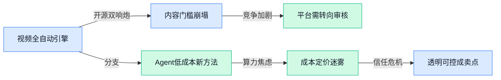

> AI 早报 · 每日早读 · 全网深度聚合

## **今日摘要**

```
OpenAI攻克Erdős数论难题，首个达到顶级数学期刊水平的AI证明震撼学界
DeepSeek放弃短期盈利全力
```

### 🔵 产品与功能更新

1. **OpenAI 推出 ChatGPT PowerPoint 插件，并警告可能误删你的内容。**
OpenAI 发布了适用于 **Microsoft PowerPoint** 的官方 ChatGPT 插件，用户可以直接在 ChatGPT 里操控幻灯片 😅。但 OpenAI 也老实警告：插件在编辑过程中**可能意外删除你的内容**，建议操作前备份 —— 这不是 bug，是当前插件架构的局限性。该插件目前通过 ChatGPT 的 **GPT-4o** 模型驱动，能帮你生成大纲、调整排版、甚至替换图片，但如果你不小心让 AI 误解了指令，整页内容可能被清空。目前官方正在收集反馈，计划后续加入撤销等安全机制。🛠️ [官方发布详情(briefing)](https://the-decoder.com/openai-launches-a-chatgpt-powerpoint-plugin-and-warns-it-might-accidentally-delete-your-content/)


2. **Google DeepMind 在亚太启动加速器项目，专攻环境风险。**
Google DeepMind 宣布在亚太地区推出 **Accelerator Program（加速器项目）**，目标是利用 AI 解决气候变化、生态监测、灾害预警等环境难题 🌏。入选团队将获得 DeepMind 的研究指导、算力支持和 Google Cloud 资源，项目周期为 6 个月。目前首批申请已开放，重点关注**水资源管理、生物多样性保护和极端天气预测** —— 比如用 AI 分析卫星图像来实时追踪森林砍伐。这不是商业项目，而是 DeepMind 的**社会公益倡议**，希望把顶尖 AI 能力落地到实际环保场景中。💚 [项目公告(briefing)](https://deepmind.google/blog/were-launching-the-google-deepmind-accelerator-program-in-asia-pacific-to-tackle-environmental-risks/)

3. **维珍大西洋航空用 OpenAI Codex 让 App 发布提速，零严重 Bug。**
维珍大西洋航空分享了他们如何借助 **Codex（OpenAI 的 AI 编码助手）** 翻新自家手机 App 的实战经验 ✈️。面临假期出行的硬性上线截止日期，开发团队让 Codex 自动生成大量单元测试（验证代码逻辑正确的自动化脚本），最终实现了**接近 100% 的代码测试覆盖率**，并且上线时没有出现任何 P1 级（最高优先级）缺陷。Codex 不光帮写代码，还能理解现有代码库，自动补全缺失的测试用例，让工程师们把精力集中在业务逻辑上。这案例说明，AI 编码工具在**高压力、短周期的企业级项目**中已经能充当可靠的“副驾驶”了。🎯 [OpenAI 官方案例(briefing)](https://openai.com/index/virgin-atlantic)

### 🟢 前沿研究

1. **微软推出 MagenticLite、MagenticBrain、Fara1.5（分别为轻量Agent框架、全能Agent大脑、配套小模型），专为小参数量设备优化 AI 智能体体验。**
微软研究院发布三款新成果，专门让参数量较小的模型也能高效运行 **AI Agent（自主完成任务的人工智能程序）**。MagenticLite 是极简版的 agent 搭建框架，MagenticBrain 提供更全面的推理与规划能力，而 Fara1.5 则是已经训练好的小模型。整套方案让手机、IoT 设备等资源有限的环境也能跑出媲美大模型效果的智能体 🚀。详见[微软研究博客(briefing)](https://www.microsoft.com/en-us/research/blog/magenticlite-magenticbrain-fara1-5-an-agentic-experience-optimized-for-small-models/)。

2. **RefusalBench（评估模型拒绝行为的基准）揭示：仅看拒绝率会错误排名顶尖大模型在生物研究问题上的表现。**
当前安全评测常以“拒绝率”衡量大模型是否合规，但**RefusalBench**发现这容易产生误导——有些模型对合法生物问题过度拒绝，有些却轻易放行。该基准提供了更细粒度的评价维度，帮开发者精准判断模型在**生物安全相关 prompt（提示词）**上的真实表现 💡。这项研究对防止 AI 被滥用又守住科研自由至关重要。见[arxiv论文(briefing)](https://arxiv.org/abs/2605.21545)。


3. **新方法将 Agent 工作流直接编译进大模型权重，以接近前沿模型百分之一的成本达到相近质量。**
研究者提出把常用的**Agent编排框架**（如LangGraph、CrewAI等）的流程“烧录”进 LLM 参数里，无需再额外运行复杂的调度代码。实验显示，成本降低两个数量级（约 99%），但解答质量几乎追平最前沿模型。这意味着中小企业也能低门槛部署高质量 AI 智能体了 🎯。详见[arxiv论文(briefing)](https://arxiv.org/abs/2605.22502)。

4. **ECUAS_n（一套评估不确定性增强系统的指标族）让“AI知道自身不确定度”这件事有了可量化标准。**
在高风险场景（如医疗诊断、金融风控）中，AI不仅要给出答案，还要告诉用户“我有多不确定”。但现有评估指标五花八门。这篇论文提出**ECUAS_n**系列指标，系统衡量模型对不确定性表征的质量，帮开发者判断“模型何时该说不知道” 📊。这对提升 AI 可信度意义重大。见[arxiv论文(briefing)](https://arxiv.org/abs/2605.20490)。

5. **首个达到顶级数学期刊水平的 AI 证明诞生，OpenAI 攻克 Erdos 问题（著名未解数论难题）。**
OpenAI 的 AI 系统成功证明了数学难题 **Erdos Problem**，其证明过程被同行评议后认可，达到了**顶级数学期刊**的发表水准。这不仅是 AI 在**形式化推理**（用符号逻辑严格推导）上的里程碑，也预示着未来 AI 将成为数学家的得力助手 🧠。该成果已引发学界广泛讨论。阅读[完整报道(briefing)](https://the-decoder.com/openai-shifts-the-boundary-of-automated-reasoning-with-a-milestone-in-ai-mathematics-that-experts-are-now-unpacking/)。

6. **Insights Generator（洞察生成器）让 LLM Agent 的失败模式能从整个运行日志中自动诊断出来。**
调试 AI 智能体一直很头疼——通常靠人眼翻看少量日志、凭经验猜问题。**Insights Generator** 能系统分析数百上千条执行记录，自动识别隐藏的失败模式（比如某类 prompt 总导致逻辑中断）。这对开发复杂 agent 系统的团队来说，相当于装上了自动 bug 检测雷达 🔍。详见[arxiv论文(briefing)](https://arxiv.org/abs/2605.21347)。

7. **通过自己构建 Benchmark（基准测试）来教 AI：QuestBench 课程培养负责任的 AI 知识工作者。**
大多数 AI 课程只教学生如何使用大模型（写 prompt、做总结），但这篇论文主张让学生亲手设计**测试基准**来评估模型能力。**QuestBench** 就是一个课程项目，学生需构建覆盖多种场景的测试集，从而理解“AI 靠谱吗”背后的挑战。这种“从用户变成测试者”的实践，能培养更负责任的 AI 开发思维 📚。详见[arxiv论文(briefing)](https://arxiv.org/abs/2605.21413)。

8. **谷歌推出 Agent 浏览审计，自动检查网站是否提供了 llms.txt（给大模型爬虫的指引文件）。**
谷歌正在测试一项新功能：**agentic browsing audit（智能体浏览审计）**，它会自动检测网站根目录下是否有 **llms.txt** 文件——一个告诉 AI 模型如何访问网站内容的标准协议，类似 robots.txt 但专为大模型设计。如果网站没有该文件，AI 智能体可能无法高效抓取信息。这标志着网站运营者需要为“AI 流量”做好准备了 🕸️。阅读[完整报道(briefing)](https://the-decoder.com/google-tests-websites-for-llms-txt-and-agent-compatibility/)。

### 🟡 行业展望与社会影响

1. **OpenAI 被 Gartner（市场研究机构）评为企业级 AI 编码代理领导者。**
   Gartner 2026 年 **企业级 AI 编码代理** Magic Quadrant（魔力象限，行业评估框架）中，OpenAI 凭借 **Codex** 被评为 **领导者** 🏆。报告强调了 Codex 在大规模部署和创新能力上的优势，标志着企业软件开发正全面走向 AI 辅助。未来更多公司可能会将 AI 编码工具集成到开发流程中。 [Gartner 官方报道(briefing)](https://openai.com/index/gartner-2026-agentic-coding-leader)

2. **加州州长签署美国首个 AI 工人保护行政令（executive order，州长签署的具有法律效力的指令）。**
   加州州长签署行政令，要求企业评估 AI 对员工的影响并制定 **再培训** 和 **过渡计划** 🛡️。这是美国首个直接应对 AI **失业风险** 的州级法规，预示未来更多州将效仿类似保护措施。该行政令还要求定期报告 AI 对特定行业的就业冲击。 [The Decoder 完整报道(briefing)](https://the-decoder.com/california-governor-signs-first-us-executive-order-to-protect-workers-from-ai-job-loss/)


3. **特朗普在马斯克、扎克伯格等科技大佬游说后撤销 AI 安全行政令。**
   据 The Decoder 报道，特朗普在接到马斯克、扎克伯格和萨克斯（技术投资人）的电话后，直接撤销了此前拜登政府签署的 **AI 安全行政令** 🔄。该命令曾要求大模型公司向政府提交安全测试结果，撤销后监管趋松，科技界对此意见分歧严重——支持者认为释放创新空间，反对者担忧 AI 风险失控。 [The Decoder 详细报道(briefing)](https://the-decoder.com/trump-pulls-ai-safety-order-after-last-minute-calls-from-musk-zuckerberg-and-sacks/)

4. **DeepSeek 据报道优先投入 AGI（通用人工智能）研究而非短期盈利。**
   尽管 DeepSeek 已获数十亿美元融资，内部消息称公司选择将资金主要用于 **AGI 基础研究** 而非快速变现 ⚖️。这种长期主义战略在当前 AI 狂欢中显得特立独行，也引发市场对其盈利能力的辩论。若成功，DeepSeek 可能在下一波技术浪潮中占据先机。 [The Decoder 报道(briefing)](https://the-decoder.com/deepseek-reportedly-prioritizes-agi-research-over-quick-profits-despite-billions-in-funding/)

5. **OpenAI 每赚 1 美元烧掉 1.22 美元，剔除股权激励后仍亏损。**
   根据公开财务数据测算，OpenAI 在剔除股权激励（以股票形式支付的薪酬）后仍每收入 1 美元支出 1.22 美元 💸。这表明即使去掉“纸面财富”成本，公司的运营模型仍严重依赖外部融资，凸显大模型竞赛的 **烧钱压力**。业界因此更加关注 AI 公司何时能实现可持续盈利。 [The Decoder 财务分析(briefing)](https://the-decoder.com/openai-burned-through-1-22-per-dollar-earned-even-after-stripping-out-stock-based-compensation/)

### 🟣 开源TOP项目

1. **vercel-labs/skills（Vercel 开源的 AI 代理技能工具集）帮你像装插件一样扩展 AI 能力。**
Vercel 推出了名为 **skills** 的开源项目，你只需在终端输入 `npx skills`（Node.js 包运行命令，用来快速调用预置模块）就能一键执行搜索、代码生成、数据分析等常见 AI 任务 🎯。它把复杂操作打包成一个个“技能”模块，开发者可以像安装手机 app 一样添加新技能，大大降低了使用 AI 代理的门槛。👉 [GitHub 仓库(briefing)](https://github.com/vercel-labs/skills)

2. **AIDC-AI/Pixelle-Video（AI 全自动短视频生成引擎）把文字脚本直接变成成品视频。**
Pixelle-Video 是一个完全自动化的 **AI 短视频引擎**，你只需输入文字脚本或简单提示，它就能自动完成剪辑、配音、字幕添加等全套流程 🎬。不用学复杂软件，运营和营销同事也能快速批量生成宣传视频，大幅降低内容生产的人力成本。🚀 [GitHub 仓库(briefing)](https://github.com/AIDC-AI/Pixelle-Video)

3. **GitNexus（零服务器代码知识图谱引擎）让你在浏览器里像看思维导图一样理解任意代码项目。**
GitNexus 是一个纯浏览器端运行的工具，你只需丢入一个 GitHub 仓库链接或 ZIP 文件，它就会自动生成一张可交互的 **知识图谱**，并内置一个 Graph RAG Agent（基于图谱的检索增强生成智能体，帮你用自然语言提问来探索代码逻辑）🔍。对于不熟悉代码的业务同事，也能通过图形界面直观了解项目结构和功能模块。💡 [GitHub 仓库(briefing)](https://github.com/abhigyanpatwari/GitNexus)

4. **NVlabs/Sana（英伟达开源的高效高分辨率图像合成模型）让高清图片生成又快又省资源。**
Sana 基于 **线性扩散 Transformer（一种用线性注意力机制加速图像生成的 AI 模型）** 架构，在保证画质的同时大幅提升了高分辨率图片的生成速度 🖼️。相比传统扩散模型，Sana 的计算效率更高，特别适合需要高清图片输出的设计、广告、产品展示等场景，用更少的算力获得更好的效果。✨ [GitHub 仓库(briefing)](https://github.com/NVlabs/Sana)

5. **facebookresearch/vggt-omega（Meta 开源的最新视觉几何模型）能从一张照片还原 3D 场景结构。**
VGGT Omega 是 Meta 在 CVPR 2026（计算机视觉与模式识别领域顶级会议）发表的 Oral 论文（口头报告论文，代表该领域的重要发现）成果，专注于让 AI 从单张图片中理解 **视觉几何**——比如自动估算物体的 3D 形状、位置和空间关系 🏗️。开源版本提供了预训练模型和推理代码，开发者可以直接用于 AR/VR、机器人导航或 3D 建模等场景。🔥 [GitHub 仓库(briefing)](https://github.com/facebookresearch/vggt-omega)

6. **heygen-com/hyperframes（为 AI 代理打造的 HTML 转视频工具）让代码直接变成动画视频。**
HeyGen 开源的 **Hyperframes** 允许你用 HTML 代码来渲染视频，专门为 AI 代理（Agent）设计 —— 代理只需要输出 HTML 标记，就能自动生成动态视频内容 📹。这对自动化视频制作（比如实时生成数据可视化动画、动态广告）提供了超轻量级的接口，非技术人员也能通过模板快速生成精美视频。🎥 [GitHub 仓库(briefing)](https://github.com/heygen-com/hyperframes)

### 🔴 社媒分享

1. **美国政府悄悄用 AI 帮你跑腿，办事效率要起飞。**  
美国政府正把 **AI 模型** 嵌入公共服务——从简化 **税务申报**、加速 **福利审批** 到自动回复市民咨询，减少排队和填表的痛苦 🏛️。虽然进展低调，但已在部分州试点用 AI 处理文书工作，让“找政府办事”不再是噩梦。详见 **[美国政府的 AI 便民计划报道(briefing)](https://www.bigtechnology.com/p/believe-it-or-not-the-government)**。


2. **AI 行业遭遇公关危机，公众信任正在流失。**  
随着深度伪造（用 AI 生成真假难辨的图片/视频）、大规模裁员和隐私担忧的加剧，AI 公司在公众眼中的形象急转直下 📉。最近一项调查显示，多数人对 AI 发展持负面态度，业内高管开始意识到：光有技术突破不够，“**AI 伦理**”和透明度才是留住用户的关键。完整分析见 **[AI 公关危机深度解读(briefing)](https://www.bigtechnology.com/p/ais-public-relations-emergency)**。

3. **微软算账发现：用 AI 干活竟然比雇人还贵。**  
微软内部调研显示，在某些任务中，部署 **AI Agent**（能自主完成多步操作的程序）所消耗的 **token 成本**（AI 每次回答按字符计费）加上算力开销，比直接支付人类员工时薪更高 💸。这给“AI 一定更省钱”的狂热泼了冷水，提醒企业需要仔细评估哪些场景才真正划算。详情见 **[福布斯对微软 AI 成本的分析(briefing)](https://fortune.com/2026/05/22/microsoft-ai-cost-problem-tokens-agents/)**。

4. **内存涨价波及你我：便宜手机和电脑正在消失。**  
由于 AI 大模型训练和推理需要大量 **DRAM**（内存芯片），全球内存产能紧张，导致从手机到笔记本的消费电子价格全面上涨 📈。过去几百美元能买到的“够用”设备越来越难找，厂商不得不提高售价或阉割配置。想了解这对你下次换机意味着什么，请读 **[David Oks 的内存短缺解释(briefing)](https://davidoks.blog/p/ai-is-killing-the-cheap-smartphone)**。

---



### 📊 行业洞察（今日 3 条）

1. Pixelle-Video（文字一键生成成品视频）和 HeyGen Hyperframes（为Agent设计的HTML转视频工具）同时开源，加上 Sana（高效图像生成）和 VGGT Omega（单图还原3D场景），AI视频制作工具正从单点拼图走向全自动流水线  
  【洞察】短视频带货的内容生产门槛被彻底拉平，未来品牌商可以自己低成本批量生成素材，我们作为剪辑平台必须从“工具提供者”转向“质量审核+策略优化者”才能保持价值。

2. 新研究把Agent工作流烧录进模型权重、成本降到前沿模型的1%，而OpenAI每赚1美元烧1.22美元、微软算账发现某些场景AI比雇人贵  
  【洞察】Agent的成本模型还在剧烈震荡：便宜方案正在冒头，但巨头仍在烧钱。给我们平台的信号是——帮客户省钱不是长久卖点，“帮客户判断什么时候该用AI、什么时候该用人”才是真壁垒。

3. 特朗普撤销AI安全行政令、加州反而签署首个工人保护令，加上公众信任流失，AI政策环境两头撕扯  
  【洞察】企业客户采购AI工具时会更看重安全合规和透明度。我们的Agent调度平台如果能做到“每一步可审计、随时可人工接管”，就能在这一波信任危机里拿到溢价订单。

### 💭 对我们的启发（今日 3 条）

1. Pixelle-Video开源全自动短视频引擎，我们直接集成或二次开发，就能把“导入脚本→出片”的流程做成我们平台的默认能力，省掉自己从头造轮子的成本。  
2. 微软AI比人贵的案例提醒我们：给客户报价时不能只讲“AI便宜”，要按场景打包（如“批量素材替换用AI，创新创意请人做”），引导客户合理搭配，减少因成本投诉的流失。  
3. 新方法把Agent工作流编译进模型权重的低成本方案，让我们的小客户（预算有限的品牌商）也能跑起多步骤视频处理Agent，我们的平台应优先适配这类低算力消耗的调度模式。


---

> 本周周报：[第21周综合分析](/ai-daily-site/blog/weekly/2026-w21/)
