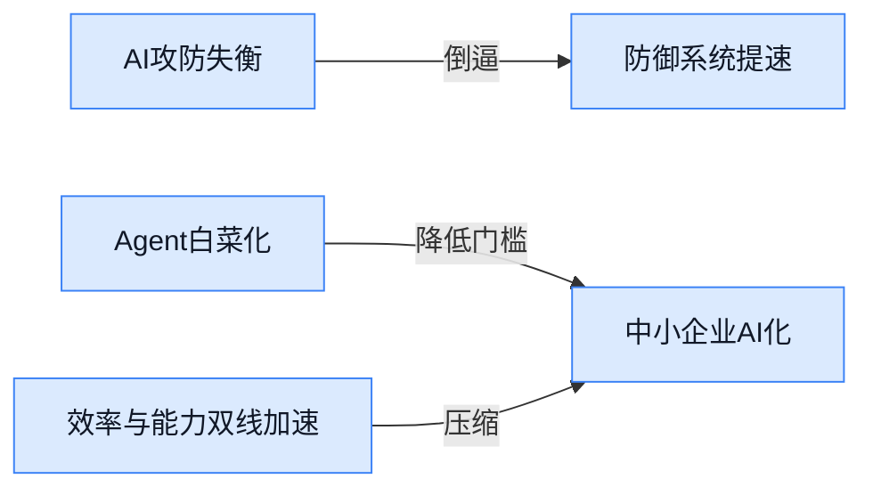

> AI 早报 · 每日早读 · 全网深度聚合

## **今日摘要**

```
```

### 🔵 产品与功能更新

1. **Anthropic 推出 Claude for Small Business（面向小企业的 Claude AI 助手），让 Agent 直接驻场在你现有的工具里。**
  这次瞄准的是中小企业场景 —— 不用再切换平台，Claude 就能无缝嵌入日常办公软件和业务工具，自动处理邮件、安排日程、整理数据 🚀 它被定义为一种能 **自主规划并执行多步骤任务** 的 Agent，相当于给每个小团队配了一位不知疲倦的数字员工。[Claude 小企业版发布报道(briefing)](https://news.google.com/rss/articles/CBMivAFBVV95cUxQMnA4Njk1TVBGWFpEYTFRN3ZEazZKcVdvdTlMOU5PSkVpbzRuRHBmVTNDbHFjUlF3QWhiNXA4b1hudnZRa3piZ0pweUc4eFBFOEZfQ3YxSWtSMXo4b1BkanRsRWh2ZHAxUVZyTzFtTWQ2OXlxV3V4bGo0MWxVeGRjN1o2NnVaWVAwRlJERTREWjJBcDROWkplNjlsTUZmYTlKemRYUzJXT3RQcmNVNEUwd3pEM0lERlNCQWRLVg?oc=5) 这对行政、运营等岗位来说，意味着像会议纪要自动流转、报销单初步校对这类重复事务，以后可以直接通过现有界面让 AI 接手。


2. **Anthropic 警告 Claude Mythos Preview（代码漏洞扫描预览工具）找 bug 比开发者修得还快。**
  这款预览工具的核心能力是 **自动挖掘软件中的安全漏洞**，其扫描和利用漏洞的速度已经快到让开发人员刚收到报告、还没来得及手工打出修复补丁（patch，即修补软件缺陷的代码更新）的地步 💡 虽然目前只是 Preview（功能尚未打磨完善的预览版），但它展示了一种令人警醒的自动化安全测试场景 —— AI 不仅替你干活，还能反向暴露防御端的响应瓶颈。[漏洞扫描工具详情(briefing)](https://the-decoder.com/anthropic-warns-claude-mythos-preview-finds-bugs-faster-than-developers-can-patch-them/) 对于非技术同事理解，这就像公司发现财务审批流程的漏洞速度，远超过了你能修改制度章程的速度，提醒着所有依赖软件的企业必须加速响应机制。

3. **Google 发布 Gemini Spark（云 AI 代理服务），让企业上手构建自己的 AI 助手。**
  Gemini Spark 是一个架在云上的 **可定制 AI Agent 服务**，旨在帮助没有深厚 AI 开发背景的团队也能快速拉起来一个能联网、能调取工具、能完成任务的智能代理 💡 它把模型调用、工具连接和任务编排打包成服务，相当于 Google 给你一个“AI 代理立等可取”的配方，你只需告诉它要做什么。[Gemini Spark 发布详情(briefing)](https://news.google.com/rss/articles/CBMijgFBVV95cUxQZ0trR2NsNlhDZTUtUXpXRlhQS18tX19wckFvQWF6RFRPTjJnYk1mNVdTcmJOMm9ocVlGb1BRVGdrQi1vbmZTLVU3X2x3M2YxZW9mNE9pbnRReEpjSGFCNmNXLUlyZEJGSHlWTXQ5MmdtUUVsWUlCbjhyNG5iTzJkNHpvWGQ4MjN4TFlxNTZB?oc=5) 对于市场、人事等需要频繁处理信息的部门，有机会把常规的竞品追踪、简历初筛等任务，低成本地转向一个由 AI 代理驱动的自动化流程。

### 🟢 前沿研究

1. **AI 预测科学进展：用量化手段预判科研突破。**  
这项研究尝试让 AI 充当科学界的“趋势雷达”📡，通过分析论文引用、研究热点等信号，**预测**哪些方向最有可能诞生重要发现。它不靠科学家直觉，而是用数据驱动的方式识别潜力领域，对企业制定技术路线图或投资决策很有参考意义。[HuggingFace（全球最大 AI 模型社区与开源平台）论文页(briefing)](https://huggingface.co/papers/2605.22681)


2. **Maestro（用强化学习自动编排多个 AI 模型协作的系统）。**  
Maestro 像一个“AI 指挥家”🎼，通过**强化学习**（让 AI 在试错中学会最优策略的训练方法）动态调配不同专长的小模型，根据任务需求灵活组合，以更低的计算成本解决复杂问题。这种多模型**协作机制**为需要综合能力的场景（如数据分析、智能客服）提供了效率跃升的可能。[HuggingFace 论文页(briefing)](https://huggingface.co/papers/2605.22177)


3. **Spreadsheet-RL（用强化学习让 AI 在真实表格任务中从试错中进步）。**  
让 AI 直接操作 Excel 或 Google Sheets 远比想象中困难，因为表格格式复杂、逻辑多步。这项研究用强化学习训练大模型亲自上手处理真实**电子表格**，比如自动填充数据、解析报表，像一位数字员工📊。对每天和表格打交道的财务、运营同事来说，未来或许可以直接吩咐 AI 干活。[HuggingFace 论文页(briefing)](https://huggingface.co/papers/2605.22642)


4. **TransitLM（无需地图自动生成公交路线的大规模数据集与评测基准）。**  
在陌生城市，AI 能不依赖地图就规划出靠谱的公交换乘方案吗？TransitLM 构建了一个覆盖全球的大规模交通路线数据集，用来训练和评测模型生成合理的多段式**公交路线**🚌。它考验的是 AI 的空间推理和规划能力，对出行导航、物流调度等实际应用有直接帮助。[HuggingFace 论文页(briefing)](https://huggingface.co/papers/2605.22355)

5. **多模态大模型（同时读懂图文的高级 AI）真的能超越第一印象去看人吗？**  
这项研究测试了像 GPT-4V 这类能看图识人的多模态大模型，看它们是否会根据长相、表情产生**第一印象偏见**，进而影响对能力或性格的判断🧑‍⚖️。结果发现模型确实会像人类一样以貌取人，这提醒我们在招聘、评价等场景使用 AI 时需特别谨慎，避免放大隐藏的社会偏见。[HuggingFace 论文页(briefing)](https://huggingface.co/papers/2605.22109)

6. **Gated DeltaNet-2（让 AI 记忆更高效的新注意力机制，像可擦写的记事本）。**  
大模型处理长文本时，**注意力机制**（模型理解上下文的核心技术）计算量容易爆炸。这个新架构通过分离记忆的“擦除”（忘掉无关信息）和“写入”（记录新信息），让**线性注意力**变得更灵活📝。未来有望让 AI 在阅读超长文档、整理会议记录时更省算力、反应更快。[HuggingFace 论文页(briefing)](https://huggingface.co/papers/2605.22791)

7. **ACC（把 AI Agent 的多步执行历史编译成高质量训练数据的方法）。**  
AI Agent 在执行订票、整理报销等任务时，会留下一串操作记录，这些就叫**轨迹**。ACC 把这些轨迹整理编译成训练材料，就像把标准作业流程写成教材📋，专门用来教会模型处理更长、更复杂的任务。这对开发更可靠的企业自动化助手（比如让 AI 独立跑完一项报销审批）很有价值。[HuggingFace 论文页(briefing)](https://huggingface.co/papers/2605.21850)

8. **Swift Sampling（用泰勒级数快速抓取视频里最“意外”的关键瞬间）。**  
在视频分析中，怎么最快找到那些剧情突变、动作转折的精彩帧？这套方法借用数学中的**泰勒级数**（用多项式近似函数的工具）来量化每一帧的“意外程度”🎬，智能跳过平淡部分。相比均匀采样，效率大幅提升，特别适合视频摘要、安防监控等需要快速预览海量录像的场合。[HuggingFace 论文页(briefing)](https://huggingface.co/papers/2605.22678)

### 🟡 行业展望与社会影响

1. **Claude Mythos（Anthropic 的 AI 漏洞挖掘系统）单月发现超一万个软件漏洞。**
Anthropic 透露其内部安全系统 **Claude Mythos** 在一个月内就揪出了超过一万个重大软件漏洞 🛡️。这相当于给软件做了一次 7x24 小时不间断的 AI 安全体检，能把藏得很深的代码缺陷、配置错误一次性全翻出来。对于用着各种 SaaS（在线软件服务）和内部系统的业务团队来说，未来很可能有 AI“保安”在后台默默守家，帮大家把数据泄露和黑客攻击的风险压到最低 💼。 [印度快报报道(briefing)](https://news.google.com/rss/articles/CBMitwFBVV95cUxQOE9Xbk9ZeXRIS3lncVRfN3BmVi0tN3dXYXZ6UnBhT3ZKNUh5TTJ3Y2tncEpJWVo4NFJkMm85Q3RXeF93SWI0YmpKbGdYek5wSmlLd1NPa0pRa0tqckxnUmRsZjdIdGduVEo4VU1JMTBkNGFXZ2NxTDZHSTQ0VGt6MTFMTE01R2ZKWExfdXF2VGoxYnRiZVV4d1RBYlU4S1ktc0hBT0hEbEpSVjFidElYRmw2ZDJocjTSAb4BQVVfeXFMT25Qamg0RS1XSnJPcWt6MXNEd0VOd3BtVmphZ2VvU2l0VjdNNUJKd3d5V1Z4aXR0bGRMSW1OTWVwUHI5cVljcnYtdFZ2c25uOHRlY2xIYS0yRVpadkFjcG5oT0k1bURGMC1Sb04yVHVNZ2hZNGtRWFR2VVZFcU1PLXRCSm00UmV3N3R2RjZ4LTNobndheHNCLTVwbkQzNU9OLVU1UjdkMU9iOTcwSTRNbVZadWJBTTF1UVV5N2F1UQ?oc=5)


2. **DeepSeek 被曝优先追求 AGI（通用人工智能）研究，暂不急于盈利。**
尽管手握数十亿美元融资，**DeepSeek** 依然把长期赌注押在了 **AGI（通用人工智能，能像人类一样灵活处理各种智力任务的 AI）**上，而不是急着把技术快速变现 💰。这种“放长线钓大鱼”的策略，意味着 DeepSeek 正在挑战 AI 能力的根本上限，而不只是想做一个更便宜的聊天工具。对普通打工族来说，未来几年我们很可能看到 AI 从“能聊会写”，进化为能真正理解复杂任务、自主规划执行的同事级伙伴 🚀。[The Decoder 报道(briefing


### 🟣 开源TOP项目

1. **CodeGraph（预索引代码知识图谱工具）助 Claude Code 省 token 提效率，全本地运行。**  
   这个项目为 Claude Code 准备了一张预先建好的**代码知识图谱**（knowledge graph，把代码里的类、函数等关系画成地图），相当于直接给 AI 手边放了份项目结构说明书 🗺️。它能让 AI 在写代码时**少消耗 token**（模型计费单位）也少调用工具，既省钱又加快响应速度，且所有操作 **100% 本地完成**，代码隐私牢牢掌握在自己手里。[GitHub 仓库(briefing)](https://github.com/colbymchenry/codegraph)


2. **Academic Research Skills（学术研究技能工具包）让 Claude Code 按规范走完从研究到定稿的全流程。**  
   这套技能把学术写作拆解成**研究→写作→审阅→修改→定稿**几个步骤，引导 Claude Code 像专业研究者一样产出论文 ✍️。它可以帮助需要写论文的学生或科研人员避免遗漏环节，让 AI 助手在学术场景下更靠谱、更符合写作规范。[GitHub 仓库(briefing)](https://github.com/Imbad0202/academic-research-skills)


3. **Anthropic 为 Claude Code 推出官方插件目录，高质量扩展一站精选。**  
   这是 Anthropic 亲自打理的**官方插件集合**，就像 Claude Code 的“应用商店” 🧩，开发者可以放心挑选经官方审核的高质量插件。无论是连接数据库、调用外部服务还是增强特定功能，都能在这里找到可靠的扩展，不用在茫茫开源中自己瞎试。[GitHub 仓库(briefing)](https://github.com/anthropics/claude-plugins-official)


4. **AgentMemory（AI 编程助手的持久记忆库）基于真实基准测试夺冠。**  
   该项目给 AI 编程智能体（如 Claude Code、Cursor）配上一个**长期记忆**，能记住你之前说过的需求、项目的上下文，下次接着干活不用重新交代 📋。由于在多项真实基准测试中排第一，它的记忆能力更稳定可靠，让 AI 协作更像跟一个了解你项目的同事搭档。[GitHub 仓库(briefing)](https://github.com/rohitg00/agentmemory)

5. **OpenHuman（开源个人 AI 助手）主打私密、简单与强大，可本地自建超智能。**  
   如果你想拥有一个完全由自己掌控的 **AI 超级助手**，OpenHuman 提供了本地部署方案 🔒。它把隐私放在第一位，安装和操作都追求极简，却具备强大的任务处理能力，相当于在你自己电脑上跑一个专属的“小 ChatGPT”，所有数据不出设备。[GitHub 仓库(briefing)](https://github.com/tinyhumansai/openhuman)

6. **CloakBrowser（隐身浏览器，基于 Chromium）替代 Playwright，30 项反爬检测全通过。**  
   它基于 **Chromium**（与 Chrome 同源的开源浏览器内核）做了深度指纹伪装，可以骗过各类反爬虫和机器人检测 🤖。如果你用过 **Playwright**（微软推出的自动化浏览器测试工具）来抓网页或做测试，CloakBrowser 能直接替代它，源码级的修改让你轻松通过 30 项检测而免于被网站封禁。[GitHub 仓库(briefing)](https://github.com/CloakHQ/CloakBrowser)

### 🔴 社媒分享

1. **英伟达 Nemotron-Labs 推出扩散语言模型，迈向“光速”文本生成。**
   英伟达把原本在图像生成里大放异彩的**扩散模型**（Diffusion Model，一种先给内容“加满噪点”再逐步去噪还原的技术，和 Stable Diffusion 同款原理）搬到了文字生成上，打破了传统模型必须一个词一个词往下憋的限制 ⚡。这个新方法能在保持逻辑连贯的同时，一口气“降噪”出整段文本，推理速度（inference，模型生成回答的过程）快到像加了火箭推进 🚀。对于日常要用 AI 写长稿、做实时对话的同事来说，这意味着未来等 AI 憋字的时间可能比热咖啡还短。[英伟达扩散语言模型技术解读(briefing)](https://huggingface.co/blog/nvidia/nemotron-labs-diffusion)


2. **2026.21: 数据中心否决权——政府一票叫停，算力基建热浪遇冷。**
   这篇分析指出，美国正在动用**数据中心否决权**来掐断部分大型算力项目的扩张，背后牵扯到土地、能源和社区利益博弈 🏗️。文章拆解了地方政府如何用一张否决票直接卡住**数据中心**（存放成千上万台服务器、用来训练大模型的巨大厂房）的许可证，让科技巨头动辄上百亿的基建计划瞬间搁浅。这件事对 AI 行业的连锁反应可能比想象中更大：算力供给一旦吃紧，模型迭代、产品体验都可能跟着慢下来。 [Stratechery 深度评析(briefing)](https://stratechery.com/2026/the-data-center-veto/)


3. **从第一性原理起步，让深度学习真正“飙起速度”（2022 经典重温）。**
   这篇 2022 年的技术经典不是空讲理论，而是手把手教你怎么把**深度学习**训练效率榨到一滴不剩 💡。作者从**第一性原理**（抛开现成框架，直接回到数学和硬件底层去思考）出发，讲透了矩阵乘法、显存搬运这些 GPU 干活时的“内功心法”。即使你不写代码，读完也能瞬间明白为什么有些 AI 产品反应飞快、有的却卡成 PPT——关键往往就卡在没让显卡集群（GPU cluster，一堆显卡协同工作的阵列）把力气花在刀刃上。 [原文精读(briefing)](https://horace.io/brrr_intro.html)


---



### 📊 行业洞察（今日 3 条）

1. Anthropic让AI直接住进小企业现有工具干活，同一天又警告自家AI找漏洞比人修得快
  【洞察】两件事放一起看，AI正在同时成为“最勤快的员工”和“最难防的安检员”——帮企业提效的同时，也暴露了防御体系跟不上进攻速度的矛盾

2. Google推Gemini Spark让没AI技术背景的团队也能自己搭智能代理，Anthropic推小企业版Claude
  【洞察】巨头们不再只盯着大客户，集体把Agent做成“开袋即食”的标准化服务，说明AI代理正从专业工具变成水电一样的基础设施

3. DeepSeek手握数十亿不着急盈利偏要死磕通用人工智能，英伟达用图像生成的扩散思路做文字模型试图让生成速度起飞
  【洞察】一个在押注能力上限，一个在死磕效率下限，两条路线同时加速，意味着AI“更聪明”和“更快”可能同时到来，留给产品做差异化的窗口在缩窄

### 💭 对我们的启发（今日 3 条）

1. Swift Sampling用数学方法快速定位视频里最“意外”的帧，这跟我们现在帮用户找带货视频高光时刻的需求天然对口——未来剪辑软件的价值不只在于“能剪”，更在于“能替用户找到该剪哪里”
2. Claude插件官方目录、Agent长期记忆项目都在降低AI代理的门槛，我们的剪辑平台要提前想清楚：如果客户将来直接让Agent帮他们生成并分发视频，我们的工具位置在哪里，是被集成还是去集成别人
3. 数据中心否决权意味着算力不会无限扩张，训练成本可能回升。我们当下做视频模板和轻量级AI处理时，应该优先榨干现有算力的效率，而不是等更便宜的算力到来


---

> 本周周报：[第21周综合分析](https://zhuxinfei.github.io/ai-daily-site/blog/weekly/2026-w21/)
