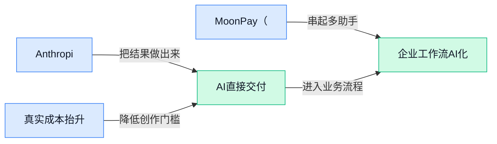

> AI 早报 · 每日早读 · 全网深度聚合

## **今日摘要**

```
```

### 🔵 产品与功能更新

1. **Anthropic联合创始人表示：AI模型开始出现“内省”迹象。**
   在教皇利奥十四世通谕（**Encyclical**，天主教最高级别的教宗教导文件）的发布活动上，Anthropic联合创始人的发言引发了广泛讨论 🤔。他指出，最新的AI模型在处理复杂问题时，开始展现出某种“内省”（**Introspection**，即模型自我审视思考过程的能力）的苗头。这并非是说AI有了人类的意识，而是模型能够更清晰地向我们解释它是如何一步步得出结论的，甚至能自我修正推理中的漏洞 💡。这一发现或许意味着，未来我们能更好地理解AI的“黑箱”决策，让AI在安全性和可靠性上迈出关键一步。 [活动详细报道(briefing)](https://the-decoder.com/at-the-launch-of-pope-leo-xivs-encyclical-anthropic-co-founder-says-ai-models-show-signs-of-introspection/)


2. **Google推出Gemini 3.5 Flash Low变体（谷歌轻量模型的超低成本版本）。**
   Google 悄无声息地发布了 **Gemini 3.5 Flash** 的一个新变体：**Low** 版本 ⚡。这个“Low”可以理解为极致的性价比模式，它在保持 **Gemini Flash 系列**（谷歌专门为速度和成本优化的轻量级大模型）原有速度优势的同时，进一步大幅降低了调用费用，简直是给高频、简单任务量身定做的。对于那些每天需要处理海量文本分类、简单的客户咨询回复等重复性工作的业务场景来说，这能帮公司在保证效果的前提下，把AI使用成本打到地板价。 [发布新闻(briefing)](https://news.google.com/rss/articles/CBMijgFBVV95cUxOekNVRURSbGFYd1haQm53QnU1RHdETXlhekpoaExoVWVYTmI2YmFIOWlIeWp0aV9LZXdEVHFSYS16ZXlpamJ1UUxWa3NMYjlUWkg4eE5XYmo4T2daQlpUMy1qVy1KZmJwWlg5TVhGOGw2OEtiYnhmclR0ZTVudi1UR3A2bXgyRHdKUXQyc2V3?oc=5)

3. **MoonPay（加密货币支付平台）在ChatGPT里直接推出了“法币买币”通道。**
   这下不用再在App间跳来跳去了！**MoonPay** 正式将 **Crypto Onramp**（法币转换为加密货币的入口服务，通俗讲就是让你用美元、欧元等常规货币直接购买比特币等虚拟货币的功能）集成到了 ChatGPT 的平台里 💰。现在，用户在跟 ChatGPT 聊天时，如果有购买或交互加密货币的需求，可以直接在聊天界面内完成合规的法币买入操作。这大大降低了普通人接触和进入 Web3 世界的门槛，把复杂的加密货币购买流程变得像在聊天软件里发个红包一样自然。 [详情报道(briefing)](https://news.google.com/rss/articles/CBMijgFBVV95cUxPSWVoak9uTVoyaDlUUXJTTHVwWmFsZGZiNGFQYnM1LWZTUzZxR2daYWczekR3VVprM0ZvYWJSTnJpQVRLTnFheEh1SEwwbnhjYk9YZ2xaU1NLUmlFY3JobXYtbUdZYmN5ckhuU2Z2cGRFTmdfZmtGMUJIajNjcXFuMnZuSjg5M3l4WlZ4SExR?oc=5)

### 🟢 前沿研究

1. **ETCHR：通过编辑技术让 AI 推理更清晰可控（ETCHR 推理编辑框架）**  
   ETCHR 提出一种全新的思路：像修改文档一样直接「编辑」大模型的推理过程 🔧。这个方法能让开发者精准干预模型的思考链（Chain of Thought，让 AI 一步步展示解题思路的技术），从而让复杂问题的解答更准确、更可解释。对于非技术同学来说，这就好比把 AI 的“内心独白”变得有条理，而不是让它含糊地蒙一个答案。感兴趣可以翻阅 [HuggingFace 论文详情(briefing)](https://huggingface.co/papers/2605.23897)。

2. **用信息论「噪声信道」视角重新理解大模型的容量与缩放定律（Scaling Law）**  
   这项研究巧妙借用了香农信息论（研究通信极限的经典理论），把大模型看作一个会因为噪声而丢失信息的信道 📡。在这个框架下，研究者推导出了模型参数量、训练数据量与最终性能之间的缩放关系，帮助我们理解为什么一味堆算力或数据并不一定高效。这是一次从底层理论出发、撼动“大力出奇迹”观念的有趣探索，详细推导见 [HuggingFace 论文页(briefing)](https://huggingface.co/papers/2605.23901)。

3. **Good Token Hunting：视觉几何 Transformer（一种用图像碎片做处理的 AI 模型）的优质 token 挑选指南**  
   当 AI 处理图像时，需要把画面切成小块（即 token）再逐个分析，就像拼拼图。这篇论文系统研究了怎么挑出最有价值的 token，让 Vision Geometry Transformer（专门处理 3D 几何形状的 ViT 变体）效率更高 🖼️。它就像一本“图像 token 淘金指南”，对三维重建、机器人视觉等场景有明显的加速效果。细节可查阅 [HuggingFace 论文(briefing)](https://huggingface.co/papers/2605.23892)。

4. **SciAtlas：超大规模科学知识图谱，为 AI 自动科研铺路**  
   面对每年数百万篇论文的“信息爆炸”，SciAtlas 从中自动抽取概念、方法和结果，构建成一个覆盖多学科的 **知识图谱**（把知识点像地图一样关联起来的数据结构）🧠。这样一来，AI 助理就能像经验丰富的研究员那样，快速找到相关文献、交叉印证，甚至提出新的假说。这对加速药物发现、材料设计等科研领域意义深远，完整论文可看 [arXiv 预印本(briefing)](https://arxiv.org/abs/2605.22878)。

5. **从原始经验到技能消费：系统研究 AI Agent 如何生成并复用技能**  
   这篇论文深入拆解了一个关键问题：AI Agent 在完成任务后，如何把成功经验抽象成可复用的“技能”，并在后续任务中高效调用 🛠️。研究者建立了一套从经验收集、技能提炼到消费的通用流水线，并评估了不同抽象程度对Agent效率的影响。如果你把 Agent 想象成不断成长的员工，这份工作就是在帮它沉淀“最佳实践手册”，[HuggingFace 论文(briefing)](https://huggingface.co/papers/2605.23899) 里有详细分析。

6. **SkillOpt：让 Agent 技能自我进化的高阶执行策略**  
   承接技能生成的研究，SkillOpt 专门设计了一套类似“调度指挥官”的优化机制，让 Agent 面对新任务时能聪明地组合、微调已学会的技能，而不是每次都从头摸索 ⚙️。这套 **自我进化** 策略让 Agent 越用越顺手，有望在实际业务场景（如自动化客服、供应链调度）中大幅降低反复训练的成本。技术要点见 [HuggingFace 论文(briefing)](https://huggingface.co/papers/2605.23904)。

7. **PhotoFlow：能自主执行 3D 虚拟摄影任务的智能 Agent**  
   PhotoFlow 打造了一个能在三维场景中当“AI 摄影师”的 Agent 系统：它可以自动规划拍摄角度、调整光照、构图，甚至完成一整套动态摄影 mission 📸。这在游戏内容生产、虚拟宣传片制作、电影预览等领域会非常实用，让设计师将精力投放到创意而非繁复的设置上。操控流水线详见 [HuggingFace 论文(briefing)](https://huggingface.co/papers/2605.23771)。

### 🟡 行业展望与社会影响

1. **教皇发布首份 AI 通谕（教皇向全世界颁发的权威教导文件），将 AI 伦理与监管上升为普世议题。**
   梵蒂冈发布了历史上第一份聚焦人工智能的 **“Magnifica humanitas”** （崇高人性）通谕，教皇利奥十四世呼吁各国政府建立 **强有力且透明的 AI 监管**，防止技术加剧社会不公 🌍。通谕强调 AI 必须服务于 **人的尊严与共同利益**，而不应让算法决策遮蔽人类的道德判断 —— 这相当于给全球天主教徒以及所有关心科技伦理的人，敲响了一次响亮的“灵魂警钟”。[路透社详细报道(briefing)](https://news.google.com/rss/articles/CBMiwgFBVV95cUxNX1dPMlpTM1h1V1paY3pubzlaeHFQWWFzRFVRX1Z6QlMzaHFhUVZ2ZzdKQU1HOW8xclJDeV9iQ24xOUpCUXNzbFB4X3piXzdiMS1MaGF2WmppNjQ5N3NJT3pSYWNxQXVubTBZcFNJYWVsNnV3US11cHlocGlpVC11TFRmYWxfSnE1STFMajB5aDRnWFlpUFprMFh2NVV2QkRESkQ2ZEplYWhsUGFMWjdZaldBU2N1Y1YxRXcyY2hGdWl1QQ?oc=5) [美联社分析(briefing)](https://news.google.com/rss/articles/CBMinAFBVV95cUxQVjMxWVlpUUhJb1JjYnFPRXpkeE1qaTc3aDNQQXltRWZYNmo4T1dmN095X3R6bDY5NmkxdHBwTERrNkg1ajFIZDFZR09VQzd6a2oyalZTM2tkcjRwMFVyXzM5RUhkZWNQQ216cExQbkI1OGN0RS1CazVJV1dvTV9aYUt2cVVsc3Z6LVJDanZySTdMOHdEWmlIVTI4VVI?oc=5)

2. **Anthropic 与梵蒂冈站在一起，联合创始人 Chris Olah 公开回应教皇通谕。**
   Anthropic 联合创始人 Chris Olah 发表特别声明，呼应教皇利奥十四世的通谕，强调 **对齐（alignment，让 AI 的价值观和行为符合人类意图）** 与 **可解释性（让人类能理解模型如何做决策）** 是确保技术服务于人性的关键路径 🕊️。这一举动罕见地把一家顶尖 AI 公司与千年教廷拉到同一战线，向业界传递出清晰的信号：在 **白宫倾向于放松 AI 管制** 的时刻，关于“安全与责任”的讨论正在由宗教领袖和科学家联手推向更高舞台。[华盛顿邮报(briefing)](https://news.google.com/rss/articles/CBMiwwFBVV95cUxQMmJHLVFCU0J1blg1bkFaVzU5Mlg5VnpqYy1ONTd4MHVFeTNjN1ZWNC1fRk55emthcTVteTNPbFRTVm85Y2V3YUg0X0FaaUtORHBiNC15ZkVjM1lwY0QzT3BZOUsyMzFJSEV0Yll4NUVzQWFHSjFuV3Y4LVc4dVFUVWNobUdLZThVNUxDWDdQSnFMRTFiRjRjelNSVXl2SWZ2OXRJY0JTR1Q4UjA1T3JtQkpQcGlvNU5Zb18wTkNoVTNHNEE?oc=5) [Anthropic 官方声明(briefing)](https://www.anthropic.com/news/chris-olah-pope-leo-encyclical)

3. **微软因 AI 预算几个月内烧光全年经费，将于 6 月底暂停 Claude Code（Anthropic 的命令行 AI 编程工具）使用。**
   一则略显“打脸”的消息：微软内部员工大量使用 **Claude Code**，导致 AI 服务开支急速膨胀 🔥，公司不得不在 6 月 30 日前叫停该工具的使用。这意味着即便坐拥 **GitHub Copilot（GitHub 推出的 AI 编程助手）**，开发者依然会用脚投票选择外部工具 —— 这也折射出巨头在 **AI 工具采购与预算管控** 上面临的尴尬现实：好东西太贵，烧不起。[完整报道(briefing)](https://news.google.com/rss/articles/CBMif0FVX3lxTFBWbzNuNVNvclRMNmo1czZFRUxCX0hITFZiZHZ3T001OW9LbW5hSzBfRHdic3hrbWM5X3pfaW9rTndYRVJJeXRWbVl6REM4SWo5Q1IzVGg1eTFaZTVSMFJHZ21XME5kaVNDUHNxS3pUWFdRYVVUMGhVZE45RWZHSFk?oc=5)

4. **OpenAI 牵手巴西两大媒体集团 Grupo Folha 与 Grupo UOL，将权威新闻注入 ChatGPT。**
   OpenAI 宣布与 **Grupo Folha（巴西最大报业集团之一，旗下《圣保罗页报》闻名）** 以及 **Grupo UOL（巴西领先的数字内容与互联网集团）** 达成内容合作 📰。这意味着 ChatGPT 将引入经过 **署名与透明溯源** 的巴西新闻资源，既帮助用户获取可靠信息，也为传统媒体在 AI 时代探索授权收入模式提供了一次参照。[OpenAI 官方公告(briefing)](https://openai.com/index/grupo-folha-grupo-uol-partnership)

5. **Google 推出 Gemini Spark（一款可 7×24 小时运行的云端 AI 代理），让 AI 跨应用自主执行任务。**
   Google 发布 **Gemini Spark**，一个全天候运行在云端的 AI 代理，能够在第三方应用里直接替用户完成预订、查询、填表等操作 🌟。这种 “AI 帮手” 不用你盯着屏幕，它自己就能在后台跑 —— 对于行政、运营等岗位来说，意味着未来大量跨系统重复操作可能被自动化接管，但也带来 **权限管理** 和 **数据隐私** 的新问题。[Tech Times 报道(briefing)](https://news.google.com/rss/articles/CBMiywFBVV95cUxNTEVRLWNwTHprQ09zWjFqaFR0M0l4VEFPR011ckVaWHQwVWZVc3kyVHdQVVY4engtZjJrVGsyTTJqaDhucGUzN1dzNlkxV3JTc0JvVjhabTBrelRuR0R2RFl2WnJPZ0VsR29lS0hydmtmNE5iRTRlYzN0a2M3SkxPN3Z3RWxGTkRzeG42ejZTRjVMVzc4ZXEzcTlhU2FaRDB4TFFmUnQzVElxRElnMmtWQ0Y1blVoQm5WRWtRXzVlczJMdkJkaXk0Um5wdw?oc=5)

### 🟣 开源TOP项目

### 🔴 社媒分享

1. **IBM 分拆出全球首个 Pure-Play 量子芯片代工厂（只负责制造量子芯片的全新独立厂牌）。**
   得益于美国《芯片法案》划拨的 20 亿美元资金，IBM 宣布将其量子芯片制造业务独立出来，成立全球第一家纯代工模式的 **量子晶圆厂** 🏭。这家工厂将在纽约州建设 **300mm 超导硅量子芯片产线**（类似传统芯片的 12 寸晶圆，但专门用来生产量子处理器），让量子硬件从实验室走向真正的规模化量产。此举意味着未来各类量子计算公司可以像委托台积电造手机芯片一样，直接找这家代工厂生产自己的量子处理器，而不必自建昂贵的制造设施。🚀 [Futurum Group 深度解读(briefing)](https://futurumgroup.com/insights/2-billion-chips-act-investment-in-quantum-bets-on-ibms-300mm-superconducting-silicon/)


2. **HuggingFace 发布 AI Agent 术语表，详解 Harness（Agent 运行循环的控制程序）与 Scaffold（支撑 Agent 的工具集）。**
   HuggingFace（全球最大的 AI 模型共享社区）上线了一份专门的 **Agent 术语表**，帮助大家厘清 Agent 开发中常被混用的关键概念 💡。其中最核心的 **Harness** 指的是那个负责驱动 Agent 思考、管理记忆和调用工具的“大脑程序”；而 **Scaffold** 则是为 Agent 提供 API、数据源等底层支持的“脚手架”。博客还顺便澄清了 Agent、Tool 和 **RAG**（检索增强生成，让模型回答前先查外部知识库）等概念的细微区别，对想了解智能体如何工作的朋友来说是一份非常友好的入门材料。 [HuggingFace 官方术语表博客(briefing)](https://huggingface.co/blog/agent-glossary)


---



### 📊 行业洞察（今日 4 条）

1. 教皇发布首份AI通谕呼吁监管，Anthropic联合创始人公开站台强调对齐，而微软却因预算烧光停用Claude Code
  【洞察】伦理呼声和成本失控同时登台，AI行业正面临“既要讲责任又要算实账”的撕裂期

2. Anthropic说模型出现内省迹象，ETCHR论文提出直接编辑AI推理过程，信息论噪声信道研究则从底层重新理解模型能力
  【洞察】三件事放一起看，AI正从“黑箱猜答案”转向“透明可修正”，可解释性不再是口号而是可落地的工具箱

3. SkillOpt让Agent技能自我进化，另一篇论文系统拆解技能复用流水线，Google又推出7×24小时跨应用自主运行的Gemini Spark
  【洞察】Agent不再是“用完就忘”的工具，而是能积累经验、自我升级的数字员工，自动化正从单次任务走向持续学习

4. Google推出Gemini 3.5 Flash超低价版，MoonPay在ChatGPT里直接买币，OpenAI牵手巴西媒体注入新闻
  【洞察】AI平台一边把高频任务打到地板价，一边疯狂集成交易和内容，纯工具型产品的生存空间被生态化挤压

### 💭 对我们的启发（今日 2 条）

1. PhotoFlow能自动在3D场景中执行虚拟摄影，SkillOpt让AI学会复用剪辑偏好
  这对我们意味着：视频剪辑工具的下一个突破口不是堆功能，而是让AI记住每个品牌商的风格惯性，做到“越用越懂你”

2. Gemini Spark跨应用自主跑任务，Flash Low把高频调用成本砍到极致
  我们软件如果大量依赖昂贵的生成模型，微软


---

> 本周周报：[第22周综合分析](https://zhuxinfei.github.io/ai-daily-site/blog/weekly/2026-w22/)
