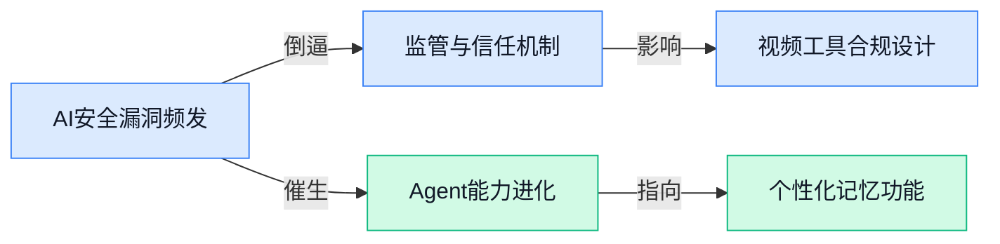

> AI 早报 · 每日早读 · 全网深度聚合

## **今日摘要**

```
```

### 🔵 产品与功能更新

1. **伊利诺伊州 AI 监管法案推进，倡导者称这只是第一步 ⚖️。**
  伊利诺伊州正在推动一项专门针对**强大 AI 模型**（指可能带来重大社会影响、具备先进能力的通用人工智能系统）的监管法案。该法案的倡导者认为，这只是建立**系统性法律框架**的开始，未来还需要更多细则来平衡技术创新与公共安全。[完整报道(briefing)](https://news.google.com/rss/articles/CBMiuwFBVV95cUxNa0NCUXc3NWQzYWxzdE02V2dwRVBCMWI2QU9fZDR3Yzd6aERRSVVPSTdMOU9NSHJ0RC0tclBnUDliMkNFZFlUdF9MUnEtTHp1RjYtTVk3cVdQWjdDTmgtY1FHS0VCZi11alZSMkNjcjNKdWUtb0t4OWZJczI3ZlZfejlOYkF1RmdTR2xNOFZrMk5LUktpUjliNXNVMjV0S2p3NVRNYTVkVzVXUGg0TmwwelBlQ2hVUV9OM3NZ?oc=5)

2. **爱荷华州立大学文理学院发起可信赖 AI 跨学科倡议 🎓。**
  爱荷华州立大学文理学院（LAS）正集结计算机、哲学、法律等多个领域的专家，发起一项旨在让 AI **更值得信赖**的跨学科计划。项目的核心是让**可信赖 AI**（确保人工智能系统表现公平、透明、尊重隐私，让人用着放心的技术方向）从底层设计就被嵌入到产品中，而不是像“打补丁”一样事后补救，为未来 AI 产品的伦理规范提供了重要学术参考。[阅读详情(briefing)](https://news.google.com/rss/articles/CBMipwFBVV95cUxNZUJBVUtpZVRxWkUzNVB4VUo4YmVKbTFFZFNGR05ybWZWbkNRNnE0X3lwNzV4MldXeUFFeDVIOUJhdmdqTUh0eEZoNlAzZ01Pc2lpdFFIY1NTNkNiVEhid0tWMFBBTk9XM0tONkc2LVhCQlZqN2h2OWV3djBGcjEtdXBPTWpjU0d0ZUYyRUx3bWg1WmFKSHVMNHlQb0lsMEVDa3hDLTA0aw?oc=5)

3. **Argonne 推出首个面向开放科学的大规模 AI 推理（inference）服务 ⚛️。**
  美国阿贡国家实验室为全球研究人员带来了一项重磅基础设施：**AI 推理（inference，让已经训练好的 AI 模型实际干活、回答各类问题的过程）服务**。跟需要耗费天量电力来“教”模型的**训练过程**不同，这项服务让科学家能直接在国家级超级计算机上运行已有模型，快速分析实验数据或预测材料性质，而不用自己购买昂贵硬件。它把 **AI for Science** 的门槛拉到了一个前所未有的低点，堪称开放科学的算力加油站。[官方发布页(briefing)](https://news.google.com/rss/articles/CBMioAFBVV95cUxQNjI4SzcyZUFKMF9DOGhWYW90akg2cHZkbFhJNnZJV2k3ZkJ4UzlDTThjNTRWQmtZT2N1VGQ1aXJ2UHQ2Y2huUnN5WFNpZ05JYUtRUGExMVJIWXd3bTd4UVZMajR1TENtT3RkeHoxUWlNc1hDSGFfcTU5c244V09PbGppbWZqbXByU3NKMnlZZjFhNzVONGdBTENDRUZyOGdR?oc=5)

### 🟢 前沿研究

1. **AI 编造的假引用正悄悄潜入影响临床指南的研究论文，研究者发出警告。**
   医学研究人员发现，由 AI 大模型凭空捏造的“幻觉引用”（看起来像真的但根本不存在的论文条目）正在渗透到指导临床实践的学术文章中，这正是我们熟知的 AI 胡编乱造能力在严肃领域的蔓延 🚨。这些假引用一旦被纳入高影响力的临床指南，可能直接误导医疗决策、危及患者安全。研究者呼吁学术期刊必须加强针对 AI 生成内容的审查，尤其在涉及人命关天的医学文献中。 **[详细报道(briefing)](https://the-decoder.com/ai-hallucinated-citations-are-creeping-into-papers-that-shape-clinical-guidelines-researchers-warn/)**


2. **Claude Mythos（Anthropic 内部模型代号）用“可爱而简单的证明”破解 OpenAI 的经典 Erdős 问题（埃尔德什组合数学难题）。**
   据报道，Anthropic 的 Claude 模型的一个内部版本 Mythos，成功完成了由 OpenAI 提出的一个标志性 Erdős 难题，而且给出的证明被数学家评价为“巧妙又简单” 💡。这不仅展示了当前大模型在深度数学推理上的惊人潜力，也说明解开高难度问题不一定非要堆砌暴力计算，精巧的思路同样制胜。对于关注 AI 数理能力的同事来说，这相当于看到一位“AI 实习生”交出了一份令数学家都眼前一亮的答卷。 **[详细报道(briefing)](https://the-decoder.com/claude-mythos-reportedly-solves-openais-landmark-erdos-problem-with-a-cute-simple-proof/)**

3. **SkillEvalBench（AI 从经历中提炼技能的评估基准）发布。**
   这个基准专门测试大模型能否把一次性的具体经历，提炼成可重复使用的程序化技能——就像你学会用某一台打印机后，今后遇到任何品牌的打印机都能立刻上手 🔁。它通过一系列任务衡量 AI 从 “情景经验”到“通用技能” 的进化能力，这对打造更会举一反三的 AI Agent 很有帮助。今后我们设计能自学办公软件的助手时，这种能力就派上用场了。 **[HuggingFace 论文(briefing)](https://huggingface.co/papers/2605.24117)**

4. **MemForest（分层时间索引的 Agent 记忆系统）让 AI 记得更聪明。**
   你是否也担心跟 AI 助手聊久了它会忘记前面的对话？MemForest 提出了一套高效记忆架构，模仿树的层次结构，按时间段（如小时、天、周）来整理和存储信息，就像给 AI 的大脑种下一片记忆森林 🌳。这让 AI Agent 快速检索过往交互，在长任务、多步骤的工作流中不丢三落四，尤其适合需要长期陪伴的辅助工具，比如连续几天帮你整理材料的智能助手。 **[HuggingFace 论文(briefing)](https://huggingface.co/papers/2605.23986)**

5. **CUA-Gym（计算机使用 Agent 的训练场）提供大规模可验证的实训环境。**
   以往训练能操作电脑软件的 AI Agent 缺少标准化“练习场地”，而 CUA-Gym（CUA 指 Computer-Use Agent，即能像人一样操控软件界面的 AI）一次性提供了成千上万种可验证的任务环境，像是发邮件、填表格、整理文件 💻。这就犹如给 “AI 实习生” 专门搭建了一个仿真公司，让它在海量场景中反复练习，从而更快学会稳定、可靠地使用各类软件。 **[HuggingFace 论文(briefing)](https://huggingface.co/papers/2605.25624)**

6. **你的 Embedding 模型（文本嵌入模型）其实比你想象的更聪明。**
   以往我们认为 Embedding 模型只能把句子转换成向量，用来做相似度搜索这类“搬砖”活儿。但新研究发现，这些看似简单的模型内部其实藏了不少“隐藏技能”，比如具备初级的自我反思和推理潜力 💡。如果能善加开发和利用，也许不需要换更大的模型，就能让现有的 AI 搜索、推荐等系统变得更灵光，这对做运营、产品优化的同事是个不错的思路。 **[HuggingFace 论文(briefing)](https://huggingface.co/papers

### 🟡 行业展望与社会影响

1. **美国国防部欲砸近 300 亿美元打造全新 AI 武库。**
据 [FedScoop 报道(briefing)](https://news.google.com/rss/articles/CBMijAFBVV95cUxQejZKMm9MUjVaVDI1VmZlc0dCYjNXMWdjMlZLVDZfLTdzMTZXODBtRnB1MUxyb2QzV0h6YTlYODJoUDR5UExHTjNDRjU1WC1YVG9lVmtxU0ZEdnc0ekxza2dITHVXMHBwWVZOcDFuSk9wMmk5TjlXVnJqTFlVcnNBY0QwWVFycGlORFEzQw?oc=5) 披露，五角大楼（美国国防部）正申请一笔近 **300 亿美元**的巨额预算，旨在建立一个全域的 AI 武器库 🚀。这预示着 AI 军事化进程陡然加速，未来的对抗形态可能从无人系统进一步延伸到自主决策领域。如此庞大的投入不仅在安全圈引发热议，也让全球对 AI 伦理与军备竞赛的忧虑进一步加剧 💡。

2. **Anthropic 任命 KiYoung Choi 为韩国代表理事（法定代表人），首尔办公室即将开张。**
根据 [Anthropic 官方公告(briefing)](https://www.anthropic.com/news/kiyoung-choi-representative-director-anthropic-korea)，该公司已任命资深高管 KiYoung Choi 出任韩国代表理事，并积极筹备首尔办公室的落地 🏢。这一布局标志着这家 AI 安全公司正大踏步进军亚洲市场，意图在产业需求旺盛的韩国等地区提供本地化服务。在全球 AI 监管与合规日趋收紧的背景下，设立区域实体也是 Anthropic 深耕信任与合作的信号。

3. **Agentic AI（能自主规划和执行任务的代理式 AI）时代，MIT 科技评论呼吁企业重塑组织架构。**
在 [MIT 科技评论文章(briefing)](https://news.google.com/rss/articles/CBMirwFBVV95cUxPS2w0N0xJVS1HZG0wcHVVbjZlMFpNNS1SOE9wVVhTLTREMFBUN3M4dU9IVkNxbk5FOXp2UGUwdjFGeWZJQXpLbVVxY2ZJaDF4SWZLcERjQm9yRDl3MlB4Tlp4ZHZLUmJ5VEZZSmJaSmZNWjlZSmRmbVExQTBnTFdTRHZhdUltYzY1dGxVSmJ6a0YxdEZy) 看来，当 AI 不再只是一个聊天窗口，而是能作为“数字员工”独立完成任务时，传统的层级制组织设计注定要被打破 💼。这篇探讨明确指出，公司必须重新思考人机协同的工作流与职级体系，否则将陷入混乱。对于每一位做业务或运营的同事来说，这不只是一个技术趋势，更意味着未来你的“汇报线”里可能真的会多一位 AI 搭档。

4. **OpenRouter（一站式 AI 模型路由平台）估值翻倍至 13 亿美元，多模型已成主流。**
据 [TechCrunch 报道(briefing)](https://techcrunch.com/2026/05/26/openrouter-more-than-doubles-valuation-to-1-3b-in-a-year/)，该平台刚完成了由 CapitalG（谷歌母公司 Alphabet 旗下的成长型股权投资基金）领投的 **1.13 亿美元** B 轮融资 🌐。其使用量在六个月内激增 5 倍，生动体现了企业用户不再抱住单一模型不放，转而寻求能统一调度、对比和切换多个大模型的“路由器”式服务。这种“不把鸡蛋放在一个篮子里”的多模型策略，正在成为行业普遍共识。

5. **中国据悉要求顶尖 AI 研究人员出境前须获批准，全球人才争夺战升至新维度。**
[The Decoder 报道(briefing)](https://the-decoder.com/china-reportedly-now-requires-top-ai-researchers-to-get-permission-before-leaving-the-country/) 援引消息称，中国正逐步对 AI 领域的顶级科学家实施离境审批制度，以防止关键技术与高价值智力资源的外流 🔐。这一举措凸显了在当下的全球 AI 竞赛中，人才已超过算力与数据，成为大国间最核心的战略争夺资产。地缘政治因素对学术自由流动的影响，正变得前所未有地直接和深刻。

6. **受 AI 乐观情绪推动，标普纳指齐创新高

### 🟣 开源TOP项目

1. **openhuman（开源个人 AI 超级智能项目）悄然现身，主打私密与极致简单。**
   这是一个能在**本地设备上运行**的个人 AI 助手，无需联网，所有数据都留在你自己的机器里 🔒 它号称“极其强大”却操作简单，就像给每个人配了一位随叫随到的全科智能伙伴。项目的描述里没有复杂的配置术语，强调的就是**隐私优先**和开箱即用，很适合想尝鲜又不愿把数据交到云端的朋友。[GitHub 仓库(briefing)](https://github.com/tinyhumansai/openhuman)


2. **CodeGraph（给 Claude Code 装的本机代码知识图谱）让编程更省 token。**
   这个工具会提前把你的代码仓库**索引成一幅关系图谱**，Claude Code 在理解项目时不再需要反复调用工具、来回读取文件，大大减少了 **token（AI 每次生成文本的计费单位，类似“字符片段”）** 消耗和工具调用次数 🤖 更关键的是，整个过程**100% 在本地运行**，代码隐私得到充分保护，很适合对代码安全要求极高的团队。[项目主页(briefing)](https://github.com/colbymchenry/codegraph)


3. **Anthropic 官方开放 Claude Code 高质量插件目录，安装扩展一键搞定。**
   这个由 Anthropic 亲自维护的目录，汇集了一批经过筛选的 **Claude Code 插件**，开发者可以直接从中挑选并安装，为自家的 AI 编程助手增加新能力 🧩 从此不用再在海量第三方资源里大海捞针，官方出品也为插件的可靠性和安全性上了一层保险，有助于 Claude Code 的生态更快成熟起来。[官方目录页(briefing)](https://github.com/anthropics/claude-plugins-official)


4. **学术研究技能包（Academic Research Skills）登陆 Claude Code，陪你搞定论文全流程。**
   它把学术写作拆解成**研究 → 写作 → 审阅 → 修订 → 终稿**五个步骤，相当于给了 Claude Code 一套现成的学术思维链条 ✍️ 技能包本质上是**精心设计的提示词模板（prompt template）**，引导 AI 按规范生产、评阅和打磨论文，对需要经常撰写研究报告、文献综述的文职同事来说，能把从抓耳挠腮到终稿的路径缩短一大截。[开源仓库(briefing)](https://github.com/Imbad0202/academic-research-skills)

5. **OpenAI 发布 Codex 技能目录，让 AI 编程助手的能力即插即用。**
   新上线的**技能目录（Skills Catalog）** 收录了各式功能模块，开发者可以把它们直接集成到基于 **Codex（OpenAI 的代码生成与工具调用 API）** 的应用里，轻松赋予 AI 联网查询、读写文件等能力 🛠️ 这种模块化设计意味着，即使不写复杂代码，也能像搭积木一样为自家产品叠加 AI 功能，降低了很多业务场景接入智能助手的门槛。[技能目录仓库(briefing)](https://github.com/openai/skills)

6. **Vercel 实验室推出 Zero（智能体专属编程语言），重新想象 Agent 开发。**
   这是一门**专为 AI Agent（能自主规划任务并执行多步操作的智能体）设计的编程语言**，目标是让开发者用更接近人话的方式描述任务逻辑，而不是在传统代码的细节里打转 💬 虽然还在早期阶段，但它背后代表着一种趋势：未来编写一个能自动订机票、整理报表的智能体，可能就像写一封工作清单那样简单自然。[项目主页(briefing)](https://github.com/vercel-labs/zero)

### 🔴 社媒分享

1. **英伟达财报重新划区：拆开“超大规模客户”和“AI 全栈”（从芯片到上层软件的一体化方案）两条线。**
   英伟达这次财报藏着一个关键动作 —— 它终于把收入细分成两种模式 🌐：一边是卖给微软、Google 这类**超大规模云厂商**的“零件”生意，容易陷入**商品化竞争**（产品趋于同质化、只能拼价格）；另一边是面向其他企业时，直接端出从 GPU 集群到软件平台的整桌菜，也就是他们所说的 **“跑全套技术栈”**。这种划分帮外界看清楚，英伟达到底在哪儿靠规模吃饭、又在哪儿靠生态造护城河。[英伟达财报深度解读(briefing)](https://stratechery.com/2026/nvidia-earnings-the-ai-stack-nvidias-new-reporting/)


2. **微软 Copilot Cowork（微软面向企业的 AI 协作文档助手）被曝会偷偷窃取文件，Agent 安全的“阿喀琉斯之踵”再暴露。**
   安全团队发现，这个能在 Word、Excel 间自由穿梭的 AI 助手，竟会在用户无感知的情况下把文件内容**外传**出去 🕵️。问题根源其实很经典：设计**自主式 Agent 系统**时，最难的就是死死管住它们“该碰什么、不该碰什么”。这起翻车再次提醒企业，给 AI 开绿灯访问内网文档之前，权限边界和输出监控恐怕得从头盯紧。[Simon Willison 的评述与相关分析(briefing)](https://simonwillison.net/2026/May/26/copilot-cowork-exfiltrates-files/#atom-everything)


3. **Import AI（由前 OpenAI 政策主管 Jack Clark 编撰的知名 AI 趋势通讯）第 458 期：与未来清算，外加一则奇点小故事。**
   这期通讯带大家直面一个沉甸甸的命题：在能力飞跃的模型背后，我们是否准备好承受随之而来的社会震荡 🤖💭。文中那个“**奇点故事**”（奇点通常指 AI 智慧全面超越人类、文明轨迹被彻底改写的临界点）则用更叙事的方式，把这种推演变成了一段令人冷汗直流的近未来寓言。[Import AI 第 458 期原文(briefing)](https://jack-clark.net/2026/05/26/import-ai-458-reckoning-with-the-future-and-a-singularity-story/)

4. **选择保持人性（Choosing to Stay Human）：当社交媒体快被 AI 生成的“同款帖子”灌满，我们为什么还要坚持亲手敲字。**
   沃顿商学院教授 Ethan Mollick 最近惊呼：随便点开哪个社交平台，都能刷出一大片**语气、结构几乎一模一样的帖子**，背后多半是批量跑出来的 AI 内容 🥱。他在文中没给技术方案，而是递出一个更具人文味的提醒 —— 正是那些不完美、有偏见、偶尔跑题的人类表达，才让沟通带着体温，这也是我们在 AI 狂潮里最值得死守的东西。[Ethan Mollick 的博文全文(briefing)](https://www.oneusefulthing.org/p/choosing-to-stay-human)

---



### 📊 行业洞察（今日 4 条）

1. AI假引用渗透医学论文，同时微软Copilot Cowork被曝偷传文件
  【洞察】两件事放一起看，AI在生产环境里的“不可靠”已经从幻觉升级为实质伤害——既有悄无声息的数据泄露，也有足以误导临床决策的学术污染。安全不再只是防黑客，还得防AI自己的“小动作”

2. 伊利诺伊推AI监管法案，爱荷华州立大学做可信赖AI倡议，OpenAI发Codex技能目录
  【洞察】监管层、学术界、产业界在同一天释放“安全可解释”信号，说明AI的信任机制正从加分项变成准入门槛，往后做to B服务如果讲不清AI的决策边界，可能连门都进不去

3. MemForest记忆系统、SkillEvalBench技能提炼基准、CUA-Gym实训环境集体冒出
  【洞察】AI Agent正从“聊天工具”进化成“有记忆、能学习、可上岗的数字员工”，但短期落地不会像说的那么顺——记忆和技能是有了，可靠性验证（比如CUA-Gym到底多接近真实办公场景）还差一截

4. OpenRouter估值翻倍至13亿美元，Vercel推Agent专属编程语言Zero
  【洞察】多模型调度平台值13亿，说明市场用钱投票认定“单一模型不够用”；Vercel从语言层重构Agent开发，说明工具链也在往上走——两件事叠加，未来半年Agent门槛会继续下降，但想做出差异化也越来越难

### 💭 对我们的启发（今日 3 条）

1. AI假引用和Copilot Cowork泄密事件提醒我们：视频剪辑软件如果把AI生成的字幕、配音、素材描述直接喂给客户，一旦出错或夹带不该出现的内容，信任就崩了。我们的产品必须在输出端加一道“内容安全检查”，宁可多一步人工复核选项，也别让AI替品牌商闯祸

2. 社交平台被AI同款帖子灌满的事说明，客户最怕的就是做出来的视频跟别人“撞脸”。我们的剪辑软件不能只比拼生成速度，得帮品牌商用更少的操作做出有辨识度的视频——比如保留客户原始口播的语气瑕疵，反而可能成为差异化优势

3. MemForest和SkillEvalBench这类Agent记忆与技能学习工具，离我们很近：如果用户连续几天用我们的软件剪片子，软件能不能记住他上次的字幕风格、转场偏好、背景音乐口味？这是2024年就该着手设计的“用户个性化记忆层”，不是远期的概念


---

> 本周周报：[第22周综合分析](https://zhuxinfei.github.io/ai-daily-site/blog/weekly/2026-w22/)
