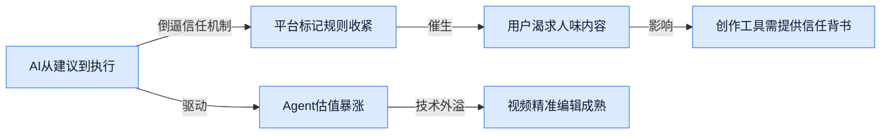

> AI 早报 · 每日早读 · 全网深度聚合

## **今日摘要**

```
```

### 🔵 产品与功能更新

1. **Warp（一款智能终端开发工具）押注开源，深度集成 GPT-5.5（OpenAI 最新推出的模型版本）来协调编码代理。**
  知名开发者终端 Warp 最近搞了个大动作 💥——直接把 **GPT-5.5** 和一系列 OpenAI 模型接入了自己的平台，用来统一调度**本地、云端以及开源社区里的编码代理**（coding agents，能自动帮你写代码、查 Bug 的 AI 助手）。这意味着不管你是在自己的 Mac 上敲代码、在远程服务器上跑任务，还是在 GitHub 上参与开源项目，Warp 都能让 AI 帮手在不同环境里无缝衔接，把重复劳动自动搞定 🚀。对非技术同事来说，这就像是“终端里的 Photoshop 突然学会了协同办公”，开发效率的提升肉眼可见。[OpenAI 官方合作案例页面(briefing)](https://openai.com/index/warp)

### 🟢 前沿研究

1. **Gemini Embedding 2（谷歌原生多模态嵌入模型）登场，一次搞定图文音视频。**
谷歌推出新一代**多模态嵌入模型**，它不再需要先把图片转成文字再做比较，而是能够直接理解图片、视频和音频的原始内容，将它们转换成一套用于搜索、分类和推荐的“语义坐标”（embeddings，把任何内容转成高维向量，让机器能像比较数字一样比较相似度的技术）🌐。这意味着一键“以图搜视频”或“用音频找图片”的场景会更流畅、更精准。[HuggingFace 论文页(briefing)](https://huggingface.co/papers/2605.27295)


2. **Claude Mythos（Anthropic 旗下专注数学推理的模型）用“可爱又简单”的证明拿下了 OpenAI 的 Erdős 难题。**
这个叫 **Mythos** 的 Claude 变体，据称成功解决了图论界著名的 **Erdős 匹配猜想** 的一个关键版本——这个难题曾被 OpenAI 内部列为衡量数学突破的标杆 💡。报道中提到的证明思路非常“简洁优雅”，与大众想象中 AI 靠蛮力穷举的方式不同，更像是人类数学家的灵光一现，显示了高阶推理模型在纯粹智力探索上的巨大潜力。[完整报道(briefing)](https://the-decoder.com/claude-mythos-reportedly-solves-openais-landmark-erdos-problem-with-a-cute-simple-proof/)

3. **LocateAnything（开源视觉语言定位模型）让 AI 看图说话时瞬间“指哪打哪”。**
这项研究提出了一种**并行框解码**的加速技术，把语言指令在图中“圈出目标”（visual grounding，视觉语言定位，让 AI 听懂一句“左下角那个红色的碗”并立刻在图片里用框标出来）的速度和质量大幅提升 🎯。对于需要实时识别图表、视频流中特定物体的应用场景，比如电商搜图或视频编辑，这种又快又准的定位能力至关重要。[HuggingFace 论文页(briefing)](https://huggingface.co/papers/2605.27365)

4. **研究揭示“尺度向量”的存在：大语言模型里微不足道的小参数，竟能左右全局风格。**
论文发现，在庞大的万亿参数模型中，藏着一些体积极小、但影响力巨大的 **Scale Vectors（尺度向量，可以理解为模型内部控制“表达力度”的隐藏开关）** 🔍。只需要轻轻拨动这个微不可察的开关，就能让同一个模型在回答时变得**啰嗦详尽**或**极度精简**，这为未来低成本、精细化的模型行为控制（fine-tuning 之外的替代方案）提供了全新的理论方向。[HuggingFace 论文页(briefing)](https://huggingface.co/papers/2605.26895)

5. **VitaBench 2.0（个性化主动 AI 智能体评测基准）发布，长期陪伴型 Agent 不再是黑箱。**
要打造一个能记住你爱吃香菜、并提前帮你点好外卖的**主动式 Agent**，难点在于如何评测它“是不是真的懂你”。**VitaBench 2.0** 构建了一套关注长期记忆、个性化和预判能力的全新考题 📝，专门检验 AI 助手在与用户长线互动（long-term interactions）中，能否主动提供恰到好处的服务而不是变成烦人精。[HuggingFace 论文页(briefing)](https://huggingface.co/papers/2605.27141)

6. **JLT（潜空间扩散模型的新训练方法）通过“跳过噪声”直接预测清晰画面，显著提升生成质量。**
在 **Latent Diffusion Transformers（潜空间扩散变换器，目前主流 AI 绘画工具底层的生成模型架构）** 的传统生图流程中，模型要学的是如何去掉噪点；而 **JLT** 另辟蹊径，直接让模型预测**干净无噪的潜变量**（clean-latent，即图像在数据压缩空间里的纯粹形态）🧼。这种“直捣黄龙”的思路让生图过程更快且纹理更细腻，可能会直接影响下一代 AI 绘图工具的效果上限。[HuggingFace 论文页(briefing)](https://huggingface.co/papers/2605.27102)

7. **微软 MAI-Image-2.5 图像生成模型在权威评测中追平谷歌 Nano Banana 2。**
在最新的 **Artificial Analysis 图像竞技场** 跑分中，微软自研的 **MAI-Image-2.5** 模型表现相当抢眼，整体质量已经和谷歌的 **Nano Banana 2（谷歌推出的极速文生图模型）** 打成平手，尤其在生成文字和遵循复杂指令方面有突出表现 🍌⚔️。这标志着图像生成领域的“军备竞赛”愈发激烈，每天用的办公软件里整合的 AI 生图功能正以月为单位快速进化。[完整报道(briefing)](https://the-decoder.com/microsofts-mai-image-2-5-pulls-even-with-googles-nano-banana-2-on-benchmarks/)

8. **MUSE-Autoskill（自进化 AI 智能体框架）让 Agent 能像玩游戏学技能一样，自己创造、记忆并评估新能力。**
该框架让 AI 有了一个 **“技能库 + 记忆网 + 练功房”** 的闭环系统：Agent 不仅能在执行任务时**创造**新技能，还能把技能存入**记忆**，并在后续同类场景中自动**调用和评估**效果 🧠。这种 **Self-Evolving（自进化）** 机制，意味着未来的 AI 助手或许不需要人类手把手更新，自己就能在长期工作中迭代出更高效的新工作流。[HuggingFace 论文页(briefing)](https://huggingface.co/papers/2605.27366)

### 🟡 行业展望与社会影响

1. **AI 编程代理 Devin（能自主完成开发任务的全流程 AI 助手）母公司 Cognition 估值翻倍至 260 亿美元。**
这家成立不到两年的创业公司刚完成 10 亿美元新一轮融资，年化收入（ARR，按当月收入推算全年收入的预估指标）已冲到 4.92 亿美元 💰。投资方给出的投前估值（融资前公司估值）为 250 亿，融资后直接飙到 260 亿，距上一轮仅隔 8 个月就翻了一番以上，足见资本市场对 **AI 编程代理** 商业前景的狂热预期 🚀。[估值飙升详情(briefing)](https://techcrunch.com/2026/05/27/ai-coding-startup-cognition-raises-1b-at-25b-pre-money-valuation/) [更多商业数据(briefing)](https://the-decoder.com/ai-coding-agent-devin-maker-cognition-more-than-doubles-its-valuation-to-26-billion-in-under-nine-months/)


2. **Nvidia（英伟达）在台湾的年支出从 150 亿暴涨至 1500 亿美元，AI 如何改写全球供应链。**
AI 大爆发让英伟达的 GPU（图形处理器，训练大模型的核心算力硬件）需求激增，而台积电等台湾半导体巨头正是全球先进芯片的 **制造命脉**。短短数年间，英伟达砸在该地区的年采购与投资规模膨胀了整整一个数量级，这不仅反映出 **GW 级算力（吉瓦级电力规模的数据中心）** 竞赛的白热化，也凸显了单一地区在 AI 基础设施里越来越重的分量 ⚡。[资金爆增分析(briefing)](https://the-decoder.com/the-ai-boom-drove-nvidias-yearly-taiwan-spending-from-15-billion-to-150-billion/)


3. **YouTube 收紧 AI 内容政策，但为知名创作者开了“绿灯”。**
官方将从本月起试行 **自动标记系统**，用算法识别并标注包含 AI 生成或合成画面的视频 🏷️。新规总体趋严，却特意留出一项重要例外：部分已经验证的大频道和音乐合作伙伴在发布 AI 合成内容时可获得更宽松的处理，这意味着商业影响力在平台规则制定中依然占据很大话语权。[政策例外细节(briefing)](https://news.google.com/rss/articles/CBMiY0FVX3lxTFBhUmZMemljbFh6OGp4MnBSVG9oX2VVOGpLUnhyY3Iwc1hpRVlFRXhYWW5NY0Nmb1NPbHdhTS15Mm1EWWE1WFhUMWdVWndkT0U4RHN5TVB1ZVRrNXNwbG9aTURyRQ?oc=5) [自动标记系统上线(briefing)](https://the-decoder.com/youtube-will-try-to-automatically-flag-ai-videos-starting-this-month/)


4. **Robinhood（美国知名零佣金互联网券商）开放 AI 代理替用户自主炒股与刷卡消费。**
新功能允许用户授权一个 **AI 代理**，直接在其账户内执行买卖股票、完成信用卡付款等真实金融操作 💳。当 AI 从“给建议”进化到“直接花钱”，资金安全和监管边界立刻成为焦点，Robinhood 这一步把 **Agent（能自主规划并执行多步骤任务的智能体）** 直接推到了个人财务决策的最前沿。[Robinhood 代理交易官宣(briefing)](https://the-decoder.com/robinhood-lets-ai-agents-trade-shares-and-make-credit-card-purchases-for-customers/)

5. **思科携手 OpenAI 用 Codex（OpenAI 的代码生成与理解模型）重塑企业级工程开发。**
两家公司将围绕 **AI-native 开发（让 AI 贯穿开发全流程的工作方式）** 深度合作，把 OpenAI 的推理能力嵌入思科的内部工具链，重点加速 **AI 防御** 领域的产品迭代，并实现缺陷修复的全自动化 🛠️。对非科技公司来说，这传递出一个清晰信号：未来的企业软件开发，正从“人写代码，AI 辅助”转向“AI 写代码，人做决策”。[思科与 OpenAI 合作公告(briefing)](https://openai.com/index/cisco)

### 🟣 开源TOP项目

1. **Anthropic 发布 Claude Code 官方插件目录。**  
  这是 Anthropic 官方亲自维护的高质量插件清单，专门给 Claude Code 用的 —— 就像应用商店一样，找插件不用全网瞎翻了 🛠️。开发者现在可以直接从这里挑选经过官方审核的扩展，给自己的 AI 编码助手装上各种实用能力。如果你平时让 Claude Code 改代码、写脚本，这个目录能让它的功能瞬间“开挂”。  
  [GitHub 仓库(briefing)](https://github.com/anthropics/claude-plugins-official)


2. **学术研究技能工具包（academic-research-skills）上线，Claude Code 变身完整论文流水线。**  
  这个开源项目把论文写作的全流程 —— 从**研究**到**写作**，再到**审查、修订、定稿** —— 打包成一个可自动执行的技能链 🎓。你只要给一个主题，Claude Code 就能按步骤帮你查资料、写初稿、自己挑刺儿、反复修改直到完工，像一个不知疲倦的学术助理。对于经常要写报告、做调研的文职同事来说，这也是一个理解“AI 如何衔接复杂工作流”的生动例子。  
  [GitHub 仓库(briefing)](https://github.com/Imbad0202/academic-research-skills)


3. **隐形浏览器 CloakBrowser 通过全部机器人检测，完美平替 Playwright（微软的浏览器自动化测试工具）。**  
  这个基于 Chromium（Chrome 和 Edge 的底层开源浏览器内核）的“隐身”浏览器，在 30 项网站机器人识别测试中**全部通过**，伪装能力登峰造极 🕵️。更厉害的是，它可以直接替换 Playwright，让原本会被网站拦截的自动化任务（比如批量抓取数据、自动填表）丝滑运行。项目在代码层面打好了**指纹伪装补丁**，对开发者来说几乎无感切换。  
  [GitHub 仓库(briefing)](https://github.com/CloakHQ/CloakBrowser)


4. **个人 AI 超级智能助手 OpenHuman（开源项目）追求私有、极简的巅峰体验。**  
  OpenHuman 的定位很像一个放在你本地的超级大脑，强调**私密、简单却极其强大** 🤖。它不走云端，数据都在你手里，适合不想把私人信息往大厂服务器上搁的用户。虽然项目还很年轻，但这种“个人专属 AI 大脑”的思路，可能将来会催生每个人口袋里都揣着一个的超级助理。  
  [GitHub 仓库(briefing)](https://github.com/tinyhumansai/openhuman)

5. **Anthropic 开源知识工作者插件库，为 Claude Cowork（Anthropic 的协作工作平台）注入强大生产力。**  
  这个仓库专门为**知识工作者**（日常和文档、分析、创意打交道的人群）设计了一组插件，让 Claude Cowork 平台处理办公室任务的能力暴涨 💼。无论是整理会议纪要、撰写项目方案，还是梳理复杂信息，这些插件都能让 AI 协作更贴合真实的办公节奏。不用等官方更新，社区就能一起贡献各种效率神器。  
  [GitHub 仓库(briefing)](https://github.com/anthropics/knowledge-work-plugins)

6. **CodeGraph（代码知识图谱工具）用预索引让 Claude Code 省 Token、少调用、快得飞起。**  
  这个工具先把整个代码库扫一遍，建成一张**知识图谱**（把代码里类、函数、调用关系变成一张可查询的关系网），然后直接喂给 Claude Code 🗺️。这样模型就不需要每次都从零读代码，**Token（模型处理的文本单元）消耗和工具调用次数双双下降**，而且整个图谱 100% 在本地生成，代码绝不外泄。对于习惯了让 AI 读项目代码的研发同事，这东西能让回答又快又省成本。  
  [GitHub 仓库(briefing)](https://github.com/colbymchenry/codegraph)

### 🔴 社媒分享

1. **Choosing to Stay Human（AI 时代选择“继续做人”的独立宣言）。**
   当社交媒体充斥着由 AI 生成的千篇一律的帖子时，个人独特的声音反而成了一种稀缺且有价值的存在 🎨。沃顿商学院教授 Ethan Mollick 指出，AI 之所以导致内容同质化，是因为它运行的机理本质上是“**token prediction**（预测下一个词的概率游戏，因此倾向于给出最“平均”的答案，缺乏独特性）”。这不仅是内容生态的危机，也为愿意独立思考的人提供了巨大的机遇：在一个连拒绝使用 AI 都能成为加分项的时代，展现粗糙但真实的自我，正逐渐成为建立信任和维护品牌差异化的核心竞争力。[来自 Ethan Mollick 的深度博客(briefing)](https://www.oneusefulthing.org/p/choosing-to-stay-human)


2. **复盘 SpaceX 上市：如果 AI 的终极算力在太空？**
   随着对算力的需求呈指数级增长，科技界将目光投向了地球之外的太空 🛰️。行业分析师 Ben Thompson 深度复盘 SpaceX 的商业逻辑时指出，**在太空建设 AI 数据中心（一种绕地轨道的算力基础设施）** 可能并非天方夜谭。利用太空无穷无尽的太阳能、天然的极限制冷环境，以及 Starlink（星链, SpaceX 的低轨卫星互联网项目）提供的星间激光链路，不仅能完美绕过地面数据中心面临的高能耗与土地限制，甚至可能通过**星对星通信**实现低于地表光纤 7 毫秒的极低延迟传输，这为未来处理海量 AI 任务提供了一种降维打击式的解决方案。[Ben Thompson 付费专文(briefing)](https://stratechery.com/2026/the-spacex-ipo-and-data-centers-in-space/)


3. **我认为 Anthropic 与 OpenAI 已找到 Product-Market Fit（产品与市场的完美契合点）。**
   知名独立开发者 Simon Willison 大胆断言，我们能感受到的“AI 体验变好”背后，是这两家公司迎来了商业化的决定性拐点 💰。Anthropic 刚刚传出即将实现首个盈利季度，而 OpenAI 的年化营收预计飙升至史无前例的 300 亿美元。这些公司不再仅靠“秀模型跑分”吸引眼球，而是通过 **API（应用程序接口，让其他软件直接调用 AI 能力的通道）** 率先抹平了价格劣势，同时凭借 **代码解释器**等强大的开发者工具生态，成功将技术领先转化为了真正的商业利润，证明了单纯靠“天才科学家”的氛围已行不通，深度理解企业客户的工程化需求才是赢家之道。[Simon Willison 的博客分析(briefing)](https://simonwillison.net/2026/May/27/product-market-fit/#atom-everything)

---



### 📊 行业洞察（今日 4 条）

1. Devin母公司估值260亿、Robinhood让AI代理自主炒股，两件事放一起看，AI正从"建议工具"跨越到"执行工具"
  【洞察】资本和技术在同时推动Agent从屏幕里的代码助手，变成能直接花你钱的数字员工。这不是渐进式改良，而是信任机制的根本性跳跃——过去我们问AI"你觉得该买什么"，现在直接让它"帮我去买"。对任何做工具的公司来说，这提出了一个新考题：当AI能直接替用户做决定，你的产品该站在哪个位置？是帮用户审查AI的决定，还是帮AI更快地执行决定？

2. YouTube收紧AI视频标记、但给大创作者开绿灯，"Choosing to Stay Human"爆火，共同指向内容平台的两难
  【洞察】平台想用规则建立用户信任，又怕得罪能带来流量的头部创作者。而观众那边，反而开始主动寻求"未经AI修饰"的粗糙真实感。这说明AI内容泛滥正在催生一个反向市场——谁能证明自己是"人做的"，谁反而有溢价。对内容创作工具来说，"帮助人高效创作"和"替代人批量生成"之间的界限，已经影响到品牌商的信任账本。

3. 谷歌Gemini Embedding一次性理解图文音视频，加上LocateAnything在画面里"指哪打哪"，视觉AI正从"看懂大概"走向"精准定位"
  【洞察】过去的AI看图，像近视眼没戴眼镜——知道这是个人、那是辆车，但你要它"圈出左下角红色那个碗"，它找不到。现在这两个技术叠加，说明视频和图像的可搜索、可编辑粒度正在大幅提升。对做视频剪辑工具的我们来说，这意味着"用自然语言精准操作画面中某个元素"的体验，技术基础已经成熟了。

4. Claude Mythos证明数学难题、JLT跳过去噪直接生图、微软追平谷歌生图模型，今天的研究新闻全在说同一件事
  【洞察】AI的能力密度正在同时向"更深"和"更快"两个方向扩展。一边是能解人类数学家都头疼的数学猜想，一边是生图速度和质量双双提升。但这两件事背后的真正信号是：头部模型之间的技术差距在缩小，当大家都追平时，差异化就不再是"谁更聪明"，而是"谁更懂用户的工作流"。

### 💭 对我们的启发（今日 3 条）

1. YouTube自动标记AI视频 + "Stay Human"宣言，说明品牌商未来会更在意视频的"人味"证明。我们的剪辑工具可以加一个"创作指纹"功能，让每条视频记录真实的编辑操作轨迹、素材来源、人工干预节点——这不是防止AI生成，而是帮客户证明"这是人做的"，在投放时变成信任资产。

2. LocateAnything和Gemini Embedding的进展，验证了一个产品方向：用户未来应该能对着视频画面说"把产品Logo放大一点"或"把背景这个角落模糊掉"，而不是在时间轴上手动选图层。这是我们下一版智能剪辑功能的技术可行性在提高。

3. 学术研究技能工具包和知识工作者插件库的出现，说明复杂工作流的"自动技能链"正从编程领域溢出到文档处理。我们的视频模板系统可以借鉴这种"研究→初稿→自审→定稿"的思路，做成"选品分析→素材匹配→初剪→品牌合规检查→输出"的自动流水线，帮品牌商省掉反复返工的环节。


---

> 本周周报：[第22周综合分析](https://zhuxinfei.github.io/ai-daily-site/blog/weekly/2026-w22/)
