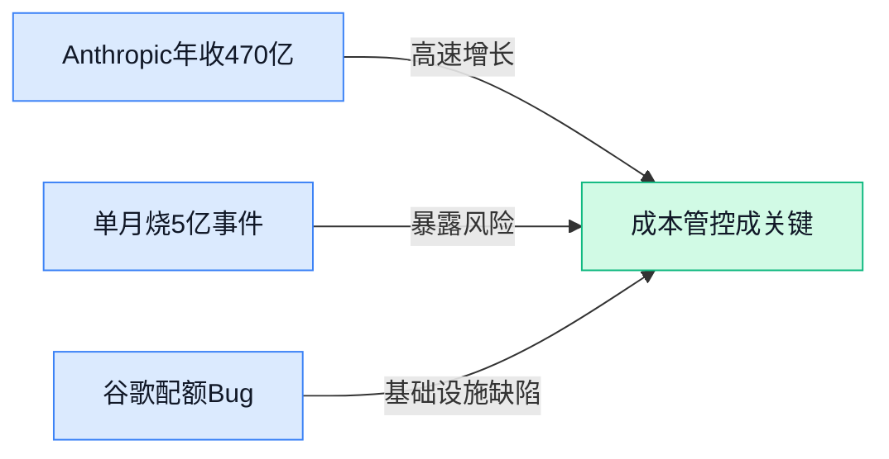

> AI 早报 · 每日早读 · 全网深度聚合

## **今日摘要**

```
```

### 🔵 产品与功能更新

1. **Google 修复 Gemini 使用额度（API 调用配额）过快消耗的多项 Bug。**
    使用 Gemini 的小伙伴最近可能会感觉**配额**怎么用得飞快 🔥？Google 最近确认了这一问题并修复了多个导致配额消耗过快的 Bug。其中包括：在执行完**工具使用**（让模型自动调用外部工具或 API 完成任务）任务后，底层的 **token（模型处理文本的最小单元）** 计数器没有正确归零，导致下一轮对话被误扣大量额度；此外，当 AI 需要从外部知识库检索但内容未命中时，本该只扣除一次**缓存查询**的额度，系统却错误地计算了多次 💡。这些修复将让开发者的使用成本回归正常。[Google 修复 Gemini 配额消耗 Bug 详情(briefing)](https://the-decoder.com/google-fixes-several-bugs-in-gemini-usage-limits-that-burned-through-quotas-too-fast/)


### 🟢 前沿研究

1. **Qwen-VLA（通义千问系列视觉-语言-动作统一模型）打通跨任务、跨环境、跨机器人形态的统一建模。**
阿里通义千问团队这次瞄准了机器人领域最难的问题：怎么让一个模型同时看懂图、听懂话、还指挥得动不同形状的机械臂 🤖。这篇论文提出了一个 **Vision-Language-Action（视觉-语言-动作）统一框架**，不再需要为每个机器人单独训练一套指令系统，而是用一个模型泛化到各类任务上。[Qwen-VLA 论文详情(briefing)](https://huggingface.co/papers/2605.30280) 这对未来“一个大脑控制多种机器人”的愿景来说，是相当扎实的一步 💡

2. **LoRA（低成本微调技术）如何记住知识？研究者发现了参数化记忆定律。**
用 **LoRA（一种只更新极少量参数就能微调大模型的技术，省钱省算力）** 给大模型“补课”时，它到底是怎么记住新知识的？这篇论文给出了一套**参数化记忆定律**，把微调时的记忆能力用数学公式量化了出来 🧠。也就是说，以后工程师可以像查表一样，精确估算出需要多少数据和训练量，才能让模型稳定记住某项新技能 [详细研究(briefing)](https://huggingface.co/papers/2605.30260) 🚀

3. **LaRA（层级表征分析工具）专抓强化学习后训练中的数据污染。**
训练 AI 的过程中如果不小心混入了脏数据（像考试前偷看了答案），模型的真实水平就会失真。这篇提出的 **LaRA（Layer-wise Representation Analysis，逐层分析模型内部信息编码的方法）** 专门在 **强化学习后训练**（让模型通过奖励信号学会更优策略的进阶训练）阶段检测这种“作弊行为”，通过观察模型每一层的**表征（representation，模型把文字/图像转化成的内部数字指纹）** 变化来揪出污染数据 [LaRA 论文链接(briefing)](https://huggingface.co/papers/2605.29888)，对保证 AI 评测的真实性很有价值 🔍

4. **CausaLab（可扩展交互式因果发现环境）想让 AI 学会像科学家一样探索因果。**
真正的智能不只会看相关性，还得追问“为什么”。**CausaLab** 搭建了一个**交互式实验沙盒**，让 AI 能像科学家一样主动设计实验、收集数据、推翻或验证因果假设 🔬。这相当于给 AI 配了一套研究因果逻辑的健身房，未来有望催生出能自主提出科学假说的 AI 研究员 [CausaLab 研究页面(briefing)](https://huggingface.co/papers/2605.26029) 💡

5. **VITRA（微软提出的 VLA 预训练新范式）通过人类视频重建重新定义机器人学习。**
微软这项研究把机器人学习玩出了新花样：不再只靠昂贵的机器人采集数据，而是让模型看海量**人类日常视频**，再通过**视频重建**任务来理解动作意图 🎥。这个名为 **VITRA** 的方法改写了 **VLA（Vision-Language-Action，统一视觉、语言和动作的模型）** 的预训练范式，让机器人在没接触过的真实环境中也能更灵活地完成任务 [微软 VITRA 研究报道(briefing)](https://news.google.com/rss/articles/CBMi0AFBVV95cUxPalMtQUlPX3gzcUlzODdYdGQ5TG53OHFFOVZWaUw1SmZvdUxSdTRHd3F6UTBTYVQ2S0JlSnhCV29GYlFZUFA4LXgzMF9Vei1SY3NieEZBLXlLR1ZzN1d2LThWRWJQZTdlTHlBVXNSVUM1MnNyaEo3TVVoaWlLV2RTa0MtdkpTaG1ZYTg0Z28wZjAzeTlIXzUwODRGQTNHTDRKclNYRDlhQXhsQWYyNmY2UjFTWnEtd3IxT1pfYUpIa1NkUGdFU2oyeVdzRXRGSjVx?oc=5) 🌟

6. **AgentDoG 1.5（轻量级 AI Agent 安全对齐框架）给智能体戴上更容易部署的“安全嚼子”。**
随着 AI Agent（能自主规划、执行多步任务的智能体）越来越强，怎么防止它乱来成了大问题。**AgentDoG 1.5** 就是一个**轻量、可扩展的安全守护框架**，能在不拖慢速度的前提下，把 **alignment（对齐，让模型行为符合人类意图和价值观的训练过程）** 约束灵活植入到智能体的每一个动作里，有点像给飞奔的猎犬套上软绳，既不影响撒欢又防跑偏 🐶 [AgentDoG 论文详情(briefing)](https://huggingface.co/papers/2605.29801)

7. **OmniRetrieval（跨异构知识源统一检索框架）要把散落在各处的企业知识一次性搜出来。**
很多公司做内部 AI 问答时都会头疼：文档、数据库、图片信息零零散散，很难一起查。**OmniRetrieval** 这个框架就是来解决**异构知识源**（格式、结构都不一样的数据）的统一检索问题的 🗂️。它能让 AI 在背后同时翻看各种格式的资料，大幅提升 **RAG（检索增强生成，让 AI 回答前先查资料的机制）** 系统的实用性 [OmniRetrieval 研究页面(briefing)](https://huggingface.co/papers/2605.29250) 🚀

8. **Xetrieval（稠密检索机制解释工具）把 AI 搜索的“黑箱”拆开给你看。**
**稠密检索（Dense Retrieval，一种把文字变成向量，用距离远近来判断相关性的搜索技术）** 虽然很强大，但一直像个黑箱，我们搞不清模型为什么选了这句话。**Xetrieval** 专门给这个“黑箱”做手术级的机理剖析，用**可解释性手段**指出究竟是文本里的哪些关键词或语义片段影响了检索结果 [Xetrieval 论文链接(briefing)](https://huggingface.co/papers/2605.29507)，让 AI 搜索在金融、医疗这些高要求场景里更值得信赖 🔎

### 🟡 行业展望与社会影响

1. **波士顿儿童医院（Boston Children‘s Hospital，全美顶尖儿科医院）借 AI 解锁 40+ 罕见病新诊断。**
    **OpenAI** 的技术正从“帮你写邮件”走进“帮医生救孩子” 🏥！波士顿儿童医院利用其 AI 模型显著减轻了医护人员的文书负担，更关键的是，这套系统在复杂的基因数据中发现了蛛丝马迹，成功辅助诊断出超过 40 例疑难罕见病。这意味着 AI 不再只是聊天工具，它开始实质性地推动**精准医疗**（根据每个人的基因和环境定制治疗方案）的落地，让那些过去可能需要数年才能确诊的漫长求医路被大幅缩短。[OpenAI 官方案例分享(briefing)](https://openai.com/index/boston-childrens-hospital)


2. **Anthropic 估值逼近万亿美元，AI 商业价值冲上新高度。**
   这家 Claude 的母公司正在进行新一轮 650 亿美元的 H 轮融资（即第 8 轮左右的超大额融资，通常意味着公司已非常成熟），将其估值直接推近**万亿美元**大关 💰。这背后折射出资本市场对顶级大模型军备竞赛的极度狂热，大家押注的是下一代 AI 操作系统级的入口。对于行业外的人来说，这个数字说明 AI 公司俨然成为全球资本版图中最粗壮的那根支柱，未来改变的不只是软件，而是整个商业世界的运转规则。[Anthropic 万亿估值详情(briefing)](https://the-decoder.com/claude-company-anthropic-nears-a-trillion-dollar-valuation-after-raising-65-billion-in-series-h/)

3. **有公司单月“烧掉”5 亿美元调用 Claude，AI 使用成本一旦失控有多可怕。**
    这绝对是近期最让人瞳孔地震的行业八卦之一 😱！据财务平台分析，某家公司在未能设定好 **API 调用上限**（限制应用程序接口访问次数防止账单爆表）的情况下，一个月内给 Claude 贡献了惊人的 5 亿美元账单。这条新闻对所有想引入 AI 的业务和财务同事都是个警示 —— 大模型的能力虽强，但如果不做好**成本和权限管控**，AI 可能瞬间从降本增效的利器沦为极其昂贵的“吞金兽”。[账单“惨案”完整报道(briefing)](https://the-decoder.com/one-company-reportedly-spent-500-million-on-claude-in-one-month-after-failing-to-cap-ai-usage/)

4. **英伟达 200 亿“非买人”交易后，AI 芯片新贵 Groq 被曝寻求 6.5 亿融资转身。**
    在英伟达那场并非为了收购人才的特殊交易余波下，AI 芯片初创公司 **Groq** 正在筹划一笔巨额内部融资。重点在于，这家原本以卖硬件闻名的公司正试图转型，把重心押注在 **AI 推理（Inference，指已经训练好的模型实际回答问题、生成内容的计算过程）**上 🧠。这对行业的信号是：未来 AI 芯片的战场可能从“怎么把模型练出来”逐渐转移到“怎么让模型跑得又快又省”，解决 AI 落地到手机、汽车等终端的实时响应问题。[Groq 转型融资报道(briefing)](https://techcrunch.com/2026/05/29/after-nvidias-20b-not-acqui-hire-ai-chip-startup-groq-reportedly-raising-650m/)

5. **OpenAI 向全球政府免费开放生命科学模型，为下一次大流行做准备。**
    为了让全世界能更好地应对突发公卫危机，OpenAI 宣布将其专门训练的 **GPT Rosalind（一个专注于生命科学领域的 AI 模型）** 免费提供给各国政府 🌍。这个模型能够加速病原体分析、疫苗设计等**复杂的生物信息学工作**（通过计算手段解读生物大数据的学科）。这展现了头部 AI 公司不单单在追逐商业利润，也在把技术作为**全球公共品**，试图在病毒面前筑起一道由算法驱动的防线。[OpenAI 生物模型开源详情(briefing)](https://the-decoder.com/openai-is-giving-away-its-life-sciences-ai-model-to-help-governments-prepare-for-the-next-pandemic/)

6. **谷歌 I/O 大会自曝“氛围编程”，让非程序员也能用 AI 搓出个小测验。**
    在今年的谷歌 I/O 开发者大会上，官方展示了一种叫 **vibe coding（指完全用自然语言描述需求，靠 AI 生成全部代码而无需亲手敲键盘的编程方式）** 的新玩法，他们自己就用这种形式在 **Google AI Studio（谷歌推出的 AI 原型搭建与实验平台）** 上搓出了一个互动问答游戏 🎮。这对于完全不懂代码的运营和设计同事绝对是好消息，它预示着一个“想到就能做到”的时代越来越近，做一些轻量级的小应用、小演示将不再是技术团队的专利。[谷歌官方博客演示(briefing)](https://blog.google/innovation-and-ai/technology/ai/io-2026-vibe-coded-quiz/)

### 🟣 开源TOP项目

### 🔴 社媒分享

1. **Anthropic 年化收入冲上 470 亿美元。**  
在近期 650 亿美元的 H 轮融资公告里，Anthropic 悄悄透露了一个关键数字：**年化经常性收入（run‑rate revenue，即按当前月收入推算出的全年营收）** 已突破 470 亿美元 🚀。这个成绩距离 2 月份的 G 轮仅过去一个季度，说明 Claude 等产品在商业端正高速铺开。不少观察者认为，这才是整篇公告中真正“藏不住”的增长信号。[Simon Willison 的点评(briefing)](https://simonwillison.net/2026/May/29/anthropic/#atom-everything) 及 [Anthropic 官方融资公告(briefing)](https://www.anthropic.com/news/series-h)


2. **Liquid AI 发布 8B‑A1B MoE（混合专家模型），训练数据量达 38T。**  
Liquid AI 推出了 LFM‑2.5 模型，采用 **MoE（混合专家模型）** 架构——你可以理解成有一群“小专家”组团工作，每次推理只唤醒一部分，既省计算又保性能 💡。该模型总参数 80 亿，但每次实际激活参数仅 10 亿，并在 **38 万亿（38T） tokens** 的超大规模数据上训练而成，瞄准的是更低成本的部署场景。[Liquid AI 官方博客(briefing)](https://www.liquid.ai/blog/lfm2-5-8b-a1b)


3. **聊天机器人与智能体 (Agent) 终将走向融合。**  
一篇分析指出，**聊天机器人** 和 **AI Agent（能自主执行多步任务而不仅限于对话的智能体）** 之间的边界正在快速消失 🤖。未来你可能会习惯用一个对话框完成查资料、下订单、排日程等一连串操作，而不需要去区分“聊天”与“自动化”。这背后是模型能力跃升后，对话式界面正逐渐变成一切智能任务的统一入口。[Big Technology 原文(briefing)](https://www.bigtechnology.com/p/the-chatbots-and-agents-are-going)


4. **Mistral（法国 AI 初创公司）Now 峰会亮点速记。**  
开发者 Koen van Gilst 参加了 Mistral 的 **AI Now 峰会**，并把现场发布、技术路线等整理成了一份笔记 🌐。作为欧洲开源力量的代表，Mistral 这次峰会上透露了模型更新、企业级功能等新动向，对关注多语言和可控部署的同学很有参考价值。[Mistral AI Now 峰会笔记(briefing)](https://koenvangilst.nl/lab/mistral-ai-now-summit)

---



### 📊 行业洞察（今日 4 条）

1. Google修复Gemini配额消耗Bug，同一天曝出某公司单月烧掉5亿美元Claude费用
  【洞察】AI行业的成本控制还处在"手动挡"阶段,连大厂自己的计费系统都在犯错,普通公司更容易踩坑

2. Anthropic年化收入冲上470亿、估值近万亿,同时波士顿儿童医院靠AI诊断40+罕见病
  【洞察】AI正从"聊天玩具"变成真能赚钱、真能救人的基础设施,但价值释放的前提是管好成本和风险

3. 谷歌推"氛围编程"让非程序员搓应用,OmniRetrieval框架统一检索企业散落知识
  【洞察】两件事放一起看,AI正把"动手能力"从技术团队下放到业务一线,做内部工具和知识问答的门槛在消失

4. Qwen-VLA统一跨形态机器人建模,VITRA用人类视频训练机器人,AgentDoG给智能体戴安全嚼子
  【洞察】机器人领域在同时解决"通用性"和"安全性",说明行业已经从炫技转向思考怎么让AI安全地走进真实世界

### 💭 对我们的启发（今日 3 条）

1. Google的配额Bug和5亿账单惨案提醒我们:视频剪辑软件如果集成AI功能,必须内置硬性的用量上限和费用预警机制,不能把这层风控完全交给客户自己去设

2. 谷歌"氛围编程"用自然语言搓出互动应用,说明未来品牌商可能直接用对话生成个性化视频模板——我们剪辑工具的价值得从"让操作更简单"升级到"让客户能说出需求就出片"

3. 波士顿儿童医院用AI从海量数据里挖出罕见病,验证了一个思路:视频创作工具如果能把品牌商散落在素材库、文案、投放数据里的信息统一检索分析,帮他们找到"什么内容最可能爆",会比单纯提供剪辑功能更有黏性


---

> 本周周报：[第22周综合分析](https://zhuxinfei.github.io/ai-daily-site/blog/weekly/2026-w22/)
