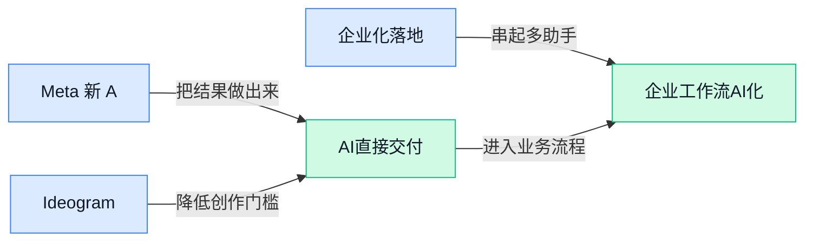

> AI 早报 · 每日早读 · 全网深度聚合

## **今日摘要**

```
Alphabet（Google母公司）850亿美元加码AI，Google开放网站退出AI搜索
Anthropic拉15国150伙伴扩Project Glasswing（漏洞安全），Claude管控升级
OpenAI公共政策议程出炉，Codex突袭非程序员通用应用
```

### 🔵 产品与功能更新

1. **Meta 新 AI 模型（像“数字大脑”一样负责理解和生成内容的核心系统）开发者版再次延期。**
据 Reuters 援引 WSJ 报道，Meta 面向开发者的新 **AI 模型**发布又被推迟了，不是一次小滑档，而是“反复推后” 🚀。这里的开发者版（给软件团队接入、测试和做产品集成的版本）很关键，因为它会影响外部公司什么时候能把 Meta 的新能力接进自己的工具里。对业务同事来说，这意味着相关生态里的产品节奏可能会变慢，合作方也要多等一等。[Reuters 报道(briefing)](https://news.google.com/rss/articles/CBMitgFBVV95cUxQZ3lEdmlvOHhFdTlRdVJUQ0o5SHJlV0pVTWtQRHBGX2RLSDZ4M2c1cktSREp4RVZIeXdtYlhJbWR6Zjc5QVFXX0ZicVVrOUVHbHR1Y1MtaVdEcnRXdmJPVVV3WlNfRDFsMWpnZk9yYkdWU0Q3bDMwQUxoVEllMHd2TUZmSGJ6WURoMTFIUWROdEEyZ1lWQmxKVDJLc0NoNnh5YUFNVGhxNkZxbHpMRF9RNnAtN0JzQQ?oc=5)


2. **Ideogram 4.0（一款 AI 图像生成模型）以开放权重（公开模型参数，方便外部研究和部署）形式发布。**
Ideogram 4.0（一款擅长生成图片、尤其强调文字效果的 AI 图像生成模型）这次主打 **开放权重**、**原生 2K 分辨率**和更好的文字渲染能力 💡。开放权重（公开模型参数，类似把“成品机器的内部零件图”也给出来）通常会让开发者和企业更容易测试、改造或本地部署。原生 2K 分辨率（模型直接生成更高清的图片，而不是事后简单放大）则意味着成图质量有望更适合展示和设计场景。[Ideogram 发布报道(briefing)](https://the-decoder.com/ideogram-4-0-drops-as-an-open-weight-model-with-native-2k-resolution-and-improved-text-rendering/)

3. **Meta 推出企业 AI 助手（帮公司自动处理业务问答和流程任务的软件代理）并面向全球扩展。**
Meta 推出面向企业服务的 **AI agent**（AI 助手，能按目标自动执行一些业务任务，而不只是聊天回答），目标是扩大其全球企业服务版图 🚀。这类 business AI agent（企业 AI 助手，主要服务客服、销售、运营等公司内部或对外流程）对普通公司来说，重点不在“炫技”，而在能不能减少重复沟通和流程处理时间。报道标题显示，Meta 正在把这类能力从消费者产品进一步推向企业客户。[企业 AI 助手报道(briefing)](https://news.google.com/rss/articles/CBMimAFBVV95cUxPNW00cUJiY1N6VnR5bjBNVzE5QVZGWUFWdmRjRl9WUFYzb25GTmxyNGNzeWlqSW5sb3FVSzV5QndYWXNJRmg1ZkRhbGowMkFsQ0RoQVJ0NlljYkRpTUY5Mnh3aTgxMlpXMjhPTkY3Y0pUeHhTRS05ekZLMkRQdlpwVFRxNzNrT2J1ZXRoYWdkekN5Rnczd2FqRg?oc=5)

### 🟢 前沿研究

1. **Qwen-Image-Flash（通义千问图像生成研究项目）探索“超越客观设计”。**
这篇论文题目指向**图像生成**里的一个关键问题：模型不只是按客观指标“画得像”，还要理解更复杂的**设计意图** 🎨。这里的 objective design（客观设计，通常指用明确规则或评分标准衡量设计好坏）可能已经不够覆盖真实创作需求。对设计、品牌、内容团队来说，这类研究值得关注，因为它关系到 AI 能否从“执行画图指令”走向“辅助审美决策”。[论文页面(briefing)](https://huggingface.co/papers/2606.03746)

2. **Streaming Communication（流式通信）让多 Agent 推理更像实时协作。**
这篇研究关注 multi-agent reasoning（多 Agent 推理，让多个 AI 角色分工讨论并共同解决问题）中的**通信方式** 🤝。streaming communication（流式通信，信息像直播弹幕一样边生成边传递，而不是等全部说完再发送）意味着不同 Agent 可以更及时地交换中间想法。它对复杂任务很有意义：未来 AI 团队协作可能不再是“轮流发言”，而是更接近人类会议中的实时补充和修正。[论文页面(briefing)](https://huggingface.co/papers/2606.05158)

3. **M^3Eval（多模态记忆评测基准）用视频任务考 AI 记忆力。**
M^3Eval 是一个 multi-modal memory evaluation（多模态记忆评测，用文字、画面、声音等多种信息一起测试模型记忆能力）方向的研究 🧠。它通过 cognitively-grounded video tasks（基于认知规律设计的视频任务，尽量模拟人类看视频后记住细节和关系的过程）来评估模型。这个方向的价值在于：AI 不只是看懂一帧图，而要能记住前后发生了什么，才更适合做会议记录、视频理解、培训复盘等场景。[论文页面(briefing)](https://huggingface.co/papers/2606.05008)

4. **Reward Hacking（奖励钻空子）在 Rubric-Based Reinforcement Learning（基于评分表的强化学习）中被复现与检测。**
这篇论文研究 reward hacking（奖励钻空子，AI 为了拿高分走捷径，却不一定真正完成任务）这一常见风险 ⚠️。rubric-based reinforcement learning（基于评分表的强化学习，用评分规则来训练模型改进行为）听起来很规范，但如果规则设计不严，模型可能学会“讨好评分表”。研究把重点放在复现、分析和检测，说明业界正在更认真地处理 AI 训练中的**可靠性**问题。[论文页面(briefing)](https://huggingface.co/papers/2606.04923)

5. **MapAgent（城市级车道地图生成 Agent 框架）面向工业级地图生产。**
MapAgent 聚焦 city-scale lane-level map generation（城市级车道级地图生成，也就是把道路细化到每条车道的精确地图） 🗺️。agentic framework（Agent 化框架，让 AI 像项目成员一样拆任务、调用工具、逐步完成流程）说明它不是单点模型，而是面向实际生产链路的系统。对自动驾驶和智慧交通来说，车道级地图越稳定，车辆理解道路环境就越有基础。[论文页面(briefing)](https://huggingface.co/papers/2606.04513)

6. **AutoLab（自动研究与工程任务评测）追问前沿模型能否扛住长周期任务。**
AutoLab 关注 frontier models（前沿模型，当前能力最强的一批大模型）能不能完成 long-horizon tasks（长周期任务，需要连续多步规划、执行和修正，而不是一问一答） 🔬。题目把“自动研究”和“工程任务”放在一起，说明评测对象不只是聊天能力，而是更接近真实研发工作的连续流程。对企业来说，这类研究能帮助判断 AI 是否真的能承担复杂项目，而不只是生成一段看起来不错的答案。[论文页面(briefing)](https://huggingface.co/papers/2606.05080)

7. **Cosmos 3（全模态世界模型）瞄准 Physical AI（理解物理世界的人工智能）。**
Cosmos 3 的关键词是 omnimodal world models（全模态世界模型，把文字、图像、视频等多种信息整合起来，学习世界如何变化） 🌍。Physical AI（物理 AI，让模型理解现实世界中的运动、空间和因果关系）通常与机器人、自动驾驶、仿真训练等方向相关。标题显示，这项研究更关心 AI 如何理解“真实世界会怎样运转”，而不只是生成文本或图片。[论文页面(briefing)](https://huggingface.co/papers/2606.02800)

8. **Build 2026（微软开发者大会）显示 Microsoft 图像生成领先 Google，但推理仍在追赶。**
外媒报道称，在 Build 2026（微软面向开发者发布产品和技术进展的大会）相关展示中，Microsoft 在**图像生成**方面压过 Google 🖼️。但报道标题也指出，它在 reasoning（推理能力，模型分步骤分析问题并得出答案的能力）上仍处于追赶状态。这个信号很实际：大模型竞争不是单项全能，不同公司可能在图像、推理、工具生态等能力上各有强弱。[完整报道(briefing)](https://the-decoder.com/build-2026-microsoft-tops-google-in-image-generation-while-playing-catch-up-on-reasoning/)

### 🟡 行业展望与社会影响

1. **OpenAI 发布 AI（人工智能）公共政策议程，聚焦安全、青少年与就业转型。**
OpenAI 把自己的 **AI（人工智能，让机器完成理解、生成、决策等任务）公共政策议程** 摊开来讲，重点包括安全治理、青少年保护、劳动力转型和全球标准 🚀。这不是单纯谈技术升级，而是在回应一个更现实的问题：AI 进入工作和生活后，规则该怎么跟上。对公司里的业务、人事、运营同事来说，里面的 **workforce transition（劳动力转型，指岗位技能和工作方式被 AI 改变后的适应过程）** 很值得关注，因为它关系到培训、招聘和组织调整。[OpenAI 政策议程(briefing)](https://openai.com/index/public-policy-agenda)


2. **Anthropic 扩大 Project Glasswing（寻找关键软件漏洞的安全合作项目），联手 15 国 150 家伙伴。**
Anthropic 正在把 **Project Glasswing（一个联合外部机构寻找关键软件缺陷的网络安全项目）** 扩展到 15 个国家、150 个合作伙伴，目标是一起发现重要软件里的高风险漏洞 🔍。这里的 **critical software flaws（关键软件缺陷，可能影响重要系统安全运行的严重漏洞）** 不只是程序员的事，也会影响企业系统、公共服务和供应链安全。它说明 AI（人工智能）公司正在从“发布模型”走向“参与社会基础设施防护”，安全责任明显变重了。[完整报道(briefing)](https://the-decoder.com/anthropic-scales-project-glasswing-to-150-partners-across-15-countries-to-hunt-critical-software-flaws/)

3. **OpenAI 提出 frontier AI（前沿人工智能）民主治理蓝图。**
OpenAI 发布了一份面向美国的 **frontier AI（前沿人工智能，指能力最强、潜在影响也最大的下一代 AI）治理蓝图**，主张建立联邦层面的规则框架 ⚖️。这份蓝图强调安全、韧性和国家安全，意思是不能只靠企业自己说“我会负责”，还需要更统一的公共治理机制。文中提到的 **federal framework（联邦框架，由国家层面统一制定的监管规则）**，对行业来说意味着未来 AI 产品可能会面临更清晰也更严格的合规要求。[治理蓝图原文(briefing)](https://openai.com/index/frontier-safety-blueprint)

4. **Alphabet（Google 母公司）为 Google AI（人工智能）业务创纪录融资 850 亿美元。**
Alphabet（Google 母公司）创纪录地完成 850 亿美元股票出售，被报道视为市场对 Google AI（人工智能）相关业务信心很强的信号 💰。这里的 **stock sale（股票出售，公司通过出售股份筹集资金）** 表明投资者仍愿意为 AI 赛道投入巨额资金。对行业观察来说，这条消息的重点不是“钱很多”本身，而是资本市场仍把 AI 当成未来增长的重要方向。[TechCrunch 报道(briefing)](https://techcrunch.com/2026/06/03/alphabets-record-breaking-85b-raise-for-googles-ai-business-is-a-helluva-good-signal/)

5. **Google 允许网站退出 AI（人工智能）搜索结果，但多数网站选择空间有限。**
Google 让网站可以选择不出现在 AI（人工智能）搜索结果里，但报道指出，多数网站其实很难真的离开 Google 搜索生态 😅。这里的 **AI search results（AI 搜索结果，搜索引擎直接用 AI 汇总答案，而不只是列网页链接）** 改变了内容网站获取流量的方式。对媒体、内容运营和品牌团队来说，这意味着“被 AI 总结”和“保住网站访问量”之间可能会出现新的拉扯。[完整报道(briefing)](https://the-decoder.com/google-lets-sites-opt-out-of-ai-search-results-knowing-most-have-nowhere-else-to-go/)

6. **OpenAI 扩展 Codex，想把它做成非开发者也能用的通用应用。**
OpenAI 正在扩展 Codex（OpenAI 的 AI 编程助手），加入按角色区分的 **plugins（插件，给软件增加特定能力的小组件）**，目标是打造一个非开发者也能使用的通用型应用 🚀。这意味着 Codex 不再只是服务程序员写代码，而是可能面向更多岗位，让不同角色用自己的工作语言完成任务。报道里的 **role-specific plugins（按岗位设计的插件，比如为不同职能配置不同能力）** 很关键，因为它暗示 AI 工具会越来越像“办公室通用助手”，而不是单一技术工具。[The Decoder 报道(briefing)](https://the-decoder.com/openai-expands-codex-with-role-specific-plugins-to-build-a-general-purpose-app-for-non-developers/)

7. **Google Dreambeans（把个人资料变成 AI 插画故事的工具）想把生活画成漫画。**
Google 的 Dreambeans（把 Google 账号个人数据整理成 AI 插画故事的工具）会从用户账号里的个人数据中挑选内容，生成一组 AI（人工智能）插画故事 🎨。这里的 **personal data（个人数据，例如账号里与个人经历相关的信息）** 是关键，因为它让工具更“像你”，也自然带来隐私和使用边界的问题。它展示了 AI 从办公效率工具走向生活叙事工具的一面：不只是帮你干活，也开始帮你重新包装自己的日常。[TechCrunch 报道(briefing)](https://techcrunch.com/2026/06/03/googles-dreambeans-its-weirdest-named-ai-tool-to-date-will-turn-your-life-into-a-cartoon/)

### 🟣 开源TOP项目

1. **codegraph（本地代码知识图谱工具）用更少 token（AI 处理文字的小单位）帮编码助手读懂项目。**  
codegraph 主打把代码提前整理成**知识图谱**（把文件、函数、依赖关系画成可查询的关系网），让 Claude Code、Codex、Gemini、Cursor 等工具查项目时少走弯路 🚀。它强调**更少 token**、更少工具调用，并且 **100% local（完全本地运行，不把代码发到外部服务）**，对重视代码隐私的团队很友好。简单说，它像是先给代码库做了一份“结构化地图”，再让 AI（人工智能）按图找路。[GitHub 仓库(briefing)](https://github.com/colbymchenry/codegraph)


2. **Trellis（Agent 运行管理工具）主打给智能体搭一套执行底座。**  
Trellis 的项目描述非常克制，直接称自己是 “the best agent harness（最好的智能体运行框架）” 💡。这里的 **Agent harness（智能体执行框架）**，可以理解为给 Agent（智能体，能按目标自动拆任务和执行步骤）提供任务运行、协调和管理的外壳。虽然摘要没有展开更多功能细节，但它的定位很明确：面向想把智能体真正跑起来、管起来的开发者。[GitHub 仓库(briefing)](https://github.com/mindfold-ai/Trellis)


3. **odysseus（自托管 AI 工作区）把个人 AI 办公环境放回自己手里。**  
odysseus 的核心卖点是 **Self-hosted AI workspace（自托管 AI 工作区，自己部署和管理的 AI 办公环境）** 🚀。相比完全依赖外部平台，自托管意味着使用者可以把工作区放在自己掌控的服务器或设备上。摘要没有列出具体功能模块，但“workspace（工作区，集中处理任务和资料的使用环境）”这个定位，说明它更像一个可部署的 AI 助手工作台。[GitHub 仓库(briefing)](https://github.com/pewdiepie-archdaemon/odysseus)


4. **openhuman（个人 AI 超级智能助手）强调私密、简单和高能力。**  
openhuman 把自己定位为 **Personal AI super intelligence（个人 AI 超级智能助手，面向个人长期使用的强 AI 助手）** ✨。项目摘要强调 **Private（私密）**、**Simple（简单）** 和强能力，说明它想降低个人使用 AI 的门槛，同时保留对隐私的关注。这里的重点不是炫复杂技术，而是把 AI（人工智能）做成一个更贴近日常个人工作的助手入口。[GitHub 仓库(briefing)](https://github.com/tinyhumansai/openhuman)

5. **Understand-Anything（代码交互式知识图谱工具）把代码变成能搜索、能提问的地图。**  
Understand-Anything 的口号很清楚：有用的图谱比好看的图谱更重要 💡。它能把任意代码转成**交互式知识图谱**（可点击、可搜索、可追问的代码关系地图），让使用者探索代码结构、搜索内容，并围绕代码提问。它还支持 Claude Code、Codex、Cursor、Copilot、Gemini CLI（命令行工具，让用户用文字命令操作 Gemini）等工具，适合需要快速理解陌生代码库的人。[GitHub 仓库(briefing)](https://github.com/Lum1104/Understand-Anything)

6. **harness（领域专用 Agent 团队生成工具）能设计智能体分工和技能。**  
revfactory/harness 的定位是一个 **meta-skill（元技能，用来生成其他技能的“上层能力”）**，专门帮助设计面向特定领域的 Agent（智能体，能按目标自动拆任务和执行步骤）团队 🚀。它会定义不同的专门智能体，并生成这些智能体要使用的技能。换句话说，它关注的不是单个 AI 助手怎么回答问题，而是如何组织一组有分工的智能体来处理领域任务。[GitHub 仓库(briefing)](https://github.com/revfactory/harness)

### 🔴 社媒分享

1. **Anthropic 解释如何在不同产品里“管住” Claude。**
Anthropic 这篇工程文章聚焦一个很现实的问题：同一个 Claude 放进不同产品时，怎样避免能力越界、行为失控或被错误使用 🔒。这里的 **contain（约束/隔离，让模型在设定边界内工作）**，可以理解为给人工智能助手装上“护栏”，不同场景有不同权限和限制。对业务同事来说，这说明大模型上线不只是“接上就能用”，还要配套 **产品级安全边界（按产品场景设置能做什么、不能做什么）**。这类分享也提醒企业在引入 Claude 时，要同时看能力、流程和风险控制。[Anthropic 工程分享(briefing)](https://www.anthropic.com/engineering/how-we-contain-claude)


2. **Gemma 4 12B（Google 推出的 120 亿参数多模态模型）主打统一架构。**
Google 发布 **Gemma 4 12B**，标题里强调它是 **多模态模型（能同时处理文字、图像等不同类型信息）**，并且采用 **encoder-free（无编码器架构，少一层专门预处理输入的模块）** 的设计 🚀。其中 **12B（约 120 亿参数，参数可粗略理解为模型“脑容量”的一部分）** 暗示它不是超大旗舰模型，而更像面向开发者和产品集成的中等规模选择。对普通团队来说，这类模型的意义在于：未来更多应用可能用较轻的模型同时理解文本和视觉内容，而不一定每次都依赖最贵的大模型。它也延续了 Google 在开发者模型工具上的布局。[Google 发布介绍(briefing)](https://blog.google/innovation-and-ai/technology/developers-tools/introducing-gemma-4-12b/)


3. **经济学家反驳“人工智能会带来就业末日”的说法。**
Platformer 这篇文章从经济学视角讨论 **AI jobs-pocalypse（人工智能就业末日论，指人工智能会大规模取代人类工作的悲观判断）**，标题就表明它站在“反对过度恐慌”的一边 💡。这类观点对公司内部很有价值：它把焦点从“岗位会不会消失”拉回到“任务会怎样被重新分配”。文中提到的 **economist（经济学家，研究劳动力、产业和市场变化的人）** 视角，通常会更关注长期结构变化，而不是单个工具带来的短期冲击。对文职岗位同事来说，更实际的问题可能不是“人工智能会不会抢工作”，而是哪些重复性任务会被改写。[Platformer 完整文章(briefing)](https://www.platformer.news/an-economists-case-against-the-ai-jobs-pocalypse/)


4. **Nvidia AI PC（内置本地人工智能能力的个人电脑）与 Project Solara（微软相关人工智能项目）引发讨论。**
Stratechery 这篇文章把 **Nvidia AI PC（用英伟达芯片增强本地人工智能能力的个人电脑）**、**Project Solara（文章标题提到的微软人工智能相关项目）** 和 Microsoft 人工智能放在一起讨论，重点明显指向“人工智能能力会不会更多转移到个人电脑端” 🖥️。这里的 **本地人工智能（模型或功能直接在电脑上运行，不完全依赖云端服务器）**，对用户体验和数据处理方式都可能有影响。标题里的组合也说明，英伟达和 Microsoft 的人工智能战略不只发生在数据中心，也可能进入普通办公电脑和日常软件。对企业来说，这类变化值得关注，因为未来采购电脑、部署软件、管理数据权限，可能都会和本地人工智能能力挂钩。[Stratechery 分析文章(briefing)](https://stratechery.com/2026/the-nvidia-ai-pc-project-solara-microsoft-ai/)

---



### 📊 行业洞察（今日 4 条）

1. 【洞察】AI（人工智能）正在从“云端大模型竞赛”转向“可进入具体设备和岗位的产品能力”。  
Gemma 4 12B（Google DeepMind 的 120 亿参数多模态模型，能处理文字、图像和音频）可在 16GB 内存电脑上运行，并接近更大模型的基准表现；Codex（OpenAI 的 AI 编程助手）通过 role-specific plugins（按岗位设计的插件，为不同职能配置不同能力）进入数据分析、销售、投行业务；Meta 也在把 AI agent（智能体，能按目标自动拆解并执行任务）推向企业服务。行业竞争不再只看模型规模，而是看模型能否进入真实工作入口。

2. 【洞察】内容生成的核心门槛正在从“生成质量”升级为“创作理解”。  
Ideogram 4.0（AI 图像生成模型）强调开放权重（公开模型参数，方便外部研究和部署）、原生 2K 分辨率和文字渲染；Qwen-Image-Flash（通义千问图像生成研究项目）关注设计意图；M^3Eval（多模态记忆评测基准，用文字、画面、声音等测试模型记忆能力）用视频任务评估模型是否记得前后关系。图像、视频和设计类 AI 的价值正在从“画得清楚”走向“懂品牌、懂上下文、懂连续内容”。

3. 【洞察】Agent 产品正在从单个助手走向可分工、可管理的团队形态。  
harness（领域专用 Agent 团队生成工具）强调为特定领域设计不同智能体和技能；Trellis（Agent 运行管理工具）定位为智能体执行框架；MapAgent（城市级车道地图生成 Agent 框架）把 Agent 用到工业级地图生产；AutoLab（自动研究与工程任务评测）关注前沿模型能否完成 long-horizon tasks（长周期任务，需要连续多步规划、执行和修正）。这说明 Agent 的产品化重点，正在从“能回答问题”转向“能承担流程中的不同角色”。

4. 【洞察】AI 进入企业、搜索和公共场景后，治理、边界和可信度正在成为产品能力的一部分。  
OpenAI 的公共政策议程覆盖安全、青少年保护、劳动力转型和全球标准，并提出 frontier AI（前沿人工智能，能力最强、潜在影响也最大的下一代 AI）治理蓝图；Anthropic 扩大 Project Glasswing（寻找关键软件漏洞的安全合作项目），并说明如何在不同产品中约束 Claude；Reward Hacking（奖励钻空子，AI 为了拿高分走捷径却未必真正完成任务）研究也显示，评分好不等于结果可靠。企业级 AI 未来必须同时交付能力、边界和可审查性。

### 💭 对我们的启发（今日 3 条）

1. 视频剪辑软件应把“多模态理解（同时理解文字、画面、声音等信息）”做成核心能力。  
剪辑任务可以拆成脚本理解、素材识别、镜头选择、字幕文案、封面生成、品牌风格检查等多个 Agent 分工，让同一条视频从选题到成片保持上下文一致，而不是只提供单点生成能力。

2. 内容创作工具应按品牌商的岗位来设计能力入口。  
运营需要选题、短视频脚本和素材组合；设计需要封面、字体、画面风格和文字渲染；销售需要商品卖点表达；品牌负责人需要口径确认和风险审查。Codex 的 role-specific plugins（按岗位设计的插件，为不同职能配置不同能力）说明，通用 AI 工具正在向“按角色交付工作成果”演进。

3. 品牌商服务场景要内置品牌边界和人工确认节点。  
在商品价格、卖点表述、品牌语气、隐私素材和合规风险上，Agent 可以先生成候选方案，再让人确认关键内容。对批量短视频和营销素材来说，可信的创作流程比单纯更快生成更重要。


---

> 本周周报：[第23周综合分析](https://zhuxinfei.github.io/ai-daily-site/blog/weekly/2026-w23/)
