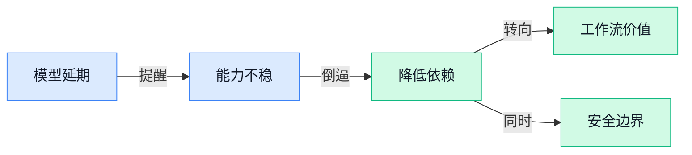

> AI 早报 · 每日早读 · 全网深度聚合

## **今日摘要**

```
Alphabet（Google母公司）为 Google AI 融资 850 亿美元，算力军备战重磅加码
OpenAI 连发政策议程与治理蓝图，Codex 扩成非开发者通用应用
Ideogram 4.0（AI图像模型）开放权重直出 2K，Gemma 4 12B 多模态登场
```

### 🔵 产品与功能更新

1. **Meta 新开发者 AI（人工智能）模型发布被多次推迟。**  
路透社援引《华尔街日报》称，Meta 面向**开发者**的新 AI（人工智能）模型发布已经多次往后推迟 🚀。这里的开发者模型，可以理解为给软件工程师接入产品、做应用功能的“底层能力包”。这类发布延期通常会影响外部团队的产品排期，尤其是已经等着接入新模型能力的应用方。对业务同事来说，信号很简单：**大模型发布节奏仍然存在不确定性**，不能只按传闻时间表做规划 💡。[路透延迟报道(briefing)](https://news.google.com/rss/articles/CBMitgFBVV95cUxQZ3lEdmlvOHhFdTlRdVJUQ0o5SHJlV0pVTWtQRHBGX2RLSDZ4M2c1cktSREp4RVZIeXdtYlhJbWR6Zjc5QVFXX0ZicVVrOUVHbHR1Y1MtaVdEcnRXdmJPVVV3WlNfRDFsMWpnZk9yYkdWU0Q3bDMwQUxoVEllMHd2TUZmSGJ6WURoMTFIUWROdEEyZ1lWQmxKVDJLc0NoNnh5YUFNVGhxNkZxbHpMRF9RNnAtN0JzQQ?oc=5)


2. **Ideogram 4.0（主打文字生成准确的 AI 图像模型）开放权重发布，原生支持 2K（更高清的图片分辨率）。**  
Ideogram 4.0（主打把海报、标语、包装上的文字画对的 AI 图像模型）这次以**开放权重**形式发布，意味着模型参数可供外部使用者下载和部署，而不只是在线调用 🚀。它还强调原生 2K（约 2000 像素级别的高清输出，适合更清楚的视觉素材）分辨率，图片细节会更适合展示和设计场景。另一个重点是**文字渲染**（让 AI 生成图片里的字更像正常排版，而不是乱码）能力改进，这对海报、电商图、社媒物料尤其关键。简单说，它把 AI 画图从“好看”继续推向“能直接放进工作流里用” 💡。[模型发布报道(briefing)](https://the-decoder.com/ideogram-4-0-drops-as-an-open-weight-model-with-native-2k-resolution-and-improved-text-rendering/)

3. **Meta 推出企业 AI Agent（能自动处理任务的人工智能助手），加速全球企业服务布局。**  
Meta 推出面向商业场景的 AI Agent（能按目标自动执行部分流程的人工智能助手），目标是把企业服务扩展到全球更多市场 🚀。这里的企业服务，指的是面向公司客户的工具和能力，不只是普通消费者聊天功能。对运营、销售和客服团队来说，这类 Agent 的意义在于：未来企业可能把更多重复沟通、信息整理和流程执行交给 AI 协助完成。虽然原文标题没有披露更细的功能清单，但方向很明确，Meta 正在把 AI 从个人助手推进到**企业级应用** 💡。[企业服务报道(briefing)](https://news.google.com/rss/articles/CBMimAFBVV95cUxPNW00cUJiY1N6VnR5bjBNVzE5QVZGWUFWdmRjRl9WUFYzb25GTmxyNGNzeWlqSW5sb3FVSzV5QndYWXNJRmg1ZkRhbGowMkFsQ0RoQVJ0NlljYkRpTUY5Mnh3aTgxMlpXMjhPTkY3Y0pUeHhTRS05ekZLMkRQdlpwVFRxNzNrT2J1ZXRoYWdkekN5Rnczd2FqRg?oc=5)

### 🟢 前沿研究

1. **Audio Interaction Model（音频交互模型，让 AI 更好理解和参与声音对话）聚焦语音场景。**  
这篇论文从标题看，关注的是**音频交互**，也就是让模型处理声音输入、理解语境并参与回应 🎧。它的关键词不只是“听见”，而是**Interaction（交互，强调来回沟通而非单次识别）**，这对语音助手、客服、会议记录等场景都很有启发。对非技术同事来说，可以把它理解成：AI 正在从“听写员”往“能参与声音沟通的同事”方向走。[论文页面(briefing)](https://huggingface.co/papers/2606.05121)

2. **Qwen-Image-Flash（通义千问图像快速生成模型）探索超越客观设计指标。**  
这篇论文标题里的 **Beyond Objective Design（超越客观设计，指不只按固定分数评价图像好坏）** 很有意思，说明研究重点可能放在图像生成结果如何更符合人的审美和使用需求 🖼️。**Qwen-Image-Flash（通义千问图像快速生成模型）** 指向图像生成方向，和设计、营销物料、内容创作都有天然关联。它提醒我们，AI 作图不只是“像不像”，还要看是否真的好用、好看、符合表达目标。[论文页面(briefing)](https://huggingface.co/papers/2606.03746)

3. **M^3Eval（多模态记忆评测基准）用视频任务测试 AI 记忆力。**  
这项研究提出 **M^3Eval（多模态记忆评测基准，用来考察 AI 同时理解画面、声音和时间线的能力）**，重点是通过视频任务评估模型记忆 🧠。标题中的 **Cognitively-Grounded Video Tasks（基于认知的视频任务，意思是参考人类记忆和理解方式来设计测试）**，说明它不是简单问“画面里有什么”，而是更接近真实观看后的理解。对业务场景来说，这类评测会影响未来 AI 处理会议视频、监控回放、培训录像时到底靠不靠谱。[论文页面(briefing)](https://huggingface.co/papers/2606.05008)

4. **Streaming Communication（流式沟通，让信息边生成边传递）用于多 Agent 推理。**  
这篇论文关注 **Multi-Agent Reasoning（多 Agent 推理，多个 AI 角色分工讨论并共同解决问题）** 中的信息传递方式 🤝。标题里的 **Streaming Communication（流式沟通，像直播字幕一样边产生边交流，而不是等全部想完再发送）**，意味着研究者在探索更实时的协作机制。普通人可以理解为：多个 AI 一起做复杂任务时，沟通节奏本身也会影响最终效率和质量。[论文页面(briefing)](https://huggingface.co/papers/2606.05158)

5. **Self-Distilled Policy Gradient（自蒸馏策略梯度，一种让模型从自身经验中改进决策的训练思路）亮相。**  
这篇论文标题包含两个核心概念：**Policy Gradient（策略梯度，常用于训练 AI 在一连串选择中学会做更优决策）** 和 **Self-Distilled（自蒸馏，让模型把自己已有表现提炼成更稳定的学习信号）** ⚙️。从标题看，它聚焦的是模型训练和决策优化，而不是直接面向普通用户的产品功能。可以把它类比成：AI 不只靠外部老师批改，也尝试从自己的答题过程里总结经验。[论文页面(briefing)](https://huggingface.co/papers/2606.04036)

6. **MapAgent（城市级车道地图生成 Agent 框架）面向工业级地图生产。**  
**MapAgent（地图生成智能体框架，用 AI 自动处理地图制作流程中的任务）** 瞄准的是城市规模、车道级别的地图生成 🗺️。标题里的 **Lane-level Map Generation（车道级地图生成，精细到每条车道而不只是道路轮廓）**，通常和自动驾驶、高精地图、城市交通数据有关。它强调 **Industrial-Grade（工业级，意味着面向实际生产流程而非单纯实验演示）**，说明这类研究正在往可落地的工程系统靠近。[论文页面(briefing)](https://huggingface.co/papers/2606.04513)

7. **AutoLab（自动化研究实验室框架）追问前沿模型能否完成长周期科研与工程任务。**  
这篇论文的问题非常直接：**Frontier Models（前沿模型，能力处在当前第一梯队的大模型）** 能不能解决 **Long-Horizon Tasks（长周期任务，需要多步骤规划、执行和反复修正的任务）** 🔬。**AutoLab（自动化实验室框架，尝试让 AI 承担研究和工程流程中的连续任务）** 这个名字也点出，它关注的不只是单次问答，而是更像“持续做项目”。这对企业很关键，因为真正有价值的工作往往不是一问一答，而是跨很多步骤的推进。[论文页面(briefing)](https://huggingface.co/papers/2606.05080)

8. **Cosmos 3（全模态世界模型）面向 Physical AI（物理世界 AI）。**  
**Cosmos 3（全模态世界模型，用来理解和预测现实世界中多种信息变化的模型）** 聚焦 **Omnimodal World Models（全模态世界模型，整合文字、图像、视频等信息来模拟世界运行）** 🌍。标题里的 **Physical AI（物理世界 AI，面向机器人、自动驾驶等需要理解现实环境的 AI）**，说明它关注的是 AI 如何在真实空间里判断和行动。换句话说，这类研究不只服务聊天和生成内容，也在为 AI 进入现实世界打基础。[论文页面(briefing)](https://huggingface.co/papers/2606.02800)

### 🟡 行业展望与社会影响

1. **Anthropic 梳理一年人工智能网络威胁，安全治理进入“实战复盘”阶段。**
Anthropic 发布了一份关于**人工智能赋能网络威胁**的年度梳理，核心是把过去一年相关攻击案例映射到 MITRE ATT&CK（网络安全行业常用的攻击行为分类框架，像给黑客手法做“目录索引”）中 🔐。这类工作不是单纯讲“AI 很危险”，而是试图把风险拆成可追踪、可防御的具体环节。对企业来说，价值在于把抽象的安全焦虑变成更清晰的防护清单，比如哪些环节可能被自动化攻击放大。完整内容可看 [网络威胁复盘(briefing)](https://www.anthropic.com/news/AI-enabled-cyber-threats-mitre-attack)。


2. **OpenAI 发布公共政策议程，重点放在安全、青少年保护与就业转型。**
OpenAI 在公共政策议程中强调，人工智能发展不能只看产品速度，也要同步处理**安全、青少年保护、劳动力转型**和**全球标准**等问题 🌍。其中劳动力转型（新技术改变岗位结构后，帮助人们重新学习和适应工作）尤其值得关注，因为它直接关系到企业培训、人力规划和岗位设计。全球标准（不同国家尽量采用可互认的规则）则有助于减少企业跨地区使用 AI 时的合规不确定性。详情见 [公共政策议程(briefing)](https://openai.com/index/public-policy-agenda)。

3. **OpenAI 提出前沿模型治理蓝图，主张美国建立联邦级安全框架。**
OpenAI 发布了一份面向**前沿模型**（能力最强、潜在影响也更大的新一代大模型）的治理蓝图，重点是美国如何建立更统一的监管框架 🏛️。文中提到的联邦框架（由美国国家层面统一制定的规则，而不是各州各管各的）主要围绕**安全、韧性**和**国家安全**展开。韧性（系统在出错、被攻击或遇到极端情况时仍能维持运行的能力）会成为未来 AI 基础设施的重要评价标准。原文可读 [前沿治理蓝图(briefing)](https://openai.com/index/frontier-safety-blueprint)。

4. **Alphabet（Google 母公司）为 Google 人工智能业务融资 850 亿美元，资本仍在押注算力与应用。**
TechCrunch 报道称，Alphabet（Google 的母公司）完成了创纪录的 **850 亿美元**股票出售，被视为投资者仍然愿意为 Google 的人工智能业务买单 💰。股票出售（公司通过卖出股份筹集资金）通常会被市场用来判断资本对某个方向的信心。摘要中的重点并不是某个单一产品，而是资本市场对 AI 相关业务的 appetite（投资胃口，指愿意投入资金的程度）依然强劲。报道见 [融资信号报道(briefing)](https://techcrunch.com/2026/06/03/alphabets-record-breaking-85b-raise-for-googles-ai-business-is-a-helluva-good-signal/)。

5. **Google Dreambeans（一款把个人数据变成插画故事的工具）想把你的生活画成漫画。**
Google 的 Dreambeans（把 Google 账户里的个人数据整理成 AI 插画故事的工具）被 TechCrunch 形容为名字相当古怪的新产品 🎨。它会从用户 Google 账户中的个人数据里，整理出一组由人工智能生成插画的“故事”。这件事有趣也敏感：personal data（个人数据，包含账号里与个人行为、内容、偏好相关的信息）一旦被用于创作，就会把“便利”和“隐私边界”同时摆到台面上。更多信息见 [漫画生活工具(briefing)](https://techcrunch.com/2026/06/03/googles-dreambeans-its-weirdest-named-ai-tool-to-date-will-turn-your-life-into-a-cartoon/)。

6. **Google 允许网站退出人工智能搜索结果，但多数网站很难真正离开。**
The Decoder 报道称，Google 让网站可以选择退出**人工智能搜索结果**，但现实问题是，很多网站仍高度依赖 Google 带来的流量 🔎。opt out（主动退出某项服务或规则）听起来给了网站选择权，可如果主要访问来源仍在 Google，选择退出就可能意味着失去曝光。这里的社会影响在于，搜索平台和内容网站之间的议价能力可能进一步失衡：技术上能拒绝，商业上却未必拒绝得起。报道见 [搜索退出机制(briefing)](https://the-decoder.com/google-lets-sites-opt-out-of-ai-search-results-knowing-most-have-nowhere-else-to-go/)。

7. **OpenAI 扩展 Codex（OpenAI 的编程助手），想把它做成非开发者也能用的通用应用。**
The Decoder 报道称，OpenAI 正通过**面向不同角色的插件**扩展 Codex（OpenAI 的编程助手，原本主要帮助写代码），目标是做成非开发者也能使用的通用型应用 🧩。role-specific plugins（按岗位设计的插件，比如给运营、财务或设计提供不同功能入口）意味着工具不再只围绕程序员工作流，而是更贴近普通办公场景。general-purpose app（通用应用，尽量覆盖多类任务而不是只做单一功能）如果成型，可能会让更多岗位把 AI 当成日常工具，而不是“技术部门专属”。详情见 [Codex 插件扩展(briefing)](https://the-decoder.com/openai-expands-codex-with-role-specific-plugins-to-build-a-general-purpose-app-for-non-developers/)。

### 🟣 开源TOP项目

1. **odysseus（自托管 AI 工作空间）主打把 AI 办公环境放回自己手里。**  
这个项目的定位很直接：做一个**Self-hosted AI workspace（自托管 AI 工作空间，意思是把 AI 工具部署在自己的服务器或电脑上，而不是完全依赖外部平台）** 🚀。对公司来说，这类工具的价值通常在于更方便控制数据、账号和使用环境，尤其适合对资料流转比较敏感的团队。虽然原始介绍很短，但它指向的是一个趋势：AI 不只是在网页里聊天，也开始变成可由团队自己管理的工作台。[GitHub 仓库(briefing)](https://github.com/pewdiepie-archdaemon/odysseus)


2. **Trellis（Agent 运行框架）想做更顺手的 Agent Harness（智能体运行外壳）。**  
Trellis（Agent 运行框架，帮助开发者组织、测试和运行 AI Agent 的工具）把自己称为“最好的 **Agent harness（智能体运行外壳，像给 AI 助手配一套任务执行和管理架子）**”💡。简单理解，它不是直接面向普通用户的聊天产品，而是给开发者搭 AI 自动办事流程时用的“基础装备”。这类项目如果成熟，会让团队更容易把 Agent 用在代码处理、流程执行、自动化任务等场景里。[GitHub 仓库(briefing)](https://github.com/mindfold-ai/Trellis)


3. **Understand-Anything（代码互动知识图谱工具）把代码变成能搜索、能提问的地图。**  
Understand-Anything（代码理解工具，把代码关系整理成可探索图谱）强调“能教学的图比好看的图更重要”📌。它可以把任意代码转换成**interactive knowledge graph（互动知识图谱，用节点和连线展示代码之间的关系，像一张可点击的项目地图）**，用户还能搜索、浏览并直接提问。它也能配合 Claude Code、Codex、Cursor、Copilot、Gemini CLI（Gemini 的命令行工具，让用户在终端里调用 Gemini）等工具使用，目的就是减少新人读代码时的迷路感。[GitHub 仓库(briefing)](https://github.com/Lum1104/Understand-Anything)


4. **CodeWhale（面向开源模型的编码 Agent）让 open weight models（开放权重模型）也能写代码。**  
CodeWhale（编码 Agent，能围绕代码任务自动分析和执行的 AI 助手）面向的是**open source（开源，代码公开可查看和修改）**与**open weight models（开放权重模型，模型参数可获取，方便本地部署或二次开发）**场景 ⚙️。这意味着它更关注不完全依赖闭源大模型的开发方式，让团队有机会用更可控的模型来做代码辅助。对技术团队来说，这类项目的看点在于：AI 编程能力正在从少数商业工具，扩散到更多可自建、可调整的方案里。[GitHub 仓库(briefing)](https://github.com/Hmbown/CodeWhale)

5. **CloakBrowser（隐身版 Chromium 浏览器）宣称通过全部 bot detection（机器人检测）测试。**  
CloakBrowser（基于 Chromium 的隐身浏览器，Chromium 是 Chrome 背后的开源浏览器核心）主打“更像真人浏览器”的自动化访问能力 🕵️。项目介绍称它能通过 **bot detection（机器人检测，网站用来判断访问者是不是自动程序的风控机制）**，并可作为 **Playwright（浏览器自动化工具，常用于测试网页或自动操作网页）** 的替代品使用。它还提到做了 **source-level fingerprint patches（源码级浏览器指纹修补，直接从底层改浏览器特征，降低被识别为自动化程序的概率）**，并在 30/30 项测试中通过。[GitHub 仓库(briefing)](https://github.com/CloakHQ/CloakBrowser)

6. **codegraph（本地代码知识图谱）帮 Claude Code、Codex、Cursor 等工具少读点代码。**  
codegraph（代码知识图谱工具，把代码提前整理成结构化关系网）提供**pre-indexed code knowledge graph（预先索引的代码知识图谱，提前把代码关系整理好，AI 查询时不用反复全文扫描）** 🧭。项目强调它可以服务 Claude Code、Codex、Gemini、Cursor，以及 OpenCode（开源代码助手工具）、AntiGravity（代码 Agent 工具）、Kiro（AI 开发工具）、Hermes Agent（智能体工具）等。它的核心卖点是**fewer tokens（更少 token，token 是 AI 处理文字时的基本单位，少用通常意味着更省成本）**、更少工具调用，并且 100% 本地运行，有助于降低代码外传风险。[GitHub 仓库(briefing)](https://github.com/colbymchenry/codegraph)

### 🔴 社媒分享

1. **Gemma 4 12B（Google 推出的 120 亿参数多模态模型）发布：统一、无编码器路线登场。**
Google 介绍了 **Gemma 4 12B（120 亿参数模型，参数可粗略理解为模型“知识容量”和表达能力的规模指标之一）**，主打 **multimodal model（多模态模型，能处理文字、图片等不同类型信息）** 🚀。标题里的 **encoder-free（无编码器，少一个专门把图片等内容先翻译成模型可读格式的独立模块）**，说明它在模型结构上追求更统一、更简洁的设计。对业务同事来说，这类模型的看点不只是“更聪明”，还可能意味着未来图文理解、内容生成、办公助手等产品形态会更容易融合在一起。[Google 发布介绍(briefing)](https://blog.google/innovation-and-ai/technology/developers-tools/introducing-gemma-4-12b/)


2. **经济学家反驳 AI jobs-pocalypse（AI 引发大规模失业末日论）。**
这篇文章从经济学角度讨论 **AI jobs-pocalypse（AI 导致岗位大规模消失的悲观说法）**，核心是对“AI 马上让大量工作消失”的判断保持怀疑 💡。它把焦点放在就业变化的逻辑上，而不是只看技术能力本身；这对 HR、运营和管理岗位很重要，因为组织真正要面对的往往是岗位内容变化，而不只是岗位数量变化。文中提到的 **economist（经济学家，研究就业、生产率、工资等社会经济现象的人）** 视角，也提醒我们看 AI 影响时要结合市场、企业采用速度和人的适应过程。[经济学家观点文章(briefing)](https://www.platformer.news/an-economists-case-against-the-ai-jobs-pocalypse/)


3. **Nvidia AI PC（英伟达面向本地 AI 的个人电脑）、Project Solara（项目代号）与 Microsoft AI 被放在一起讨论。**
这篇分析把 **Nvidia AI PC（能在个人电脑本地运行 AI 能力的硬件方向）**、**Project Solara（文中提到的项目代号）** 和 **Microsoft AI（微软相关 AI 业务与产品方向）** 放在同一框架里观察 🧠。从标题看，它关注的不是单个产品发布，而是本地设备、芯片能力和软件生态之间的关系。对非技术岗位来说，可以把 **AI PC（AI 个人电脑，让部分 AI 任务不用完全依赖云端服务器）** 理解成未来办公电脑可能自带更多智能处理能力的趋势。[Stratechery 分析文章(briefing)](https://stratechery.com/2026/the-nvidia-ai-pc-project-solara-microsoft-ai/)


4. **Anthropic 解释如何在不同产品中“约束” Claude。**
Anthropic 这篇工程文章讨论 **contain Claude（约束 Claude，让模型在不同产品场景里按规则、安全边界和预期行为运行）** 的方式 🔒。这里的重点不是让 Claude 单纯更强，而是让它在多个产品里更可控、更稳定；这对企业使用 AI 很关键，因为可控性往往决定它能不能进入客服、办公、代码等真实流程。文中提到的 **products（产品场景，指 Claude 被嵌入或使用的不同服务形态）**，也说明同一个 AI 助手在不同入口里可能需要不同的安全和行为边界。[Anthropic 工程文章(briefing)](https://www.anthropic.com/engineering/how-we-contain-claude)

---



### 📊 行业洞察（今日 4 条）

1. Meta（社交平台公司）开发者模型延期，Google搜索给网站退出权却难真正退出
  【洞察】大平台既不稳定又很强势，创业公司不能把产品节奏押在单一入口或单一能力上。

2. Ideogram 4.0（主打文字生成准确的图像模型）开放，通义千问图像模型研究审美
  【洞察】图像生成正在从“能画”走向“能直接商用”，海报、电商图、短视频封面会更快变成基础能力。

3. OpenAI推安全治理蓝图，Anthropic复盘人工智能网络威胁并讲约束Claude
  【洞察】头部公司都在补“可信”这门课，说明企业客户买人工智能不只看效果，也会追问风险谁负责。

4. OpenAI的Codex（编程助手）扩到非开发者，Meta（社交平台公司）推企业智能体
  【洞察】人工智能助手正在按岗位拆功能，未来竞争点不是会聊天，而是能不能嵌进真实工作流程。

### 💭 对我们的启发（今日 3 条）

1. Ideogram 4.0和通义千问图像模型都在强化可用设计，我们的视频工具要把封面、字幕、商品卖点图做成可直接交付，而不是只给用户一堆素材草稿。

2. Meta模型延期提醒我们，剪辑软件不能重度绑定某一家模型；关键功能要有备用方案，否则客户出片排期会被上游发布节奏拖住。

3. OpenAI和Anthropic都在强调安全与约束，品牌商用自动剪辑时也需要人工接管边界，比如价格、功效、合规词、达人话术必须能被明确审核。


---

> 本周周报：[第23周综合分析](https://zhuxinfei.github.io/ai-daily-site/blog/weekly/2026-w23/)
