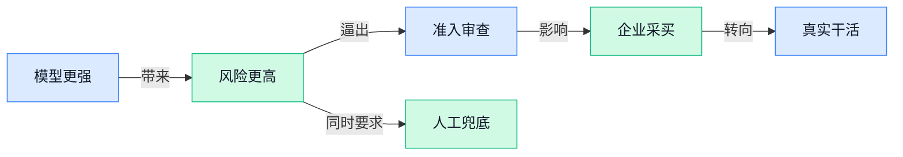

> AI 早报 · 每日早读 · 全网深度聚合

## **今日摘要**

```
Anthropic 连发 Claude Fable 5 和 Mythos 5，Microsoft 随即限制员工使用，数据留存风险正面撞上前沿模型
Anthropic 警告 AI 几小时就能从安全补丁反推漏洞利用，美国把修复窗口压到三天，攻防节奏骤然改写
OpenAI 指中国相关行动介入美国 AI 讨论，Anthropic 与 OpenAI 同时争抢前沿准入牌照，监管战场越打越深
```

### 🔵 产品与功能更新

1. **Anthropic 推出 Claude Fable 5（新一代 AI 模型）和 Mythos 5（新一代 AI 模型）。**
Anthropic 发布了两款新的 **AI 模型**，分别是 **Claude Fable 5** 和 **Mythos 5**，主打更强的综合能力与更广的应用场景 🚀。其中一条报道特别提到，它们在 **cybersecurity（网络安全，指保护系统和数据不被攻击或泄露）** 相关能力上有所加强，这意味着这类模型正从“会聊天”继续走向“能处理更专业任务” 💡。对企业用户来说，这类更新通常关系到客服、知识问答、内部助手等工具能不能更稳、更聪明地落地。[完整报道一(briefing)](https://news.google.com/rss/articles/CBMiggFBVV95cUxQQmlJWnBQM1Q2QjI4Nmw0aTgwX1MxUV9aWHdFWVVCM2hkbzNzSFNNTkFVaFhLN3pQZHRYdmN5Z0x4Tk9wSGtlOXUxajNNWjRFUzZWR1FZQ0U4UmhEWFotVXNISTNtLUQ2X19QcDI0S3VJY19hcWNuQ0IzUDM5dXpPYnZ30gGHAUFVX3lxTE1NYVJQV0Z5bC1kMjFIVEV5OThfUU1rcFFvMkhfU1NRMGlwMWVTRWRpblpsMVJoMFhVLWljQ3FBYXpNc0dpajJGSW1kY0JnZzhESGNTNFRYNFZJcUFEYmREZU4tZmNzTGF6OUItVjBmalMtWV9VdmxuWkJFa3pSbVhSX0R1dFlmOA?oc=5) [补充报道二(briefing)](https://news.google.com/rss/articles/CBMi0AFBVV95cUxNeU9Fei0wT2ZlcGl1NXJGYktlVnJVdGUzMkdmNFZobWZJZTdHYkNmdUkwd0lQRzltMl9PNjg2QXBrX0Z4TG5SVkQ1M3ZjWE5rcUNOYnlyOGItcDlreXRCbFNrNENqVjJHaUxTZzF2QmZyTXpCNlpLRm1KelJIRTFXNHJrRzBTUThHYUFDOGQ4eTdYT2FrdDdVMW1qZ0xyZFFlZms0MmNMZmpPUlQ2WUQ1ZERZRTRsTkNlZ3JhaUVKLUJESERFUzFxWDRJT045bzgy?oc=5)

2. **Google 给 Gemini 加入商家资料工具，AI 助手开始更懂本地生意。**
Google 正把 **Business Profile（商家资料页，商家在 Google 上展示地址、营业时间、评价等信息的入口）** 相关工具加入 **Gemini** 应用，让商家能更方便地管理线上门面 ✨。这意味着 AI 助手不只是回答问题，还可能进一步参与店铺信息维护、客户触达等更贴近经营动作的工作。对运营、市场和本地生活类团队来说，这类功能更新值得关注，因为它让 **AI 助手** 更像一个能直接帮忙处理日常事务的数字同事 🤖。[功能更新报道(briefing)](https://news.google.com/rss/articles/CBMiowFBVV95cUxOVGlMOWJZSmo0ejdkQnZERWFIQmh0OUdOenV0d2M3d2NXV2MtNjhnaERoZHZabFc2VzBQcnJfbEVkTl9YWmQyTUtkYzljRlVvN1RkT1FpeUdPVjlna2Y3ZGNrV0QtYlJLRUhQdmlOcHZFbGJfalF5V1hmY2tGbFZ6a2lNeThRM1hrY2NWSVl3dE1sUGhWZVVaaklObU1USThoQjBZ?oc=5)

### 🟢 前沿研究

1. **Role-Agent（一种让 Agent 在“双角色进化”中自我成长的训练方法）提出用双角色机制培养更强智能体。**
这篇论文关注的是怎么让 **Agent** 不靠大量人工规则，也能一步步“练”出更强的执行能力 💡。它提出 **Dual-Role Evolution（双角色进化，让模型同时扮演执行者和反馈者，通过来回迭代持续改进）**，本质上是在给大模型搭一个能自我打磨的训练闭环。对企业来说，这类研究的意义在于：未来做流程自动化、客服协助、数据整理时，Agent 可能不必每次都靠人工细调 prompt，而能更快适应任务变化。[论文页面(briefing)](https://huggingface.co/papers/2606.10917)


2. **EEVEE（一种让 Agent 在实际使用时边做边学提示词的研究）瞄准“用中学习”式自我改进。**
这项工作研究 **Test-time Prompt Learning（测试时提示学习，指模型在真正执行任务时动态调整提示词，而不是训练完就固定不变）**，目标是让 Agent 在真实环境里越用越顺手 🚀。它聚焦 **Self-Improving Agents（自我改进智能体，能根据执行结果持续修正自己策略的 Agent）**，说明研究重点已经从“训练时变强”转向“上线后还能继续进化”。对非技术团队也有直接启发：以后同一个 AI 助手面对不同部门、不同业务语境时，可能会更快学会“怎么说、怎么做”才更合适。[论文介绍页(briefing)](https://huggingface.co/papers/2606.11182)

3. **One Token per Multimodal Evidence（一种把多模态证据压缩存储的问答方法）尝试让低资源设备也能高效问答。**
这篇研究聚焦 **Multimodal Evidence（多模态证据，指图片、文字等不同类型的信息一起作为回答依据）** 怎么更省资源地被模型利用。标题里的 **Latent Memory（潜在记忆，指把大量信息压缩成更短、更抽象的内部表示，像把厚资料浓缩成便签）**，就是为了让设备算力有限时也能完成问答任务。简单说，它想解决的是“信息很多、机器不够强”时，AI 还能不能快速抓住重点回答问题 📌。这类方向如果成熟，会特别适合移动端、边缘设备（离用户更近的小型终端设备）或成本敏感的企业应用。[论文页面(briefing)](https://huggingface.co/papers/2606.10572)

4. **Sparse Autoencoders（稀疏自动编码器，一种用更少激活单元拆解模型内部特征的分析工具）被用来“看懂并调控”语音模型。**
这篇论文研究的是：人们能不能更清楚地理解 **Text-to-Speech（文本转语音，把文字直接生成自然语音）** 模型内部到底学到了什么，以及如何更稳定地“拨动”它的输出 🎙️。作者借助 **Sparse Autoencoders（稀疏自动编码器，把复杂神经网络里的混杂信号拆成更容易解释的特征）**，去解释并引导语音模型的行为。对行业来说，这类研究很关键，因为语音 AI 不只是“能说话”就够，未来还要更可控、更可解释，才能更放心地用于客服、播报、教育等场景。[论文介绍页(briefing)](https://huggingface.co/papers/2606.10029)

5. **Anthropic 研究称，AI 可在数小时内从安全补丁推导攻击利用方式。**
这项研究释放了一个很现实的信号：**安全补丁** 一旦公开，AI 可能比过去更快帮人找出可被利用的漏洞路径 ⚠️。报道指出，过去这类过程常常需要研究人员花上数周分析，但现在模型可能在数小时内完成相当一部分工作，说明 **网络攻防** 的节奏正在被 AI 明显加速。对企业管理层和职能部门来说，这意味着补丁发布后“尽快更新”不再只是 IT 口号，而是更直接的经营风险问题；因为攻击者和防守者都在同时被 AI 提速。[完整报道(briefing)](https://the-decoder.com/anthropic-study-shows-ai-needs-hours-not-weeks-to-build-exploits-from-security-patches/)

6. **Workflow-GYM（一套评测电脑操作型 Agent 长流程能力的基准）把 AI 考题拉到真实职业场景。**
这项研究要解决的不是“AI 会不会答题”，而是它能不能在真实工作里连续完成多步任务，比如跨软件操作、处理中间状态、记住长期目标 🧭。所谓 **Long-Horizon Evaluation（长程评测，考察模型在很多步骤之后还能否保持目标一致）**，就是要看 Agent 面对复杂流程时会不会中途跑偏。标题中的 **Computer-use Agentic tasks（电脑操作型智能体任务，指让 AI 像人一样点网页、填表格、切换工具完成工作）**，也说明行业正在从聊天机器人走向“能干活的数字同事”。[论文页面(briefing)](https://huggingface.co/papers/2606.11042)

7. **Code-Switched Speech（夹杂两种语言的混合语音）基准测试追问语音 Agent 能否接住双语客户。**
这项基准测试聚焦客服里很常见但常被低估的问题：用户会在一句话里来回切换两种语言，语音 AI 到底能不能稳稳听懂 📞。文中提到的 **ASR（自动语音识别，把人说的话转成文字）** 是语音 Agent 的基础能力，而 **Benchmarking（基准测试，用统一标准横向比较不同模型表现）** 则是在检验当前前沿系统面对真实双语场景时的可靠度。对出海业务、跨境电商和国际客服团队来说，这类研究很有现实价值，因为“能听懂混合表达”往往比单语环境下的高分更接近真实服务能力。[官方博文(briefing)](https://huggingface.co/blog/ServiceNow-AI/code-switching)

8. **Chain of Thought（思维链，模型把推理过程一步步写出来的方式）可能“知道答案却依然答错”。**
这篇论文讨论多轮推理模型里一个很反直觉的问题：模型在中间推理时也许已经出现了更正确的判断，但最终输出却还是走向错误结果 🤔。它关注 **Multi-Turn Reasoning Models（多轮推理模型，能连续多步分析问题并逐步得出结论的模型）** 的失效模式，也就是模型为什么会在“想对了部分内容”后依然“答错整题”。这对产品设计很重要，因为企业现在越来越依赖会推理的 AI，但“会展示思考过程”不等于“最终一定靠谱”，评估方式也要随之升级。[论文页面(briefing)](https://huggingface.co/papers/2606.10740)

### 🟡 行业展望与社会影响

1. **Anthropic CEO 呼吁政府拦截危险 AI，行业监管风向更趋强硬。**
Anthropic 首席执行官公开表示，政府应该阻止**危险 AI**的发展，这说明前沿模型的治理讨论正在从“要不要管”转向“具体怎么拦” ⚠️。对企业来说，这类表态会直接影响后续的**合规**、产品上线节奏和风险审查标准，尤其是高能力模型的发布门槛可能继续抬高。另一边，Anthropic 还在推动对**frontier AI（前沿 AI，指能力最强、潜在影响也最大的模型）**进行强制测试，核心思路是先验证风险，再决定放行 💡。[Axios 报道(briefing)](https://news.google.com/rss/articles/CBMiggFBVV95cUxPUGFPeVR2VldXM21VWDNBRFdaVEVtVDNwZDBCcnhzWmp1a3p2YTN3eGhUTE13TTRZMzhpckkza0QzRUxaZkJLQ3Q4UnY1U1JweTluZ19zNGdhZndyZW9SQ2JSWGd5dWRJQnJkb1ZhY0pCWmkwaTFkZnVZdTRLYnowMWNR?oc=5) [Politico 报道(briefing)](https://news.google.com/rss/articles/CBMiqgFBVV95cUxNVl9QRy0tRE9Qb25zemdFd3hrU3FzckNVQnhMS1ByVG9YVEZ4TVVab1FMekZEQVhxN0pwdWtYYWpIamliVGFwSEhfUk1VbkVjXy1wRERwaFk2ZlpScllIc2VPWEtWdk5wUDFZMXhtRXNBXzV4OWhZTUpMdXhOdVc1SFlBZ1lQcWlibW1NMTNrMmRKdFZXZ3RiQ0hsX0ZhR2FBX0NnTWx1eDRzdw?oc=5)

2. **Anthropic 与 OpenAI 掀起前沿 AI 准入竞赛，谁能先拿到“入场券”很关键。**
Axios 提到，Anthropic 和 OpenAI 正在点燃一场新的**前沿 AI 准入**竞赛，重点已经不只是模型谁更强，而是谁更快获得政府与关键机构的使用许可 🚀。这里的“准入”可以理解成一种高门槛通行证：模型既要展示能力，也要证明自己足够安全、可控。对行业的启发很直接——未来大模型竞争，除了拼产品体验，还要拼**安全评估**、政策沟通和机构信任。换句话说，AI 公司比的不只是技术研发，还包括面向监管体系的“交卷能力”。[Axios 完整报道(briefing)](https://news.google.com/rss/articles/CBMifEFVX3lxTE4zY3Y4V3VZVkI2d0l2OTNXQTNXeGh4el9kUW43blpVWDRPb01sUy1YM0M5YWhMX3BKeTN6ZG5jLU41cGZubnNFd3NTTzVVcS1aOWxjVkI1LUVfLTlxM1RGa3FsN2VGM29JcTVVYVZUdzZlOXVTbDUyaVBfLXc?oc=5)

3. **OpenAI 称中国相关影响行动正介入美国 AI 讨论，舆论战开始延伸到算力议题。**
OpenAI 表示，与中国有关的影响行动正在试图塑造美国社会对 AI 数据中心的看法，这说明 AI 竞争已不只是产品和模型之争，也进入了**公共舆论**与政策博弈层面 🧭。所谓**数据中心（承载大量服务器的基础设施，相当于 AI 运转背后的“工厂”）**，直接关系到算力、电力和国家级投资，因此自然会成为敏感议题。OpenAI 也提到，相关行动正在瞄准美国的 AI 辩论，这提醒企业和公众：未来围绕 AI 的信息，不仅要看“技术上是否先进”，也要看“信息来源是否可信”。[OpenAI 相关披露(briefing)](https://news.google.com/rss/articles/CBMid0FVX3lxTE5hbGEzYUxQMlNOVzFaanBFUmo0b09XUlhmV2txb19Vd0o5cXF6Wmx6cFJoVWtYRzZqaEJWSDU0eUF0Y3VfemVoRTdOcGJSMHFSWGtYSUhmZHFVTDlseS1GUDZpWkIwanlJSXlDU0s4aERjTnl1Q2o0?oc=5) [Politico 报道(briefing)](https://news.google.com/rss/articles/CBMijgFBVV95cUxPLXcwaXBhY3BNaDJjc2QxSmJ4MlNMODNFNERwNlFaUjVJbDkyeVdULS1PRXZzU2hTOUk0NVZwS1hGV3FFRDl3Z1FaaWpXNm92eDR6NVA2UTA3QjhoaTVSSV9tU0J2LXo4R0hrc1Q3a1NLLTZRZDJ6dURfejRqekxGZVNJRVRPa212WHFuVVBR?oc=5)

4. **Anthropic 反对一刀切叫停各州 AI 立法，先有联邦标准再谈统一更现实。**
Reuters 报道称，Anthropic 正敦促美国不要在尚未建立联邦标准前，就先阻止各州推进 AI 法规 📌。这背后的重点是：如果国家层面的统一规则还没出台，地方先行立法至少能填补监管空白，避免市场完全“裸奔”。对企业而言，这意味着未来一段时间内，可能要同时面对多层级的**合规**要求，政策环境不会立刻变简单。这里的**联邦标准（全国统一适用的规则）**，可以理解成跨州经营最期待的“统一说明书”。[Reuters 报道(briefing)](https://news.google.com/rss/articles/CBMipwFBVV95cUxQTGswMmJtWE5seHQzaWRSWXhPRktmbHc1SHZpYndBM1hjTzdLUlp0LVdmM3BQTTN1NnIxeWsxR2JubC1qeS03XzdVVjR0amttUUQxUWpVUlN2MzdsRTlSZDdJT1ZUTnlQTmlDc2h5WC1VdlQwYm5OQ2xROG1lT3BUVmhHS1V1bE4xeHhpazlwTGJSYWNNSnBtX0tFdkFBX0M1VTdZVDNwQQ?oc=5)

5. **美国把网络漏洞修复窗口缩短到三天，AI 威胁正逼安全体系提速。**
Reuters 提到，美国将网络安全修复时限缩短到 **3 天**，原因之一是 AI 带来的威胁正在上升 ⏱️。简单理解，过去留给系统“慢慢补漏洞”的时间越来越少，因为 AI 可能让攻击者更快发现和利用弱点。这里的**网络漏洞（系统里的安全缺口，像门锁没关严）**一旦被自动化工具大规模利用，风险扩散会更快。对公司日常运营来说，这也意味着 IT、安全、采购乃至管理层都要更重视“快速响应”能力，而不只是事后补救。 [Reuters 完整报道(briefing)](https://news.google.com/rss/articles/CBMirAFBVV95cUxOYUJ0Y3ZPOE9IbWdjS0xqd20zczBOanREM3JhNmk5bVpDYlhkbFlhMTBwTWkxZ080TTEwcHJKVnhocTU3UTdBTGVmQUhrUDhqbE40bGpqS0tpQWI1RmNUMVhNTF9Kb09OYkZIanduaEN5ek1PUkdyZVRJOWxORW9fWFI4Q1Y0OWxYMk9XelRpWmJDVURweXBLT19ORl9RaWh2eWcyVkhmcGNqZ0tn?oc=5)

6. **Microsoft 限制员工使用 Claude Fable 5（Claude 的特定版本或功能），数据留存风险成企业新顾虑。**
Reuters 援引 The Verge 称，Microsoft 因担心**数据留存（用户输入和生成内容会被保存多久、如何保存）**问题，限制员工使用 Anthropic 的 Claude Fable 5 🛡️。这件事很有代表性：现在企业选择 AI 工具，已经不只是看“聪不聪明”，还要看数据会不会留在外部系统、能不能满足内部规范。对于法务、人事、财务等会处理敏感信息的部门，这类顾虑尤其现实，因为日常文档、会议纪要和分析内容都可能涉及内部数据。也就是说，AI 落地正在进入一个更务实阶段——**治理能力**和**信任机制**，开始和模型能力同样重要。[Reuters 报道(briefing)](https://news.google.com/rss/articles/CBMivwFBVV95cUxQMFZRVXVXbExma1lxdjN0RkRoUFo4SVFYWm1QWk9TYTQwZS1tUldwbUVhbndQRkFtSmVwNTNmWndVQWF5U2NpRXZfdnA4NEFxMTA3SXBoVFFMLWtvbHdhZjJZbTVJT0F3MWZCNHhxUnJEalJyTExqZUtLVWJrdk5WWHFHWmJOV2p6cmtPa3ZuZFA0UkRNXzI3MGhDZjFFYXpsRVhQdF92eHQxd0RGa1ZvdWROZ3FpeTBSV255WGx3cw?oc=5)

### 🟣 开源TOP项目

1. **`ziwei-doushu`（一个开源的紫微斗数排盘引擎）把传统命理算法做成了可复用项目。**
这个项目主打**完整排盘算法**，并且明确基于倪海夏《天纪》体系来整理实现，适合对传统文化数字化、知识库产品化感兴趣的人关注 💡。它不只是“算盘面”，还包含**四化系统**（紫微斗数里用于判断星曜变化与作用关系的一套规则）和**格局知识库**（把命理解读规则整理成可查询内容），说明作者在往“算法 + 数据”一体化方向推进。项目里还收录了**古籍原文数据**，这类结构化整理对做内容检索、知识问答或文化类 AI 应用都很有参考价值。[GitHub 项目页(briefing)](https://github.com/Renhuai123/ziwei-doushu)


2. **`Project N.O.M.A.D`（一台可离线运行的生存信息电脑）想把工具、知识和 AI 打包带走。**
这个开源项目的核心卖点是**自包含**和**离线可用**，也就是不依赖网络，也能随时调用关键工具、资料和 AI 能力 🚀。它把“生存电脑”做成一个便携式方案，适合灾害应急、野外使用或网络条件差的场景，重点不在炫技，而在**任何时间、任何地点都能获得信息支持**。从摘要看，它强调的是把知识和能力预先装进设备里，这和很多依赖云端的大模型产品路线不同，也让“边缘部署”（把 AI 放到本地设备运行，而不是全靠远程服务器）这件事更容易被普通人理解。对企业来说，这类思路也提醒大家：AI 不一定只能在线，用在应急、安保、偏远作业等场景时，**离线能力**可能反而更关键。[GitHub 仓库介绍(briefing)](https://github.com/Crosstalk-Solutions/project-nomad)


### 🔴 社媒分享

1. **Anthropic 联合创始人发文谈《Policy on the AI Exponential（AI 指数级发展时代的政策思考）》。**
这篇长文从**国家竞争**、**算力**和**安全治理**三个角度，讨论当 AI 能力以指数级速度提升后，政策该怎么跟上节奏 💡。作者特别强调，未来几年可能不是“慢慢变化”，而是能力、产业和地缘格局一起快速重排，所以政府和企业都不能再按线性思维做准备。对非技术岗位同事来说，这类讨论的意义在于：AI 不只是一个工具升级，更可能改变**招聘结构**、**合规要求**和**组织决策速度**。想看原文可直接读 [政策原文全文(briefing)](https://darioamodei.com/post/policy-on-the-ai-exponential) 🚀


2. **Apache Burr（一个专门构建可靠 AI Agent 的开源框架）想让 Agent 更可控。**
Apache Burr 主打的是把 AI 应用拆成清晰的**状态流**和**执行步骤**，方便团队追踪 Agent 每一步到底做了什么、为什么出错。这里的状态流（指任务执行到哪一步、手里有哪些信息的“过程记录”）很关键，因为很多 Agent 难排查，不是模型不聪明，而是流程像黑箱 😵‍💫。对企业来说，这类框架的价值不只是“能做”，而是更接近“能上线、能维护、能审计”。项目主页见 [官方项目主页(briefing)](https://burr.apache.org/) 。


3. **一笔 0.01 欧元转账，暴露了银行 AI Agent 的安全风险。**
这篇案例讲的是研究团队如何帮助 bunq 修复其金融 AI 助手中的潜在漏洞：攻击者可能借助一笔极小额转账，把**恶意指令**混进系统处理流程里。问题核心在于 AI Agent 会读取外部输入并据此执行动作，如果缺少足够的边界控制，就可能出现“把陌生内容当真”的风险，这和 prompt injection（提示词注入，指攻击者把隐藏指令塞进文本里误导 AI）很像 ⚠️。对所有准备把 AI 接进客服、财务、审批流程的公司来说，这提醒非常直接：**自动化越深入，安全设计越要前置**。案例详见 [安全案例解析(briefing)](https://blue41.com/blog/how-we-helped-bunq-secure-their-financial-ai-assistant/)

4. **《How to help knowledge workers who lose their jobs to AI（如何帮助被 AI 影响失业的知识工作者）》把焦点拉回人。**
这篇讨论没有停留在“AI 会不会替代人”的空泛争论，而是直接追问：如果一批知识工作者真的被冲击，社会、企业和政策应该怎么接住他们。这里的知识工作者，指主要靠写作、分析、沟通、整理信息完成工作的岗位，比如运营、客服、助理、研究、基础内容生产等。它值得转发的地方在于，AI 讨论常常只讲效率和产品，却很少认真讲**转岗支持**、**收入缓冲**和**组织责任** 🧭。原文可看 [完整评论文章(briefing)](https://www.platformer.news/how-to-help-knowledge-workers-who-lose-their-jobs-to-ai/)

5. **DiffusionGemma（Google 推出的扩散式文本生成模型）主打文本生成提速 4 倍。**
Google 这次介绍的重点，是把 diffusion（扩散生成，一种不是按字一个个往后写，而是逐步“整体修正”内容的生成思路）用到文本生成里，从而实现更快的输出速度。和常见的自回归生成（模型按顺序一个 token 一个 token 往下写，像逐字接龙）相比，这条路线的看点在于**速度**和**推理方式**都不一样。对普通用户来说，最直接的意义是：未来聊天、写作、搜索类产品可能在“响应快”这件事上再往前走一步 ⚡。详情见 [Google 官方介绍(briefing)](https://blog.google/innovation-and-ai/technology/developers-tools/diffusion-gemma-faster-text-generation/)

6. **《Fable 5（公开发布的 AI 故事生成系统）、Anthropic alignment（对齐，让模型行为符合人类意图的训练过程）与 AI 分层》讨论了能力边界的新变化。**
这篇分析把 Fable 5 放在更大的产业背景里看：一边是生成内容能力越来越强，另一边是不同模型开始出现更明显的**分层**，也就是按能力、成本、风险划出不同档位。文中提到的 alignment 很关键，它不是抽象口号，而是决定模型能否在真实场景里“有能力又不乱来”的核心训练环节。对业务团队来说，这意味着今后选 AI 可能不再是“谁最强就用谁”，而是要同时权衡**效果**、**价格**和**可控性**。延伸阅读可看 [深度分析原文(briefing)](https://stratechery.com/2026/fable-5-anthropic-alignment-ai-tiers/)

---



### 📊 行业洞察（今日 4 条）

1. Anthropic一边发布Claude Fable 5（新一代AI模型）和Mythos 5（新一代AI模型），一边又说政府该拦危险AI，还承认AI几小时就能从安全补丁推导攻击路径
  【洞察】同一家公司同时秀能力、谈管制、讲风险，说明前沿AI已进入“越强越难放开”的阶段，产品竞争正被安全红线硬生生改写

2. Microsoft因30天数据留存（用户输入和输出会被保存一段时间）顾虑限制员工用Claude Fable 5，Anthropic又在推动前沿AI准入审核
  【洞察】企业买不买AI，关键已不是演示效果，而是谁更能交出“数据怎么管、风险怎么兜底”的答卷，信任开始压过炫技

3. Google给Gemini接入Business Profile（商家在Google上管理门店资料的入口），Workflow-GYM（评测AI连续做多步工作的测试集）也在盯真实电脑操作
  【洞察】AI竞争正从“会不会回答”转向“能不能直接把事做完”，谁先卡住真实业务入口，谁就更像数字员工而不是聊天框

4. Role-Agent、EEVEE都在研究Agent上线后自己变强，Chain of Thought（思维链，模型把推理过程一步步写出来）却显示“中途想对也可能最后答错”
  【洞察】行业正同时追求“更会学”和“别乱来”，这说明自进化很诱人，但离可放心托管还有距离，人工校验短期内撤不掉

### 💭 对我们的启发（今日 3 条）

1. Microsoft限制Claude Fable 5，提醒我们视频剪辑软件若接入外部模型，不能只卖生成效果，必须把素材留存规则、品牌资料隔离和人工复核开关做成明牌。

2. Google让Gemini直接管理商家资料，说明客户真正愿意买的是“帮我完成发布与运营动作”。我们做剪辑工具也该少讲模型，多做一键成片、改标题、发多平台的闭环。

3. Role-Agent和EEVEE都在讲Agent会越用越聪明，但Chain of Thought研究又提醒最终仍会答错；所以我们的自动剪辑和文案生成功能，适合先放在“建议稿”位置，不宜默认直接发布。


---

> 本周周报：[第24周综合分析](https://zhuxinfei.github.io/ai-daily-site/blog/weekly/2026-w24/)
