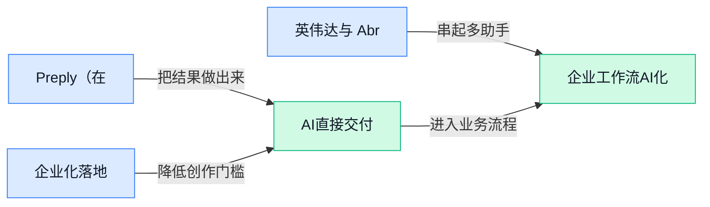

> AI 早报 · 每日早读 · 全网深度聚合

## **今日摘要**

```
Google 联合 FBI 起诉 AI 诈骗网络，生成式诈骗已规模化蔓延，AI 黑产正式工业化
Anthropic 联手 TCS（塔塔咨询服务公司）强攻监管行业，Claude 从实验室直插金融政企腹地
Mistral AI 寻求 30 亿欧元融资，Meta 承认抢人犯错士气低迷，欧洲趁乱猛追美国大厂
```

### 🔵 产品与功能更新

1. **Preply（在线语言学习平台）用 OpenAI 把 AI 反馈和真人外教结合起来。**  
Preply 正在把 **AI 个性化学习** 做得更“落地”一些：它基于 OpenAI 推出了 AI 生成的课程总结、个性化反馈和语言练习，让学员课后不用自己再慢慢整理重点 ✍️。这类功能的意义不只是“更方便”，而是把真人老师的时间释放出来，去做更需要判断和互动的部分，而把重复整理、出题这类工作交给 AI。对做培训、教育产品或内部学习项目的同事来说，这也是一个很典型的 **“AI + 人类专家”协作** 范式（不是完全替代人，而是让人把精力用在更高价值环节）💡。[官方案例介绍(briefing)](https://openai.com/index/preply)


2. **Anthropic 联手 TCS（塔塔咨询服务公司，印度大型企业技术服务商）把 Claude 推向强监管行业。**  
Anthropic 宣布与 TCS 合作，重点是把 **Claude** 带进监管要求更高的行业场景，比如那些对流程、合规和数据处理要求都更严格的企业 🏢。这里的“受监管行业”通常指金融、医疗、公共服务等领域，这类行业不是不能用 AI，而是更在意 **合规**、**可追溯性** 和部署方式是否稳妥。对企业客户来说，这类合作释放了一个明确信号：AI 落地已经不只是做聊天助手，而是在往正式业务系统里走，尤其是需要大型服务商一起推进的复杂场景。想关注企业级应用落地节奏的同事，可以直接看 [Anthropic 官方公告(briefing)](https://www.anthropic.com/news/tcs-anthropic-partnership)。

3. **英伟达与 Abridge（医疗对话记录与临床文书 AI 公司）合作开发医疗专用 AI 模型。**  
这次合作聚焦 **医疗专用模型**，也就是不是做“什么都懂一点”的通用 AI，而是更懂医生问诊、病历整理和临床表述的专门模型 🩺。Abridge 本身做的是把医患对话自动整理成临床文书，这类能力背后很依赖领域数据、专业术语理解和 **模型推理**（让训练好的模型真正去完成回答或生成任务的过程）稳定性。对医疗行业来说，专用模型通常比通用模型更有机会进入真实工作流，因为它更贴近合规、准确性和专业表达要求；对其他行业同事来说，这也说明 **垂直行业模型** 正在成为产品更新的重要方向，而不是所有公司都只追求“大而全” 🚀。[完整报道原文(briefing)](https://news.google.com/rss/articles/CBMivAFBVV95cUxPZEo0S0t2SGt1NGM1azFfMmpvRERvcG9DWFFocUtpMUFxMlN4Q0VoZEJJdjAzZ1E5YVh4djA5Sy1SMmhSVXVCbUVjNnJfdlNZREZUN0J6eXQ3LWRCYnNRc1BPSjR5SzJzbzdmR2hGbkREbk16UFlGdkdidkprMzRjUExkcUlaR1dVWWR6aTh2TnBjV2o4Vlc4S1VKMVBDekNmeUhKYzRJVGZKVmh4bHJxTWZ5YzJWaGd3a2RZYg?oc=5)

### 🟢 前沿研究

1. **LabVLA（面向科学实验室的视觉-语言-动作模型）想让 AI 真正在实验台前干活。**  
这篇研究把 **Vision-Language-Action**（视觉-语言-动作模型，让 AI 不只“看懂”和“听懂”，还要能实际操作）放进科学实验室场景里，重点是解决实验环境里“看见器材、理解指令、完成动作”这三件事怎么连起来 🧪。对行业来说，这类工作很关键，因为实验室自动化一直是高成本、强流程、低容错的典型场景，AI 如果能真正落地，意义会比聊天问答更直接。它也说明前沿研究正在从“会说”继续往“会做”推进，尤其瞄准科研和工业里的真实操作任务。[论文页面(briefing)](https://huggingface.co/papers/2606.13578)

2. **SpatialClaw（面向空间推理的 Agent 动作接口）重新思考 AI 应该怎么“动手”。**  
这项工作聚焦 **agentic spatial reasoning**（带行动能力的空间推理，让 AI 不只是判断位置关系，还能基于空间理解采取动作），核心是重做 **action interface**（动作接口，也就是 AI 与环境交互时“能做什么、怎么做”的设计）📐。这听起来偏技术，但对普通用户也有现实意义：很多机器人、3D 操作系统、自动化工具做不好，不是 AI 完全不会想，而是“手脚接口”设计得不对。换句话说，这篇论文关注的是让 AI 在空间任务里少走弯路、少误操作，为机器人和复杂数字环境打基础。[论文介绍页(briefing)](https://huggingface.co/papers/2606.13673)

3. **MaxProof（数学证明生成系统）用生成器-验证器强化学习把 AI 数学证明继续做大。**  
这篇论文研究怎么把 AI 的数学证明能力继续往上推，重点方法是 **Generative-Verifier RL**（生成器-验证器强化学习，让一个模型先写证明、再由“审稿人式”的验证模块检查并反馈）和 **test-time scaling**（测试时扩展，推理阶段给更多尝试次数或更多候选答案来换更强结果）🧠。它的价值不只是“刷数学题”，更代表 AI 正在进入需要严密逻辑链条的任务，像定理证明、规则审核、复杂决策辅助都会受启发。对企业读者来说，可以把它理解为：未来 AI 不只是“给答案”，而是更可能“给出能被检查的推理过程”。[HuggingFace 论文页(briefing)](https://huggingface.co/papers/2606.13473) [arxiv 论文原文(briefing)](https://arxiv.org/abs/2606.13473)

4. **MiniMax Sparse Attention（稀疏注意力机制，用更少计算处理更长内容）瞄准长文本效率瓶颈。**  
这项研究关注 **Sparse Attention**（稀疏注意力，让模型只重点看部分关键信息，而不是每个字都平均用力），本质是在降低大模型处理长内容时的计算负担 ⚙️。如果把普通注意力理解成“开会时每个人都要和所有人逐一交流”，那稀疏注意力更像“只找相关的人沟通”，效率会高很多。它对行业的意义在于，未来 AI 处理超长文档、长对话、复杂知识库时，可能更省算力、更便宜，也更容易落地到企业场景。[论文页面(briefing)](https://huggingface.co/papers/2606.13392)

5. **Risk Under Pressure（算力约束下的大模型对抗鲁棒性评估）提醒大家别只在理想环境里测 AI 安全。**  
这篇研究讨论 **adversarial robustness**（对抗鲁棒性，指模型面对故意误导、诱骗或攻击性输入时还能否稳住）在 **compute-aware evaluation**（考虑算力成本的评估方式，不是假设资源无限地做测试）条件下应该怎么衡量 🔍。这点很重要，因为现实里的模型部署往往要受成本、延迟、设备能力限制，实验室里“堆很多算力测出来很强”不代表上线后也一样稳。对企业而言，这类研究是在提醒：AI 安全和稳定性不能脱离预算与实际运行环境来谈。[论文介绍页(briefing)](https://huggingface.co/papers/2606.11409)

6. **Google 研究 AI 帮用户理解皮肤状况，医疗辅助继续往日常场景靠近。**  
Google 这项研究聚焦 AI 如何帮助用户更好理解 **skin conditions**（皮肤状况，比如常见皮疹、色斑、炎症等可见症状）🌿。这类方向的意义在于，它把 AI 从“通用聊天”推进到更贴近日常健康管理的辅助工具，但核心仍是“帮助理解”，不是替代医生判断。对普通同事来说，这说明医疗健康仍是 AI 最值得长期关注的落地赛道之一，尤其是在信息解释、初步识别和用户教育这类环节。[Google 相关报道(briefing)](https://news.google.com/rss/articles/CBMilwFBVV95cUxOS2RfR3d1c29jOUFBenpXQndSNk91UXoyNXk5NFZFR2NxeXJfRnlvcTJWSzJJNWhhZEJsdlZDT19TQm4xRHJPOTlQVEI0ZlBtUDJzY2JVYnltcVktdEhTSWxzWW9uZThYS05sY3BtWVZkb2s5bngybHlReHdLSXlPYU1pdml3eUJaS243R0dVSF9KLUdsY0RN?oc=5)

7. **EurekAgent（面向自主科学发现的 Agent 环境工程框架）把重点放在“给 AI 搭好科研赛场”。**  
这篇论文的核心观点很鲜明：想让 AI 做 **autonomous scientific discovery**（自主科学发现，自己提出、验证并迭代科研思路），关键不一定只是换更强模型，还要做好 **environment engineering**（环境工程，也就是把任务规则、反馈机制、实验空间和工具接口设计清楚）🔬。这和很多企业实践其实很像——AI 表现不好，未必是模型不行，可能是流程、数据入口、反馈闭环没搭好。它给行业的启发是，下一阶段拼的可能不只是“大模型参数”，而是谁更会设计让 Agent 发挥能力的工作环境。[论文页面(briefing)](https://huggingface.co/papers/2606.13662)

### 🟡 行业展望与社会影响

1. **Google 联合 FBI 起诉 AI 诈骗网络，暴露生成式诈骗已进入规模化阶段。**
Google 表示，一个名为 **Outsider Enterprise** 的团伙利用 **AI** 大规模行骗，在两周内发送了 **250 万条短信**，受害者规模达到“数十万” 😮。这不只是普通网络诈骗，而是把 **自动生成内容** 和批量触达结合起来，说明 AI 已被用于低成本、高频率的社会工程攻击（通过话术诱导人上当的骗术）⚠️。对企业来说，这类事件提醒大家：今后要防的不只是“假链接”，还包括越来越像真人写的短信、邮件和客服对话。[TechCrunch 报道(briefing)](https://techcrunch.com/2026/06/12/chinese-cybercrime-operation-that-used-ai-to-scam-hundreds-of-victims-sued-by-google/) [联合诉讼解读(briefing)](https://the-decoder.com/google-files-first-joint-lawsuit-with-fbi-over-chinese-ai-scam-network-openai-blocks-prc-influence-clusters/)


2. **AI 行业正掉进“平台陷阱”，越来越像当年的 Microsoft 生态竞争。**
报道指出，今天的大模型公司正在从“做一个好模型”走向“做自己的整套平台”，这和当年 **Microsoft** 通过平台掌控开发者与用户入口的逻辑越来越相似 🧩。所谓 **平台**，可以理解成不仅卖单点产品，还要把开发工具、分发渠道、付费体系和用户关系都握在自己手里；一旦形成闭环，后来者就更难切入。对普通企业用户来说，这意味着未来选 AI 工具时，不能只看模型能力，还得看它会不会把数据、流程和团队协作一起“锁”进某个生态里。[完整分析报道(briefing)](https://the-decoder.com/the-ai-industrys-platform-trap-is-starting-to-look-a-lot-like-microsofts/)


3. **Meta 承认 AI 人才与组织调整“犯过错”，大厂抢人副作用开始外溢。**
Meta CEO 扎克伯格表示，公司在 AI 人才转移和团队调整中“犯过错误”，说明这场 AI 竞赛已经不只是拼模型，也在拼组织架构与内部协同 💼。当企业把大量资源快速转向 AI，最容易出现的问题往往不是技术本身，而是岗位重组、管理压力和团队磨合成本。对管理层和职能部门来说，这是一种现实提醒：AI 转型如果推进太急，**组织设计** 和 **人才配置** 可能比模型效果更先出问题。[路透相关报道(briefing)](https://news.google.com/rss/articles/CBMiogFBVV95cUxOMDl3TDBSSG5DbXEwYTcwNlcwaTJ5dWpZV29IWEpNYnVKc2UzT2NpaWdZMXdpbWU1WklwMHdqWXBXRG13cU9Dc0h1NDdQcTRNN1JLR1hjU0RuUkRxSUl4NzFtRTJoTUJPVS1xdzJKdGR0TFVXUTRVbzBscFY4OHJqbzVRUkoycTNvV2s0eWY4WWxNRDJiSW5QU25Qd0tvYU5WNXc?oc=5)

4. **Anthropic 发布 Public Record（公共记录公开项目）首批结果，AI 安全治理开始走向“定期披露”。**
Anthropic 公布了 **Public Record（公共记录公开项目，用来定期对外说明模型安全与滥用情况的机制）** 的第一批结果，释放出一个明确信号：AI 公司正在把“安全承诺”变成更具体的公开制度 📋。这类做法的意义在于，外界不再只能听企业自己说“我们很重视安全”，而是能看到更持续、可追踪的披露框架。对行业来说，**透明度** 正在成为竞争力的一部分；对监管和企业采购方来说，这也有助于判断一家 AI 公司是否值得长期合作。[Anthropic 官方说明(briefing)](https://www.anthropic.com/news/anthropic-public-record)

5. **Mistral AI 寻求 30 亿欧元融资，欧洲想继续押注“本土大模型”。**
Mistral AI 正寻求 **30 亿欧元** 资金，以推动其欧洲 AI 扩张计划，这反映出欧洲仍希望在大模型竞争中保住自己的位置 🇪🇺。这里的核心不只是融资金额大，而是“本土 AI”这件事仍被当作产业战略来推进：谁掌握模型、基础设施和企业入口，谁就更有议价权。对市场观察者来说，这说明 AI 竞争还远没到“美国几家巨头通吃”的阶段，区域力量仍在积极补位。[融资计划报道(briefing)](https://the-decoder.com/mistral-ai-seeks-3-billion-euros-to-fund-its-european-ai-push/)

6. **Google AI 项目延迟冲击芯片股，但数据中心建设节奏仍未转向。**
报道称，Google 某个 AI 项目延期一度影响了芯片股表现，但更大的趋势并没有变：**数据中心** 建设仍在按原计划推进 🏗️。数据中心（承载云服务和大模型训练/运行的大型机房）是 AI 产业真正的“重资产底座”，只要这类投入还在持续，就说明行业长期预期仍偏强。对企业和投资者来说，这提醒我们别只盯着单个产品进度，基础设施投资往往更能反映大厂对 AI 的真实判断。[CNBC 市场报道(briefing)](https://news.google.com/rss/articles/CBMiuAFBVV95cUxPVUY3NTh1QmdLRmNLMTc1TElTRzVtSWh0ZWJkV3gyaUFDNEg2bGg5dHBVNHpwYWh4MXdYUnZkbTJfM1NHdWxuYWltUi1LenM4OEJNY1dUZDhPVmJGbkdQTXYyYmRNOW9pZUdGZ0RWSGtMYk9XbGtrN0pKRVRJMHhvSkxzLTF4WS1xWnB1bkEyOGJJTWhVSEpYcS1YVy10cGpuMXE2dWdycjBHaThUTzRaSjV5SGI5bXEx?oc=5)

7. **Meta 新 AI 部门被曝士气低迷，AI 军备竞赛开始考验大厂内部承压能力。**
TechCrunch 援引新报告称，Meta 这个成立仅数月、拥有 **6500 名员工** 的 AI 部门内部不满情绪高涨，甚至被形容已接近“反弹”边缘 😵‍💫。这说明在 AI 高速扩张期，企业面临的不只是研发速度问题，还有跨团队协作、目标管理和员工承受力的系统性挑战。对所有正在推进 AI 转型的公司来说，一个很现实的教训是：如果只强调“全力冲刺”，却缺少清晰分工与合理节奏，组织本身就可能先失速。[TechCrunch 深度报道(briefing)](https://techcrunch.com/2026/06/12/metas-months-old-ai-unit-is-a-soul-crushing-gulag-say-the-engineers-stuck-inside-it/)

### 🟣 开源TOP项目

1. **openmed（开源医疗 AI 项目）瞄准医疗场景的智能应用。**  
这是一个主打**医疗健康场景**的开源 AI 项目，方向很明确：把 AI 能力带进更专业、门槛更高的医疗信息处理里 🏥。对公司里做运营、产品或服务流程的同事来说，这类项目的意义在于，未来医疗问答、病历整理、知识检索这类需求会更容易被标准化和落地。虽然原始介绍很短，但从项目定位看，它属于典型的**垂直行业 AI**，也就是专门为某个行业定制，而不是“什么都聊一点”的通用助手。[GitHub 项目页(briefing)](https://github.com/maziyarpanahi/openmed)


2. **Personal_AI_Infrastructure（个人 AI 基础设施方案）想把人的能力“放大”。**  
这个项目的核心关键词是 **Agentic AI Infrastructure（面向 Agent 的 AI 基础设施，指一整套让 AI 助手能持续执行任务的底层搭建方案）**，目标是“放大人的能力” 💡。说白了，它不是单一聊天工具，而更像一个为个人或团队准备的 AI 工作底座，让多个 AI 能围绕任务协作。对非技术同事也有启发：未来高效办公不只是“问 AI 一个问题”，而是把资料、流程、任务分发都接进同一套系统里。[项目仓库说明(briefing)](https://github.com/danielmiessler/Personal_AI_Infrastructure)


3. **butterbase（开源后端一体化平台）把数据库、权限和 AI 接口打包到一起。**  
这个项目主打 **backend-as-a-service（后端即服务，意思是把登录、数据库、文件存储这些“网站后台能力”直接封装好）**，并且把 **Postgres（常见开源数据库，用来存业务数据）**、身份认证、存储、函数和 AI 网关整合在一个平台里 🚀。它还提到支持 **MCP（模型上下文协议，让 AI 能更规范地调用外部工具和数据）**，这意味着开发者可以更方便地把 AI 接进业务系统。对企业来说，这类项目的价值在于能更快搭出带 AI 能力的新产品，而不用先从零造一整套基础设施。[GitHub 仓库(briefing)](https://github.com/butterbase-ai/butterbase)


4. **Kun（面向 DeepSeek 的 AI Agent 工作空间）把代码模式直接塞进应用里。**  
Kun 是一个为 **DeepSeek** 模型打造的 **AI agent workspace（AI 智能体工作空间，指让 AI 在一个界面里持续执行任务、切换工具、处理上下文的环境）**，强调可直接集成进应用中 ✨。项目介绍里提到内置 **Code mode（代码模式，用来处理编程相关任务）** 和 **Claw mode（项目定义的一种操作模式，表示 AI 在应用里以不同方式执行任务）**，说明它不是单纯聊天窗口，而是更偏“可执行”的 AI 工作台。对产品和业务团队来说，这类项目值得关注，因为它代表 AI 正在从“回答问题”走向“嵌入业务流程、直接干活”。[官方仓库页面(briefing)](https://github.com/KunAgent/Kun)

### 🔴 社媒分享

1. **《“你不就把它上传到 ChatGPT 吗？”》点出了企业用 AI 的真实顾虑。**
这篇文章讨论的不是“会不会用 ChatGPT”，而是很多公司在处理文件、合同、客户资料时，最担心的**数据上传风险**和**信息边界**问题 💡。对业务、法务、财务同事来说，这类提醒很关键：不是所有内容都适合直接丢给公共 AI 工具，尤其当资料涉及隐私、客户或商业机密时。它也折射出一个越来越现实的职场分水岭——大家都想提效，但真正落地前，往往先要回答“**能不能传**、**谁来负责**”这两个问题。[原文评论文章(briefing)](https://correresmidestino.com/dont-you-just-upload-it-to-chatgpt/)


2. **在 macOS 上搭建 local coding agent（本地代码助手，不把代码发到云端的 AI 助手）正在变得更容易。**
这篇分享聚焦如何在 **macOS** 上配置 **local coding agent（本地代码助手，让 AI 直接在自己电脑上帮忙看代码、改代码）**，核心吸引力是**隐私可控**和**本地运行** 🚀。对不写代码的同事来说，也可以把它理解成：企业未来未必都依赖在线 AI，有些团队会更偏好“数据不出内网”的方案。文章之所以值得关注，是因为它反映出一个趋势——AI 工具正在从“聊天窗口”走向“直接接入工作环境”，而且越来越强调**安全**、**可定制**和**离线可用**。[安装教程原文(briefing)](https://ikyle.me/blog/2026/how-to-setup-a-local-coding-agent-on-macos)


3. **《Hey Siri, Tell Me a Fable》借 Siri 讲出了 Apple 在 AI 时代的尴尬位置。**
这篇来自 Stratechery 的文章，标题看似轻松，实则是在讨论 **Siri** 作为语音助手，在当下 AI 竞争中为什么显得不够“聪明”和不够“可依赖” 🤔。对普通职场人来说，这背后不是单纯的产品吐槽，而是一个更大的行业信号：当用户已经习惯 ChatGPT 这类能理解上下文、连续对话的助手后，传统语音助手的短板会被放得非常大。文章值得看的一点，是它帮助我们理解：AI 竞争如今拼的不只是“能不能回答”，而是**能不能真正完成任务**、能不能成为日常工作的入口。[Stratechery 原文(briefing)](https://stratechery.com/2026/hey-siri-tell-me-a-fable/)


4. **微软 CEO 萨提亚·纳德拉访谈，透露了这家老牌巨头看 AI 的五个关键信号。**
这篇整理自 Hard Fork Live 的对谈，核心价值在于把纳德拉对 **AI 平台**、产品路线和行业变化的判断，压缩成了更容易消化的几条结论 🧠。对非技术同事来说，这类内容特别适合用来观察大公司高层怎么理解未来办公方式：AI 不再只是一个单点功能，而是会逐步嵌进搜索、办公、设计和协作流程。摘要页还提到 Figma CEO 的观点，Figma（主流界面设计协作平台）负责人强调“设计并没有死”，这也说明 AI 更像是在重塑分工，而不是简单取代所有岗位。[访谈整理报道(briefing)](https://www.platformer.news/satya-nadella-interview-hard-fork-live/)

---



### 📊 行业洞察（今日 4 条）

1. Google 联合美国联邦调查局起诉 AI 诈骗团伙，OpenAI 也封禁来自中国的影响力操作集群
  【洞察】AI 滥用已经从零散试水变成规模化运营，安全不再是“模型厂商的道德题”，而是所有平台都得面对的经营题

2. Anthropic 推出 Public Record（定期公开安全与滥用情况的机制），同时又和 TCS（塔塔咨询服务公司，印度大型企业技术服务商）推进强监管行业落地
  【洞察】这说明企业级 AI 的竞争重点，正从“谁更聪明”转向“谁更可审、可管、可追责”

3. 英伟达和 Abridge 做医疗专用模型，Google 研究皮肤状况辅助，openmed（开源医疗 AI 项目）也押注医疗
  【洞察】垂直行业正在比通用聊天更快形成真实价值，因为专业场景更愿意为准确性、流程贴合和合规买单

4. LabVLA（实验室操作模型）、SpatialClaw（空间动作接口）和 EurekAgent（给 AI 搭工作环境的框架）都在研究“怎么让 AI 真干活”
  【洞察】下一阶段比拼的不是会不会说，而是任务拆解、操作接口和反馈闭环谁设计得更像真实工作流

### 💭 对我们的启发（今日 3 条）

1. Google 起诉 AI 诈骗团伙、Anthropic 做公开披露，说明内容生成平台必须补上信任机制：视频来源标记、操作留痕、敏感用途拦截，会从加分项变成必选项。

2. Preply（在线语言学习平台）把 AI 反馈和真人老师结合，验证了“AI 先出草稿、人再接管”更容易落地。我们的剪辑工具也该把人工接管点做清楚，别迷信全自动出片。

3. 医疗专用模型和长内容降成本研究放一起看，说明行业会越来越细分。我们不该只做“万能剪辑”，而要做更懂带货脚本、口播节奏、商品卖点的视频工具，同时盯住生成成本。


---

> 本周周报：[第24周综合分析](https://zhuxinfei.github.io/ai-daily-site/blog/weekly/2026-w24/)
