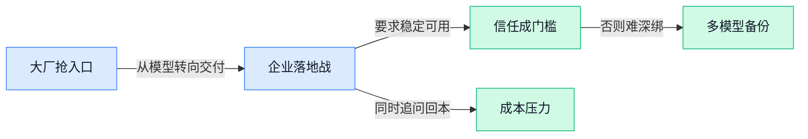

> AI 早报 · 每日早读 · 全网深度聚合

## **今日摘要**

```
OpenAI 推 Partner Network 豪砸1.5亿美元抢企业AI，Salesforce再砸36亿美元吞下 Fin（AI客服平台）
Anthropic 顶级模型遭美国限制出口，高层冲突还致模型一度下线，安全王牌反成治理大考
Meta AI 搜索被看好年入100亿美元，英伟达同步发200亿美元债，AI军备竞赛继续升温
```

### 🔵 产品与功能更新

1. **OpenAI 推出 Partner Network（合作伙伴网络），砸 1.5 亿美元加速企业用 AI。**  
OpenAI 宣布上线 **Partner Network（合作伙伴网络，帮助咨询公司与服务商更系统地把 AI 落地到企业）**，并将投入 **1.5 亿美元**支持全球合作伙伴推进部署、采用与业务转型 💼。这类动作说明，AI 竞争正从“谁模型更强”走向“谁更会进企业、改流程、做交付”，对做运营、行政、财务系统升级的团队尤其有现实意义。简单说，OpenAI 不只是卖模型，也在补齐 **企业落地服务** 这块拼图，让更多公司更容易把 AI 真正接进日常工作流里。[官方发布页(briefing)](https://openai.com/index/introducing-openai-partner-network)


2. **Pokémon Go（全球知名 AR 抓宠游戏）数据训练出的 AI，被曝已关联军用无人机。**  
这篇报道把 Niantic 过去依靠 **Pokémon Go（让玩家边走边玩的增强现实游戏）** 等产品积累的现实世界数据，与后续 AI 能力及军用场景联系了起来，引发了不小争议 ⚠️。这里的关键不只是“游戏数据”，而是 **空间模型（让 AI 理解真实世界地形、建筑和位置关系的能力）** 可能被用于更敏感的用途，比如无人机导航与环境识别。对普通用户和企业来说，这再次提醒大家：很多看似娱乐或效率工具收集的数据，未来可能进入完全不同的应用链条，**数据用途边界** 正变得越来越重要。[完整报道(briefing)](https://the-decoder.com/pokemon-go-data-helped-train-ai-now-linked-to-military-drones/)

3. **Meta 推出 AI 搜索工具，分析师称年收入潜力可达 100 亿美元。**  
据报道，Meta 旗下 Facebook 正推出一款 **AI 搜索工具（用大模型理解问题、整理答案的新型搜索方式）**，分析师认为它未来可能带来高达 **100 亿美元**的年收入想象空间 💰。这背后的逻辑很直接：如果用户把“找答案、找商品、找内容”的入口更多交给 AI，搜索结果页、广告位和导购链路都可能被重新设计。对做市场、内容、电商运营的同事来说，这意味着未来平台流量分发和商业化规则，可能会越来越围绕 **AI 搜索入口** 重构。[完整报道(briefing)](https://news.google.com/rss/articles/CBMi3gFBVV95cUxPLUVYVnZVQWxtZDZnaFpPdTZJTWtBcHNfYTZobFJIbU42SUI0V3ppR2dvTkFVZHNGWndhNG1lbmxxZU8xa1NqV1V1MndmY0hBSl9zYUtiR05RdTJlZ2VMdmxsTmpFQkVaT0dHaHhlODFHcXBmQU12ek9DaW1kT3F3aWIyRTU5d0RCWHV6eDVkNTVackNaem9PZmNvM3hYbEotNy1VdldjdkN2UFF3T3JaMExQVDAwNHYwOWloTGUzNXpjVDNvVDdpLVd5eGJpclMtWFpvaEtQLThYQUQ2S2c?oc=5)

### 🟢 前沿研究

1. **Hy-Embodied-0.5-VLA（一套把视觉、语言和动作打通的机器人学习系统）想把机器人真正带进现实世界。**
这篇工作关注的不只是单个模型，而是从 **VLA（视觉-语言-动作模型，让机器人既“看得懂”又“听得懂”还“做得到”）** 一路延伸到真实可落地的机器人学习栈，也就是一整套从感知到执行的方案 🤖。对非技术同事来说，它的重要性在于：行业正在从“AI 会聊天”走向“AI 能动手”，未来仓储、巡检、服务等场景都会更受关注。论文标题本身就点出了核心方向——让机器人学习不再停留在实验室，而是更贴近现实部署。可查看 [论文页面(briefing)](https://huggingface.co/papers/2606.14409) 了解原始内容。

2. **HarnessX（一套可组合、可适应、可演化的 Agent 运行底座）瞄准更稳的智能体工程化。**
这项研究把重点放在 **Agent harness（智能体运行“线束”或“底座”，负责把模型、工具、流程和规则接起来）** 上，不是单纯追求模型更大，而是让系统更容易拼装、调整和持续演进 🧩。其中 **composable（可组合，像搭积木一样自由拼接模块）**、**adaptive（可适应，能根据环境变化调整行为）**、**evolvable（可演化，后续能持续升级）** 这几个词，直接说明它想解决企业落地时“今天能跑、明天难改”的老问题。对业务团队而言，这类研究的意义在于：未来公司内部的 AI 助手不只是一个聊天框，而是更像可维护的数字流程员工。原文可见 [论文详情(briefing)](https://huggingface.co/papers/2606.14249)。

3. **Orchestra-o1（一种统筹多种输入输出的智能体编排方案）押注“全模态协同”。**
这篇论文主打 **omnimodal（全模态，指文字、图片、语音、视频等多种信息一起处理）** 的 **agent orchestration（智能体编排，让多个能力模块像乐团一样协同工作）** 🎼。如果说过去很多 AI 还只是“看图说话”或“听音转文字”，那这类研究想推进的是：一个系统能同时理解多种信息，再把任务分配给合适模块完成。对公司日常工作来说，这会影响客服、培训、会议纪要、设计审核等需要混合处理文档、图像和语音的场景。更多信息可看 [论文原页(briefing)](https://huggingface.co/papers/2606.13707)。

4. **ClinHallu（一套检测医疗多模态模型“幻觉”问题的评测基准）盯上 AI 医疗最敏感的风险点。**
这里的 **benchmark（评测基准，相当于一套标准化考试题）** 用来诊断医疗 **MLLM（多模态大模型，能同时处理图像和文字的模型）** 在推理过程中分阶段出现的 **hallucination（幻觉，AI 一本正经地说错话）** 🩺。这件事很关键，因为医疗场景里，AI 不只是“答得像不像”，而是“会不会误导人”。论文强调的是 **stage-wise（分阶段）** 诊断，也就是把错误拆开看：究竟是看图阶段错了、理解病历阶段错了，还是推理阶段跑偏了。对行业来说，这说明 AI 医疗正从“能不能做”走向“怎么更安全地做”，详见 [论文页面(briefing)](https://huggingface.co/papers/2606.14697)。

5. **《从 Chatbot 到 Digital Colleague（数字同事, 能长期协作的自主 AI）》提出 AI 正从聊天工具转向常驻型助手。**
这篇研究讨论的不是单次问答，而是 **persistent autonomous AI（持续在线的自主 AI，能长期记住任务并自己推进工作）** 的范式转变 💼。简单说，过去的 **chatbot（聊天机器人）** 更像“你问一句它答一句”，而 **digital colleague（数字同事）** 则更像能持续跟进事项、记住上下文、在需要时自主行动的虚拟员工。对办公室工作者而言，这种转向最值得关注，因为它对应的不是“更会聊天”，而是“更会协作”。如果这一方向成熟，未来行政、运营、人事等岗位接触到的 AI 形态可能会明显变化，可参考 [原论文页(briefing)](https://huggingface.co/papers/2606.14502)。

6. **μ_0（一种可扩展的 3D 世界模型）试图让 AI 更理解真实空间中的互动过程。**
这篇工作提出 **3D interaction-trace world model（基于三维互动轨迹的世界模型，让 AI 学会理解物体、空间和动作之间怎么变化）**，核心目标是提升 AI 对现实环境的建模能力 🌍。所谓 **world model（世界模型）**，可以理解为 AI 在脑中先“模拟世界怎么运转”，再决定下一步怎么做，而不是只靠静态图片或单步反应。这样的研究对机器人、自动化操作、虚拟仿真训练都很关键，因为它们都需要 AI 真正理解“动起来之后会发生什么”。原始论文可看 [论文链接(briefing)](https://huggingface.co/papers/2606.13769)。

7. **Jack Clark 在《Import AI 461（AI 行业观察专栏）》里提醒：Alignment（对齐，让 AI 行为符合人类意图）进展并不乐观。**
这篇专栏文章把多个前沿议题放在一起看，其中最抓人的是“**alignment is not on track（AI 对齐进度并不在正轨上）**”这个判断 ⚠️。文中还提到 **FrontierCode（前沿代码能力方向，指最强模型在编程上的竞争）** 和 **synthetic research interns（合成研究实习生，指由 AI 扮演初级研究助理）** 等话题，反映行业已不只卷模型参数，也在卷研究生产力。对非技术岗位同事来说，这类观察的价值在于：它帮你看清 AI 行业目前最担心什么、最兴奋什么，而不只是追单条新闻。可查看 [专栏原文(briefing)](https://jack-clark.net/2026/06/15/import-ai-461-alignment-is-not-on-track-frontiercode-and-synthetic-research-interns/)。

### 🟡 行业展望与社会影响

1. **美国政府限制 Anthropic 顶级模型出口，引发网络安全老兵公开反对。**
数十位**网络安全**专家联名呼吁白宫撤销对 Anthropic 的 Fable 和 Mythos（该公司两款更强的 AI 模型）出口管制，理由是这会削弱防守方用 AI 保护系统的能力，而不是单纯提高安全性 ⚠️。这件事的争议点很现实：如果最强模型被卡住，真正负责查漏洞、做防护的团队也可能拿不到足够好用的工具。对企业来说，这意味着 **AI 管制** 已不只是外交或科技新闻，而是会直接影响安全团队能不能及时升级“防火墙大脑” 🛡️。[完整报道(briefing)](https://techcrunch.com/2026/06/15/cybersecurity-vets-protest-dangerous-us-government-ban-on-anthropics-most-powerful-models/)


2. **“要求绝对防不住被攻击”的大模型，政府可能在提一个不可能完成的任务。**
另一篇分析把问题说得更尖锐：美国政府似乎希望 Anthropic 提供“**无法被黑**”的 LLM（大语言模型，能理解和生成文字的 AI 核心系统），但这在现实里几乎是不可能的 🤔。因为任何复杂软件系统都很难做到绝对零风险，大模型也一样；真正可行的路径通常是持续测试、加固和限制高风险用法，而不是幻想一次性做出“永远攻不破”的系统。对行业而言，这反映出 **AI 安全监管** 正在碰到一个老问题：规则如果脱离技术实际，最后可能既卡住创新，也不一定更安全。[分析文章(briefing)](https://the-decoder.com/the-us-government-may-be-asking-anthropic-the-impossible-by-demanding-unhackable-llms/)


3. **微软 CEO 纳德拉警告：少数 AI 系统可能吃走大部分经济回报。**
微软 CEO 萨提亚·纳德拉公开提醒，如果未来只有少数几个 **AI 系统** 掌握入口、数据和用户关系，经济收益可能会高度集中到极少数平台手中 💡。这句话的分量很重，因为它点出了 AI 时代一个常被忽略的问题：不只是“谁技术强”，更是“谁拿走价值分配权”。对普通企业和职场人来说，这意味着未来竞争也许不只是买不买 AI，而是要警惕自己是否过度依赖单一平台，失去议价权和业务主动权。[原文解读(briefing)](https://the-decoder.com/microsoft-ceo-satya-nadella-warns-of-a-small-number-of-ai-systems-capturing-all-the-economic-returns/)

4. **Salesforce 36 亿美元收购 Fin（AI 客服平台），企业服务自动化继续升温。**
Salesforce 宣布以 36 亿美元收购 Fin（主打 AI 客服的平台），并计划把其团队和技术用于强化 Agentforce（Salesforce 的企业 AI 代理平台，帮助公司搭建能自动处理任务的 AI 助手）🚀。这说明 **客服自动化** 仍是最容易看到投入产出的 AI 场景之一：客户咨询量大、流程标准化高、企业也愿意为效率买单。对行业来看，大厂正在用并购加速补齐能力，未来企业买的不只是“一个机器人客服”，而是整套能接入业务流程的 **Agent 平台**。[TechCrunch 报道(briefing)](https://techcrunch.com/2026/06/15/salesforce-acquires-ai-customer-service-platform-fin-for-3-6b/) [路透报道(briefing)](https://news.google.com/rss/articles/CBMihwFBVV95cUxQV1FlS21zNlZXYlpJUG5iVDk5a0FkU2c5b1NjaFNZWXlmWDV0NFBrc2d3RVZoTDE1bmYyZ0FQTUp3YTBNYVR5SmlGTWdHb2JuSUFBdVdRWEhIZnEzcDN0SWttMjFWTHdrSGlId19pSXhRV2EtR1Z6YklHUVBoVncybUY5dHpXRzg?oc=5)

5. **英伟达加入“AI 借债潮”，发售 200 亿美元债券。**
英伟达也加入了围绕 **AI 基建** 的融资大潮，宣布进行 200 亿美元债券发售。债券（企业向市场借钱的一种长期融资方式）规模之大，反映出市场对 AI 相关数据中心、芯片与基础设施投入仍在快速扩张 📈。换句话说，AI 的热度不只体现在模型和产品上，更体现在真金白银的资本开支上；这也提醒大家，所谓 AI 竞争，背后其实还是一场重资产、长周期的基础设施竞赛。[报道原文(briefing)](https://the-decoder.com/nvidia-joins-ai-debt-boom-with-20-billion-bond-sale/)

6. **美国 5 月工厂产出持平，但 AI 投资仍在托住制造业。**
路透报道称，美国 5 月**工厂生产**基本持平，不过 **AI 投资** 仍在为制造业提供支撑。这里的关键信号不是“AI 立刻让工厂大爆发”，而是它正成为资本继续投向设备、产线和相关基础设施的重要理由。对更广泛的经济观察来说，这说明 AI 的影响已从软件公司外溢到实体产业，开始影响制造业景气、投资预期和就业结构 🏭。[路透完整报道(briefing)](https://news.google.com/rss/articles/CBMiqAFBVV95cUxOZkhZZGR2cEFxRXFLZTd1U2lxenZfYUdyTWNzR1lnUU9jN2dCWXF1akM4SmU4aEFYNmJRQ0dXT3dSZ1pVblRLWkZXMEwzaE1VMkI5Yi1SZlFsMzQtMFNlZHJIWWZzSDZ1ZHg0eGRHd19hWS1GS01vbzhqWXFYOEFqTHpHdndGY2IxdU9KQzBKN3pMR1VjNXVtaVhRLV8ySFRRdUxvV2dmQTY?oc=5)

7. **微软因支出、云业务与 AI 相关问题遭股东起诉，资本市场开始更较真。**
微软遭股东起诉，争议涉及公司**费用支出**、**云业务**表现以及 AI 相关事项，这说明资本市场对 AI 叙事的容忍度正在下降 🧾。过去投资人更愿意先为“讲故事”和高投入买单，但现在越来越会追问：花出去的钱到底有没有换来业务增长、利润改善和可验证的回报。对所有大公司都是提醒——AI 不再只是“必须跟进”的战略口号，还要经得起财务审视和股东问责。[路透案件报道(briefing)](https://news.google.com/rss/articles/CBMiqwFBVV95cUxNUmJQUkh0dTUzZ2dITlpFWVp1ZGp4d0t2T3RYNHZMTVVra042ZVNYTk94R1dKdjM2cU0yWTh5cXNCVlVHTkFXRDFiT3ptRnNPeDUteGR1RDV5eWVoS3M4NFJsNDVpcHlVTVluQWViLUI0a29XR0JOaERIUXZnUTJ2V2VXSWs4MFBzMlFUR2NGNHJRcEFjUWptTU84dEZ2UllET0NWX2hsTDgwRDQ?oc=5)

### 🟣 开源TOP项目

1. **Kami（一款把网页内容排成“可打印纸张”风格的开源工具）让好内容更适合收藏和打印。**
这个项目的核心点很直接：把屏幕上的内容整理成更像“纸质阅读”的版式，让文章、文档这类**长内容**看起来更舒服 📄。对经常做资料归档、内部分享、培训材料整理的同事来说，这类工具的价值在于把零散网页快速变成更规整的输出物，减少二次排版时间。虽然原始介绍非常简短，但“好内容值得好纸张”这句定位已经说明它主打的是**阅读体验**和**内容呈现**。[GitHub 仓库(briefing)](https://github.com/tw93/Kami)


2. **ponytail（一套让 AI Agent 像“资深程序员偷懒式思考”的开源框架）主打少写代码也能完成任务。**
这个项目的思路很有意思：它希望让 **AI Agent** 在执行开发任务时，优先选择“少做无用功”的路径，而不是一股脑生成一大堆代码 🤖。摘要里那句“最好的代码是你从没写过的代码”，其实强调的是**尽量复用已有能力**、避免重复建设，这对软件团队的效率很有吸引力。这里的 framework（框架，指一套可复用的开发骨架）更像是在教 Agent 学会“先判断有没有更省事的办法”，而不是单纯比谁写得多。[GitHub 项目页(briefing)](https://github.com/DietrichGebert/ponytail)


3. **enableMacosAI（一键开启国行 Mac 上完整 Apple 智能的开源项目）瞄准端侧与云端能力解锁。**
这个项目面向的是使用 **Apple Silicon**（苹果自研芯片，也就是近几年 Mac 上的 M 系列芯片）的用户，主打一键开启国行 Mac 上更完整的 Apple 智能体验 🍎。摘要里特别提到端侧（在设备本地直接运行）和 **Private Cloud Compute**（苹果把复杂 AI 计算放到自家隐私保护云端处理的机制），说明它关注的是本地与云端能力一起打通。对普通用户来说，最直观的意义就是少折腾设置、尽快把系统内置 AI 用起来；对关注设备能力释放的人，这类项目会很有吸引力。[GitHub 仓库说明(briefing)](https://github.com/SkyBlue997/enableMacosAI)


4. **Horizon（一款用 AI 生成中英文日报的个人新闻雷达）把信息追踪做成了自动化。**
Horizon 想解决的是“每天信息太多、但又不想自己手动筛”的问题：它会像一个新闻雷达一样，帮用户生成**中英文简报** 🛰️。这里的 briefing（简报，指把大量信息浓缩成短篇摘要）很适合做行业跟踪、竞品观察或团队晨读材料，尤其适合需要快速掌握动态的运营、市场和管理同事。它的亮点不只是“抓新闻”，而是把“收集—筛选—生成摘要”这条链路尽量自动化，让个人也能搭出自己的信息系统。[GitHub 项目介绍(briefing)](https://github.com/Thysrael/Horizon)

5. **osiris（开源全球情报平台与实时 OSINT 看板）试图做成 Palantir 的平替。**
这个项目定位非常明确：它是一个面向**全球情报分析**的开源平台，并提供实时 **OSINT**（开源情报，指从公开网页、社交平台、地图、公告等公开来源收集信息）仪表盘 📡。摘要还直接说它是 **Palantir**（知名数据分析公司，常为政府和大型机构做复杂信息整合）的替代方案，说明它强调的是多源数据整合与可视化分析能力。对企业风控、舆情监测、市场研究这类场景来说，这种“公开信息统一看板”很有想象空间，价值在于把原本分散的信息汇总成可追踪的全局视图。[GitHub 仓库(briefing)](https://github.com/simplifaisoul/osiris)

6. **Omnigent（一层覆盖多种 AI Agent 的统一调度层）想把 Claude Code、Codex 等助手接到同一套体系里。**
Omnigent 的卖点不是再造一个新 Agent，而是做一个 common layer（通用中间层，像“万能转接板”一样把不同助手接起来）🧩。它可以覆盖 Claude Code、Codex，以及开发者自己写的 Agent，让团队在切换或组合不同工具时，不必每次都重写一套流程；同时还强调 policies（策略规则，用来约束 Agent 行为）和 sandboxing（沙箱隔离，把程序关在受控环境里运行，避免乱动系统）。简单说，它更像一个“总控台”，帮助团队把多个 AI 助手统一管理、协作和约束起来。[GitHub 项目页(briefing)](https://github.com/omnigent-ai/omnigent)

### 🔴 社媒分享

1. **Anthropic 因高层人际冲突导致模型一度下线，引发外界对治理稳定性的担忧。**  
这条社媒讨论聚焦的不是模型能力，而是**公司内部管理**和外部关系如何直接影响产品可用性 😮。Simon Willison 转引 Axios 报道称，Anthropic 的模型下线与**白宫内部博弈**、以及相关人物之间的**性格冲突**有关，说明 AI 公司现在面对的已不只是技术竞争，也包括政策沟通和组织协作。对普通业务团队来说，这类事件提醒我们：即使是头部模型，服务稳定性也可能受非技术因素影响，选型时不能只看“谁更聪明”，还得看“谁更稳”。可先看 [事件解读文章(briefing)](https://simonwillison.net/2026/Jun/15/axios-clashes-anthropics/#atom-everything) 和 [Axios 原始报道(briefing)](https://www.axios.com/2026/06/15/anthropic-white-house-fable-mythos) 了解来龙去脉。


2. **Anthropic 的“安全优势”被认为正成为它区别于同行的核心筹码。**  
Stratechery 这篇分析认为，Anthropic 之所以能持续获得关注，不只是因为模型表现强，还因为它把**安全**做成了真正的产品差异化 💡。这里的安全不只是“不乱答”，也包括 **alignment（对齐，让模型行为尽量符合人类意图和规则）** 以及面向企业和政策场景的风险控制，这对大公司客户尤其重要。换句话说，当越来越多企业把 AI 用进客服、文档、内部知识库等正式流程时，“更可靠、可控”可能比“偶尔更惊艳”更值钱。相关观点可参考 [Stratechery 分析原文(briefing)](https://stratechery.com/2026/anthropics-safety-superpower/)。

---



### 📊 行业洞察（今日 4 条）

1. OpenAI 砸1.5亿美元做 Partner Network（合作伙伴网络），Salesforce 又花36亿美元收购 Fin（AI 客服平台）
  【洞察】大厂在抢的已不是“最强模型”名头，而是企业落地入口；谁能进流程、做交付、拿结果，谁才更容易赚到真钱

2. Anthropic 模型先被美国限制出口，又因高层冲突一度下线；同时外界还在吹它的“安全优势”
  【洞察】AI 公司的真正风险不只在模型对错，还在政策关系和组织稳定；“更安全”如果换不来持续可用，企业也不敢深绑

3. HarnessX、Orchestra-o1、Digital Colleague（数字同事）都在讲长期协作，Meta 又押注 AI 搜索入口
  【洞察】AI 正从“回答一次问题”变成“长期接活并分发任务”；未来价值会更多落在入口、编排和用户关系，不只是单次生成能力

4. 英伟达发200亿美元债券扩 AI 基建，微软却因 AI 支出和回报问题遭股东起诉
  【洞察】行业还在重金猛冲，但资本开始追问回本；这说明 AI 不是只看增速，更要证明收入、成本和效率真能对上账

### 💭 对我们的启发（今日 3 条）

1. OpenAI 做合作伙伴网络、Salesforce 收购 Fin，说明企业客户买的是“能落地的结果”。我们的视频剪辑软件不能只卖功能，要把出片流程、审核、复用模板一起做成可交付方案。

2. Anthropic 被限、下线两件事提醒我们：视频生成和剪辑能力不能压在单一模型上。产品上要保留多家能力切换和人工接管，不然上游一抖，我们就跟着停摆。

3. Meta 做 AI 搜索、路透说 AI 引导来的消费者停留更久也更愿花钱，说明分发入口在变。我们要尽快补“面向搜索与导购的短视频素材组织、标题脚本、版本测试”能力，而不只是剪辑本身。


---

> 本周周报：[第25周综合分析](https://zhuxinfei.github.io/ai-daily-site/blog/weekly/2026-w25/)
