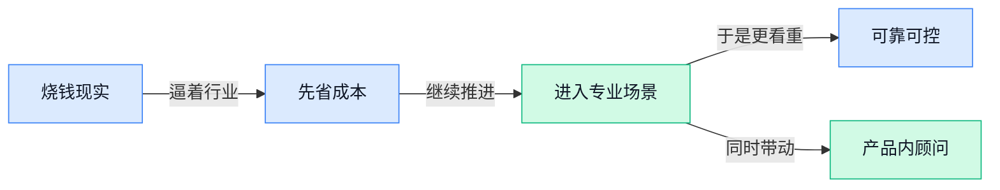

> AI 早报 · 每日早读 · 全网深度聚合

## **今日摘要**

```
智谱 GLM-5.2 登顶 Artificial Analysis，编程评测逼近闭源头部模型，国产开源正面硬刚 OpenAI
OpenAI 被曝每年亏损数十亿美元，还在研究模型上线前会翻车几次，烧钱与失控双线承压
美国暂缓将 DeepSeek 列入黑名单，Anthropic 突袭首尔扩张韩国生态，中美韩 AI 竞速再升温
```

### 🔵 产品与功能更新

1. **肿瘤评估 AI 模型帮助间皮瘤患者与医生更快看清病情。**
这条更新聚焦 **医疗 AI** 的实际落地：一款用于**肿瘤评估**的 AI 模型，被报道为能让**间皮瘤**（一种较少见、侵袭性较强的癌症）患者和医生都从中受益 💡。对普通人来说，这类工具的价值在于把原本更依赖人工经验的判断，变成更可重复、可辅助沟通的分析过程，医生看得更清楚，患者也更容易理解病情。报道没有把它写成“替代医生”，而是强调它在临床判断中的**辅助作用**，这也是当前医疗 AI 更现实的方向。可查看这则[医疗应用报道(briefing)](https://news.google.com/rss/articles/CBMiXEFVX3lxTE53eHJZTGxUbEpDSEVsU01kVWhYaGVsNnBkakItUWVPM3lUSE10cG5OaEpnMlVRY2dNb2hYcW9hVUxsTExKNDVCY0s2ZTd0b3oxYmF5eXk2U0E0bkFL?oc=5)。

2. **Workforce Solutions 推出 AI 暑期项目，面向高中生提前补上未来职场能力。**
这不是新模型发布，而是一个偏 **人才培养** 的功能型动作：Workforce Solutions（当地劳动力发展与就业服务机构）上线了面向高中生的 **AI 暑期项目** ☀️。它反映出一个越来越清晰的趋势——AI 不再只是程序员的事，而是在更早的教育阶段就被当作**通用工作能力**来培养。对企业和职场来说，这意味着未来新人进入岗位时，可能会更自然地使用 ChatGPT 一类工具处理资料、写作和分析任务。[项目新闻报道(briefing)](https://news.google.com/rss/articles/CBMioAFBVV95cUxQUHFjREVDTGpSVU5vbXVzLUNRZ0NZeXY1cURfLU1LeHh1RkFrLXJDUjJHMTlpZDR3bmEycGdoR180QmlmLVMwLU5SY1dOTHdMOElzR2RWekxza2VnMnREMTlQS2pkSnlWNmxpRXh5bzBkbTVqTE12dEc1cHZieFdqZkVRM2kyVEsxMmRuX3JMMXdIWks1MDQ2bzVCX2NTSG5V0gG0AUFVX3lxTE1qZGxOdGplemxTWFJqeTZla2ZFSlIwWmNCYjVxVEZBQ1M2VlVkRGpLTG1MeDM5VE5CQmM3anNKWUNpaFlKWTVYQlhtS3h3Y19xeDYtdkhTMU1iSDR6Qi1Sb2dzS2NFTXd0WTc3QThLQmZkeDRWUWN3cjB3WWxSSGprOTZVUWs0aW1CUkptM3dCS3lFVm5xY2ozUlNYYzF4dEZUZVVhVzk5Qzk2cmdKWi1RTVF6aw?oc=5)。

3. **Coinbase 推出 A.I. Advisor（AI 顾问功能），把加密平台服务再往智能化推一步。**
Coinbase 这次上线的是 **A.I. Advisor（AI 顾问功能，用智能问答方式帮助用户理解和使用平台服务）**，属于典型的产品层功能更新 🚀。对普通用户来说，这类功能通常不是在“发明新技术”，而是在把原本复杂的金融信息、操作路径或平台说明，变得更容易问、也更容易懂。放在行业里看，这说明 **AI 助手** 正在从办公场景进一步走向**垂直平台服务**，尤其是信息复杂、用户门槛较高的领域更有动力接入。相关情况可参考这则[财经简报报道(briefing)](https://news.google.com/rss/articles/CBMingFBVV95cUxOdDRWRWNrOVlJdjBEYnpYalNaWXhkMFBHUkNKMVk5ampENGw3Q3pOMHlaTTZieUlDUHQ1UTJMVXAtSjNFZVp6VzFqTlFGUHRFNnY2WFJBbjk0bWU4dnNCX0VtQ01SQ2dOLTl6QkduQ2k3eGVlZ2RQWW9fd09KR3h1THBrbm5MNVhBdEc1bTJhdHlEaUxOZWNEUnhwcGdjZw?oc=5)。

### 🟢 前沿研究

1. **OpenAI 研究人员想在模型上线前预测它会“翻车”多少次。**
这项研究的重点不是让模型**永不出错**，而是提前估算它在真实使用中会以多高频率失败，相当于先给 AI 做一份“风险体检” 🩺。对企业来说，这比只看考试式榜单更实用，因为上线后真正麻烦的往往是那些**低频但高代价**的错误。它也反映出 AI 评估正在从“答对几题”转向“能不能稳定上岗”这件更现实的方向。[完整报道(briefing)](https://the-decoder.com/openai-researchers-want-to-predict-how-often-ai-models-will-fail-before-launch/) 💡


2. **《The Price of Anarchy in Disaggregated Inference（分离式模型推理中的“无序代价”研究）》关注 AI 系统拆分运行后的效率损失。**
这里的 **Disaggregated Inference（分离式模型推理，把模型计算拆到不同机器或模块上执行）**，常被用来提升资源利用率，但论文关注的是：一旦各部分各自做局部最优决策，整体系统可能会变慢或更低效。标题里的 **Price of Anarchy（无序代价，指每个参与方都按自己利益行动时，整体效率比“统一协调”差多少）**，原本来自博弈论（研究多方决策互动的学科），现在被拿来分析 AI 基础设施调度问题。对做产品和运营的同事来说，这类研究的意义在于：未来同样的算力预算，未必只靠堆机器提升体验，**调度方式**本身也可能决定响应速度和成本。[论文页面(briefing)](https://huggingface.co/papers/2606.17081) 🚀

3. **Looped World Models（循环世界模型，用重复计算模拟未来变化的模型）试图兼顾长程预测与部署成本。**
所谓 **world model（世界模型，让 AI 在内部“想象”环境如何演变的模型）**，难点在于：想看得更远，就得做更深、更贵的计算，而且误差还会一层层累积。这个工作提出“循环”思路，让模型反复使用同一套计算模块，而不是一味堆更多层数，从而在**长时程模拟**和**推理成本**之间找平衡。对机器人、自动驾驶和复杂流程规划来说，这类研究很关键，因为它关系到 AI 能不能在更长任务链里保持靠谱，而不是走几步就偏航。[arxiv 论文(briefing)](https://arxiv.org/abs/2606.18208) 🤖

4. **智谱 GLM-5.2 在编程马拉松式评测中逼近闭源头部模型。**
报道显示，智谱的 **GLM-5.2（智谱推出的新一代大模型）** 在长时间、连续多轮的编码任务里，表现正接近一些闭源领先模型。这里所谓“编程马拉松”，可以理解为不是做一道小题，而是让模型持续完成复杂开发任务，更接近真实工作场景；这比单轮答题更能看出**稳定性**和**耐力**。如果趋势持续，国内模型在高强度代码场景里的竞争力会更强，也意味着企业在选型时，开源或本土方案的可用性正在上升。[完整报道(briefing)](https://the-decoder.com/zhipu-ais-glm-5-2-closes-in-on-closed-source-leaders-in-coding-marathons/) 💻

5. **近乎自主的 AI chemist（AI 化学家，能辅助设计和改进化学实验流程的系统）改善了一项高难度药物反应。**
OpenAI 与 Molecule.one 展示了一个基于 **GPT-5.4** 的 AI 化学系统，如何改进医药化学中的关键反应步骤。这里的“近乎自主”不是完全无人参与，而是 AI 能在实验设计与方案优化上承担更多工作，帮助研究人员更快找到可行路径。对医药行业来说，这类成果的意义不只是“会答题”，而是 AI 开始进入**研发试验**这种高价值、强专业的真实环节。[官方发布页(briefing)](https://openai.com/index/ai-chemist-improves-reaction) 🧪

6. **Google 研究称 AMIE（医疗对话 AI 系统）可帮助管理复杂健康问题。**
这项发表于 Nature 的研究显示，**AMIE（Google 的医疗对话 AI，用聊天方式辅助健康管理）** 在复杂疾病管理场景中，能达到与基层医生相当的表现。这里说的“疾病管理”不只是回答一个健康问题，而是围绕长期病情、随访和多轮沟通提供支持，因此更贴近真实医疗服务。对普通人和企业福利场景来说，这意味着 AI 医疗助手未来可能更适合做**前置沟通**和**持续跟进**，帮助缓解医疗资源紧张，但它仍是辅助角色，不等于替代医生。[Google 研究介绍(briefing)](https://blog.google/innovation-and-ai/models-and-research/google-research/amie-for-disease-management-in-nature/) 🩺

7. **《Verified Detection and Prevention of Concurrency Anomalies in Multi-Agent Large Language Model Systems（多 Agent 大模型系统中的并发异常验证与预防）》盯上了“多个 AI 同时干活”的隐患。**
当多个 **Agent（能独立执行任务的 AI 助手）** 一起操作同一套流程时，可能出现 **Concurrency Anomalies（并发异常，多个任务同时进行时互相打架、覆盖或顺序错乱的问题）**。这篇论文关注的不只是“发现 bug”，还强调 **Verified（可验证）**，也就是用更严格的方法证明某些异常能被检测和避免，而不是靠经验碰运气。对企业自动化来说，这很重要：以后 AI 不只是一个聊天窗口，而是多个助手同时处理审批、客服、排班、采购时，系统是否可靠会直接影响业务风险。[论文页面(briefing)](https://huggingface.co/papers/2606.17182) ⚙️

8. **LoopCoder-v2（循环式代码模型第二代）想用“只循环一次”提升测试时计算效率。**
这篇论文讨论的是 **Test-Time Computation Scaling（测试时计算扩展，模型在真正回答问题时临时多花点算力来提升结果）**，目标是在不显著拖慢速度的情况下，让代码模型答得更好。它基于 **Looped Transformers（循环式 Transformer，一种把同一计算模块反复利用的模型结构）**，并尝试减少传统循环带来的延迟和 **KV-cache（键值缓存，模型为记住上下文而保存的中间记忆，占显存也影响速度）** 压力。对实际产品部署来说，这类研究很接地气：大家都想要更强的模型，但如果每次回答都慢很多、贵很多，就很难真正落地。[arxiv 论文(briefing)](https://arxiv.org/abs/2606.18023) 🚀

### 🟡 行业展望与社会影响

1. **Anthropic 在首尔设办公室，并扩大韩国 AI 生态合作。**
这件事的重点不只是“开新办公室”，而是 **Anthropic** 明确把韩国放进了全球布局里 🌏。原文提到它会在韩国推进新的本地合作，意味着 **AI 生态** 不再只是几家美国公司单打独斗，而是更强调和本地企业、机构一起落地。对行业来说，这类区域化扩张通常会带来更多 **本地化产品**、**企业合作** 和 **人才竞争**，也说明亚洲市场在 AI 产业链里的分量还在继续上升。[Anthropic 官方发布页(briefing)](https://www.anthropic.com/news/seoul-office-partnerships-korean-ai-ecosystem)


2. **Amazon、Nvidia 和 AMD 押注 3D world models（3D 世界模型，让 AI 理解并模拟真实空间）的创业公司。**
三家大厂合计投入 **3.1 亿美元**，押的不是普通聊天机器人，而是能构建 **3D world models（3D 世界模型，让 AI 在数字空间里“理解世界怎么运转”）** 的公司 🤖。这类模型的想象空间很大，因为它更接近让 AI 具备“空间理解”与“环境模拟”能力，未来可能影响机器人、自动驾驶和虚拟场景生成。对普通职场人来说，这代表 AI 的下一阶段竞争，正在从“会说会写”走向“会看、会理解、会模拟现实”。[完整报道(briefing)](https://the-decoder.com/amazon-nvidia-and-amd-bet-310-million-on-ai-startup-building-3d-world-models/)


3. **Google DeepMind 用 AI-accelerated planning（AI 加速审批规划，用模型辅助更快做建设决策）切入英国住房审批。**
Google DeepMind 和英国政府合作，想用 **AI-accelerated planning（AI 加速审批规划，用模型辅助分析材料、提高决策速度）** 做一个住房审批原型系统 🏘️。这不是单纯的技术展示，而是把 AI 直接放进公共治理流程，尝试解决“房子建得太慢”的现实问题。它释放的信号很明确：AI 的价值越来越不只体现在办公室效率，也开始进入 **政府服务** 和 **城市建设** 这类更大的社会系统。对行业观察者来说，这类案例很关键，因为它决定了 AI 会不会从工具升级为基础公共能力。[官方博客说明(briefing)](https://deepmind.google/blog/unlocking-uk-house-building-with-ai-accelerated-planning/)

### 🟣 开源TOP项目

1. **effective-html（一套用简洁 HTML 生成方案图和页面草图的 Agent 技能）让 AI 更会“画方案”。**
这个开源项目主打把**HTML**（网页的基础标记语言，可以理解成搭页面骨架的方式）用得更轻更美，让 Agent 按统一风格输出**架构图**、计划页或其他可视化内容 💡。对不懂设计软件的人也很友好，因为它本质上是在帮 AI 生成“能直接打开查看”的轻量页面，而不是一堆难读的描述。对于做产品、运营、项目管理的同事来说，这类能力意味着以后写流程方案、展示结构关系时，AI 不只会“说”，还能顺手“排版成型”。可先看它的 [GitHub 项目页(briefing)](https://github.com/plannotator/effective-html) 了解具体用法 🚀


2. **kage（一款把网站“去脚本化”后离线保存的工具）适合做网页留档。**
这个项目的核心能力，是把网站内容“影子复制”下来，并去掉 **JavaScript**（让网页产生交互效果的脚本语言），方便用户**离线查看**。这样处理后的页面通常更轻、更稳定，也更适合做资料归档、内容备份或留存证据 📦。对行政、运营、研究同事来说，如果你担心网页以后改版、下线，或者只想保存可读内容，这类工具就很实用。详情可见 [离线镜像项目页(briefing)](https://github.com/tamnd/kage)


3. **improve（一种让强模型先审代码、再交给便宜模型执行的代码协作流程）想降低 AI 开发成本。**
这个项目的思路很像“资深顾问先定方案，执行团队再照着做”：先用能力更强的大模型审查**代码库**（一个项目的全部代码与文件集合），再输出清晰计划，交给成本更低的模型去落实 ✍️。它瞄准的是现实里的一个痛点——不是所有环节都需要最贵的模型，先把复杂判断和后续执行拆开，能更讲究投入产出比。即使你不写代码，也能看懂它背后的业务意义：企业未来用 AI 协作时，可能会越来越像“高配模型做决策，低配模型做执行”。项目入口在 [代码审查流程仓库(briefing)](https://github.com/shadcn/improve)


4. **SkillSpector（英伟达推出的 AI Agent 技能安全扫描器）瞄准 Agent 安全风险。**
SkillSpector 是英伟达开源的一个**安全扫描器**，专门检查 AI Agent 的“技能”里有没有**漏洞**、恶意模式或其他安全隐患 🛡️。这里的 Agent 技能，可以理解成 AI 调用外部工具、执行任务时遵循的一段能力配置；一旦设计不当，就可能带来误操作甚至被利用的风险。随着越来越多团队让 AI 接数据库、文件系统和办公流程，安全检查会变成上线前的基础动作，而不只是技术团队的额外选项。可查看 [英伟达项目仓库(briefing)](https://github.com/NVIDIA/SkillSpector) 了解它扫描什么、怎么用。

### 🔴 社媒分享

1. **GLM-5.2（智谱新一代开源权重模型）在 Artificial Analysis（第三方 AI 模型评测机构）排名登顶。**
这次被强调的不是“又发了个新模型”，而是 **open weights（开放模型权重，也就是把模型核心参数公开，方便企业和开发者自己部署）** 阵营里，GLM-5.2 在第三方榜单上拿到了领先位置 📈。对公司用户来说，这类模型的价值在于既能追求性能，又更方便做 **私有化部署** 和成本控制，尤其适合对数据合规有要求的场景。想看具体评测结论，可以直接翻 [评测机构原文(briefing)](https://artificialanalysis.ai/articles/glm-5-2-is-the-new-leading-open-weights-model-on-the-artificial-analysis-intelligence-index)；如果想了解它为什么主打长任务处理，也可以看 [官方技术介绍(briefing)](https://huggingface.co/blog/zai-org/glm-52-blog) 💡


2. **GLM-5.2（智谱新一代开源权重模型）主打 Long-Horizon Tasks（长链路任务, 需要连续多步规划和执行的复杂工作）。**
官方介绍把重点放在 **长链路任务**：不是回答一句话就结束，而是让模型能连续处理多步骤、跨上下文的工作流，比如更复杂的分析、规划和执行 🧠。这类能力对办公场景特别关键，因为很多真实工作并不是“问一次答一次”，而是要反复读资料、拆步骤、接着往下做。原文发布在 HuggingFace（全球最大 AI 模型共享社区）博客，感兴趣可以看 [官方博客说明(briefing)](https://huggingface.co/blog/zai-org/glm-52-blog)；结合前面的第三方成绩，再看它的市场位置会更清楚一些。[第三方评测文章(briefing)](https://artificialanalysis.ai/articles/glm-5-2-is-the-new-leading-open-weights-model-on-the-artificial-analysis-intelligence-index)


3. **OpenAI 被曝每年亏损数十亿美元，AI 竞赛的“烧钱现实”再次摊开。**
这篇报道的核心很直接：泄露出的财务文件显示，OpenAI 目前仍在承受 **每年数十亿美元级别的亏损** 💸。这也提醒大家，大模型行业表面上产品更新飞快，背后其实是极高的 **训练成本** 和 **inference（模型推理，让训练好的模型真正回答问题的过程）** 成本在持续吞钱。对普通公司来说，这意味着未来选型时不能只看“模型聪不聪明”，还要看谁能把价格、效率和商业模式真正跑通。具体内容可见 [完整报道原文(briefing)](https://arstechnica.com/ai/2026/06/leaked-financial-docs-show-openai-is-losing-billions-of-dollars-a-year/) 🚀

4. **美国暂缓将 DeepSeek 列入黑名单，另有 100 多家企业被认定存在安全风险。**
路透这条消息释放的是很明确的政策信号：美国方面目前 **暂缓** 对 DeepSeek 采取黑名单动作，但同时把更大范围的中国企业纳入了安全风险视野 🌍。这类“先观察、再决定”的动作，说明 AI 竞争已经不只是产品和模型能力之争，也和 **出口管制**、供应链、国际政策环境紧紧绑在一起。对企业用户和从业者来说，后续如果政策收紧，可能会影响合作、采购甚至全球业务布局。原报道可参考 [路透完整报道(briefing)](https://www.reuters.com/world/china/us-holds-off-blacklisting-chinas-deepseek-more-than-100-firms-deemed-security-2026-06-17/)

5. **MolmoMotion（一个用自然语言引导的 3D 动作预测模型）瞄准“看懂并预测接下来怎么动”。**
这个项目关注的是 **3D motion forecasting（3D 动作预测，也就是根据当前画面推测物体或人物接下来会怎么移动）**，并且加入了 **language-guided（语言引导，让人可以用文字告诉模型该关注什么）** 的能力 🤖。通俗说，它不是只“看视频猜下一帧”，而是尝试让 AI 在空间里理解动作趋势，这对机器人、自动化交互和更真实的虚拟世界应用都很关键。项目由 AllenAI 发布在 HuggingFace（全球最大 AI 模型共享社区）博客，想看原始介绍可读 [项目发布说明(briefing)](https://huggingface.co/blog/allenai/molmomotion) 💡

6. **《The State of Fable, The Jailbreak Problem, SpaceX Acquires Cursor》聚焦 Anthropic 的 Fable（相关项目名）争议与越狱风险。**
这篇文章的摘要点得很明确：作者认为美国政府对 **Fable（文中讨论的 Anthropic 相关项目）** 的判断很可能有误，但最终责任仍然在 Anthropic 身上。文中还把 **jailbreak（越狱攻击，指用户通过特殊提示词绕过模型安全限制）** 当成核心问题之一，强调模型安全不能只靠外部争议来定义，而是平台自身必须负起责任 🔐。对企业用户来说，这类讨论很重要，因为 AI 一旦进入办公和业务流程，安全边界、内容约束和责任归属都会变成实际管理问题。原文可看 [专栏全文链接(briefing)](https://stratechery.com/2026/the-state-of-fable-the-jailbreak-problem-spacex-acquires-cursor/)

---



### 📊 行业洞察（今日 4 条）

1. OpenAI被曝年亏数十亿美元，LoopCoder-v2（循环式代码模型第二代）和 Looped World Models（循环世界模型）都在想办法少花算力
  【洞察】行业开始从“拼更强”转向“拼更省”，因为模型再聪明，若成本压不住，商业上也站不稳

2. OpenAI研究上线前先估算模型会翻车几次，英伟达开源 SkillSpector（AI 助手技能安全扫描器），都在补“先检查再放行”
  【洞察】AI 竞争重点正从能力展示转向可靠性治理，谁能证明自己更稳、更可控，谁才更容易进企业流程

3. Google 的 AMIE（医疗对话 AI 系统）进复杂病程管理，OpenAI 的 AI chemist（AI 化学家）进入药物反应优化
  【洞察】AI 已不满足于做通用聊天，而是在高价值专业场景里做“辅助决策”，这说明真正的壁垒正转向行业理解

4. 智谱 GLM-5.2 在长任务评测逼近闭源头部，Anthropic 又在韩国扩生态
  【洞察】一边是模型能力差距缩小，一边是区域落地加速，说明未来竞争不会只看谁最强，还要看谁更近市场、更好部署

### 💭 对我们的启发（今日 3 条）

1. OpenAI 亏损和多篇“省算力”研究放一起看，我们的视频工具不能默认一直用最贵模型；草稿、改写、定稿要分层用，先保毛利，再谈体验。

2. OpenAI 做翻车预测、英伟达做安全扫描，说明剪辑工具里凡是“自动发片、自动改文案、自动替换素材”的功能，都要有可回看、可撤销、可人工接管。

3. Coinbase 推 AI 顾问功能，说明复杂平台会把“教学”直接做进产品。我们不能只给按钮和模板，得把选题、脚本、剪辑建议变成边做边教的新手引导。


---

> 本周周报：[第25周综合分析](https://zhuxinfei.github.io/ai-daily-site/blog/weekly/2026-w25/)
