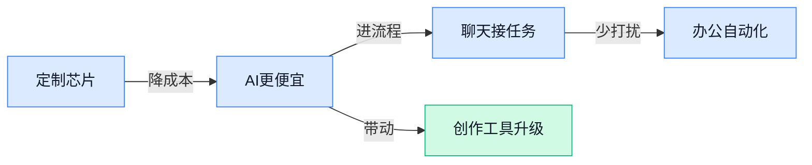

> AI 早报 · 每日早读 · 全网深度聚合

## **今日摘要**

```
Anthropic 把 Claude Tag 直接塞进 Slack，企业聊天里 AI 标签协作开始落地
OpenAI 首款定制芯片交给 Broadcom 打造，ChatGPT Instant 又升级成“更懂你”的模式
NVIDIA NeMo AutoModel 让 Transformer 微调更快，45°C 冷却设计把数据中心用水量压到接近零
```

### 🔵 产品与功能更新

1. **Anthropic 把 Claude Tag（Claude 标签功能）带进 Slack（企业聊天协作工具）。**  
Anthropic 这次不是单纯升级模型，而是把 **AI Agent** 更自然地接进了团队日常聊天场景，重点就是让人们在 **Slack（企业聊天协作工具）** 里直接调用它做事。对文职同事来说，这类更新最直观的意义是：以后很多“在群里问、整理、转发、跟进”的动作，可能能让 AI 顺手代劳。文章来自 [TechRepublic 报道(briefing)](https://news.google.com/rss/articles/CBMihAFBVV95cUxQVExhdFFnbzl6T2JHcC1tWWdvYmNqWlpLa0tURExKTzJuM2ZjVUJTY0VaUmRPQklGaEprVjZKcGtsZUQ2dURGb3pneVF0T3RPbERINmhoTDdqRFFSOG96aW9Ucy02SnRnUjFmX3hILXBsa2VxYkMyWXM2UjBLdEppZzRkQy0?oc=5)。

2. **Google 推迟 Gemini 3.5 Pro（谷歌新一代前沿大模型）发布到 7 月。**  
这次不是功能上线，而是发布时间往后挪了，说明 Google 还在继续打磨这个 **frontier AI model（前沿大模型，代表厂商最强一档模型）**。对业务同事来说，这类延期通常意味着产品可能更稳，但也会影响外部期待和竞品节奏。相关消息可看 [Business Insider 报道(briefing)](https://news.google.com/rss/articles/CBMikwFBVV95cUxQREwxNHVteGEyX2VHdWc4NDlHYzlocExKY1VpMExkZnl2SmM1WXJpbjM2SU5yOWhZb25DWTNSVnJYUzduSE1HY3F5MER0Y0VKQXlkX2M2LVlEUDRZUDlNcWEtU19IRURPSFJYV0VRM19BTHNBcmptaGlkZjJpTkJONngtS0liTG44NW90aEpkbHBLakk?oc=5)。

3. **Abstract 推出 AI Workflow Agent（AI 工作流代理, 能自动串起多个步骤的助手）。**  
Abstract 是一家做 **legislative data（立法数据）** 的公司，这次发布的是一个面向流程自动化的 **agent（代理，能按目标自己执行多步任务的 AI）**。它的价值在于把原本需要人工反复操作的流程，交给 AI 去接力完成，特别适合数据整理、流程跟进这类重复性工作。更多信息见 [GovTech 报道(briefing)](https://news.google.com/rss/articles/CBMijgFBVV95cUxOR2RQVDQ4Q0xhb0RUOFFMcU5oMUJJemFKN2Q4ZzRxcW5nN1IxeVZGcEphbFJQMDRVSTRhY3Z3UEREeTJSZmczMUFFeW1iMEFzX3RSNmUweThsOXZfZ0NjNTZyb3BLTzhBTm5STmRRS3dyYlRWT0xEaTRiTVhPbmNGZk91NVp3Umdua2tRQm93?oc=5)。

### 🟢 前沿研究

1. **InSight：让 VLA（视觉语言动作模型）自己摸索新技能。**
InSight 这个框架想解决一个很现实的问题：**VLA**（把视觉、语言和动作连在一起的模型）虽然能学会操作任务，但能力往往被训练数据里出现过的技能“卡住”。它主打 **self-guided skill acquisition（自我引导式技能获取）**，意思是模型不只照着示范学，还能更主动地挖掘和扩展可用技能。对做机器人、智能设备或自动化操作的人来说，这类研究的价值在于，未来模型可能不再只会“照抄”，而是更会“举一反三”。[arxiv 论文(briefing)](https://arxiv.org/abs/2606.24884)


2. **OpenThoughts-Agent：给 Agentic Models（智能体模型）准备的数据配方。**
这篇更像是在讲 **agentic models（能自主拆任务、做决策的模型）** 该怎么喂数据，重点不是单一模型，而是数据组织方式。标题里的 **data recipes（数据配方）** 可以理解成一套更系统的训练菜单，目的是让模型更适合当“会干活的助手”。对产品和运营同事来说，这类工作意味着：未来 AI 不只是会回答问题，还可能更擅长按流程做事、接任务、追步骤。[Hugging Face 论文页(briefing)](https://huggingface.co/papers/2606.24855)

3. **FlowR2A：把“奖励”转成驾驶规划动作分布。**
FlowR2A 关注的是 **multimodal driving planning（多模态驾驶规划, 同时参考图像、传感信息等来决定怎么开）**。它研究的是 **reward-to-action distribution（把奖励信号映射成动作分布）**，通俗说就是让系统不只给出一个死答案，而是学会在不同情境下更合理地选动作。这样的方向对自动驾驶研发很关键，因为真实路况变化太快，模型需要更稳地在“该怎么开”上做判断。[Hugging Face 论文页(briefing)](https://huggingface.co/papers/2606.24231)

4. **InSight：让 VLA（视觉语言动作模型）摆脱“只会背示范”的限制。**
这条和上面那篇同名，核心也是 **steerable VLAs（可被引导的视觉语言动作模型）**。它强调模型能在更少人为干预下，自主获取新技能，而不是完全依赖训练集里已经写好的样本。对智能硬件、机器人流程自动化这类场景来说，这类方法的意义在于降低“每来一个新任务都要重新喂很多数据”的成本。[Hugging Face 论文页(briefing)](https://huggingface.co/papers/2606.24884)

5. **ReMMD：用多语言、多图片的智能核验，查多模态谣言。**
ReMMD 的重点是 **multilingual multi-image agentic verification（多语言、多图片的智能核验）**，目标是做 **multimodal misinformation detection（多模态虚假信息检测）**。这意味着它不只看文字，还会结合图片，并且面向不同语言场景去判断信息真假。对内容审核、品牌公关、舆情监测这类工作很有启发：未来“辟谣”可能越来越依赖能同时看懂图文的 AI。[Hugging Face 论文页(briefing)](https://huggingface.co/papers/2606.24112)

6. **Mistral 传出新 OCR（光学字符识别）模型，在盲测中表现更强。**
这则消息说的是 Mistral 的新 **OCR（光学字符识别，简单说就是把图片里的文字读出来）** 模型，在盲测案例里击败了竞争对手，且公司方面这样表示。对日常办公场景来说，OCR 直接关系到发票、合同、扫描件、截图文字提取这些高频需求。若模型真如报道所说更强，意味着很多“看图转字”的工作会更快、更准。[完整报道(briefing)](https://the-decoder.com/mistrals-new-ocr-model-beats-competitors-in-72-percent-of-blind-test-cases-company-says/)

7. **Holistic Data Scheduler：用多目标强化学习（让系统在多个目标间找平衡）安排 LLM 预训练数据。**
这篇研究盯的是 **LLM pre-training（大模型预训练，模型正式学语言能力前的海量通识训练）** 阶段的数据调度。它引入 **multi-objective reinforcement learning（多目标强化学习, 让系统在多个目标之间权衡取舍）**，意思不是只追一个指标，而是同时考虑多个训练目标来安排数据。对企业来说，这类工作虽然偏底层，但它决定了未来模型“学得好不好、贵不贵、稳不稳”。[Hugging Face 论文页(briefing)](https://huggingface.co/papers/2606.24133)

8. **FLUX3D：用扩散模型（逐步生成内容的模型）做高保真 3D Gaussian 生成。**
FLUX3D 研究的是 **3D Gaussian generation（3D 高斯生成，一种把三维场景表示成很多“模糊小点”的方法）**，并结合 **diffusion-aligned sparse representation（与扩散模型对齐的稀疏表示, 用更省的方式保留关键信息）**。简单理解，它是在提升三维内容生成的精细度和效率。对做 3D 内容、虚拟展示、数字人场景的团队来说，这类技术可能会影响未来的建模流程和制作成本。[Hugging Face 论文页(briefing)](https://huggingface.co/papers/2606.24874)

### 🟡 行业展望与社会影响

1. **Figma 在 Config 2026 强调“人来拍板”，但画布里的 AI 可能不是自家的。**  
Figma 在这次 Config 2026（Figma 的年度产品发布会）上，把重点放在**人的判断**而不是一味自动化：也就是说，设计里最后怎么定，还是希望由人来做主。报道同时提到，Figma 画布里驱动部分 AI 功能的能力，来自**别家技术**，这也反映出工具公司正在重新分工：前台体验归自己，底层 AI 可能外采。对做设计、运营和产品的同事来说，这意味着未来软件会越来越“聪明”，但**谁来决定结果**依然很重要。[完整报道(briefing)](https://the-decoder.com/figma-bets-on-human-judgment-at-config-2026-while-the-ai-powering-its-canvas-belongs-to-someone-else/)


2. **OpenAI 说 ChatGPT Instant（即时模式，能更快给出回应的聊天模式）更懂用户真正想要什么。**  
这次更新的重点不是“回答更长”，而是让 ChatGPT Instant 更会抓住用户的**真实意图**，减少那种“你字面上问这个，它却理解偏了”的情况。对日常办公来说，这类改进通常意味着你发一句模糊需求，AI 也更可能接住上下文，不用反复改口。换句话说，ChatGPT 正在从“会答题”往“更会猜你要什么”走一步。[更新解读(briefing)](https://the-decoder.com/openai-says-chatgpt-instant-now-better-understands-what-users-actually-want/)

3. **ChatGPT 最常用模型又更新了，重点还是让它更懂日常提问。**  
这条消息说的是 OpenAI 对 ChatGPT 使用最频繁的模型再次做了调整，核心方向依然是提升**理解用户意图**的能力。虽然细节没有展开，但这种更新通常会直接影响大家平时最常用的对话体验，比如写文案、改措辞、整理思路时，AI 是否更“顺手”。对普通用户来说，感觉上可能就是：它没那么容易答偏了。[相关报道(briefing)](https://news.google.com/rss/articles/CBMiqAFBVV95cUxPMWJjT193bFcwVVRJMWZuUlNRUXg1aUpyN3hjM2o2cUNtQnBOVkRBTjZhVGFZQ3BxcFVDTUtLd25fVEh5cF91dy1sQmlYbGZIWkZpaExGUEl1SlpJajJjaVI3Q2Y0aVVIdjgtTFk2RFBfWEVCMjNvMDNYbmUza1BGYlptQWVaZWpzbGFfYmlKM3NnOF9kQ29qUmVoNkhpTHpka0lKOHlkclo?oc=5)

4. **Figma 新增代码图层、动画支持和更多 AI 功能，设计工具继续往“全能创作台”走。**  
这次更新里，Figma 加入了**代码图层**（把可生成或嵌入代码的内容作为设计元素管理）、支持**动画**和**shader（着色效果，让画面更有视觉层次）**，还可以用 AI 创建自定义**插件（给软件加功能的小工具）**。这说明 Figma 不再只是画界面，而是在把设计、交互和部分开发工作往一个地方集中。对业务同事来说，直观感受就是：以后做页面方案，可能更快从“静态稿”走到“可演示的动态稿”。[TechCrunch 更新报道(briefing)](https://techcrunch.com/2026/06/24/figma-adds-code-layers-support-for-animations-more-ai-features-in-new-update/)

### 🟣 开源TOP项目

1. **KiloCode：一站式 AI 编程代理平台。**  
KiloCode 主打把写代码、交付和迭代这几件事尽量放到一个地方完成，适合想用 **AI 编码代理**（会按任务自动帮你改代码、跑流程的工具）提速的团队。它自称是最受欢迎的开源代码代理之一，意思是开发者可以直接拿来用、再按自己需求改。对公司来说，这类工具通常意味着**开发效率**更高、重复劳动更少。[GitHub 仓库(briefing)](https://github.com/Kilo-Org/kilocode)


2. **Epic Games 的 Lore：新一代开源版本控制系统。**  
Lore 的定位是 **版本控制系统**（记录文件每次修改、方便回退和协作的工具），而且强调是“下一代”开源方案。简单说，它想解决的是多人协作时“谁改了什么、怎么追溯、怎么合并”的老问题。对产品、设计、运营同事来说，这类基础设施升级往往意味着团队协作更稳、历史记录更清楚。[GitHub 仓库(briefing)](https://github.com/EpicGames/lore)


3. **GLM-5：从 Vibe Coding 到 Agentic Engineering。**  
GLM-5 这次把重点放在 **Vibe Coding（凭感觉和自然语言驱动写代码）** 到 **Agentic Engineering（让 AI 代理按工程流程协作完成任务）** 的升级上，方向很明确：不只是“陪你写”，而是更像“替你跑流程”。这通常意味着 AI 不再只做单点补全，而是更深入地参与需求拆解、执行和迭代。对业务侧同事来说，可以理解为：AI 正在从“助手”往“半自动同事”靠近。[GitHub 仓库(briefing)](https://github.com/zai-org/GLM-5)


4. **Turso：兼容 SQLite 的进程内 SQL 数据库。**  
Turso 是一款 **SQL 数据库**（用表格结构存数据、靠查询语句取数据的系统），并且能兼容 **SQLite（轻量级嵌入式数据库）**。它强调的是 **in-process**（和应用运行在同一个进程里，部署更轻便），这对需要快速开发、简单部署的小型应用很友好。换句话说，它主打“轻、快、好接入”，能减少很多基础设施折腾。[GitHub 仓库(briefing)](https://github.com/tursodatabase/turso)

5. **Penpot：面向设计与代码协作的开源设计工具。**  
Penpot 是给设计和研发一起用的 **设计工具**，重点不是单纯画界面，而是让 **设计与代码协作** 更顺。它的开源属性意味着团队可以更自由地部署和定制，适合重视数据掌控和流程可控的公司。对非技术同事来说，这类工具的价值就是：设计稿不再只是“看图说话”，而是更容易和实际开发对上。[GitHub 仓库(briefing)](https://github.com/penpot/penpot)

6. **科学代理技能库：把任意 AI 代理变成“AI 科学家”。**  
这个项目提供一套给 **AI agent（能自动执行任务的智能体）** 用的 **skills library（技能库，可理解成一组现成工作模板）**，目标是让 AI 更会做科研类任务。它号称有 140 个可直接用的技能，还覆盖生物、化学、医学和药物发现等多个科学数据库。对研究、医药和知识密集型团队来说，这类工具的意义是：AI 不只会聊天，还能更像“会查资料、会做步骤”的研究助理。[GitHub 仓库(briefing)](https://github.com/K-Dense-AI/scientific-agent-skills)

### 🔴 社媒分享

1. **OpenAI 首款定制芯片由 Broadcom（博通）打造。**  
OpenAI 这次公开的是自家第一颗 **custom chip（定制芯片）**，重点不是给手机或电脑用，而是专门服务模型的 **inference（推理，让训练好的模型真正开始回答问题）** 场景。Broadcom（博通，做网络和芯片的大厂）参与了这块芯片的打造，说明 **AI 算力** 供应正在从通用 GPU（显卡算力）走向更贴身的专用方案。对行业来说，这通常意味着更强的算力控制权和潜在的成本优化空间。[OpenAI 官方发布页(briefing)](https://openai.com/index/openai-broadcom-jalapeno-inference-chip/)


2. **NVIDIA NeMo AutoModel（自动微调工具）让 Transformer（主流大模型架构）微调更快。**  
这条讲的是 HuggingFace（全球最大 AI 模型共享社区）上的一篇实践分享，核心是用 NVIDIA NeMo AutoModel（面向开发者的自动化训练工具）去加速 **fine-tuning（微调，用自家数据再训练模型）**。它提到的 Transformer（主流大模型架构）是今天很多大模型的底座，所以这类优化会直接影响模型适配业务场景的速度。对做产品、运营或业务同事来说，意思很简单：以后把模型改成“更懂我们公司”的成本可能更低、上线更快。[HuggingFace 实践文章(briefing)](https://huggingface.co/blog/nvidia/accelerating-fine-tuning-nvidia-nemo-automodel)


3. **NVIDIA 用 45°C 冷却设计，把数据中心用水量压到接近零。**  
这条说的是 NVIDIA（英伟达）在数据中心 **cooling design（冷却设计）** 上的新思路：把温度控制做到 45°C 条件下运行，并把用水量降到几乎为零。对外行来说，可以把它理解成“大模型机房更省水、更像工业级节能改造”，不只是跑得快，也更看重 **基础设施可持续性**。对于企业采购、IT 运维和财务视角，这类设计往往意味着后续的运营成本和资源消耗有机会下降。[英伟达官方博客(briefing)](https://blogs.nvidia.com/blog/liquid-cooling-ai-factories/)


---



### 📊 行业洞察（今日 4 条）

1. OpenAI和Broadcom推出Jalapeño定制芯片，KiloCode、GLM-5继续推Agent编程  
   【洞察】大家都在把AI从“会说”推到“会干活”，但真正比拼点已变成算力成本和交付效率，谁能把长期成本压住，谁才更能跑远。

2. Anthropic把Claude Tag带进Slack，Abstract又发Workflow Agent  
   【洞察】AI正从独立聊天框走进团队日常流程，说明下一轮竞争不只看模型聪不聪明，更看谁能嵌进办公场景、少打扰地替人接力。

3. Figma一边强调人来拍板，一边加代码图层、动画和更多AI，OpenAI也在让ChatGPT更懂用户  
   【洞察】工具都在变“更会猜需求”的全能台，但厂商又不敢完全放手自动化，说明短期最稳的路线还是人定方向、AI提速。

4. Mistral传出更强OCR，ReMMD做图文多语核验，OpenThoughts-Agent给智能体配数据  
   【洞察】一边是看懂图片文字，一边是辨真假，再到给Agent喂更合适的数据，放一起看说明AI的门槛正从“生成内容”转向“读懂并核对内容”。

### 💭 对我们的启发（今日 3 条）

1. OpenAI做定制芯片、NVIDIA也在压数据中心成本，说明我们做视频剪辑工具不能只追功能多，得把“更省、更快出片”当核心卖点。

2. Anthropic把Claude接进Slack、Abstract做Workflow Agent，提醒我们剪辑平台要少做复杂入口，多做“发素材就能自动推进”的流程体验。

3. Figma加动画和代码图层、OpenAI又在增强意图理解，说明用户会越来越期待“一次说清就出结果”，我们要重点盯人工接管边界和结果可解释性。


---

> 本周周报：[第26周综合分析](https://zhuxinfei.github.io/ai-daily-site/blog/weekly/2026-w26/)
