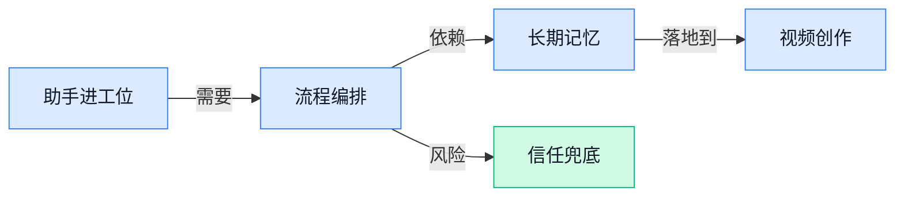

> AI 早报 · 每日早读 · 全网深度聚合

## **今日摘要**

```
特朗普政府要求 OpenAI 错峰发模型，Claude 付费用户直追 ChatGPT
Amazon 130 亿美元砸印度 AI 基建，Holcomb（政界人士）5 亿美元救劳动力
Adobe 收购 Topaz Labs（图像增强工具），AI 修图视频版图突变
```

### 🔵 产品与功能更新

1. **Meta 加速上线人工智能审核，员工担心节奏过快。**  
Meta 内部员工警告，新的 **人工智能审核**（用 AI 自动判断内容是否违规，替代部分人工审核） rollout（产品上线推进过程）可能推进得太快 🚦。这类功能一旦判断失误，可能影响用户内容展示、账号处罚和平台信任度，所以“快”不一定总是好事。对业务同事来说，这提醒我们：AI 用在高风险决策场景时，除了效率，也要关注**误判成本**和**人工兜底**。[Meta 审核报道(briefing)](https://the-decoder.com/meta-employees-warn-ai-moderation-rollout-is-too-fast/)


2. **Google Finance（谷歌财经服务）升级，并推出安卓应用。**  
Google 宣布新版 **Google Finance**（谷歌的财经信息查询服务）结束 beta（公开测试阶段，表示产品还在打磨）并正式推出，同时还带来新的安卓应用 📱。这意味着用户可以更方便地在手机上查看财经信息，而不只是在网页里使用。对运营和财务同事来说，这类产品更新值得关注：大厂正在把**金融信息入口**做得更移动化、更日常化 💡。[谷歌财经升级(briefing)](https://blog.google/products-and-platforms/products/search/google-finance-updates-june-2026/)


3. **Holcomb（美国政界人士）发起 5 亿美元计划，帮助劳动力适应人工智能转型。**  
Holcomb 推出一个新组织，目标是缓解 workforce transition（劳动力转型，指员工岗位和技能随技术变化而调整）到人工智能时代的压力，并获得 **5 亿美元**支持 🤝。这不算单一产品更新，但它反映出 AI 已经从“工具尝鲜”进入到**组织变革**层面。对 HR、行政和管理岗位尤其相关：未来重点可能不只是买 AI 工具，而是设计培训、岗位调整和员工支持机制。[劳动力转型报道(briefing)](https://news.google.com/rss/articles/CBMiuwFBVV95cUxPNHNCbDFlNkNqcnAtQ29VRS0tb0xBb2F1czhvRmpZUWo4VEwzVDNlWVMxclFIRWpGY0szSk1Jdy02UG05VWUxN1pUTm90Q1JPY1ktMzh6Z0dGMjBYMWsxeGlUMXk2dUs3aGF3eXNyMm9LRm9pczl4dDMzUjJ6YUcxUWJDRG1YYjdvbk5xdjNhTVhiOUJ0bXliU09ZNGp3c2FIUTBxaGZmSEFlLS1LQUVaMlhsc1lndkxKYWFz?oc=5)

### 🟢 前沿研究

1. **OpenAI 研究显示 Agent（能自动拆解并执行任务的智能助手）正在改变工作方式。**  
OpenAI 新论文把焦点放在**AI Agent（人工智能智能体，能按目标连续执行多步骤任务）**如何进入真实工作流：它们不只是回答问题，而是开始承担更长、更复杂的任务 🚀。这意味着生产力提升不再只集中在技术岗位，也可能扩展到运营、财务、人事等更多角色。对企业来说，关键变化是“人写指令、Agent 跑流程”的协作方式正在变得更现实。[OpenAI 研究论文(briefing)](https://openai.com/index/how-agents-are-transforming-work)

2. **Improved Large Language Diffusion Models（改进型大语言扩散模型）探索新的文本生成路线。**  
这篇论文关注**大语言扩散模型（把扩散模型用于文字生成，像先打草稿再逐步改清楚）**，试图改进传统大模型“一字一句往后写”的生成方式 💡。其中的**扩散模型（从模糊噪声一步步还原出清晰内容的生成思路）**，过去更常见于图像生成，如今被搬到语言任务里做探索。它的意义在于：未来文本生成不一定只有“顺序续写”这一条路，研究者正在寻找更灵活的生成范式。[论文收录页面(briefing)](https://huggingface.co/papers/2606.25331)

3. **What Intermediate Layers Know（中间层知道什么）用熵变化识别越狱攻击。**  
这项研究看的是大模型内部的**中间层（模型处理信息时的中途节点，类似大脑思考到一半的状态）**，能否提前发现用户正在尝试“越狱”⚠️。这里的**熵动态（模型输出不确定性的变化轨迹，简单说就是它是不是突然变得拿不准）**，被用来判断危险提示是否正在绕过安全规则。对产品安全团队来说，这类研究的价值在于：不只看最终回答，还能观察模型“思考过程中的异常信号”。[论文收录页面(briefing)](https://huggingface.co/papers/2606.25182)

4. **Thinking Tokens（思考标记）是否真的能提升模型安全性？**  
这篇论文直接追问一个热门问题：让模型生成更多**思考标记（模型在回答前用于中间推理的小片段，类似草稿纸上的推导）**，是否会让回答更安全 🧠。标题里的**安全性（让模型避免输出有害、违规或被诱导的内容）**，是当前大模型落地时绕不开的核心指标。它提醒我们，“会推理”不等于“更安全”，中间推理过程本身也需要被研究和验证。[论文收录页面(briefing)](https://huggingface.co/papers/2606.25013)

5. **Wan-Streamer v0.1（实时音视频交互基础模型）主打低延迟双向互动。**  
Wan-Streamer v0.1 被描述为一个**端到端（从输入到输出由一个整体系统直接完成，减少中间拼接）**的实时交互基础模型，面向音频和视频的连续互动场景 🎥。它强调**全双工（双方可以同时说话和回应，像真实对话而不是轮流按键）**、低延迟和原生流式处理，目标是让模型更像“实时陪你交流”的系统。摘要显示，这类模型瞄准的是更自然的语音、视觉互动，而不只是文本聊天。[arxiv 论文页面(briefing)](https://arxiv.org/abs/2606.25041)

6. **Causal-rCM（一套流式视频生成蒸馏方案）给互动世界模型提供开放配方。**  
Causal-rCM 聚焦**自回归扩散蒸馏（把复杂生成模型压缩成更快的生成流程，适合连续生成视频）**，用于流式视频生成和互动世界模型 🌍。标题提到的**教师强制（训练时让模型参考标准答案，像老师一步步带着做题）**与**自我强制（让模型更多依赖自己前一步结果继续生成）**，都是训练连续生成系统时的重要策略。它的看点在于“开放配方”：研究者试图把复杂训练流程整理成更统一、可复用的做法。[论文收录页面(briefing)](https://huggingface.co/papers/2606.25473)

7. **Microsoft 用人工智能解释与实验来理解大脑。**  
Microsoft 研究博客介绍了用**人工智能驱动解释（让模型帮助提出可理解的科学假设）**和实验来研究大脑 🧬。这类方向通常不是让模型替代科学家，而是帮助研究人员更快组织线索、形成解释，并设计后续验证。对行业的启发是：大模型正在从“办公助手”走向“科研协作者”，尤其适合处理复杂系统里难以直接看清的关系。[微软研究博客(briefing)](https://www.microsoft.com/en-us/research/blog/understanding-the-brain-with-ai-driven-explanations-and-experiments/)

### 🟡 行业展望与社会影响

1. **Google 人工智能研究员持续流向竞争对手。**  
Google 仍在面临**顶尖人工智能人才外流**的压力，报道指向的是其研究人员被竞争对手持续吸走的趋势 😮。这类流动会影响大模型（能理解和生成文字、图片等内容的人工智能系统）的研发节奏，也会让行业竞争从“产品比拼”进一步变成“人才争夺”。对企业来说，这提醒我们：人工智能能力不是只靠买工具，背后更依赖长期团队积累和核心研究人才。[人才流动报道(briefing)](https://the-decoder.com/google-keeps-losing-top-ai-researchers-to-rivals/)


2. **General Intuition（用游戏数据训练智能体的人工智能公司）押注游戏训练现实世界智能体。**  
General Intuition（用游戏数据训练智能体的人工智能公司）已融资 **3.2 亿美元**，公司估值达到 **23 亿美元**，核心思路是用数百万小时的游戏玩法数据训练人工智能 🚀。这里的智能体（能自主拆解任务并采取行动的软件助手）不只是会聊天，而是希望从玩家操作里学到更接近人类的“直觉”。如果这条路跑通，游戏数据可能会成为训练现实世界自动化助手的重要素材，而不只是娱乐内容。[融资完整报道(briefing)](https://techcrunch.com/2026/06/25/general-intuitions-2-3b-bet-that-video-games-can-train-ai-agents-for-the-real-world/)


3. **Adobe（创意软件公司）收购 Topaz Labs（图像和视频增强工具厂商）。**  
Adobe（创意软件公司）宣布收购 Topaz Labs（图像和视频增强工具厂商），并表示会把对方工具整合进自己的应用里 🎨。图像增强（提升清晰度、降噪、修复细节等处理）和视频增强（改善画质、细节和观感）正变成创意软件里的高频刚需。对设计、市场和内容团队来说，这意味着未来修图、修视频的“补救型工作”可能会更自动化、更贴近原有工作流。[收购消息报道(briefing)](https://techcrunch.com/2026/06/25/adobe-acquires-image-and-video-enhancement-tool-maker-topaz-labs/)

4. **Amazon 加码印度，新增 130 亿美元人工智能基础设施投资。**  
Amazon（亚马逊，全球电商与云计算公司）计划在印度追加 **130 亿美元**人工智能基础设施投资，背景是全球科技公司都在抢建当地算力能力 ⚡。人工智能基础设施（支撑模型训练和运行的数据中心、服务器、芯片与网络）决定了企业能不能稳定提供大规模人工智能服务。印度正在成为全球算力布局的重要战场，这也说明人工智能竞争已经从模型本身延伸到电力、机房和区域市场。[印度投资报道(briefing)](https://techcrunch.com/2026/06/25/amazon-ups-india-bet-with-fresh-13b-ai-infrastructure-investment/)

5. **特朗普政府要求 OpenAI 错峰发布人工智能模型。**  
据报道，特朗普政府要求 OpenAI 将人工智能模型发布安排做出错峰处理，这说明**模型发布节奏**已进入政策关注范围 🧭。人工智能模型（经过大量数据训练、能生成内容或完成任务的软件系统）的上线，不再只是公司内部产品排期，也可能牵动监管、安全和舆论节奏。对行业来说，未来前沿模型发布可能更像重大公共事件，需要兼顾商业速度与社会影响。[政府要求报道(briefing)](https://news.google.com/rss/articles/CBMitAFBVV95cUxNaE5VQW1pUnQyZ29WbDA4U3JSSW5ILXdZcTAtT0d0X0MwSVNXcDhnYkc1OEJXZERiOURVOUZnLVZSUDBudkRNM1hKVjVOQ0ppdmk1bEZiWjB5d3F3ZDVWNXRUTVRTdk05LWtLaTRHSlladzVRdUZYc3RDTzU1YS1TY2x3d196TG9JOFpYUmlBaFVNY2puSXdsbmJHbk9mMzBEYWJSTVZuWUEzNnI0bXhIRjBKdkE?oc=5)

6. **Claude 正在吸引更多付费消费者，挑战 ChatGPT 的优势市场。**  
数据显示，虽然 ChatGPT 仍有明显市场领先优势，但愿意为人工智能付费的消费者正越来越多选择 Anthropic 的 Claude 💡。付费消费者（愿意每月花钱订阅工具的个人用户）代表的是更强的真实需求，而不只是“试试看”的流量。这个变化说明，人工智能助手市场可能不会一家独大，用户会根据写作、分析、工作协作等具体体验做选择。[用户增长报道(briefing)](https://techcrunch.com/2026/06/25/anthropics-claude-is-winning-over-paid-consumers-a-market-owned-by-chatgpt/)

7. **Meta 招揽 Virtue AI（人工智能安全创业公司）创始人。**  
Meta 已聘请 Virtue AI（人工智能安全创业公司）的创始人，显示大公司仍在积极吸纳外部人工智能安全人才 🧩。人工智能安全（研究如何减少模型胡编、误导、越权等风险的方向）正在从“附加功能”变成核心竞争力。对企业用户来说，这类人才流动值得关注，因为未来工具是否可靠、可控，往往取决于这些安全团队的能力。[人才聘用报道(briefing)](https://news.google.com/rss/articles/CBMie0FVX3lxTE5GWVdvWFhrZGI2OWQ4NVV3OFZiZWpVZGdaMG5iWldfdXBoSWg4cmMxTTZWMkhoZDkzTDBIaHlnWm1xZGEzZWtzYjhRYWkyaHJJTEhYMHZyTzIwLXo1RVBRWUsxdTBqZllOOG8zM1hHZE9NdDVoSXFrQ0QtYw?oc=5)

8. **保险公司尝试用生成式人工智能做灾害建模，但幻觉和销售逻辑成阻碍。**  
保险公司正在尝试把生成式人工智能（能自动生成文字、图像或分析结果的人工智能）用于灾害建模，但报道也提醒：**幻觉**和**销售逻辑**可能干扰结果 🌪️。灾害建模（估算洪水、风暴等灾害造成损失的风险模型）直接关系到保险定价和赔付判断，容错空间比普通办公场景小得多。幻觉（人工智能编出看似合理但实际错误的信息）一旦进入风险评估，就可能带来错误决策；这也说明高风险行业用人工智能，不能只看效率，还要看验证机制。[保险应用分析(briefing)](https://the-decoder.com/insurers-turn-to-generative-ai-for-catastrophe-modeling-but-hallucinations-and-sales-logic-could-get-in-the-way/)

### 🟣 开源TOP项目

1. **PixelRAG（面向像素原生搜索的开源项目）想让搜索少依赖网页解析。**  
PixelRAG（项目名，主打“像素原生搜索”的开源工具）把方向押在 **pixel-native search（像素原生搜索，直接围绕页面视觉像素做检索）** 上，而不是传统的 **web parsing（网页解析，把网页代码拆开再提取内容）** 🚀。它的定位很明确：结束复杂网页解析，开启可规模化的像素级搜索思路。对业务同事来说，这类项目值得关注，因为它可能让 AI 更像“看网页的人”，而不是只读网页背后的代码。[开源项目仓库(briefing)](https://github.com/StarTrail-org/PixelRAG)


2. **CodexPlusPlus（CodexApp 的增强工具）让 Codex 用起来更顺手。**  
CodexPlusPlus（一个增强工具项目）面向 **CodexApp（围绕 Codex 使用的应用）** 做体验补强，目标是让 Codex 更好用、更舒服 💡。原项目描述很朴素：它不是重新做一个 AI 编程助手，而是给现有使用流程加“顺手度”。如果团队里有人高频使用 Codex，这类 **enhanced tool（增强工具，给原有软件补功能和体验的小工具）** 可能会带来细节效率提升。[开源项目仓库(briefing)](https://github.com/BigPizzaV3/CodexPlusPlus)


3. **Orca（并行 Agent 管理开发环境）主打同时调度一队编码助手。**  
Orca（面向多 Agent 协作的开发环境）自称是 **ADE（Agent Development Environment，给 AI 助手编排和运行任务的开发环境）**，用于管理一组并行工作的 Agent 🚀。它支持用户用自己的订阅来运行任意 **coding agent（编码智能体，能自动写代码、改代码的 AI 助手）**，并且覆盖桌面端和移动端。简单说，它想解决的是“多个 AI 编程助手一起干活时怎么管”的问题，而不是只让一个聊天框单打独斗。[开源项目仓库(briefing)](https://github.com/stablyai/orca)


4. **Cognee（开源 AI 记忆平台）给 Agent 配上长期记忆。**  
Cognee（面向 Agent 的开源 AI 记忆平台）主打让 AI 助手在不同会话之间保留 **persistent long-term memory（持久长期记忆，像给 AI 建一个不会随聊天结束消失的资料库）** 💡。它还提到使用 **self-hosted knowledge graph engine（可自托管知识图谱引擎，把信息按关系网组织起来并放在自己服务器上）**，这对重视数据可控性的团队很关键。对普通使用者来说，它解决的是一个熟悉痛点：AI 每次打开都像“失忆”，而 Cognee 想让 Agent 记住上下文和积累。[开源项目仓库(briefing)](https://github.com/topoteretes/cognee)

5. **Palmier Pro（面向 AI 的 macOS 视频编辑器）把视频剪辑和 AI 放到一起。**  
Palmier Pro（一个视频编辑器项目）定位很直接：**macOS video editor built for AI（为 AI 场景打造的 macOS 视频编辑器）** 🎬。这里的 **video editor（视频编辑器，用来剪辑、处理和输出视频的软件）** 与 AI 结合，说明它瞄准的不是传统手工剪辑流程，而是更适合 AI 参与的视频制作场景。对运营、设计、内容团队来说，这类工具值得留意，因为视频生产正在从“纯手工软件操作”走向“AI 辅助创作”。[开源项目仓库(briefing)](https://github.com/palmier-io/palmier-pro)

6. **Loop Library（可复用 AI Agent 工作流库）沉淀工程、运营和设计流程。**  
Loop Library（一个 AI Agent 工作流库）提供 **repeatable AI-agent workflows（可重复执行的 AI Agent 工作流，把一套任务步骤沉淀成模板反复使用）**，覆盖工程、评估、运营、内容和设计等场景 🚀。这里的 **workflow（工作流，把多人或多步骤任务按顺序组织起来的流程）** 很适合非技术团队理解：它像一份可复制的 SOP，只是执行者可以换成 AI Agent。项目价值在于把“临时问 AI”变成“稳定跑流程”，更利于团队复用经验、减少重复劳动。[开源项目仓库(briefing)](https://github.com/Forward-Future/loop-library)

### 🔴 社媒分享

1. **HuggingFace（全球最大 AI 模型共享社区）博客：用一条命令在 HF Jobs（HuggingFace 的云端任务运行服务）跑起 vLLM（让大模型更快对外提供回答的推理引擎）服务器。**  
这条分享指向 HuggingFace 的官方博客，主题很直接：**Run a vLLM Server on HF Jobs in One Command（一条命令启动大模型服务）** 🚀。对非技术同事来说，可以把 **vLLM（专门加速大模型回答速度的服务组件）**理解成“让 AI 客服窗口更快接待用户”的后台引擎；**HF Jobs（云端跑任务的服务）**则像是不用自己买服务器、直接租一个临时工作台。它的行业意义在于，部署 AI 服务正在从“工程团队大工程”变成“更轻量的标准化操作” 💡。[官方教程博客(briefing)](https://huggingface.co/blog/vllm-jobs)


2. **AI and Liability（AI 与责任归属）讨论：Google AI Overviews（Google 搜索里的 AI 摘要功能）可能要为输出承担更多责任。**  
Simon Willison 转引了 Bruce Schneier 对 **AI liability（AI 责任归属，即 AI 出错后谁负责）**的讨论，核心背景是一项德国裁决：Google 的 **AI Overviews（搜索结果页自动生成的 AI 摘要）**被视为 Google 自己的内容，而不只是“引用别人说法” ⚖️。这对企业很关键，因为如果 AI 摘要、客服回复或自动报告出错，平台方可能不能简单甩锅给模型或第三方数据。换句话说，AI 产品越像“代表公司发言”，合规、审核和风险控制就越不能省 (๑•̀ㅂ•́)و。[责任讨论文章(briefing)](https://simonwillison.net/2026/Jun/25/ai-and-liability/#atom-everything)

3. **Figma（面向设计师的在线协作设计工具）CEO Dylan Field 访谈：设计工作正在被 AI 重新塑形。**  
Stratechery 发布了对 Figma CEO Dylan Field 的访谈，主题聚焦 **design and AI（设计与 AI 的结合）** 🎨。Figma（很多产品、运营、设计团队用来一起画界面和原型的工具）本来就是协作软件的代表，所以它怎么看 AI，会影响“设计师如何和产品、工程、业务一起工作”。这类访谈的看点不只是 AI 能不能画图，而是 AI 会不会改变从想法、原型到落地的整个设计流程 💡。[CEO 访谈原文(briefing)](https://stratechery.com/2026/an-interview-with-figma-ceo-dylan-field-about-design-and-ai/)

4. **Herculaneum scroll（赫库兰尼姆古卷，火山灰中碳化保存的古罗马卷轴）首次被完整读出。**  
Scroll Prize（一个推动解读古代碳化卷轴的研究挑战项目）宣布，**一整卷 Herculaneum scroll（赫库兰尼姆古卷）**首次被读出 📜。原文还提供了 **preprint（论文预印本，正式发表前先公开给同行查看的研究稿）**和 GitHub 项目链接，方便外界复核和继续研究。对普通读者来说，这意味着一些过去“看得见但读不了”的历史材料，正在被新的数字化研究流程打开大门 ✨。[项目发布页(briefing)](https://scrollprize.org/firstscroll)

---



### 📊 行业洞察（今日 4 条）

1. OpenAI说Agent能做更长任务，Orca（多Agent管理工具）和Cognee（AI长期记忆平台）也在补编排和记忆
  【洞察】Agent正在从“聊天框”变成“团队流程工具”，因为只会回答问题已经不够用了

2. Meta加速AI审核、Google AI摘要可能担责，保险业又担心AI幻觉影响灾害判断
  【洞察】AI越进入真实决策，信任成本越高；省人工不难，难的是出错后谁负责

3. Adobe（创意软件公司）收购Topaz Labs（图像和视频增强工具厂商），Palmier Pro（AI视频编辑器）也把AI塞进剪辑流程
  【洞察】视频创作竞争正从“能不能生成”转向“能不能嵌进日常剪辑”，入口比单点能力更重要

4. Amazon（亚马逊）在印度投130亿美元建AI基础设施，Google又持续流失AI研究员
  【洞察】大厂竞争一边拼算力，一边拼人才；模型能力不是买服务器就能堆出来的

### 💭 对我们的启发（今日 3 条）

1. Adobe收购Topaz Labs说明“画质修复、降噪、增强”会变成剪辑软件标配，我们不能只做插件式功能，要把它做进出片流程里。

2. Palmier Pro把AI视频编辑器定位得很直接，提醒我们竞争会更贴近剪辑入口；我们的差异化要落在带货脚本、素材匹配、成片转化上。

3. Meta AI审核过快引发担忧，说明自动剪辑也要有人工接管边界；涉及品牌调性、违规词、虚假承诺的地方，不能全交给AI自动发版。


---

> 本周周报：[第26周综合分析](https://zhuxinfei.github.io/ai-daily-site/blog/weekly/2026-w26/)
