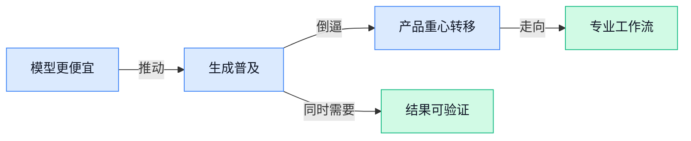

> AI 早报 · 每日早读 · 全网深度聚合

## **今日摘要**

```
Google 一天双发 Nano Banana 2 Lite 与 Gemini Omni Flash，图片视频 API 同时提速，轻量模型全面抢量
Anthropic 连发 Claude Sonnet 5、Claude Science，Agent 成本继续下探，药物发现也要把 Claude 推进实验室
DeepSeek DSpark 在美国出口限制下仍把推理速度最高拉升 85%，OpenAI 再推 GeneBench-Pro 抢占 AI 生物科研评测高地
```

### 🔵 产品与功能更新

1. **Google 推出 Nano Banana 2 Lite（更快的 AI 图片生成模型）和 Gemini Omni Flash（面向视频生成的轻量模型）API。**
Google 这次把重点放在**速度**和**接口可用性**上：Nano Banana 2 Lite 主打更快出图，Gemini Omni Flash 则通过 **API**（应用程序接口，让别的软件也能直接调用模型能力）面向视频生成场景开放 🚀。对做产品和运营的同事来说，这意味着企业更容易把**图片生成**、**视频生成**能力直接接进自家系统，而不只是停留在演示页里。简单说，就是 Google 正在把多模态能力（让 AI 同时处理图片、视频等多种内容）做得更轻、更快，也更适合规模化落地。[完整报道(briefing)](https://the-decoder.com/google-launches-nano-banana-2-lite-for-fast-ai-images-and-gemini-omni-flash-for-video-via-api/)


2. **Anthropic 发布 Claude Sonnet 5，主打更便宜的 Agent 运行成本。**
Anthropic 把 Claude Sonnet 5 定位成一个更适合跑 **Agent** 的选择：既强调更强的自主执行能力，也把**价格**压得更低 💡。报道提到，它在定位上瞄准了 Opus、GPT-5.5 和 Gemini Pro 这类更高阶模型，想用更低成本覆盖大量实际业务场景。对公司内部团队来说，这类更新最直接的意义是：以后做自动化客服、信息整理、流程处理这类任务时，可能能用更少预算跑出更稳定的效果；同时它也强调了**安全性**改进，说明大模型竞争已经不只是“谁更聪明”，而是“谁更适合长期商用”。[TechCrunch 报道(briefing)](https://techcrunch.com/2026/06/30/anthropic-launches-claude-sonnet-5-as-a-cheaper-way-to-run-agents/)


3. **Anthropic 启动 AI 药物发现项目，加入科技巨头押注医疗赛道。**
Anthropic 正式推出面向**药物发现**的 AI 项目，显示它也开始把大模型能力往医疗健康行业延伸 🧪。这里的药物发现，简单理解就是用 AI 帮研究人员更快筛选候选药物、缩短早期研发判断时间，而不是单纯做聊天问答。对非技术岗位同事来说，这条新闻的关键信号是：AI 公司正在从通用助手走向更垂直的行业平台，未来竞争点会越来越偏向“能不能真正进入专业流程”。这也说明医疗这种高门槛领域，正成为科技公司争夺下一波商业化价值的重要方向。[CNBC 转载报道(briefing)](https://news.google.com/rss/articles/CBMinAFBVV95cUxNck84aEo5SERWUzlnMzBaY3ZYdnhRZ3gtMkgtSmlUS3gtamhsRUR5ZkNwbEtCUk5BOEkwY1NvMmpSVDlfLTc5WWg0c0xqX1lLR3ZRMV9qSmQ3bnFlWlBUQU16N1pTWGVwZXpjekVUV2JKc3lUbGxPdXNGZXJTLVRMV1UtZ0xEQ0pSM2c5XzB0N2s1RWdJcmlHc3NaaGvSAaIBQVVfeXFMT0lDWjZWV1hWcWs4YXNsWERycW1sM2p4dkFaMERBcm1Jd1BmbjhaeXdyMnlBYzF2Z00yVVNLeHJvLWxSTzlBSGFVYWlNRmxndkczM2FqdjM3YVJ4azlUd2xyU2ItR1ExTDc2WVVmT0pRWWd2eUdvcHRHdnJ2SFdXaDFZVDZ5MEdpLXpycVpXYzRvMW1lZUQzdGQ0cWxha0dmcWln?oc=5)

### 🟢 前沿研究

1. **OpenAI 推出 GeneBench-Pro（评测 AI 生物科研能力的新基准）。**
OpenAI 发布了 **GeneBench-Pro**，用更接近真实科研场景的数据，来测试 AI 在**基因组学**（研究基因和 DNA 信息的学科）、**生物学**和科学研究任务里的表现 🧪。它的重点不是考 AI 会不会背答案，而是看模型能不能处理复杂、真实世界的问题，这对医疗、药物研发和科研助手类产品都很关键。对普通业务同事来说，这类**基准测试**（衡量模型能力的标准化考试）会直接影响大家以后看到的“AI 能不能真进实验室”这件事。[OpenAI 官方发布页(briefing)](https://openai.com/index/introducing-genebench-pro)


2. **ScarfBench（面向企业 Java 迁移的 AI Agent 评测集）瞄准企业级代码改造。**
IBM Research 在 HuggingFace（全球最大 AI 模型共享社区）介绍了 **ScarfBench**，它专门评测 AI Agent 在**企业 Java 框架迁移**里的表现，也就是帮公司把老系统迁到新框架时，AI 到底靠不靠谱 💼。这里的 Java 框架迁移，本质上像“给企业核心系统换发动机”，改不好就可能影响业务连续性，所以这类评测比普通写代码测试更贴近大公司真实需求。对行业来说，这意味着 AI 编程正在从“写小段代码”走向“接手高风险系统改造”，价值和门槛都更高。[HuggingFace 介绍页(briefing)](https://huggingface.co/blog/ibm-research/scarfbench)

3. **ReFreeKV（免阈值的 KV Cache 压缩方法）想让大模型更省资源。**
这篇论文提出 **ReFreeKV**，聚焦 **KV Cache**（模型生成长文本时临时保存上下文信息的缓存，像 AI 的“短期记忆”）压缩问题 📉。它强调 **threshold-free**（不依赖人为设定阈值），说明研究者在尝试减少调参负担，让模型在推理时更省显存、更容易落地。对企业用户来说，这类优化虽然不显眼，却可能直接影响大模型的运行成本和响应效率，是“把 AI 用得起”的关键一环。[论文页面(briefing)](https://huggingface.co/papers/2502.16886)

4. **A Gravitational Interpretation of Fine-Tuning Reversion（用“引力”视角解释微调后回退现象）探索模型为什么学了又像没学。**
这项研究讨论 **fine-tuning**（用特定数据对已有大模型继续训练，让它更懂某个领域）之后的 **reversion**（能力或行为往回退，像“刚学会又忘了”）现象 🧠。作者用 **gravitational interpretation**（“引力式”解释，把模型参数变化类比成被某种力量拉回原位）来理解这种回退，为大家提供一种更直观的分析框架。对做 AI 产品的人来说，这类研究关系到一个现实问题：为什么模型定制后效果不稳定，以及怎样减少“上线前很好、上线后跑偏”的风险。[论文页面(briefing)](https://huggingface.co/papers/2606.28525)

5. **DreamForge-World 0.1 Preview（低算力实时可控世界模型预览版）瞄准更轻量的交互式 AI 模拟。**
这篇论文介绍了 **DreamForge-World 0.1 Preview**，主打 **low-compute**（低算力需求，意味着不用特别昂贵的硬件）和 **real-time controllable world model**（可实时操控的世界模型，让 AI 持续模拟环境变化并响应指令）🌍。简单说，它想让 AI 不只是生成一张图或一句话，而是能实时“运行一个可控制的小世界”。如果这条路线成熟，未来会更利于游戏、机器人和交互式训练场景，因为这些场景都需要 AI 在动态环境里持续反应。[论文页面(briefing)](https://huggingface.co/papers/2606.30292)

6. **Cognitive Episodes in LLM Reasoning Traces（用大模型推理片段预测题目难度）让“AI 看懂人类答题难点”更可解释。**
这项研究关注 **LLM reasoning traces**（大模型推理过程的文字轨迹，也就是 AI“怎么一步步想”的记录），并用其中的 **cognitive episodes**（可理解为推理中的认知片段或阶段）来预测人类觉得一道题有多难 🧩。亮点在于它强调 **interpretable**（可解释），不是只给出一个分数，而是尝试说明“为什么这题难”。这类方向对教育、测评和培训行业尤其有意义，因为它可能帮助出题、分层教学和能力评估变得更精准。[论文页面(briefing)](https://huggingface.co/papers/2606.28186)

7. **Beyond IID（跳出“数据同分布”前提）追问表格基础模型到底有多通用。**
这篇论文把目光放在 **tabular foundation models**（处理表格数据的基础模型，比如面向财务、销售、风控表格的通用 AI 模型）上，质疑它们在 **IID**（独立同分布，指训练数据和实际数据很像的理想条件）之外到底还能不能打 📊。这很重要，因为现实业务里的表格数据经常会变，地区、时间、用户结构一变，模型效果就可能掉。对企业来说，这类研究是在提醒大家：AI 在实验室里表现好，不等于到了真实业务现场也一样稳。[论文页面(briefing)](https://huggingface.co/papers/2606.30410)

### 🟡 行业展望与社会影响

1. **Google 英国经济影响报告称，英国要打造“AI 先行者国家”。**
Google 英国发布最新**经济影响报告**，核心观点是：如果让更多人真正学会并用上 AI，英国下一阶段的**生产力提升**会更可观 💡。文中把重点放在“普及使用”而不只是“少数专家领先”，也就是让员工、企业和公共部门都更容易获得 AI 能力，这对各类办公室岗位尤其有现实意义。对企业管理者来说，这类信号说明 AI 竞争正在从“有没有”转向“谁能更快让全员用起来” 🚀。可查看 [Google 英国官方博文(briefing)](https://blog.google/company-news/inside-google/around-the-globe/google-europe/united-kingdom/unlocking-britains-next-era-of-productivity-building-a-nation-of-ai-trailblazers/) 了解原文表述。


2. **OpenAI 数据显示 ChatGPT 采用范围持续扩大。**
OpenAI 这次公布的 **Signals（官方整理的使用趋势数据）** 显示，ChatGPT 不只是用户更多了，大家还在更频繁地用、尝试更多功能，而且增长已经扩展到更多**地区**和**语言** 🌍。这说明 AI 工具正在从“尝鲜产品”变成更普遍的工作入口，尤其对运营、客服、内容、行政等岗位影响会越来越直接。更关键的是，增长不只发生在英语环境，意味着全球化企业未来在多语言办公与知识协作上会更依赖这类助手。详情可读 [OpenAI 官方趋势说明(briefing)](https://openai.com/index/how-chatgpt-adoption-has-expanded)。


3. **DSpark（DeepSeek 推出的推理加速技术）在美国出口限制下把 AI 速度最高提升 85%。**
报道提到，DeepSeek 的 **DSpark（用来提升模型 inference，即“模型推理，让训练好的模型回答问题的过程”效率的加速方案）**，可将 AI 运行速度最高提高 **85%**，被视为在美国进一步收紧出口管制背景下的一次**战略性突破** ⚙️。这类进展的意义不只是“更快”，还关系到在高端芯片受限时，企业能否通过更聪明的软件优化，把现有算力（也就是现有芯片资源）榨出更高效率。对行业来说，这反映出 AI 竞争正在从“拼最强硬件”扩展到“拼系统优化能力”，谁更会省资源、提效率，谁就更有韧性。更多信息见 [完整报道(briefing)](https://the-decoder.com/deepseeks-dspark-boosts-ai-speed-by-up-to-85-percent-a-strategic-win-under-tightening-us-export-controls/)。

### 🟣 开源TOP项目

### 🔴 社媒分享

1. **Nano Banana 2 Lite（Google 的轻量级图像生成模型）上线，主打更快更省的出图体验。**
这款模型也被称为 **Gemini 3.1 Flash Lite Image（Gemini 系列里的轻量图像版本，强调速度和成本）**，从名字就能看出它瞄准的是“够用、便宜、响应快”的场景 ⚡。对普通团队来说，这类轻量模型的意义很直接：做营销配图、活动草图、内容素材时，门槛会继续下降。想看具体介绍，可以先读 Simon Willison 的整理说明，再跳到官方页面了解模型定位：[作者解读文章(briefing)](https://simonwillison.net/2026/Jun/30/nano-banana-2-lite/#atom-everything) [官方模型页面(briefing)](https://deepmind.google/models/gemini-image/flash-lite/)


2. **The AI Compass（一个用“政治坐标测试”形式帮你看清 AI 立场的问答工具）火了。**
它把大家对 **AI 监管**、**开源**、**版权**、**自动化替代工作** 等问题的看法，做成了类似“政治光谱测试”的互动问卷 🧭。这类工具的价值不在于给出“标准答案”，而是帮人更清楚地意识到：自己到底更在意创新速度，还是更在意安全、版权和社会影响。对公司内部讨论 AI 政策也挺有启发，因为它能把原本模糊的态度，变成更可讨论的分歧点。[体验问答工具(briefing)](https://bambamramfan.github.io/ai-compass/) [作者背景说明(briefing)](https://bambamramfan.tumblr.com/post/820505178072580096/the-ai-compass)


3. **Claude Science（Anthropic 面向科研场景的 AI 助手）发布，想把 Claude 推进实验室与研究流程。**
从产品名就能看出，Anthropic 这次强调的是 **科学研究** 场景，而不是泛用聊天 🤖。这意味着 AI 正在继续从“人人都能聊两句”的通用助手，走向更垂直、更专业的行业工具；对医药、材料、学术研究等领域尤其值得关注。虽然目前公开信息不多，但它至少释放了一个信号：大模型竞争正在从“谁更会聊天”转向“谁更能干活”。[Claude Science 官方页(briefing)](https://claude.com/product/claude-science)


4. **Hugging Face（全球最大 AI 模型共享社区）把 Every Eval Ever（汇总各类模型测评结果的项目）接入模型页面。**
简单说，以后你在模型页里就能更方便地看到来自社区的 **评测结果**，而不是只看厂商自己挑出来的成绩单 📊。这里的 **eval（模型评测，用统一任务测试模型真实能力）** 很关键，因为它直接影响大家怎么判断一个模型是否真的适合自己的业务。对非技术团队也有现实意义：选模型时会更透明，不容易被单一宣传指标带偏。[官方博客说明(briefing)](https://huggingface.co/blog/eee-community-evals)

5. **Claude Sonnet 5（Anthropic 新一代 Claude Sonnet 模型）更新细节出炉，重点是能力继续打磨。**
Simon Willison 汇总了官方文档中的变化，适合想快速理解这次升级重点的人先看一遍 ✍️。这里的 **Sonnet** 是 Claude 产品线里的一个主力档位，可以理解为在速度、成本和能力之间做平衡的版本；而官方这次专门写“what’s new”，说明升级不只是版本号变化。对日常使用者来说，最重要的不是参数，而是它在真实工作里的稳定性、回答质量和任务完成度有没有继续提升。[更新解读文章(briefing)](https://simonwillison.net/2026/Jun/30/claude-sonnet-5/#atom-everything) [官方更新文档(briefing)](https://platform.claude.com/docs/en/about-claude/models/whats-new-sonnet-5)

6. **《The twilight of the chatbots》（一篇讨论“聊天机器人时代是否正在让位”的长文）提醒行业正在换挡。**
文章核心观点是：如果你觉得 AI 进展越来越快，那大概率不是错觉，领先实验室的新模型发布节奏确实在加速 🚀。更值得注意的是，AI 的重点可能正从“陪你聊天的机器人”，转向更强的执行能力与更复杂的实际用途，这会改变大家对产品形态的想象。对公司来说，这种变化意味着未来比拼的不只是聊天体验，而是 AI 能不能真正嵌进业务流程、承担具体工作。[完整文章解读(briefing)](https://www.oneusefulthing.org/p/the-twilight-of-the-chatbots)

---



### 📊 行业洞察（今日 4 条）

1. Google 同时推更快更便宜的 Nano Banana 2 Lite 和视频模型 Gemini Omni Flash，Anthropic 又把 Claude Sonnet 5 打成低价主力
  【洞察】大厂在集体把 AI 从“秀能力”推向“拼单价和响应速度”，下一阶段先卷落地，不先卷最强

2. Anthropic 一边做 Claude Science（给科研人员用的 AI 工作台），一边上药物发现项目，OpenAI 又发 GeneBench-Pro（评测 AI 生物科研能力的标准）
  【洞察】几家头部公司在同步冲科研和医疗，说明通用聊天越来越不值钱，真正贵的是进专业流程的能力

3. Hugging Face 把社区评测接进模型页，IBM 又做 ScarfBench（评测 AI 接手企业旧系统改造的测试集）
  【洞察】行业开始不太信厂商自报成绩了，大家更想看“在高风险真场景里到底稳不稳”，评测正变成信任基础设施

4. DeepSeek 的 DSpark 号称最高提速 85%，论文 ReFreeKV（让模型“短期记忆”更省资源）也在压成本，Google 新模型同样主打轻量
  【洞察】算力不再只是买更多芯片，软件省钱能力正在变成竞争力；谁能把同样预算跑出更多结果，谁更能打

### 💭 对我们的启发（今日 3 条）

1. Google 把图片和视频生成都做成更快更便宜，说明“会生成”很快不稀缺了；我们的视频剪辑工具要把重点放在品牌素材管理、批量出片和结果稳定，而不是只堆生成功能。

2. Hugging Face 强化社区评测、IBM 做高风险场景测试，提醒我们别只宣传“生成效果惊艳”；产品里要补人工复核、版本对比、结果可追溯，不然客户不敢拿去投流。

3. Anthropic 把 Claude 做成科研工作台而不只是聊天框，这验证了我们的方向：短视频工具也该从“单点功能”走向“完整工作台”，把脚本、剪辑、配音、过审、导出串成一条线。


---

> 本周周报：[第27周综合分析](https://zhuxinfei.github.io/ai-daily-site/blog/weekly/2026-w27/)
