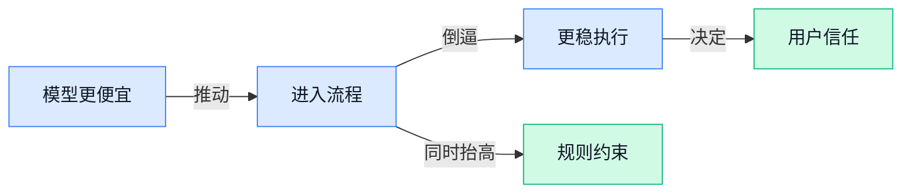

> AI 早报 · 每日早读 · 全网深度聚合

## **今日摘要**

```
Cloudflare 默认封锁新规倒逼 AI 付费，Meta 盘活闲置算力外卖，AI 基建生意突然变脸
Anthropic Fable 5 因越狱风波封两周后恢复全球上线，Claude Code 又曝隐藏标记逻辑
Google 放出 Nano Banana 2 Lite 与 Gemini Omni Flash，Hugging Face联手 Cerebras把 Gemma 4 推进实时语音 AI
```

### 🔵 产品与功能更新

1. **葡萄牙推出首个开源 AI 模型，加入欧洲“技术主权”推进潮。**  
葡萄牙发布了本国首个**开源** AI 模型，这件事的意义不只是“又多了一个模型”，更在于它呼应了欧洲近来强调的**技术主权**——也就是关键技术尽量掌握在本地、别过度依赖国外平台 💡。对政府、教育、公共服务这类场景来说，**本地可控**和**语言文化适配**往往比单纯追求最强性能更重要。Reuters 的这篇报道把它放进欧洲整体趋势里看，更能理解这不是单点新闻，而是一条产业路线的延伸 🚀。[路透完整报道(briefing)](https://news.google.com/rss/articles/CBMiygFBVV95cUxNTmN2WTU0cnBFTWY2ZDZlR3VfNTM1R3lvMlNUU1ZHODNla21NNHVOUFNjcVlUTnpOMTdKbHk0aUtmd2NoR1o4cjVCLVpyNHFkdDRhYUxVdzNZd0Mxc2Z6SXFlbHVZQjV2MXgwTEgtZmZlaWR0QXEyZWRvYmVuT0pHM3d1STFXSWxLc05zTVg2NGJ3Z3RqWUhmaUVHSjkyelVhaWc2dFNxQ3VSSkJOTWdJc0xRUVRPZngwTnN0ZnZWRndsZDdWWlRYZ1JB?oc=5)


2. **Distill（一个帮开发者转接模型请求的代理服务）推出每月 4 美元代理方案，瞄准 Claude Code 和 Codex 成本优化。**  
Distill 上线了一个**公开测试版**代理服务，主打用每月 4 美元的方式，降低 Claude Code 和 Codex 这类**AI 编码助手**的使用成本 ⚙️。这里的 **proxy（代理服务，相当于在你和模型平台之间加一层“中转站”）**，核心价值是帮团队优化调用路径和花费，而不是自己训练新模型。对经常用 AI 写代码、改脚本、跑自动化流程的团队来说，这类工具的吸引力在于：同样的工作流（workflow，指一整套连续操作流程）能不能更省钱、更稳定。它还处于**公开测试**阶段，意味着产品方向已经明确，但实际效果和适配范围还得继续观察 👀。[产品报道原文(briefing)](https://news.google.com/rss/articles/CBMitwFBVV95cUxQcVVVcUNPZUp4cmR6RldUQWNkR0tkRjBKWjRnc2VLUWNTVTk1eU5rSUNnaG0wUlV6Yk1hdE1GckI5LVhMV29ORENXTjBrOThuSHdMc19IcTFZMXdvdGVOQTBSVG9QU3pLZmtRU2dUdVRZaGsycFdqYkZFaEFZMWh1VnE4QkVZMmNHd0U2ZHVLZUtZcU5MVm10TFJpTDliTlE2dnk1VEhtUGxvcFVZV1VzUldaWnc1Q0k?oc=5)

3. **Nano Banana 2 Lite（Google 推出的轻量级多模态模型）与 Gemini Omni Flash（主打更快响应的 Gemini 模型版本）开放构建。**  
Google DeepMind 宣布开发者可以开始基于 **Nano Banana 2 Lite** 和 **Gemini Omni Flash** 进行构建，重点显然放在“更快上手”和“更轻量可用”上 🚀。这里的**多模态**，就是模型不只处理文字，还能理解图片、语音等多种输入；而 **Lite（轻量版，通常意味着更省资源、更适合大规模接入）** 则往往和成本、速度直接相关。对做产品、运营工具、智能客服或内容生产的团队来说，这类更新通常预示着：一些原本太贵、太慢的 AI 功能，开始有机会进入真实业务流程。Google 官方博客虽然没给节选，但从标题就能看出，它强调的是“现在就能开始做”，而不是停留在演示阶段 💡。[Google 官方发布页(briefing)](https://deepmind.google/blog/start-building-with-nano-banana-2-lite-and-gemini-omni-flash/)

### 🟢 前沿研究

1. **LUMOS（一种给 AI Agent 提供“系统级语义接口”的操作系统层）想让无障碍能力直接变成 Agent 的通用入口。**  
这篇论文关注的不是再做一个更会聊天的模型，而是给 Agent 补上真正能“看懂并操作电脑界面”的**底层通道** 🚀。这里的 accessibility（无障碍能力，原本是给残障用户读屏、导航界面用的系统接口）被重新利用成 Agent 的稳定观察入口，semantic layer（语义层，把按钮、输入框、菜单等元素转成机器更易理解的结构化信息）则负责让模型少靠“猜屏幕”做事。对企业办公场景来说，这类方案的意义很直接：如果 Agent 能稳定读取和操作各类软件界面，跨系统自动化的可靠性就更高了 💡。[论文详情页(briefing)](https://huggingface.co/papers/2606.30697)


2. **Reinforcement Learning with Metacognitive Feedback（一种让模型学会诚实表达“不确定”的训练思路）瞄准大模型“别装懂”难题。**  
这项研究讨论的是，怎么让 LLM（大语言模型）在没把握时更真实地表达**不确定性**，而不是一本正经地答错 🤔。其中 Reinforcement Learning（强化学习，让模型根据反馈不断调整回答策略）配合 metacognitive feedback（元认知反馈，简单说就是让模型不仅看答案对不对，还学会判断自己有几分把握）一起使用，目标是提升“会不会”和“知不知道自己会不会”这两件事的一致性。对普通用户和企业团队来说，这种能力很关键，因为一个愿意明确说“我不确定”的模型，往往比“自信乱答”的模型更适合进入客服、知识库和办公流程。[HuggingFace 论文页(briefing)](https://huggingface.co/papers/2606.32032)

3. **QVal（一种低成本评估长流程 Agent 训练信号的方法）想解决 Agent 越做越长、越难教的问题。**  
论文指出，LLM Agent 在 long-horizon（长周期、多步骤任务，比如连续执行上百步网页操作）场景里，单看最终成败已经不够，因为中间每一步到底做得好不好很难判断 ⚙️。QVal 关注的是 dense supervision signals（密集监督信号，也就是不给“最后分”，而是尽量给过程中的每一步更多反馈），并尝试用更便宜的方式评估这些训练信号到底值不值。它对行业的启发在于：未来 Agent 不只是“能不能完成任务”，还要看“中途有没有走歪、浪费多少步、是否稳定复现”，而这正是企业真正落地最在意的地方。[arxiv 论文(briefing)](https://arxiv.org/abs/2606.32034) [HuggingFace 论文页(briefing)](https://huggingface.co/papers/2606.32034)

4. **Multi-Block Diffusion Language Models（多块扩散语言模型，一种不同于传统逐字生成的新架构）在语言模型路线里另辟蹊径。**  
这篇研究把 diffusion（扩散生成，先从噪声或粗糙结果开始，再一步步细化）思路带到语言模型里，而且采用 multi-block（多块并行处理）的方式来组织生成过程 🧠。和常见的“一个字一个字往下写”的自回归路线相比，这类方法可能更适合并行生成、更快修正局部内容，但也意味着模型设计和训练方式会明显不同。对非技术同事可以这样理解：这像是把“逐句口述”改成“先出草稿再反复润色”的写作方式，若路线成熟，未来可能影响内容生成的**速度**与**一致性**。[论文详情页(briefing)](https://huggingface.co/papers/2606.29215)

5. **Xiaomi-GUI-0（小米发布的图形界面操作模型）技术报告，把“会点屏幕”的 Agent 再往前推一步。**  
从标题看，这是一份聚焦 GUI（图形用户界面，也就是手机和电脑上的按钮、列表、弹窗这些可视化操作界面）操作能力的技术报告 📱。这类模型通常面向更真实的设备交互：不是只会对话，而是要理解界面元素、决定点击路径，并完成连续任务。对行业来说，GUI Agent 的价值很现实——谁先把“看懂 App 并稳定操作”做扎实，谁就更接近真正可用的数字员工形态；不过具体能力边界还得以这份[技术报告页(briefing)](https://huggingface.co/papers/2606.31410)公开内容为准。

### 🟡 行业展望与社会影响

1. **Meta 仿照 SpaceX 盘活闲置 AI 算力，准备把“多余产能”卖出去。**
Meta 正在筹划一项**云基础设施业务**，把自家多出来的 **AI 算力**（训练和运行大模型所需的计算资源）与模型能力对外出售，这相当于把内部重资产变成新收入来源 💰。这一步也意味着，Meta 不再只是做社交和模型，还要下场挑战 Amazon Web Services（亚马逊的云计算平台）、Google Cloud（Google 的企业云服务）和 Microsoft Azure（微软的企业云平台）等老牌云厂商。对行业来说，未来大公司之间比拼的可能不只是模型谁更聪明，还包括谁能把**算力供给**做成生意、形成平台壁垒。[完整报道(briefing)](https://techcrunch.com/2026/07/01/meta-like-spacex-looks-to-turn-excess-ai-compute-into-cash/) [深度解读(briefing)](https://the-decoder.com/meta-follows-spacexs-playbook-and-builds-a-cloud-business-to-sell-its-spare-ai-compute-to-outside-customers/)


2. **Cloudflare 用默认封锁新规则，倒逼 AI 公司为媒体内容付费。**
Cloudflare 正要求 AI 公司在 **9 月 15 日**前，把用于**搜索抓取**和用于**AI 训练**、Agent 调用的 **网络爬虫**（自动访问网站并抓取内容的程序）明确区分开来，否则许多媒体网站将默认封锁这些访问 🚧。这不是单纯的技术调整，而是在重写“内容被谁拿去训练、是否该付钱”的行业规则。对出版商和内容平台来说，这会增强议价能力；对 AI 公司来说，获取训练数据的成本和合规压力都可能继续上升。[政策报道(briefing)](https://techcrunch.com/2026/07/01/cloudflares-new-policy-pushes-ai-companies-to-pay-for-publishers-content/) [官方博客说明(briefing)](https://news.google.com/rss/articles/CBMickFVX3lxTE1VaDZNMDVHQjNxQTBOZklHVENvMFFXNUx6aDJRREhvYTZEV1AySnNLQUpqZ3VJbjdONzVzMzBrbTBMVUl1N28tVlJpVldfUWthMG82Ml82czF4TFhJdHVzMlp0WXhIU0lIa0RkdEd1Mm84UQ?oc=5)

3. **Anthropic 的 Fable 5（Anthropic 旗下模型/产品）因越狱风波被封两周后恢复全球上线。**
这条消息的关键不只是“恢复服务”，而是 **jailbreak（越狱，指用户用特殊提示词绕过模型安全限制）** 已经开始直接触发政府层面的干预 ⚠️。一款 AI 产品因安全漏洞被短期禁用，再重新回到全球市场，说明监管正在从“观望”进入更实质的执行阶段。对所有 AI 公司而言，**安全对齐**（让模型行为更符合人类规则与使用边界的训练过程）不再只是产品体验问题，而是能否持续运营的问题。[事件报道(briefing)](https://the-decoder.com/anthropics-fable-5-is-back-worldwide-after-a-two-week-government-ban-over-a-jailbreak/)

4. **Claude Code 被曝存在隐藏标记逻辑，AI 工具的透明度再受拷问。**
报道称，Claude Code 中存在会**秘密标记中国用户**的隐藏代码，这让“AI 工具到底如何识别、分类和处理用户”再次成为焦点 🔍。像 Claude Code 这样的编码助手，本质上会接触大量工作内容与上下文，因此一旦出现未公开的识别或标记机制，就会迅速演变成**信任**与**合规**问题。对企业用户来说，这类事件提醒大家：在引入 AI 工具时，除了看效率，也要认真审视**数据处理规则**和对外披露是否充分。[完整报道(briefing)](https://the-decoder.com/hidden-code-in-claude-code-secretly-flagged-chinese-users/)

5. **SpaceX 展示搭载 xAI（马斯克旗下 AI 公司）技术的 AI 手机原型，终端入口争夺战升温。**
SpaceX 向投资人展示了一款轻薄的 **AI 智能手机原型**，并强调其由 xAI 技术驱动，这说明 AI 竞争正在从模型和云服务进一步延伸到**硬件入口** 📱。如果 AI 能力被深度装进手机，用户未来接触助手、搜索、任务执行的第一入口，可能不再只是 App，而是整台设备本身。对行业来说，这类原型的意义在于：谁掌握终端，谁就更有机会掌握用户日常行为数据、分发渠道和商业化场景。[原型机报道(briefing)](https://the-decoder.com/spacex-shows-investors-a-slim-ai-smartphone-prototype-powered-by-xai-technology/)

### 🟣 开源TOP项目

1. **open-seo（开源版 SEO 分析平台）想做 Semrush 和 Ahrefs 的平替。**
这个项目主打 **开源替代**，目标很直接：用更透明、可自托管的方式，去覆盖 Semrush（常用的搜索营销分析平台）和 Ahrefs（常用的外链与关键词分析平台）这类 **SEO**（搜索引擎优化，帮助内容在 Google 等搜索结果里更容易被看到）工具的核心场景 💡。对做运营、内容增长和品牌投放的同事来说，它的意义在于：以后不一定只能依赖昂贵的闭源平台，也可能有更灵活的内部方案可选。对于团队而言，**数据可控**、**成本可控** 会是它最吸引人的点之一。[GitHub 项目页(briefing)](https://github.com/every-app/open-seo)


2. **open-knowledge（AI 原生 Markdown 编辑器与知识库）把写文档和喂模型合成一件事。**
这个项目把 Markdown（轻量文本格式，常用于写文档和知识库）编辑器和 **LLM Wiki**（大模型驱动的知识库，能让 AI 更好理解和调用团队资料）放在了一起 🚀。所谓 **AI-native**（从一开始就按 AI 协作方式设计，而不是后加插件）意味着它不只是“能写字”，更像是面向知识整理、问答和复用而生。对业务、运营、客服团队来说，这类工具的价值在于把零散文档变成更容易被 AI 使用的知识资产，后续做问答助手、内部资料检索都会更顺。[GitHub 仓库页(briefing)](https://github.com/inkeep/open-knowledge)


3. **skill（AI 技能包聚合商店）把 GitHub 上的 Skills 项目集中打包好了。**
这个项目收录了 **72 个精选技能包**，覆盖文档处理、内容创作、编程开发、机器学习、自动化工作流等多个方向，重点是已经**打包完成**，可以直接安装使用 ⚙️。它还会自动抓取 GitHub 上相关的 Skills 项目，并按分类、更新时间、Star（GitHub 上表示受欢迎程度的收藏标记）数量等维度整理，等于替大家先做了一轮筛选。对非技术团队来说，这类“技能商店”最大的价值不是研究底层，而是更快找到现成能力，少走“看了一堆项目却装不起来”的弯路。[项目仓库说明(briefing)](https://github.com/anbeime/skill)


4. **FluidVoice（本地离线语音转文字工具）主打 macOS 上的极速听写。**
FluidVoice 是一款面向 macOS 的 **离线听写应用**，核心卖点是 **Voice to Text**（语音转文字）完全在本地完成，不依赖云端服务 🔒。这意味着语音内容不用上传外部服务器，对会议记录、私密草稿、敏感业务沟通这类场景会更让人放心。对经常开会、写纪要、做采访整理的同事来说，**本地处理** 和 **快速转写** 是很实际的效率点。[GitHub 项目主页(briefing)](https://github.com/altic-dev/FluidVoice)

5. **router（面向 Agent 系统的模型路由器）想用一次接口切换换来更低成本。**
这个项目是给 **Agentic systems**（多步骤自主执行任务的 Agent 系统）用的 **模型路由器**，会把不同 prompt（给 AI 的指令）分发给更合适的模型 🧠。按项目描述，它能在 **50 毫秒内**完成路由，并通过仅改一个 endpoint（接口地址，相当于把请求入口换到统一调度层）来降低 **40%-70% 成本**。这件事对企业很重要，因为很多团队现在不是“没模型可用”，而是模型一多就难管、难控预算；这种调度层工具，本质上是在帮公司做 **性能与成本平衡**。[GitHub 仓库页(briefing)](https://github.com/workweave/router)

6. **astryx（可定制且支持 Agent 的开源设计系统）瞄准 AI 时代的界面搭建。**
Meta 旗下的这个项目把自己定义为 **开源设计系统**，并强调 **fully customizable**（可深度定制，方便团队按自己品牌和产品规范改造）以及 **agent ready**（适合接入 Agent 能力，让 AI 更容易参与界面生成或交互流程）✨。设计系统可以理解成一套统一的按钮、表单、颜色、组件规则，目的是让产品界面更一致、开发更高效。对设计、产品和前端协作来说，这类项目的看点在于：未来做 AI 产品时，界面层可能也会越来越需要为 Agent 协作预留“接口”和规范。[GitHub 项目页(briefing)](https://github.com/facebook/astryx)

### 🔴 社媒分享

1. **重度 AI 采用与更多招聘相关，而不是裁员。**
一项新数据观察指出，企业**越积极采用 AI**，结果反而越常见于**继续招聘**，并非外界想象中的“先上 AI、后裁员” 📊。这类结论对业务、人事和管理岗位都很重要：AI 在很多公司里更像是**扩产提效工具**，而不是简单的人力替代器。原文来自对企业招聘与 AI 使用情况的分析，适合拿来校准团队对“AI 会不会马上抢饭碗”的判断。[完整分析报道(briefing)](https://www.bigtechnology.com/p/heavy-ai-adoption-linked-to-more)


2. **Fable 5（Claude 发布的短片系列新作）回归。**
Claude 官方社媒直接放出一句“**Fable 5 回来了**”，信息很短，但信号很明确：这个内容系列已经恢复更新 🎬。从传播层面看，这类短片化表达往往不是讲参数，而是用更轻的方式让更多人感知产品能力和品牌调性。对于做运营、市场和品牌的同事来说，这也是个提醒：AI 公司越来越重视**内容叙事**，不只拼模型，也拼“怎么被看见”。[官方社媒动态(briefing)](https://twitter.com/claudeai/status/2072402636813607381)


3. **Hugging Face（全球最大 AI 模型共享社区）与 Cerebras（主打超高速 AI 芯片与推理服务的公司）把 Gemma 4（Google 推出的开源模型）带进实时语音 AI。**
这次合作的重点，是把 **Gemma 4** 用到**实时语音交互**场景里，让模型在“听、想、说”这条链路上更快响应 ⚡。其中 **real-time voice AI（实时语音 AI，指能边听边理解并立即开口回应的系统）** 对客服、助手、教育等场景很关键，因为卡顿少一秒，体验差很多。对非技术团队来说，可以把它理解成：开源模型社区、算力平台和语音场景正在更紧地连在一起，AI 语音产品落地速度还会继续加快。[官方技术博客(briefing)](https://huggingface.co/blog/cerebras-gemma4-voice-ai)

---



### 📊 行业洞察（今日 4 条）

1. Google 开放 Nano Banana 2 Lite（Google 推出的轻量级多模态模型）和 Gemini Omni Flash（更快响应的模型版本），Distill（模型请求中转服务）又把 Claude Code 和 Codex 使用费往下压
  【洞察】两件事放一起看，AI 正在从“能不能用”转向“能不能低价常驻业务流程”，以后比的不是首秀效果，而是长期成本

2. LUMOS（把电脑界面转成机器更易理解结构的系统层）和 Xiaomi-GUI-0（小米发布的界面操作模型）都在推“会看会点屏幕”，QVal（评估长流程任务中每一步是否走偏的方案）又在补过程考核
  【洞察】这说明 Agent 真正卡住的已不是会不会聊天，而是能不能稳定干完一整套活，可靠性开始压过炫技感

3. Anthropic 的 Fable 5 因越狱（绕过安全限制）被短暂封禁，Claude Code 又被曝有隐藏标记逻辑；同时“让模型承认不确定”的研究也在升温
  【洞察】几件事合起来看，行业下一阶段卖的不只是能力，更是可解释、可审查、出事后能说清楚的信任机制

4. 葡萄牙发布本国开源 AI 模型，Cloudflare（全球网站安全与加速服务商）又推动媒体默认拦截 AI 抓取，Meta 还准备把多余算力卖出去
  【洞察】底层规则正在重写：一边是国家和平台争数据主权，一边是巨头争算力入口，中小公司会越来越受上游规则挤压

### 💭 对我们的启发（今日 3 条）

1. Google 的轻量模型开放、Distill 和 router（模型路由器，帮不同请求分配更便宜模型）都在打成本战，我们的视频剪辑工具要把“便宜模型先跑、贵模型兜底”做成默认策略，不然毛利会被吃掉。

2. LUMOS、Xiaomi-GUI-0、QVal 都说明多步骤操作最怕中途走偏。我们做自动剪辑和内容生成时，不能只看最终是否出片，还要记录每一步为什么改、哪里失败、何时转人工。

3. Anthropic 接连遇到封禁和隐藏标记争议，提醒我们别把“黑箱生成”直接交给客户。涉及脚本改写、素材选择、自动发布建议时，要给用户看依据、置信度和人工复核开关。


---

> 本周周报：[第27周综合分析](https://zhuxinfei.github.io/ai-daily-site/blog/weekly/2026-w27/)
