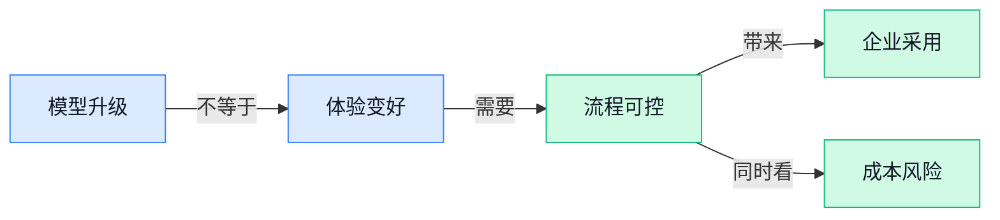

> AI 早报 · 每日早读 · 全网深度聚合

## **今日摘要**

```
GPT 5.4 登陆 ChatGPT 带来 5 项改进，OpenAI 再压模型升级节奏
Anthropic 推 Claude Science Beta，又自研药物发现突袭冷门疾病
Alibaba 限制 Claude Code，pxpipe（图片藏文工具）宣称成本最多降 70%
```

### 🔵 产品与功能更新

1. **Anthropic 推出 Claude Science Beta（面向科学家的 Claude 科研工作台测试版）。**  
Anthropic 面向科研人群发布 **Claude Science Beta（把 Claude 变成科研流程工作台的测试版产品）**，主打用多 Agent 协作（多个 AI 助手分工处理同一项复杂任务）来支持科学研究 🚀。[科研工作台报道(briefing)](https://news.google.com/rss/articles/CBMihgFBVV95cUxPYjJabGZzM01VQTY3MndSdTZSZEF0d0poLXFXUGwtZlF5NnB1dTY0SEhjTGZBTGNKWUQ4SEI5alZiaDFHczNpdVg2NDdRNlFZcFJZcjh1dTJlT0VaVlpvdDVJajRsekFsaVdGcG5oRDZkR25mNmZkd012amRVamZnNHI3MmNTQQ?oc=5) 从标题信息看，它覆盖 **基因组学**（研究整套基因信息）、**蛋白质组学**（研究人体或生物体内一整套蛋白质变化）和**化学信息学**（用计算方法分析化合物数据）等管线场景，重点是让科研流程更**可复现**（别人按同样步骤也能追踪和验证结果）💡。另一篇报道把它概括为科学家可用的 **AI workbench（AI 工作台，把多个科研工具和流程集中到一个操作环境里）**，说明 Anthropic 正在把 Claude 从聊天助手推向更专业的科研生产工具。[科学家工作台报道(briefing)](https://news.google.com/rss/articles/CBMikwFBVV95cUxNSHJ2UFdWRy11UFhfcG05SmtSU1JRS0J3QThxcGl2dWVFdWRSMGZlVi1Ea0ppRTVVWnNMTTN0THZYcldGcG1zTU4yVFR5dXFxWmtLWFhjd2xZUU83U2hFcXpLak1nZVl2c3RnclZUVEJZSTdNdjZaWFNWMzBZbFJFajN2Zm9CbWFRUVhnNm80QkhacU0?oc=5) 同时，Anthropic 还被报道启动了面向**被忽视疾病**（商业关注较少、但公共健康意义很高的疾病）的内部药物发现项目，和 Claude Science 一起推进，AI 进入生命科学应用的信号更明确了 (๑•̀ㅂ•́)و。[药物发现报道(briefing)](https://news.google.com/rss/articles/CBMivAFBVV95cUxPVmRRdzJMX2N4VG5IQmEyeWlOMUw3TVBZaGlUdk5yUndiSWxWN0V3Nk5nQkZFQmtScS1KM1RsT0R5VWpVdDBRdEt5ejhSUDFjLUYwS3RDRVhmVE1TSDZDTDJucGJ0MjVfNEVQLWlseThWcHUzUTB3WFBsZi1FYjVEeWMzODAyRm1QeFFlTk04SlAxaDd5TnhvVE9yaE4tWG04Z283NmtaNXB3ZjBWXzAwNkFORDFPZ0tVNm1NVA?oc=5)

### 🟢 前沿研究

1. **Learning to Move Before Learning to Do（先学会移动再学会做任务的 VLA 预训练研究）探索机器人先练“动作基本功”。**  
这篇论文聚焦 **VLA（视觉-语言-动作模型，把“看见画面、理解指令、执行动作”串起来的机器人模型）** 的训练顺序：在学具体任务前，先做**任务无关预训练（不针对某个固定任务，先积累通用能力）** 🚀。从题目看，它想回答一个很实际的问题：机器人是不是应该先学会“怎么动”，再学“做什么”。这对具身智能（让 AI 进入机器人、车辆等实体设备中行动）很关键，因为动作能力如果更通用，后续适配新场景可能更省力。[论文详情页(briefing)](https://huggingface.co/papers/2607.02466)

2. **WARP（从模型权重反推训练数据组合的分析方法）试图揭开模型“吃过什么数据”。**  
**WARP（权重空间分析框架，通过观察模型内部参数来推测训练数据来源）** 关注的是一个越来越敏感的问题：模型训练时到底用了哪些数据组合 💡。这里的 **Weight-Space（权重空间，模型参数所在的“坐标系”，可理解为模型记忆和能力的内部痕迹）** 不是普通用户会直接看到的界面，而是研究者分析模型来源的重要入口。若这类研究继续成熟，可能帮助行业做**数据溯源**、合规审查和模型审计，让“模型是怎么练出来的”更透明。[论文详情页(briefing)](https://huggingface.co/papers/2607.01686)

3. **Morphing into Hybrid Attention Models（把模型转变为混合注意力模型）关注大模型结构改造。**  
这项研究围绕 **Hybrid Attention Models（混合注意力模型，把不同注意力机制组合起来，让模型处理信息更灵活）** 展开，核心关键词是 **Morphing（模型形态转换，像把已有模型改造成另一种结构）** 🚀。**Attention（注意力机制，让模型判断哪些文字、图片或信息更重要）** 是大模型能力的基础部件之一，因此结构变化往往会影响速度、成本和效果。对业务同事来说，它背后的意义是：未来模型不一定只靠“越做越大”，也可能靠更聪明的内部结构来提升表现。[论文详情页(briefing)](https://huggingface.co/papers/2606.30562)

4. **WorldDirector（可控世界模拟器研究）用持久动态记忆打造更稳定的虚拟世界。**  
**WorldDirector（用于构建可控世界模拟器的研究项目）** 指向一个热门方向：让模型生成和维持一个可以被控制的“世界” 🌍。标题里的 **Persistent Dynamic Memory（持久动态记忆，让系统记住环境变化并持续更新，而不是每次都从零开始）** 很关键，因为世界模拟不能只生成一帧漂亮画面，还要前后连贯。**World Simulator（世界模拟器，用 AI 模拟环境、物体和事件变化的系统）** 可能服务于游戏、机器人训练、视频生成等场景，但本文材料只显示其研究目标，不能进一步推断具体效果。[论文详情页(briefing)](https://huggingface.co/papers/2607.02517)

5. **AutoMem（自动学习记忆能力的研究）把“会记住”当成 AI 的认知技能来训练。**  
**AutoMem（自动化记忆学习框架，让模型学习如何保存和调用信息）** 关注的是 AI 不只是回答当下问题，还要学会管理记忆 🧠。这里的 **Memory as a Cognitive Skill（把记忆视为认知技能，类似人类知道什么该记、什么时候该想起来）** 很有意思，因为它把“记忆”从被动存储变成一种可学习能力。对办公场景来说，这类方向如果成熟，可能让助手更会跟进长期任务、持续理解项目背景，而不是每次都像第一次见你。[论文详情页(briefing)](https://huggingface.co/papers/2607.01224)

6. **2.6 万名学生研究显示，AI（人工智能）的隐藏学习成本要两年才显现。**  
这篇报道提到一项覆盖 **26,000 名学生** 的研究，结论指向一个不太容易立刻看见的问题：使用 **AI（人工智能，用机器完成理解、生成和辅助决策等任务）** 的学习成本，可能需要整整两年才浮出水面 📚。所谓**滞后效应（影响不是马上出现，而是在较长时间后才被观察到）**，对教育管理者特别重要，因为短期成绩或效率提升不一定代表长期学习能力也提升。它提醒学校和企业培训团队：引入工具时，不能只看“作业完成更快”，还要观察理解力、独立思考和知识沉淀。[完整报道(briefing)](https://the-decoder.com/a-26000-student-study-shows-ais-hidden-learning-cost-takes-two-full-years-to-surface/)

7. **Multi-Resolution Flow Matching（多分辨率流匹配）用分阶段采样加速扩散模型。**  
这篇论文研究 **Multi-Resolution Flow Matching（多分辨率流匹配，让生成过程先粗后细地推进）**，目标是实现 **Training-Free Diffusion Acceleration（无需重新训练的扩散模型加速）** ⚡。**Diffusion（扩散模型，常用于图像生成，通过一步步去噪生成内容）** 通常生成质量强，但推理过程可能较慢；标题里的 **Staged Sampling（分阶段采样，把生成步骤拆成不同阶段执行）** 指向一种提速思路。对产品侧来说，若这类方法有效，图像生成工具可能在不重训模型的情况下获得更快响应。[论文详情页(briefing)](https://huggingface.co/papers/2607.01642)

8. **InstanceControl（无需实例标注的复杂图像可控生成）降低精细控图门槛。**  
**InstanceControl（实例级控制图像生成方法，让用户更细粒度地控制画面对象）** 关注复杂图像生成里的一个痛点：想控制具体对象，却不想做大量标注 🖼️。标题里的 **Instance Labeling（实例标注，把图片中每个具体对象单独圈出并命名）** 往往很耗人力，尤其是多人物、多物体场景。若这种方向推进顺利，设计、营销和内容团队未来做可控生成时，可能更少依赖繁琐的数据准备，更接近“说清楚画面结构，模型自己执行”。[论文详情页(briefing)](https://huggingface.co/papers/2606.31924)

### 🟡 行业展望与社会影响

1. **Midjourney（AI 图像生成工具）要求好莱坞片厂公开自己的 AI 使用细节。**  
Midjourney（AI 图像生成工具，输入文字就能生成图片）在与三家**好莱坞片厂**的法律纠纷中，反过来要求对方披露自己如何使用 AI（人工智能，让机器完成生成、分析等任务）⚖️。这件事的看点不只是版权争议，而是把问题推向了“指责别人用 AI 的公司，自己到底怎么用 AI”这一层。对影视行业来说，AI 使用透明度可能会越来越像合规问题，而不只是创作工具选择。[完整报道(briefing)](https://techcrunch.com/2026/07/04/midjourney-wants-hollywood-studios-to-reveal-the-details-of-their-ai-usage/)


2. **Alibaba（阿里巴巴集团）据称将 Claude Code 列为高风险软件并限制员工使用。**  
报道称，Alibaba（阿里巴巴集团，中国大型互联网与云计算公司）已把 Claude Code 归类为**高风险软件**🔒。Claude Code（Claude 的编程助手，能帮程序员写代码、改代码、理解项目）这类工具能提升研发效率，但也可能接触公司代码、内部文档等敏感信息。这个动作说明，大公司正在把 AI 编程工具纳入**安全治理**，不是“好用就全员放开”这么简单。[完整报道(briefing)](https://techcrunch.com/2026/07/04/alibaba-reportedly-bans-employees-from-using-claude-code/)


3. **Anthropic 启动自有药物发现项目，瞄准大药企认为不赚钱的疾病。**  
Anthropic 正在推出自己的**药物发现项目**，目标是处理 Big Pharma（大型制药公司，通常指资金雄厚、以商业回报为核心的跨国药企）认为“不够赚钱”的疾病方向 🧬。drug discovery（药物发现，从海量分子和病理线索中寻找潜在新药的早期研发过程）过去高度依赖昂贵实验和长周期筛选，AI（人工智能，让机器辅助分析、生成和推理）被寄望于降低探索门槛。它的社会意义在于：AI 公司不只是给药企卖工具，也可能直接参与疾病研究议题的选择。[完整报道(briefing)](https://the-decoder.com/anthropic-launches-its-own-drug-discovery-programs-to-tackle-diseases-big-pharma-considers-unprofitable/)

4. **Anthropic 开发者分享 Fable 5（面向创作与提示测试的 AI 工具）提示技巧：先找自己的盲区。**  
一位 Anthropic 开发者分享了针对 Fable 5（面向创作与提示测试的 AI 工具，帮助用户打磨输入并观察模型反应）的 prompting（提示词设计，写清楚任务和限制来引导 AI 输出）经验 💡。重点不是追求“神奇咒语”，而是先让用户发现自己的**未知盲区**，也就是自己没意识到的问题。对日常办公也有启发：问 AI（人工智能，让机器辅助生成、分析和推理）前，先让它帮你检查假设，往往比直接要答案更稳。[提示技巧报道(briefing)](https://the-decoder.com/anthropic-developer-shares-prompting-tips-for-fable-5-that-focus-on-finding-your-own-blind-spots-first/)

5. **GPT 5.4（OpenAI 新一代语言模型版本）登陆 ChatGPT，带来 5 项改进。**  
Mashable 报道称，GPT 5.4（OpenAI 新一代语言模型版本，用来支撑对话、写作和推理等能力）已经来到 ChatGPT，并总结了**5 项值得关注的改进**✨。model upgrade（模型升级，底层能力更新后让同一个产品回答更好或更快）对普通用户的意义，通常体现在更顺的对话、更少的误解，以及更贴近日常任务的输出。虽然摘要未展开具体改进点，但它说明 ChatGPT 仍在持续迭代，办公场景里的 AI 助手会继续变得更“可用”。[新闻聚合报道(briefing)](https://news.google.com/rss/articles/CBMic0FVX3lxTE1jYzBBX0IzYWVJRUd5UUkwOXg1S2VxZ1JUMVh4LTBYNUxvb0ZRRlNPZFpiV1ZYeC1YX1g3a1RjN3lNcUMwOEZXMDY1WEktS1Nfbl9kam4wbndKWWVyRFExT0VMNXQ3RC1POXM2TkFlSzNGVlU?oc=5)

6. **pxpipe（把文本藏进图片以降低模型费用的开源工具）可将 Claude Code 与 Fable 5 成本最多降 70%。**  
开源工具 pxpipe（把文本编码进图片文件里的工具，像把一段文字“塞进图片像素”再交给模型读取）声称，可把 Claude Code（Claude 的编程助手，帮助写代码和改代码）与 Fable 5（面向创作与提示测试的 AI 工具）的 token（模型处理文字的计费单位，字数越多通常越贵）成本最多降低 70% 💰。它使用 PNG（常见图片格式，适合无损保存图像信息）来承载文本，本质是在尝试用不同输入形式绕开高文本费用。对企业用户来说，这类工具提示了一个趋势：AI 成本优化会越来越细，甚至会深入到“信息怎么喂给模型”这一层。[开源工具报道(briefing)](https://the-decoder.com/open-source-tool-pxpipe-hides-text-in-pngs-to-cut-claude-code-and-fable-5-token-costs-up-to-70/)

### 🟣 开源TOP项目

1. **VulnClaw（用自然语言自动跑安全测试流程的开源工具）把漏洞排查做成一条龙。**  
VulnClaw（用自然语言驱动安全测试的开源项目）主打把**信息收集、漏洞发现、漏洞利用、报告生成**串成自动化流程 🚀。它结合 AI（人工智能）智能体、MCP（Anthropic 提出的模型上下文协议，让模型能更规范地调用外部工具）和渗透 Skill（可复用的安全测试技能包，像给模型装上专门工具箱），让用户用自然语言发起任务。对安全团队来说，这类项目的价值在于把重复、标准化的排查步骤交给工具先跑一遍，再由人做判断和复核。[GitHub 仓库(briefing)](https://github.com/Unclecheng-li/VulnClaw)


2. **pm-skills（产品经理智能体技能市场）收集 100+ 产品工作技能包。**  
pm-skills（面向产品经理的智能体技能集合）把产品工作拆成 100 多个可复用的 skills（技能包，能让 AI 按固定步骤完成某类任务）和 commands（命令模板，像提前写好的操作按钮）💡。摘要里覆盖了从**发现需求、制定策略、执行推进、发布上线到增长**的完整链路。它更像一个 PM（产品经理）工作流 Marketplace（技能市场，集中查找和复用模板的地方），让团队把经验沉淀成可调用的插件和流程。[GitHub 仓库(briefing)](https://github.com/phuryn/pm-skills)


3. **BuilderIO/skills（面向编程智能体的技能包集合）服务代码协作场景。**  
BuilderIO/skills（给编程智能体使用的技能集合）聚焦 coding agents（编程智能体，能读写代码并执行开发任务的 AI 助手）场景 ⚙️。它的核心思路是把常见开发能力整理成 skills（技能包，类似给 AI 增加可复用的办事清单），方便智能体在写代码时调用。对研发管理和产品同学来说，这意味着团队可以把一些固定开发流程沉淀下来，让 AI 更稳定地按既定方式协作。[GitHub 仓库(briefing)](https://github.com/BuilderIO/skills)


4. **book-to-skill（把技术书变成 Claude Code 技能包的工具）让书本知识进工作流。**  
book-to-skill（把技术书转换成可调用技能包的开源项目）可以把任意技术书 PDF（电子文档格式，常见于电子书和资料手册）转成 Claude Code 可用的 skill（技能包，让 AI 在工作时引用和执行相关知识）📚。摘要强调它生成后可用于**学习、查阅和边工作边使用**。这类工具的意义在于把厚厚的技术资料变成更容易调用的工作助手，而不只是放在文件夹里“吃灰”。[GitHub 仓库(briefing)](https://github.com/virgiliojr94/book-to-skill)

5. **AutoCVE（自动发现公开漏洞编号的源代码审计平台）瞄准漏洞验证和报告生成。**  
AutoCVE（由智能体驱动的自动化漏洞发现平台）面向 source code auditing（源代码审计，也就是检查代码里是否藏着安全问题）🔍。它围绕 CVE（公开漏洞编号，安全行业用来标记和追踪已确认漏洞的标准编号）发现、漏洞验证和报告生成展开。摘要显示，它试图把从代码检查到结果整理的流程自动化，帮助安全人员减少机械排查工作，把精力放在判断漏洞真实性和影响范围上。[GitHub 仓库(briefing)](https://github.com/larlarua/AutoCVE)

6. **planning-with-files（用文件保存计划的 Claude Code 技能）复刻 Manus 风格工作流。**  
planning-with-files（通过文件持续记录计划的 Claude Code 技能）实现了 Manus-style persistent markdown planning（Manus 风格的持久化文档计划，把任务计划长期写进文档而不是只停留在聊天里）📝。这里的 markdown（轻量文本格式，用简单符号表达标题、列表等结构）让计划更容易被人阅读、修改和追踪。摘要还提到它对应的是“20 亿美元收购背后的工作流模式”，重点在于把 AI 协作从一次性对话变成可持续推进的任务计划。[GitHub 仓库(briefing)](https://github.com/OthmanAdi/planning-with-files)

### 🔴 社媒分享

1. **Better Models: Worse Tools（“模型更强、工具更差”的社媒讨论）提醒：AI 能力提升不等于体验变好。**  
Simon Willison 转发了 Armin 的一段经历：他在折腾 **Pi**（原文提到的项目或环境，候选摘要未展开具体背景）时遇到一个怪问题，开头就指向“更新的 Claude”带来的反直觉体验 🤔。由于候选材料只给到摘要开头，我们不能补写具体 **bug**（软件缺陷，会导致功能表现异常）细节，但标题已经点出一个产品信号：**大模型**更强，不代表配套 **工具链**（一组配合完成工作的软件和流程）就一定更好用。对业务和运营同事来说，这类讨论值得关注，因为 AI 落地效果往往卡在“模型很聪明，但流程不好用”这一层 💡。[社媒讨论原文(briefing)](https://simonwillison.net/2026/Jul/4/better-models-worse-tools/#atom-everything)

---



### 📊 行业洞察（今日 4 条）

1. Anthropic一边推科研工作台，一边自做冷门病药物发现项目
  【洞察】这说明头部 AI（人工智能）公司不满足卖工具，正下场做垂直行业成果；但医疗验证周期长，短期更像战略押注。

2. pxpipe（把文字藏进图片降费用的工具）降本，Alibaba（阿里巴巴）又限制 Claude Code（Claude 的编程助手）
  【洞察】两件事放一起看，企业用 AI（人工智能）不只问好不好用，还要同时算成本、准确率和数据风险。

3. AutoMem（让 AI 学会记忆的研究）、WorldDirector（可控世界模拟器研究）都在补“长期一致性”
  【洞察】AI（人工智能）下一步竞争不是单次生成多惊艳，而是能不能记住前后关系，稳定完成连续任务。

4. OpenAI 升级 ChatGPT，社区却讨论“模型更强、工具更差”
  【洞察】模型进步已经不能自动变成用户体验；真正的产品差距，会出现在流程设计、人工接管和错误恢复上。

### 💭 对我们的启发（今日 3 条）

1. WorldDirector（可控世界模拟器研究）和 InstanceControl（精细控制图片对象的研究）都指向“可控生成”。我们的视频剪辑工具不能只做一键生成，要让用户能锁定商品、人物、字幕和镜头风格。

2. pxpipe（把文字藏进图片降费用的工具）提醒我们，AI（人工智能）功能成本会被用户持续比较。视频脚本、素材分析、批量剪辑要做分层调度，便宜任务别都用最贵模型。

3. Alibaba（阿里巴巴）限制 Claude Code（Claude 的编程助手）说明企业客户会担心资料外泄。我们处理品牌素材、直播话术和商品卖点时，要给出权限、留痕和人工确认边界。


---

> 本周周报：[第27周综合分析](https://zhuxinfei.github.io/ai-daily-site/blog/weekly/2026-w27/)
