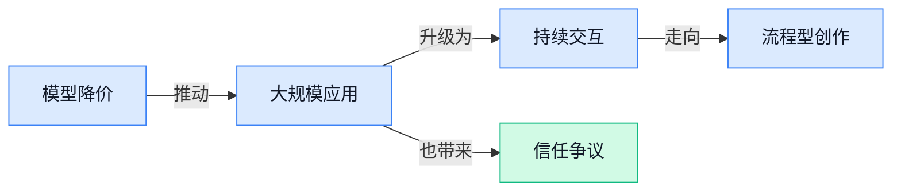

> AI 早报 · 每日早读 · 全网深度聚合

## **今日摘要**

```
xAI 连发 Grok 4.5 主打更便宜高性能，OpenAI 上线 GPT‑Live 与新语音模型抢占实时对话
Meta 加拿大首个大型数据中心落地，常开型 AI 眼镜测试、Instagram 照片 deepfake 争议再升级
Google 放出 Gemma 4 技术报告，Cognition 的 SWE-1.7 逼近 GPT 5.5 与 Opus，编程 Agent 开战
```

### 🔵 产品与功能更新

1. **SpaceXAI 推出 Grok 4.5，主打更便宜的高性能模型。**
SpaceXAI 发布了新版 **Grok 4.5**，Elon Musk 还把它称作接近 **Opus-class（对标顶级水平的一档大模型能力）** 的模型，核心卖点是既强又更省钱 💡。从原文看，这次更新重点不是花哨新玩法，而是强调它能作为其他强力 AI 模型的**更高效替代方案**。这对企业用户尤其重要：如果同样能完成复杂任务、但成本更低，就更容易进入客服、内容生产、内部知识问答等实际业务场景 🚀。[TechCrunch 完整报道(briefing)](https://techcrunch.com/2026/07/08/spacexai-releases-grok-4-5-which-elon-describes-as-an-opus-class-model/)


2. **ZML 发布 ZML/LLMD（帮助多种 AI 芯片更快跑模型的软件），瞄准更低推理成本。**
法国创业公司 ZML 推出了免费的 **ZML/LLMD（用于提升模型 inference〈模型推理，让训练好的模型真正“回答问题”〉速度的软件）**，目标是让 AI 在多种芯片上跑得更快、更便宜 ⚙️。原文特别提到，它可以加速跨不同 AI 芯片的运行，这意味着企业不必死绑某一种硬件，部署选择会更灵活。对很多公司来说，真正烧钱的往往不是训练，而是日常把模型跑起来的过程；谁能把这部分成本压下去，谁就更有机会把 AI 用到大规模生产环境里 📉。[产品报道原文(briefing)](https://techcrunch.com/2026/07/08/hot-french-startup-zml-releases-free-product-to-speed-inference-across-lots-of-ai-chips/)


3. **OpenAI 发布新语音模型，实时对话更自然。**
OpenAI 推出了新的 **voice models（语音模型，让 AI 能更自然地听和说）**，重点提升了实时交流时的自然度 🎙️。按原文说法，新语音模式可以一边说一边听，这种能力对 **live translation（实时翻译，边听边译而不是等一句讲完再处理）** 特别关键。对普通用户来说，这意味着和 AI 聊天时打断、追问、接话会更像真人对话；对企业场景来说，会议翻译、跨语言客服和语音助手体验也会更顺滑 🚀。[TechCrunch 详情报道(briefing)](https://techcrunch.com/2026/07/08/openai-releases-new-voice-models-for-more-natural-live-conversations/)


### 🟢 前沿研究

1. **TurnOPD（一种让 Agent 训练更关注“回合过程”的蒸馏方法）提升长流程任务训练效率。**
这篇论文关注的是**长链路 Agent 训练**：当 AI 需要连续很多步完成任务时，传统 **on-policy distillation（在模型自己当前策略生成的数据上做蒸馏，相当于“边做边教”）** 往往不够稳定。TurnOPD 的核心是加入 **turn-aware（按对话/操作回合来感知过程）** 设计，让模型不只看最终结果，也更重视每一轮中间决策 💡。这类研究对未来做复杂客服、流程审批、自动执行任务的 AI 很关键，因为它直接关系到**多步骤任务**能不能更省成本、更少跑偏。[论文摘要页(briefing)](https://huggingface.co/papers/2607.05804)


2. **Harrison.Rad 1.5（一种面向放射科的医学影像基础模型）可根据影像与病史起草报告。**
这份技术报告瞄准的是**放射科报告积压**问题：影像检查需求增长快，但医生人手扩张没那么快，单靠招聘和培训难以消化 backlog（积压待处理工作）。Harrison.Rad 1.5 被描述为一个 **foundation model（基础模型，可在多类任务上通用再适配）**，能结合图像、既往资料和临床背景来起草报告，对医疗场景的**效率提升**意义很直接 🩻。对非技术同事来说，可以把它理解成“先帮医生打一版高质量草稿”的 AI，而不是直接替代医生下最终结论。[arxiv 论文(briefing)](https://arxiv.org/abs/2607.05880)

3. **Gemma 4（Google 的新一代开放模型技术报告）发布。**
Gemma 4 以技术报告形式亮相，属于 Google 持续推进的**开放模型**路线，面向研究者和开发者提供更系统的模型信息。技术报告这类材料的价值，不只是“又发了个模型”，更在于它通常会交代模型设计、训练思路和评测结果，方便外界判断它适合哪些场景 📘。对企业用户来说，这类进展会继续推动**低门槛本地部署**、行业定制和开源生态竞争；对开发团队来说，也意味着又多了一套可参考的能力基线。[论文摘要页(briefing)](https://huggingface.co/papers/2607.02770)

4. **CanvasAgent（一种可协调多种视觉工具的图片创作 Agent）瞄准复杂图像生成与编辑。**
这篇论文指出，复杂的图片创作往往不是一个模型就能搞定，而是要把生成、定位、分割、局部修改等多个步骤串起来。CanvasAgent 的重点在 **visual tool orchestration（视觉工具编排，像项目经理一样调度多个图像工具协作）**，让 AI 按任务需要调用不同能力完成整套流程 🎨。这对设计、营销、电商等团队很有想象空间，因为未来“改图”可能不再是一条指令碰运气，而是更接近可控、可拆解、可反复修改的工作流。[arxiv 论文(briefing)](https://arxiv.org/abs/2607.05465)

5. **PluraMath（一套把数学推理评测扩展到更多语言的基准）补上低资源语言空白。**
很多 AI 数学能力测试主要集中在英语等**高资源语言（训练数据丰富、资料充足的语言）**，但这并不代表模型在其他语言里也一样强。PluraMath 的意义就在于把**数学推理评估**延伸到更多语言，尤其是过去容易被忽略的 **low-resource languages（低资源语言，公开数据和工具较少的语言）** 🌍。这类工作会影响大家怎么看“模型真的会推理，还是只是在少数语言里表现好”，对全球化产品和跨语种教育场景尤其重要。[论文摘要页(briefing)](https://huggingface.co/papers/2607.05992)

6. **KAT-Coder-V2.5（一种能在真实代码仓库里自主行动的编程 Agent 模型）发布技术报告。**
这篇报告强调，它不是传统那种“一问一答写一段代码”的模型，而是面向真实、可执行代码仓库工作的 **agentic model（具备自主分步行动能力的模型）**。换句话说，它更像一个能进入项目现场、理解上下文、连续处理任务的 AI 编程助手，而不是只会单次补全代码 ✍️。这类研究的价值在于，未来企业买到的不只是“代码生成”，而是能在完整软件项目里帮忙定位、修改、验证的**自动化开发协作能力**。[arxiv 论文(briefing)](https://arxiv.org/abs/2607.05471)

7. **CGGS（一种用于第一人称 3D 场景生成的新方法）提升视角一致性。**
CGGS 研究的是 **ego-centric（第一人称视角，也就是“我看到什么”）** 的 3D 场景生成，重点放在如何让不同视角之间更一致。论文标题中的 **Gaussian Splatting（高斯泼溅，一种近年来很火的 3D 场景表示方法，可更高效地重建和渲染画面）**，本质上是在追求更自然、更稳定的空间生成效果 🧭。这类研究虽然偏底层，但会直接影响 VR（虚拟现实）内容、机器人视觉和沉浸式交互体验，尤其是“人走动时画面会不会穿帮”这种真实感问题。[论文摘要页(briefing)](https://huggingface.co/papers/2607.03819)

### 🟡 行业展望与社会影响

1. **Meta 在加拿大建设首个大型数据中心，AI 基建扩张正式“跨境”。**
这条消息反映出 **AI 基础设施** 的竞争，已经不只是拼模型功能，更是在拼谁能更快拿下电力、土地和服务器资源 ⚙️。所谓数据中心，本质上就是放置大量服务器和 **GPU 集群（显卡集群，训练和运行大模型的核心硬件设施）** 的“大型机房”，谁先建起来，谁就更有机会支撑后续 AI 产品扩张。对行业来说，这也说明 AI 投资正在从“软件热”走向“重资产阶段”，会持续影响能源、地产和本地就业等议题。[CNBC 报道原文(briefing)](https://news.google.com/rss/articles/CBMipAFBVV95cUxOQndUcHlKZDM0c3Rma19aWGhsbWZQT0NGUDQzc3hfV1pwcEhGcDJJUzVEeUt4R2FnR2JEUzdXVl9QZnVtLU5zU3BOMnFvN243Zm5zNndtX3RkMl9WMGV0ODd5UHc2STBGN3pVMzZaNmtfQ19VMWpFYjg3WlNTa2hNWG1QVmNjVjNla2oxNkUtX0RfMENScHEzVXFSZW5oSXFVbS1SWNIBqgFBVV95cUxNTlNKbW5ZdVlnZnMtSHVFMEVxMlhVWkZQWm1sMm13VDl1MVI0bXdmOVRzeTNLV2xNUnRwSTdFeGc0aEJTYTdXQmNxMjlFRVRwaEMybkZodk5vYjNxQ2ItMTlkUlBTYmxaSWpGbm5sQWJHZFVadGtYZXVDMWZvaE1PRmpFXzNuTjlUc3liSnBaOVNOMU15Y3JQcjFEOTNCSm9RUDhTS1NHNG9Wdw?oc=5)


2. **OpenAI 帮助 K–12（从幼儿园到高中阶段）教师建立实用 AI 能力。**
这件事的重点不只是“教老师用工具”，而是把 **AI 素养** 往基础教育系统里推进 📚。K–12（从幼儿园到高中阶段）一旦开始系统训练教师，影响的就不只是课堂效率，还包括学生未来如何理解、使用甚至警惕 AI。对企业同事来说，这类动作也释放了一个清晰信号：未来的职场新人，会越来越早接触 **生成式 AI（能自动写文案、做总结、产出内容的 AI）**，组织内部的培训方式也得跟着升级。[OpenAI 官方说明(briefing)](https://news.google.com/rss/articles/CBMiaEFVX3lxTE9ObE5GY2xGX3FENzlKdFliX2JUT2hRWjJHUnlRdkJhcmhXQm1GaUZqbE5WQmdKUWljOUpRMV93VW00SDdIaWg3dVRydlhRN1VTNDVhdlVRV19RTGlqR0twUFdXQ1p1YkVJ?oc=5)

3. **Meta 的 AI 眼镜隐私防护升级了，但数据采集争议并没消失。**
报道指出，Meta 一边增加防止他人被偷偷录制的保护措施，一边又继续扩展 AI 产品对个人数据的收集和使用范围 👓。这让问题不再只是“功能酷不酷”，而是 **隐私边界** 到底在哪里：当可穿戴设备（穿在身上、随时陪伴用户的智能设备）越来越聪明，它也可能越来越“了解你”。对普通用户和企业都一样，未来选择 AI 硬件时，除了看体验，还得更在意它采集什么、保存多久、会不会被二次使用。[TechCrunch 完整报道(briefing)](https://techcrunch.com/2026/07/08/meta-wants-its-ai-glasses-to-seem-less-creepy-its-ai-strategy-says-otherwise/)

4. **Meta AI 新工具可修改公开 Instagram 照片，社交平台内容边界再起争议。**
这项功能意味着，用户放在公开账号上的照片，可能被拿来进行 **AI 图像编辑**，而且未必经过明确同意 🖼️。这和传统“转发”完全不是一回事，因为 **深度伪造（用 AI 生成或修改逼真图片、视频，让内容看起来像真的）** 会改变原图含义，带来肖像权、误导传播和平台治理问题。对品牌、公关和运营团队来说，这也提醒大家：公开发布的素材，未来不只是“可被看见”，还可能“可被再创作”。[Mashable 报道摘要(briefing)](https://news.google.com/rss/articles/CBMimAFBVV95cUxNY2w0cWIwQ0R2X09ST2ZYWnF6ZWpuSmFTN3Q1SzVXYV8zeTA0OGVtcTM4Y3pJN1UyQ0ZzSl9MeUhBTDlXUDIwOWo1ejFzODdsRTNCWmdPRGlqU01aT3RMMEhEMk9Sczl2UDJFdFVmQUc2OVc1TlZlemRjeTJSdXgybFJ5ZWtScGs5YWJPSHFLTTBxVDdXQUlsYw?oc=5)

5. **Meta 测试常开型 AI 眼镜，试图记录用户“整天发生了什么”。**
“常开型”最大的变化，是把 AI 从“你打开时才工作”变成“它持续在场” ⏺️。这类设备如果长期捕捉日常画面，等于把 **环境感知（让设备持续观察周围场景并理解发生了什么）** 带进现实生活，也会直接碰到隐私、同意和数据安全问题。行业层面看，这代表 AI 硬件竞争正从手机里的助手，走向“全天候贴身设备”，而社会层面的讨论只会越来越激烈。[The Decoder 报道原文(briefing)](https://the-decoder.com/meta-tests-always-on-ai-glasses-that-capture-your-entire-day/)

6. **Meta AI 可用公开 Instagram 照片生成 deepfake（AI 伪造内容），且不要求明确同意。**
这条新闻之所以引发关注，是因为它把“公开可见”与“可被 AI 改造”之间的界线彻底摆上台面 ⚠️。deepfake（AI 伪造内容，用算法合成看起来很真的人物图像或视频）过去更多出现在安全和舆论风险讨论里，如今却越来越接近普通用户日常使用场景。对社会影响来说，这不只是平台功能更新，而是在考验现有的 **内容治理**、肖像授权和用户知情机制是否还跟得上。[NBC News 报道(briefing)](https://news.google.com/rss/articles/CBMijgFBVV95cUxOYmtCQ01mQzExd0FKMVM3US1icmVMbXk2bnpKRnNmLXJGc3dibnZyaDNpTUZ1eVRNZ2hiMzlzSm1paXlUMlRkS2F5T1BBWU5IU09aelBLWk44eEhldFdkSUtuWU5wdTdsN1Nqd3hMLWEtQXctQlFKMk1VWlU3ckd6ZTUyRUc0NGNTMU5jM3NB?oc=5)

### 🟣 开源TOP项目

1. **emilkowalski/skills（面向设计工程师的案例与技能库）值得当成灵感手册收藏。**
这个 GitHub 项目主打 **Design Engineers（设计工程师，既懂产品设计又能动手做前端交互的人）** 所需的技能与案例整理，适合想把 **设计** 和 **开发** 更紧密结合的团队参考 💡。对业务、运营和设计同事来说，它的价值不在“学代码”，而在于能更直观看到现在优秀数字产品是怎么把视觉体验和实际可用性连起来的。若你们团队正在做官网、活动页或产品界面迭代，这类开源项目常常能提供很具体的表达方式和实现灵感。[GitHub 项目页(briefing)](https://github.com/emilkowalski/skills) 🚀


2. **usestrix/strix（开源 AI 安全助手，用来发现并修复应用漏洞）瞄准开发安全自动化。**
Strix 是一个 **open-source（开源，代码公开可自由查看和使用）** 的 **AI hackers（这里指自动帮你找漏洞的 AI 安全助手，不是真的黑客）** 项目，目标是帮助团队发现并修复应用里的安全问题 🔍。这里的 **vulnerabilities（安全漏洞，指系统里可能被攻击者利用的薄弱点）**，对任何上线产品都很关键，因为漏洞不仅影响技术团队，也会牵连客户信任、品牌和合规风险。对非技术同事来说，可以把它理解成“给 App 配一个会自动巡检风险的智能保安”，很适合关注 **应用安全** 和 **风险控制** 的团队留意。[GitHub 仓库页(briefing)](https://github.com/usestrix/strix) 🛡️


### 🔴 社媒分享

1. **Data for Agents（面向 AI 智能体的开放数据计划）发布。**
这篇内容聚焦 **AI 智能体** 到底该用什么数据来训练和评测，核心是推动更开放、可复用的数据资源 🚀。文中由 HuggingFace（全球最大 AI 模型共享社区）与英伟达共同介绍，讨论了适合 **Agent** 使用的数据形态，以及为什么高质量开放数据会成为下一阶段能力提升的关键。对普通业务团队来说，这意味着以后不只是“模型更强”，而是“会做事的 AI”会更依赖可追溯、可共享的数据基础设施。[官方博客原文(briefing)](https://huggingface.co/blog/nvidia/open-data-for-agents)


2. **SWE-1.7（Cognition 推出的软件工程大模型）能力逼近 GPT 5.5 与 Opus。**
Cognition 在这次更新里强调，**SWE-1.7** 的整体智能水平已接近更强一档的通用模型，主打的是 **软件工程** 场景表现 💡。这里的 SWE 指 software engineering（软件工程，也就是让 AI 更像工程师一样读代码、改代码、完成开发任务），不只是聊天问答，而是更偏真实开发流程。对企业来说，这类模型一旦稳定，最先改变的会是测试、修 bug、改需求这类高频工作，而不只是“写几行示例代码”。[官方发布说明(briefing)](https://cognition.com/blog/swe-1-7)


3. **Flint（一种让 AI 智能体更稳定生成图表的可视化语言）由 Microsoft 发布。**
Microsoft 推出的 **Flint**，本质上是一套专门给 AI 生成图表用的“表达语言”，目标是让图表既更可靠，也更好看 📊。原文提到，AI 智能体在做数据可视化时，常会遇到“规范简单但成品质量不高”的问题，而 Flint 想解决的正是这种落地不稳定。这里的 visualization language（可视化语言，指用一套明确规则描述图表长什么样）可以理解为“给 AI 一份更清晰的作图说明书”，对做运营、汇报、分析的人尤其有想象空间。[Flint 官方页面(briefing)](https://microsoft.github.io/flint-chart/#/)

4. **Vibe coding（随手说需求、让 AI 边写边改的编程方式）正在走出终端。**
这篇文章观察到，**vibe coding** 不再只是程序员在 terminal（终端，一个黑底命令行操作窗口）里玩的东西，而是开始进入更图形化、更大众化的产品形态 ✨。文中提到 Glaze 与 Raycast（Mac 上常用的效率启动工具）等产品，让“边想边做、边说边改”的 AI 编程体验更像日常办公软件，而不是开发者专属工具。对非技术岗位同事来说，这个变化很重要：未来你可能不需要会写代码，也能通过自然语言快速搭出小工具、自动化流程或原型页面。[完整报道原文(briefing)](https://www.platformer.news/glaze-app-raycast-vibe-coding-review/)

5. **Grok 4.5（xAI 新一代大模型版本）正式发布。**
xAI 公布了 **Grok 4.5**，这是 Grok 系列模型的新版本，延续其作为通用 AI 助手与模型底座的定位 🚀。从发布形式看，这条更新重点就是模型代际升级本身，适合关注大模型竞赛节奏的人快速跟进。对行业观察者来说，每一次主流模型迭代都意味着能力、成本与产品接入方式可能同步变化，值得持续看后续实测反馈。[xAI 官方发布页(briefing)](https://x.ai/news/grok-4-5)

6. **GPT‑Live（OpenAI 的实时交互式 AI 体验）亮相。**
OpenAI 推出的 **GPT‑Live**，顾名思义强调的是更“实时”的 AI 交互方式，让人与模型的来回沟通更接近现场交流 🎙️。这里的 live（实时互动，不用反复发送等待、而是更连续地对话）意味着 AI 不再只是输入一句、返回一段，而可能成为更自然的陪伴式助手。对办公场景来说，这类产品形态会直接影响会议协助、即时问答和任务推进体验。[OpenAI 官方介绍(briefing)](https://openai.com/index/introducing-gpt-live/)

---



### 📊 行业洞察（今日 4 条）

1. Grok 4.5主打更便宜的高性能，ZML 又在帮多种芯片压低模型运行成本
  【洞察】AI竞争重点正从“谁最强”转向“谁更便宜地规模化可用”，价格战会先打进内容生产、客服这类高频场景

2. OpenAI 同时推新语音模型和 GPT‑Live（实时交互式 AI 体验），都强调边听边说、更像真人
  【洞察】AI交互正在从“发一句等一句”变成“持续陪聊式”，以后拼的不是回答对不对，而是能不能顺着人自然工作

3. CanvasAgent（协调多种视觉工具的图片创作 Agent）和 TurnOPD（更重视多回合过程的训练方法）一起出现
  【洞察】这说明行业在补“做事能力”短板，未来真正有价值的不是单次生成，而是能拆步骤、可反复修改的完整流程

4. Meta 一边建加拿大数据中心，一边推进常开型 AI 眼镜、公开照片改图和未经明确同意的 deepfake（AI 伪造内容）
  【洞察】行业在同时狂奔两件事：扩大算力和扩大数据获取；但越依赖真实用户内容，信任和合规反而越可能成为刹车

### 💭 对我们的启发（今日 3 条）

1. Grok 4.5 和 ZML 都在打成本，说明我们的视频剪辑工具不能默认绑死单一模型；要把“按任务选更省钱模型”做成产品能力，直接影响毛利。

2. OpenAI 把语音交互做得更自然，说明视频工具里的指令入口该从“点按钮”走向“边说边改”；但关键是保留人工确认，别让误操作直接改片。

3. Meta 用公开照片做改图引发争议，提醒我们做素材生成、人物换脸、批量改写时，必须把授权来源、可追溯记录和风险提示做在前面，不然增长越快越危险。


---

> 本周周报：[第28周综合分析](https://zhuxinfei.github.io/ai-daily-site/blog/weekly/2026-w28/)
