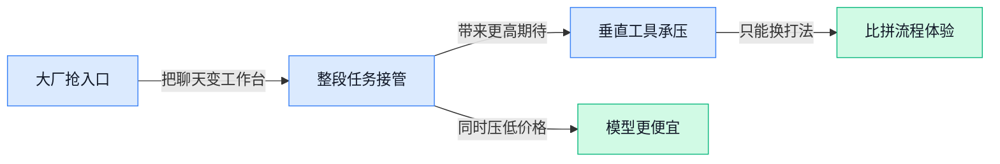

> AI 早报 · 每日早读 · 全网深度聚合

## **今日摘要**

```
OpenAI 上线 ChatGPT Work 与 GPT-5.6，规划 ChatGPT Superapp，高层离职风波再起
腾讯拟收购 Manus（AI 智能体公司）多数股权，Meta 20 亿美元交易被北京叫停局势突变
GPT-5.6 Sol 综合基准逼近 Fable 5 成本只要三分之一，Sol Ultra 还拿出数学猜想证明
```

### 🔵 产品与功能更新

1. **Google 梳理 Gemini、Veo、Nano Banana（Google 旗下不同用途的 AI 模型与工具）产品线。**
这篇内容相当于把 Google 近来的 **AI 模型家族**做了一次“对照表”整理，方便外行快速分清谁负责聊天、谁负责视频、谁适合端侧运行 💡。其中 **Gemini** 是 Google 的通用大模型，**Veo** 是偏向视频生成的模型，而 **Nano** 通常指可在设备本地运行的小模型，适合手机等端侧场景（端侧，指直接在用户设备上处理，而不是都发到云端）。对普通团队来说，这类梳理的价值在于：以后看到 Google 推新功能，不会再一脸懵，能更快判断它是面向 **办公助手**、**内容生成** 还是 **设备内 AI**。想看更完整的产品脉络，可参考[Google 模型解读(briefing)](https://news.google.com/rss/articles/CBMieEFVX3lxTE9FWlpxSldPWGRVNXFnMFVOdVFtdnJqeWRobVVvbEdtZEdoTjNySW5rMWZaZ1FxSWtqQ3dYRHdIaVpLRXlHbkhYNzFCT1Naa181UjgyNDZPMkNUY205cW9ZTFNSdUc4ZGJOMjBnVm5pODc1OHBCa0R0YQ?oc=5)。


2. **OpenAI 推出 ChatGPT Work（能接管整段工作流的 Agent），并配合 GPT-5.6 公开上线。**
这次更新的重点不只是模型版本升级，而是 **ChatGPT Work** 这种更像“数字同事”的新形态 🚀。报道指出，它可以处理完整 **工作流**（工作流，指把多个步骤串起来的一整套工作过程），也就是不再只回答单个问题，而是连续完成整段任务；这正是 **Agent** 从“会聊”走向“会做事”的关键变化。对业务、运营和职能团队来说，这意味着未来 AI 不只是写文案、做总结，还可能直接接手跨步骤执行任务，效率想象空间更大。更多细节可看[OpenAI 功能报道(briefing)](https://the-decoder.com/openai-pairs-its-gpt-5-6-public-rollout-with-chatgpt-work-a-new-agent-that-handles-entire-workflows/)。

3. **Meta 用 Muse Spark 1.1（Meta 新推出的模型接口服务）API 定价继续加码价格战。**
这条新闻的核心不是单纯“又发了个模型”，而是 **API 定价**开始正面冲击 OpenAI 和 Anthropic 😮。**API**（应用程序接口，可以理解成“让企业把别家 AI 能力接进自己产品里的插口”）价格一旦下探，企业做 AI 产品的成本就会被迅速重算，尤其影响需要大规模调用模型的客服、搜索、内容生成场景。报道认为，Meta 正借助 **更激进的价格策略**压缩竞争对手空间，说明大模型竞争已从“谁更强”扩展到“谁更便宜、更适合商用”。相关情况可查看[Muse Spark 定价报道(briefing)](https://the-decoder.com/metas-muse-spark-1-1-api-pricing-squeezes-openai-and-anthropic-as-the-ai-price-war-heats-up/)。

### 🟢 前沿研究

1. **GPT-5.6 Sol（OpenAI 的新一代推理模型）综合基准几乎追平 Fable 5（另一款前沿大模型），成本却只要三分之一。**
这条研究最值得关注的点，不只是**分数接近**，而是把**性能 / 成本比**又往前推了一大步 💡。原文提到，GPT-5.6 Sol 在聚合基准测试（把多项评测结果合并看整体能力的方式）中，已经非常接近 Fable 5，但推理成本明显更低，这对企业落地尤其关键：同样预算，可能跑更多任务或服务更多用户。对业务团队来说，这意味着未来高阶 AI 能力不一定只属于“最贵模型”，**性价比模型**正在变得越来越有竞争力 🚀。[完整报道(briefing)](https://the-decoder.com/gpt-5-6-sol-nearly-matches-fable-5-on-aggregated-benchmarks-at-one-third-the-cost/)


2. **GPT-5.6 Sol（OpenAI 的新一代推理模型）还能自主后训练 Luna（更小体量的模型），只靠一个相当模糊的提示词。**
这篇报道透露了一个很有冲击力的方向：强模型正在开始“带”弱模型训练，也就是自动完成一部分**post-training（后训练，让模型在预训练后继续学特定能力）**工作 🤖。原文说，GPT-5.6 Sol 只拿到一个“描述并不充分”的 prompt（提示词，给模型下任务的文字指令），就能自主后训练 Luna，这说明模型不只是会答题，还在走向**会调模型**。如果这一能力继续成熟，未来模型开发门槛可能进一步下降，许多原本需要专家手工反复调试的流程，有望被 AI 接管一部分。[原文报道(briefing)](https://the-decoder.com/openais-gpt-5-6-sol-autonomously-post-trained-the-smaller-luna-model-with-a-fairly-underspecified-prompt/)


3. **CausalDS（面向数据科学 Agent 的因果推理评测集）补上了“会分析数据”不等于“懂因果”的关键空白。**
这篇 arxiv 论文关注的是一个很现实的问题：现在很多大模型已经能当数据分析助手，但它们未必真的理解**因果推理（区分“相关”与“因果”的分析能力）**。CausalDS 把评测重点放在 data-science agents（数据科学 Agent，能自己调工具、跑分析流程的 AI 助手）身上，试图检验它们是不是只会“看起来像分析”，还是真的能做出更可靠判断。对企业来说，这很重要——如果 AI 未来要参与经营分析、用户洞察、实验复盘，**因果判断能力**会直接影响结论是否靠谱 📊。[arxiv 论文(briefing)](https://arxiv.org/abs/2607.08093)

4. **Vidu S1（可实时互动的 AI 视频生成模型）瞄准“边生成边交互”的下一代视频体验。**
从标题就能看出，这项工作强调的不只是生成视频，而是**real-time（实时响应，用户操作后能快速反馈）**和 **interactive（可交互，不是一次生成后就结束）** 两个方向 🎬。这意味着 AI 视频可能从“提交素材、等待出片”，走向更像游戏或设计软件那样的即时协作体验。对内容团队、营销团队甚至培训场景来说，如果视频生成真的进入实时交互阶段，未来做演示、做创意脚本、做动态素材的工作流都可能被重塑。[论文页面(briefing)](https://huggingface.co/papers/2607.03118)

5. **Linear Attention Architectures（线性注意力架构，用更省算力的方式处理长文本）系统梳理了长上下文模型的取舍。**
传统 self-attention（自注意力机制，让模型回看整段上下文找信息）效果强，但随着文本变长，计算成本会快速飙升；这篇论文讨论的 linear attention（线性注意力）就是想把这件事做得更省 💡。标题里的 cross-layer routing（跨层路由，让不同网络层更高效分工传递信息）也说明，作者不只是谈单点优化，而是在比较一整类架构思路。对普通读者来说，可以把它理解为：研究者正在想办法让 AI **读更长、记更多、跑更便宜**，这会直接影响长文档分析、长会议记录处理、复杂知识库问答等场景。[arxiv 论文(briefing)](https://arxiv.org/abs/2607.07953)

6. **Jet-Long（长上下文扩展方案）用 Dynamic Bifocal RoPE（动态双焦点位置编码，让模型更稳地理解远近信息）提升长文本处理效率。**
长上下文一直是大模型的重要战场，因为模型读得越长，越可能胜任合同审阅、研究报告整理、跨多轮对话跟踪等任务 📚。这篇论文提出 Dynamic Bifocal RoPE，其中 RoPE（旋转位置编码，让模型知道“这句话前后顺序”的常见机制）是当前大模型里很常见的底层设计，而“双焦点”思路说明作者在优化模型对近处与远处信息的兼顾。简单说，它想解决的是：**模型怎么在不大幅增加成本的前提下，看更长内容还能不糊涂**。[论文页面(briefing)](https://huggingface.co/papers/2607.07740)

7. **ARDY（用于人物动作生成的模型）把 autoregressive diffusion（自回归扩散，分步骤生成且逐步细化结果）带进可交互的人体动作生成。**
这项研究聚焦的是 human motion generation（人体动作生成，让 AI 产出连续动作而不是单张姿势），适合游戏、数字人、动画和虚拟人场景 🕺。标题里的 hybrid representation（混合表示，同时用多种方式描述动作信息）意味着作者在尝试兼顾动作的连贯性、可控性和真实感。对非技术同事来说，可以把它理解为：AI 不只是会画人、会做视频，还在逐步学会**让角色自然地动起来，并且能按你的互动要求调整动作**。[论文页面(briefing)](https://huggingface.co/papers/2607.08741)

### 🟡 行业展望与社会影响

1. **腾讯拟收购 Manus（AI 智能体公司）多数股权，Meta 的 20 亿美元交易被北京叫停后局势生变。**
这条消息最值得关注的，不只是**并购**本身，而是全球 AI 投资正在更明显地受**地缘监管**影响 🌍。原文提到，Meta 原本与 Manus（AI 智能体公司，主打让 AI 像“数字员工”一样自动完成任务）有一笔约 20 亿美元的交易，但在北京要求撤销后，腾讯转而推进多数股权收购。[完整报道(briefing)](https://the-decoder.com/tencent-moves-to-buy-majority-stake-in-manus-after-beijing-forced-meta-to-unwind-its-2-billion-deal/) 这说明 AI 赛道的竞争，已经不只是产品和模型能力之争，也越来越像**资本、政策、平台入口**的综合博弈 ⚖️。对企业用户来说，未来选用哪家 AI 服务，背后可能不仅看功能，还要看其**合规稳定性**和跨境合作风险。


2. **Bun（一个主打高性能的 JavaScript 运行工具）借助 Claude Fable 5（Claude 参与的大规模代码生成项目）11 天改写超百万行代码。**
这件事让“AI 能不能真正参与底层工程重构”这个问题，有了一个很具体的案例 🚀。原文称，Bun 放弃 Zig（一个追求高性能与低层控制的新编程语言），转向 Rust（更强调内存安全、适合大型系统开发的编程语言），并在 Claude Fable 5 的帮助下于 11 天内写出超过**100 万行代码**。[完整报道(briefing)](https://the-decoder.com/bun-ditches-zig-for-rust-with-help-from-claude-fable-5-writes-over-a-million-lines-of-code-in-11-days/) 这不代表 AI 已经能完全替代程序员，但很清楚地说明，AI 正在从“写几个小脚本”升级到参与**大规模工程迁移**。对行业的意义是，未来软件团队的生产方式可能会大改：人更像“架构师 + 审核员”，AI 则成为高强度的“代码施工队” 🛠️。

3. **Apple 起诉 OpenAI，指控前员工泄露机密并涉及商业秘密盗用。**
如果属实，这起诉讼会把 AI 行业最敏感的**人才流动**与**商业秘密保护**问题直接摆上台面 ⚠️。TechCrunch 报道称，Apple 指控部分前员工泄露保密信息，并认为相关不当行为受到 OpenAI 高层指使；另一则 [事件快讯(briefing)](https://news.google.com/rss/articles/CBMibEFVX3lxTFBSYjJXQWVjNnNKQXk5UC12TWFkWGd6UU55SExkcWFPVkptRjZGUkI1WjgySWRfRV9ROVBXTlltRFNjRXUybVdENkFnWlcyV1ZGWk10dC1CVjNJN055cDVuaWpKSmpfMWUwZGJRUA?oc=5) 也聚焦于“前员工泄密”这一核心争议，[TechCrunch 报道(briefing)](https://techcrunch.com/2026/07/10/apple-sues-openai-over-alleged-trade-secret-theft/) 给出了更完整背景。这里的**商业秘密**，可以理解为公司不公开、但足以决定竞争力的内部资料，比如产品路线、算法细节或工程方案。对整个行业来说，这类案件会进一步提高企业对**竞业限制**、内部权限管理和 AI 团队合规的重视程度，也提醒所有公司：AI 人才很贵，但数据和知识资产同样要守住 🔐。

4. **Deutsche Telekom（德国电信，欧洲大型通信运营商）正用 OpenAI 把自己改造成 AI 原生运营商。**
这不是单点试用 ChatGPT，而是把 AI 深度嵌进**客服、员工流程、网络运维和语音服务**等核心业务里 💡。OpenAI 的案例页显示，Deutsche Telekom（德国电信，欧洲大型通信运营商）希望成为 **AI-native telco**（AI 原生电信公司，意思是把 AI 变成日常运营的底层能力，而不是外挂工具），覆盖客户服务到网络运营多个环节。[官方案例页(briefing)](https://openai.com/index/deutsche-telekom) 这对传统大企业很有启发：AI 的真正价值，往往不是做一个炫酷 demo（演示样品，用来展示能力的小样板），而是重做那些每天都在消耗人力和时间的流程。对非技术岗位同事来说，也能感受到一个趋势——未来很多重复沟通、信息查询和标准化处理工作，都会被 AI 逐步“吃掉”，而人的价值会更多体现在判断、协调与复杂服务上。

5. **OpenAI 表示 ChatGPT 正从聊天工具走向“高难度工作搭档”。**
这个表述背后，反映的是 ChatGPT 定位的变化：不再只是“问一句答一句”，而是被包装成能陪你完成复杂任务的**工作伙伴** 🤝。原文标题直接强调，ChatGPT 现在是用户完成“最有野心工作”的 partner（伙伴，指能持续协助推进复杂项目的角色），这意味着 OpenAI 正试图把它从通用助手推向更深入的生产力场景。[官方消息流(briefing)](https://news.google.com/rss/articles/CBMid0FVX3lxTE84UHZjcXphU213bnNtVW4wNXZmWjFuSTVodldyWkthd1I5MWp3U1k0elVOQ1lOcDhtR0h1N0dQT1dZeDhmUnlaT2pOVFlEMk5Mdy1Sa0hKY0ZvdGNtdEtxRVJ5amhtMFFfNFVsclVUZk9PdXBURDZF?oc=5) 从社会影响看，这会进一步抬高大家对 AI 的预期：老板会希望它参与方案、写作、分析，员工也会更自然地把它当“第二大脑”。但这也意味着组织需要更早思考**人机协作**边界——哪些工作适合交给 AI，哪些决策仍必须由人拍板 🧠。

### 🟣 开源TOP项目

1. **pocket-tts（一款可在普通 CPU 上运行的文本转语音工具）主打“轻量到能装进口袋”。**
这个项目最抓人的点，就是把**文本转语音**能力尽量做轻，不依赖昂贵显卡，直接瞄准 **CPU（电脑里的通用处理器，日常办公机器也有）** 场景 🚀。对很多想把 AI 配音接进业务流程的团队来说，这意味着本地部署门槛更低，试用和落地都更方便。它来自 Kyutai Labs，项目介绍非常直白：就是一个“装得进 CPU、也装得进口袋”的 **TTS（文本转语音，把文字自动念出来）** 方案。[GitHub 项目页(briefing)](https://github.com/kyutai-labs/pocket-tts) 💡


2. **RedKnot（一套提升长上下文大模型服务效率的推理方案）瞄准“更长对话、更省资源”。**
这个开源项目聚焦 **长上下文** 场景，也就是让大模型一次处理更长文档、更多历史对话时，尽量别把算力浪费掉。它提到的 **KV Reuse（复用模型之前算过的中间结果，像把已做过的草稿继续拿来用）** 和 **PagedAttention（把注意力计算按页管理，减少显存和调度压力）**，本质上都是在优化大模型 **serving（在线提供模型服务，让用户请求更快返回）** 效率 ⚙️。如果你的业务在做长文档问答、复杂客服或多轮助手，这类底层优化虽然不显眼，却直接影响成本和响应速度。[GitHub 仓库说明(briefing)](https://github.com/rednote-machine-learning/RedKnot)


3. **claude-design-system-prompt（一套把 Claude 调成设计协作搭档的提示词与技能库）走红。**
这个项目的核心不是新模型，而是一套**逆向整理**出来的 **system prompt（系统提示词，决定 AI 默认角色和行为规则）** 和技能库，用来把 Claude 变成更有主见的设计协作助手。它特别强调 **accessibility（无障碍设计，让更多人包括视障或行动不便用户也能顺畅使用产品）**，以及抵抗 **AI-slop（低质量、套路化、味很重的 AI 内容）**，对设计团队很有现实意义 🎨。简单说，它想解决的不是“能不能出图”，而是“AI 产出的设计建议到底靠不靠谱、能不能进团队流程”。[项目仓库主页(briefing)](https://github.com/Trystan-SA/claude-design-system-prompt) ✨


4. **testsprite-cli（一款在命令行里做自动化测试的 AI 工具）把测试流程往前再推一步。**
这是 TestSprite 官方推出的 **CLI（命令行工具，不用点页面、直接在终端输入指令操作）** 项目，主打用 AI 帮开发者自动化完成测试任务。它的定位很明确：直接从 **terminal（终端窗口，程序员执行命令的工作界面）** 发起测试，而不是切来切去找平台页面 🧪。对团队来说，这类工具如果成熟，价值就在于把测试更早嵌进开发流程，减少人工重复检查。[官方仓库页(briefing)](https://github.com/TestSprite/testsprite-cli)

### 🔴 社媒分享

1. **OpenAI 大发布背后又现高层离职风波。**
这篇社媒热议点不只在**新品发布**，更在于 OpenAI 同时出现了更受关注的**核心人员变动**，讨论焦点一下从产品拉到了组织稳定性上 😮。对普通职场同事来说，这类消息往往意味着：一家 AI 公司不只是拼模型能力，也在拼团队、节奏和战略定力。原文把“发布”与“离开”并置，说明市场已经开始把**人才流动**视作和产品路线同等重要的信号。[完整报道原文(briefing)](https://www.platformer.news/openai-gpt-5-6-simo-meta-muse-spark-1-1/)


2. **GPT-5.6 Sol Ultra（OpenAI 的高阶推理模型）给出 Cycle Double Cover Conjecture（图论里一个长期未解的数学猜想）证明。**
这条内容之所以刷屏，是因为它不是普通的“答题做对”，而是号称产出了一份针对**数学猜想**的完整证明文稿 📘。Cycle Double Cover Conjecture（图论里研究“网络连接结构”的经典难题）离大众工作很远，但它代表了 AI 正在从“会聊天、会总结”走向更强的**深度推理**。如果这类成果后续经得起学界检验，AI 在科研、金融分析、法务论证等高复杂度场景的想象空间会被进一步放大。[证明文稿原件(briefing)](https://cdn.openai.com/pdf/04d1d1e4-bc75-476a-97cf-49055cd98d31/cdc_proof.pdf)


3. **PyTorch（最流行的 AI 开发框架）性能剖析新文聚焦 Attention（让模型判断“该重点看哪部分信息”的核心机制）。**
这篇文章来自 HuggingFace（全球最大 AI 模型共享社区）的技术博客，核心是在讲：当大模型运行变慢、变贵时，开发者该怎么定位问题 🔍。Profiling（性能剖析, 像给程序做“体检”，找出最耗时间和算力的环节）被放到 Attention 这个关键模块上，说明现在优化 AI 成本，已经不是只看模型大小，而是看每一步推理到底卡在哪。对业务侧也有现实意义：模型越会“省算力”，企业部署时的**响应速度**和**使用成本**就越有机会一起改善。[技术博客原文(briefing)](https://huggingface.co/blog/torch-attention-profile)

4. **OpenAI 被曝规划 ChatGPT Superapp（超级应用，想把多种功能装进一个入口）。**
社媒讨论这篇内容，主要因为它描绘了 ChatGPT 可能不只是一款聊天工具，而是朝着**一站式入口**继续扩张 🚀。Superapp（超级应用, 像“把搜索、协作、任务、内容服务放进同一个壳里”）一旦成形，用户和企业未来可能会把更多工作流直接放进 ChatGPT，而不是在多个软件间来回切换。这对办公软件、搜索、内容平台甚至垂直工具都是压力：AI 不再只是插件，而可能变成主界面。[报道全文(briefing)](https://www.bigtechnology.com/p/openais-plans-for-its-new-chatgpt)

5. **Apple 起诉 OpenAI，指控前员工带走商业机密。**
这类新闻在社媒上热度高，不只是因为两家巨头正面碰撞，更因为它触到了 AI 行业当下最敏感的**人才竞争**与**知识产权**问题 ⚖️。商业机密（企业未公开、但足以影响竞争优势的核心资料）如果真的涉及流出，影响的就不只是单个项目，而是产品路线和研发壁垒。对企业管理层来说，这也提醒了一个现实：AI 时代拼的不只是招人速度，还要拼内部保密制度和员工流动管理。[案件报道整理(briefing)](https://9to5mac.com/2026/07/10/apple-sues-openai-trade-secret-theft/)

6. **报告称 Boko Haram（尼日利亚极端组织）正在利用 frontier AI（前沿 AI，能力最强的一批新模型）。**
这条内容把社媒讨论从“AI 多强大”拉回到“AI 会被谁利用”的老问题上了。frontier AI（前沿 AI, 指当前能力最靠前、可能带来更大社会影响的模型）一旦被极端组织用于宣传、组织或信息操作，风险就不再抽象，而是现实安全议题 ⚠️。对普通读者来说，这类报告的重要性在于提醒我们：AI 治理不能只谈创新，也得同步考虑**滥用防范**、平台审查和跨国协作。[风险报告原文(briefing)](https://casp.ac/reports/ai-enabled-terrorism)

---



### 📊 行业洞察（今日 4 条）

1. OpenAI一边推 ChatGPT Work（能接管整段工作的 AI 助手）和“高难度工作搭档”，一边又被曝要做 ChatGPT Superapp（超级应用）并砍掉 Atlas 浏览器
  【洞察】几件事放一起看，OpenAI 已不满足做单点工具，而是想把“入口、执行、留存”都抓在自己手里，垂直软件以后最怕的不是功能被抄，是用户先去 ChatGPT 里把事做完了

2. Meta 用 Muse Spark 1.1（Meta 的模型接口服务）打价格战，OpenAI 的 GPT-5.6 Sol（新推理模型）又把性能拉近但成本压到三分之一
  【洞察】大模型竞争正在从“谁最强”转成“谁够强还更便宜”，以后行业会先卷成本再卷体验；只靠接模型赚差价会越来越难，产品必须有自己的使用价值

3. GPT-5.6 Sol 能自己带着 Luna（更小模型）继续学习，Bun 借 Claude Fable 5（Claude 参与的大规模代码生成项目）11天改写百万行代码
  【洞察】这说明 AI 已从“辅助写一点”走向“能参与整段生产”，但别高兴太早，产出越大，复核成本和出错后果也越大，人不会消失，只是从执行改成把关

4. Vidu S1（可实时互动的 AI 视频生成模型）强调边生成边交互，Google 又把 Gemini、Veo、Nano（Google 不同用途模型）分得更清楚
  【洞察】视频方向开始从“出片能力”转向“交互体验和场景分工”，以后用户不只在乎能不能生成，更在乎能不能边改边看、不同任务能不能自动选对工具

### 💭 对我们的启发（今日 3 条）

1. OpenAI 把 ChatGPT 往“工作入口”做，说明我们的视频剪辑软件不能只卖生成功能，得把脚本、剪辑、配音、改稿串成一条顺手流程，否则用户会被更大入口截走。

2. Meta 降价、OpenAI 提升性价比，验证模型调用会越来越便宜；这对我们是好事，但也意味着护城河不在“用了谁家模型”，而在出片速度、稳定性和品牌可控性。

3. Vidu S1（可实时互动的 AI 视频生成模型）提醒我们，视频工具该优先做“边改边预览”和“关键节点人工接管”，别把全自动当卖点，客户真正怕的是失控和返工。


---

> 本周周报：[第28周综合分析](https://zhuxinfei.github.io/ai-daily-site/blog/weekly/2026-w28/)
