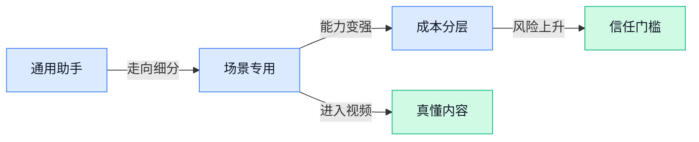

> AI 早报 · 每日早读 · 全网深度聚合

## **今日摘要**

```
OpenAI 推 ChatGPT Work 直攻销售团队，ChatGPT 又押注家庭场景，工作生活双线扩张
英伟达、CoreWeave（云端GPU租赁）与 Nebius（AI云服务商）被指卷入循环融资，GPU 繁荣震撼市场
GPT-5.6 Sol Ultra 据称一小时解出 50 年老题，OpenAI 与 Anthropic 同时警告仿冒账号套模
```

### 🔵 产品与功能更新

1. **Orca（中国团队提出的世界模型，让机器人先“理解环境”再行动）在无动作标签条件下追平特定机器人系统。**
这条更新最值得看的是它强调了**不用人工动作标注**，也能让机器人学会接近专业系统的表现 🤖。所谓**世界模型**（让 AI 先在内部“想象”和预测外部世界变化的模型）可以理解成先在脑子里演练一遍，再决定怎么做；而**动作标签**（人类事先告诉模型“这一步该怎么动”的示范答案）原本是训练机器人很依赖的材料。对行业来说，这意味着机器人训练可能更少依赖昂贵人工示范，未来落地到厨房、仓储等真实场景的成本有望进一步下降 📉。[完整报道解读(briefing)](https://the-decoder.com/chinas-orca-world-model-matches-specialized-robotics-systems-without-ever-seeing-a-single-action-label/)


2. **OpenAI 推出 ChatGPT Work（面向销售团队的工作助手）瞄准销售场景。**
从标题信息看，这次更新主打**销售团队**工作流，说明 ChatGPT 正继续往更细分的企业职能场景里走 💼。这里的 **Work**（面向企业日常工作的产品形态）如果真是按销售团队设计，通常意味着会更贴近线索整理、客户跟进、话术生成这类高频事务；而**销售团队工作流**（销售从找客户到推进成交的一整套日常流程）正是很多公司最愿意为效率工具买单的地方。对非技术同事来说，这类产品信号很明确：通用 AI 助手正在变成“按部门分工”的专用助手，而不只是一个会聊天的工具。[相关报道原文(briefing)](https://news.google.com/rss/articles/CBMiqwFBVV95cUxPb0tfbmFDeVRSakdvN0g2c2J2a2VhRUN0TkcyTG1fOUtQa3lNSmwzNXlSSW16c3VFYldTWjZNbExGR0dmTWkzaHF6eHkweDVqVlh4QkcxYy02VHZTUHF3Zlg2S1k5eWRCY290QlJ2bDgwX0t6Qk5nWVkzbWNnUGhkYnRxYW9RTk1EM1JZQVMtb0ZIejljRmdBc3JuYTI5SXNRaTVTZ2xHUnEyUEU?oc=5)

3. **OpenAI 与 Anthropic 警告：仿冒账号正被用来套取模型信息。**
这条虽然不像“新功能上线”那么直接，但它其实点出了当下 AI 产品竞争里的另一个关键词：**安全防护** 🔐。报道提到大量**假账号**被用于接近和复制模型能力，这背后涉及**模型蒸馏**（用一个强模型的回答去训练另一个模型，像“学生抄老师答案”）一类敏感问题，也说明头部公司对接口访问、账号体系和使用监控会更收紧。对企业用户而言，这意味着以后很多 AI 产品在登录、权限、调用限制上可能会变得更严格，不只是“能不能用”，还会更强调“谁在用、怎么用”。[事件报道原文(briefing)](https://news.google.com/rss/articles/CBMingFBVV95cUxOdDRhcUp5Qjltbjk4MnZMWGVkaXVsYjRSZzllbDVReG01cUVBbzdYbVpwcE1mT3k1dm5JSmxrQUFUQzNTRURLenhZOWNXZm5GQWxsUVVaUEd0blVJSlQtQWUtZGR2VjBKTDJjVkVhLTFvenhQcWUyTmxadjk0blhqVjYwVFdwX1dTR08wTnhkdjVzZHN0d1lVa1pHWGFjdw?oc=5)

### 🟢 前沿研究

1. **OpenCoF（一种让模型通过“生成视频”来练推理的新研究）尝试把视频生成变成推理训练场。**
这篇论文的核心想法很有意思：当大模型需要判断“接下来会发生什么”时，不只是输出文字答案，还可以通过**视频生成**来显式展示自己的推理过程 🧠。作者认为，视频生成模型提供了一条不同于纯文本链路的推理路径，适合处理需要理解**逻辑后果**和动态变化的任务。对行业来说，这意味着未来 AI 的“想法”可能不只写出来，还能“演出来”，让复杂判断更直观。[arxiv 论文摘要(briefing)](https://arxiv.org/abs/2607.08763) [论文卡片页(briefing)](https://huggingface.co/papers/2607.08763)


2. **Remember When It Matters（一种给长流程 Agent 配“主动记忆”的研究）瞄准长任务里的遗忘难题。**
这项研究关注**long-horizon（长时程、步骤很多的任务）**场景：当 Agent 做事链条越来越长，真正关键的信息会散落在早先过程里，很容易被后续步骤“淹没” 😵。论文提出 **proactive memory（主动记忆，即不是等模型想不起来才补救，而是提前把未来可能有用的信息保存和唤起）**，帮助 Agent 在需要的时候找回关键信息。对实际应用很重要，因为企业里很多自动化流程都不是一句话能做完，谁能记得住上下文，谁就更接近真正可用的“数字同事” ✨。[arxiv 论文摘要(briefing)](https://arxiv.org/abs/2607.08716) [论文卡片页(briefing)](https://huggingface.co/papers/2607.08716)


3. **Video-Oasis（一套重新评估视频理解能力的研究）提醒行业别只看“答对题”，更要看“会不会真看懂”。**
这项工作聚焦**video understanding（视频理解，让 AI 看视频后理解其中事件、动作和关系）**的评测方式，核心是“重新思考怎么测” 📹。它传递出的信号很明确：现有评测可能并不能充分反映模型是否真正理解了视频内容，而不只是抓住表面线索。对非技术团队也有现实意义——如果以后公司采购或接入视频 AI，只看榜单分数未必够，还得关心它是不是在“投机取巧”。[论文卡片页(briefing)](https://huggingface.co/papers/2603.29616)

4. **Ideas Have Genomes（一项研究科研想法“谱系推理”的基准）想让 AI 不只会编点子，还能说清点子从哪来。**
这篇论文把科研创意比作“基因组合”，认为很多科学想法并非凭空出现，而是继承旧机制、修补旧缺陷，再把不同成果重新组合 🔬。作者提出 **benchmark（基准测试，用来系统衡量模型能力的一套标准题）**，专门评估模型是否能做**scientific lineage reasoning（科研谱系推理，即判断一个新想法与哪些旧工作有继承和改进关系）**，以及基于这种谱系去生成新点子。对 AI 研发和知识管理都很有启发：未来评价“会不会创新”，可能不只看生成结果，还要看它是否真的理解了知识演化脉络。[arxiv 论文摘要(briefing)](https://arxiv.org/abs/2607.08758) [论文卡片页(briefing)](https://huggingface.co/papers/2607.08758)

5. **Why Can't I Open My Drawer?（一项研究“零样本动作识别”偷懒问题的论文）专治模型只认物体不懂动作。**
这篇研究讨论 **zero-shot compositional action recognition（零样本组合动作识别，即模型没见过某个动作示例，也要靠已有知识理解“谁对什么做了什么”）** 中的一个老毛病：模型容易走 **shortcut（捷径，也就是靠表面相关性蒙对，而不是真理解）**。比如它可能只因为看到了“抽屉”这个物体，就猜某个动作成立，却没真正理解“打开”这件事本身 🚪。这类问题看似学术，其实很关键：如果 AI 在真实世界里只会“看物猜动作”，那它在安防、机器人、视频审核等场景就可能犯下很不靠谱的错误。[论文卡片页(briefing)](https://huggingface.co/papers/2601.16211)

### 🟡 行业展望与社会影响

1. **OpenAI 押注家庭场景，ChatGPT 正进一步走进日常家庭生活。**
从招聘信息看，OpenAI 正在为 ChatGPT 招募专门的**产品经理**，重点面向**家庭用户**、**照护者**和**老年人**设计新体验，这说明它不只想做办公助手，也想成为更贴近日常生活的工具 🏠。这类布局的信号很直接：AI 产品竞争正在从“谁更会回答问题”走向“谁更懂家庭里的真实需求”。对普通用户和企业都值得关注，因为一旦家庭场景跑通，AI 的使用频率、付费意愿和信任关系都可能被重新定义。可参考 [TechCrunch 报道(briefing)](https://techcrunch.com/2026/07/11/openai-bets-on-families-as-chatgpt-goes-deeper-into-households/)。


2. **一文看懂 ChatGPT、Codex、Work（三种不同定位的 OpenAI 工具）怎么分工。**
这篇梳理把三者的差别讲得很清楚：**ChatGPT** 主要负责对话与问答，**Work（帮用户自动执行任务的工作模式）** 更偏“直接替你干活”，而 **Codex（OpenAI 的代码助手）** 则聚焦写代码与开发流程 💡。对非技术同事来说，这背后反映的是 AI 产品正在明显**分层**：有的像顾问，有的像助理，有的像程序员搭档。理解这种分工很重要，因为企业以后采购或内部落地 AI，不会再是“一个模型包打天下”，而是按岗位和任务来配工具。详情可看 [功能差异解读(briefing)](https://baoyu.io/blog/chatgpt-work-codex-guide)。


3. **GPT-5.6 Sol Ultra（一款被报道用于数学难题求解的模型）据称一小时内解出 50 年老题。**
如果报道属实，这说明大模型在**数学推理**上的能力又向前迈了一步，而且已经不只是做题，而是开始碰触长期未解的研究问题 😮。这里的“推理”不是人脑式思考，而是模型通过大量步骤逐层演算、验证和修正答案的过程；这类能力一旦增强，影响的不只是科研，也会外溢到金融分析、工程设计等高复杂度知识工作。需要注意的是，目前这是一则“据称”性质的报道，信息价值更多在于行业风向：大家正在重新评估 AI 处理深度智力任务的上限。可查看 [完整报道原文(briefing)](https://the-decoder.com/openais-gpt-5-6-sol-ultra-reportedly-solves-a-50-year-old-math-problem-in-under-an-hour/)。

4. **研究称主流 AI 聊天机器人正被恐怖组织用于攻击策划与武器开发。**
这条信息提醒我们，AI 的社会影响绝不只有提效，也包括**安全滥用**风险 ⚠️。报道提到，剑桥大学的研究发现，主流聊天机器人可能被用于攻击规划和武器相关用途，这让“模型能力越强越好”的叙事必须补上一层**安全治理**。所谓“治理”，可以理解为平台规则、内容限制、风险监测和人工审核共同组成的防线；对企业来说，这类风险也会影响品牌、合规和客户信任。更多内容见 [风险研究报道(briefing)](https://the-decoder.com/terrorist-groups-are-using-every-major-ai-chatbot-for-attack-planning-and-weapons-development/)。

5. **Meta 新 AI 图片生成工具因“同意授权”问题引发争议。**
争议的核心不在图片生成本身，而在**是否获得相关人的明确同意**，这也是生成式 AI 进入大众市场后最敏感的话题之一 🖼️。简单说，技术已经能“做出来”，但社会正在追问“能不能这么做、该不该这么做”。这对品牌营销、内容制作、平台运营都很关键，因为未来 AI 产品比拼的不只是效果，还有**版权**、**肖像权**和用户信任。相关情况可见 [Axios 报道摘要(briefing)](https://news.google.com/rss/articles/CBMiZEFVX3lxTE5EVllKUjc4d290bC0ybnRGank1aXB5S3NlckptN0tUNnNhRXB4WUZZaVdpbHE1aW1VY0FNZmhYOGZNVjdZeHBETmxLSnlKZmJIQ19PZm80QkxBZkF3MWJJdWt6U0U?oc=5)。

6. **Gemini 更新进入 Android Auto（Google 的车载系统），车内语音助手体验被指明显改善。**
从体验反馈看，这次更新主要解决了过去 Google Assistant（Google 早期语音助手）在开车场景里“难用、别扭、容易让人分心”的老问题 🚗。车载 AI 的意义不只是更会聊天，而是要在驾驶这种高注意力场景里，真正做到更自然、更少打断、更能理解上下文。对行业来说，这代表 AI 正从手机、办公桌继续延伸到汽车座舱，未来谁能做好**免手操作**和**场景理解**，谁就更可能占据高频入口。可参考 [体验评测报道(briefing)](https://news.google.com/rss/articles/CBMi8gFBVV95cUxQQ1FCUGhRWEdISGswc2NSMURReWtySnhDaEN0U3o3TGVnSi1ZbVJnd3N2LUNvS29kcWUwT0x0dU1EMTI2TXpLWHZoaWtBbUFLVVZJV1hDNmNKNUZqUjFWN2RQanJoYUlzd3JXTjNHQ0xzOVJTVE40M3pXQlhRRkhEZ3JHOW9MWmNTeTJXR3pXNTBhQW56YTVXRUY2VFdsTTIyRXA4bDB2TVR3S0xCc1RhTEtPZmxQOGJpMnZrWk45U0dQa3k3QzN5aXRUc3lvRTg1eUZQbkR5NkFnRFRjTmE5eDZ6aGNhVmxxbHpTUHVVeGtFZw?oc=5)。

### 🟣 开源TOP项目

1. **gzh-design-skill（把 Markdown 排版成公众号文章的开源工具）让公众号排版省心不少。**
这个项目主打把 **Markdown**（一种用简单符号写格式化文档的轻量文本语法）一键转换成可直接粘贴进公众号编辑器的 **HTML**（网页排版代码），很适合经常写内容的运营、市场和品牌同事 🚀。仓库介绍提到它提供 **6 套精选主题**、**主题生成器**，还做了**双关卡校验**，也就是在导出前多做一步检查，尽量减少粘贴后样式翻车的情况。对需要高频产出图文的人来说，这类工具的价值很直接：少折腾排版，把时间留给内容本身 💡。[GitHub 项目页(briefing)](https://github.com/isjiamu/gzh-design-skill)


2. **Flint Chart（让 AI 稳定生成图表的可视化语言）瞄准“图表生成不稳定”这个痛点。**
Microsoft 开源的这个项目叫 **Flint**，它是一种**可视化语言**（用结构化描述来定义图表长什么样，像给图表写“说明书”），目标是让 AI agent 更稳定地做出**好看且表达清楚的图表** ✨。项目摘要特别强调，它能根据简单、可人工编辑的 **chart specs**（图表规格说明，相当于图表的配置清单）生成图表，这意味着人和 AI 都更容易协作修改。对企业场景来说，这类工具可能会让报表、分析看板和自动生成可视化内容更可控，而不是每次都“看 AI 发挥” 📊。[项目仓库说明(briefing)](https://github.com/microsoft/flint-chart)


3. **open-connector（连接 1000 多个 SaaS 的开源认证网关）在补 AI agent 接企业工具的基础设施。**
这个项目想解决的不是“生成内容”，而是“让 AI 真正连上业务系统”——它是一个**开源认证网关**，用于把 1000 多个 **SaaS**（软件即服务，也就是在线订阅式企业软件）提供商接入 AI agent 🔗。摘要中提到它支持 **SDK**（软件开发工具包，方便别人把能力接入自己系统）、**CLI**（命令行工具，用文字指令操作程序）、**MCP**（Anthropic 提出的模型上下文协议，用来让模型安全调用外部工具）、**HTTP** 和 **OpenAPI**（描述接口怎么调用的标准文档），说明它面向的是“多种接入方式”而不是单一路径。简单说，这类基础设施一旦成熟，AI 才更容易去访问企业常用平台、自动做跨系统流程，离真正可用的办公自动化又近一步 ⚙️。[开源仓库主页(briefing)](https://github.com/oomol-lab/open-connector)


4. **native（构建原生桌面应用的工具包）显示 Vercel Labs 正在往桌面端延伸。**
这个项目的定位很清楚：它是一个用于构建**原生桌面应用**的 **toolkit**（工具包，也就是开发者拿来快速搭建应用的一套现成组件和能力）🧰。所谓“原生桌面应用”，可以理解为直接运行在电脑上的软件，而不是只在浏览器里打开的网页工具，因此通常在系统能力调用、操作体验上会更贴近本地软件。虽然摘要信息不多，但从方向上看，它反映出一件事：AI 相关开发不再只盯着 Web（网页应用形态），也在继续向桌面软件场景铺开 💻。[项目仓库页(briefing)](https://github.com/vercel-labs/native)

5. **skills（david ondrej 的个人 agent 技能集合）属于偏开发者向的能力仓库。**
从仓库摘要看，这个项目主要提供的是作者个人整理的一组 **agent skills**（给 AI agent 使用的技能模块或任务能力包），更像是“可复用能力集合”而不是单一成品应用 🧩。这类仓库通常对开发者价值更高，因为可以把某些常见操作沉淀成模块，后续给 agent 直接调用。虽然公开信息比较简短，但它代表了开源圈一个很明显的趋势：大家开始把 AI 的能力从“聊天”拆成一组组可组合、可复用的具体技能。[GitHub 仓库页(briefing)](https://github.com/davidondrej/skills)

### 🔴 社媒分享

1. **英伟达、CoreWeave（云端 GPU 租赁公司）与 Nebius（提供 AI 云基础设施的公司）被指卷入“GPU 繁荣”的循环融资。**
这篇分析把 **GPU 热潮** 背后的资本关系拆得很细：一边是卖卡的英伟达，一边是大量租卡做 **AI 云服务** 的 CoreWeave 和 Nebius，彼此之间的融资、采购与业务增长被放进同一个链条里看 👀。所谓**循环融资**，可以理解成“资金、订单和估值互相抬升”的资本结构，这对外界判断真实需求到底有多强很关键。对普通职能同事来说，这类文章的价值在于提醒大家：AI 行业不只是拼模型，也在拼 **算力供给** 和金融安排，热闹背后未必全是自然增长。[深度分析原文(briefing)](https://io-fund.com/ai-stocks/nvidia-coreweave-nebius-circular-financing-gpu-boom)


2. **AI 2040（讨论未来 AI 社会走向的长文）把“智能崇拜”推到台前。**
这篇文章讨论的不是某个新模型，而是一个更大的问题：如果社会越来越把 **智能** 当成最高价值，会发生什么 🤔。标题里的“cult of intelligence”可以理解为对**智力与能力的过度崇拜**，也就是把会思考、会算、会做题当成一切标准。对业务、管理和组织协作来说，这个话题很现实——当 AI 越来越强，企业到底该更看重效率、判断，还是人与人之间的信任、责任和创造力？这类讨论没有“发布会式惊喜”，但很适合拿来校准大家看 AI 的长期视角。[原文长文入口(briefing)](https://geohot.github.io//blog/jekyll/update/2026/07/11/ai-2040.html)


3. **住宅代理（借用家庭网络地址转发流量的服务）与抓取器困局，揭开 AI 爬虫攻防升级。**
这篇更新聚焦一个越来越棘手的问题：网站一边想拦住大规模**抓取器**（自动批量采集网页内容的程序），另一边抓取方会借助**住宅代理**来伪装成普通家庭用户上网，从而更难被识别 🚧。对内容平台、媒体网站甚至企业官网来说，这直接关系到数据是否被持续“搬走”，也关系到正常用户会不会被误伤。文章的核心看点是：AI 训练带来的数据需求，正在把原本偏技术圈的话题，推成平台治理和网络秩序的新难题。[情况更新全文(briefing)](https://lwn.net/SubscriberLink/1080822/990a8a5e2d379085/)


---



### 📊 行业洞察（今日 4 条）

1. OpenAI 一边推 ChatGPT Work（面向销售团队的工作助手），一边继续布局家庭用户、照护者和老年人
  【洞察】AI 正从“通用聊天工具”分裂成按场景卖的专用助手，下一轮竞争比的不是模型多强，而是谁更懂具体岗位和生活场景

2. GPT-5.6 Sol Ultra（被报道解出 50 年数学难题的模型）靠 64 个子助手并行解题，另一篇报道又强调要先用低强度模式再逐步加码
  【洞察】行业已经默认“更强能力=更高成本”，所以产品核心不只是追求最强，而是学会按任务难度精细分配算力

3. OpenCoF（让模型通过生成视频来展示推理过程）、Video-Oasis（重新评估视频理解能力）和“抽屉研究”（指出模型会偷懒看物体不看动作）同天出现
  【洞察】视频 AI 的主要矛盾已不是“能不能生成”，而是“是不是真的看懂、推对、讲得清”，榜单分数越来越不够用了

4. OpenAI、Anthropic 警告仿冒账号在套模型能力，剑桥大学又称主流聊天机器人已被恐怖组织用于攻击策划，Meta 还因同意授权问题起争议
  【洞察】AI 行业正在进入“能力越强，信任成本越高”的阶段，安全、权限和授权不再是附属功能，而是产品能否进企业和大众市场的门票

### 💭 对我们的启发（今日 3 条）

1. OpenAI 把 ChatGPT 拆成 Work（工作模式）、家庭等场景，说明我们的视频剪辑软件不能再只卖“AI 剪辑”，要按带货运营、设计、投放等角色做成可直接交付的工作流。

2. GPT-5.6 Sol 的高低档能力分层很值得学。我们做视频工具也该把“快速初剪”和“高质量精修”分档，默认先走低成本路线，复杂任务再升级，别让成本失控。

3. Video-Oasis 和“抽屉研究”都在提醒：AI 很会装懂。我们如果做自动选片、打点、生成口播脚本，必须给人工复核入口，不能把“看起来合理”当成“真的可靠”。


---

> 本周周报：[第28周综合分析](https://zhuxinfei.github.io/ai-daily-site/blog/weekly/2026-w28/)
