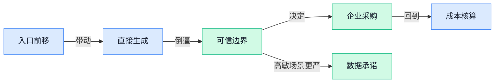

> AI 早报 · 每日早读 · 全网深度聚合

## **今日摘要**

```
Apple 向所有人开放新版 Siri AI 随 iOS 27 公测上线，Google Search 找不到答案时直接生成 AI 图片
OpenAI 首款设备传为无屏可移动音箱，ChatGPT 重返 WhatsApp 欧洲，超级应用野心再被点燃
DeepSeek 刚融 70 亿美元又传继续找钱，Anthropic 推 Claude for Teachers 并承诺不拿学生数据训练
```

### 🔵 产品与功能更新

1. **Google Search 找不到网页答案时，开始直接生成 AI 图片。**
Google 给搜索加了一个更直观的新出口：当系统判断网上缺少你要找的画面内容时，会直接用**AI 生成图片**来补位，而不是只返回一堆链接 🖼️。这意味着搜索正在从“帮你找网页”进一步走向“直接给你结果”，对做内容、设计灵感和资料搜集的同事会更有感。这里的生成能力本质上属于**多模态**（让 AI 同时理解文字、图片等多种信息）的应用场景，也是在把搜索和创作工具继续打通。[功能更新报道(briefing)](https://the-decoder.com/google-search-now-generates-ai-images-when-it-cant-find-what-youre-looking-for-on-the-web/)


2. **Apple 向所有人开放新版 Siri AI，随 iOS 27 公测上线。**
Apple 发布了 **iOS 27 公测版**，让普通 iPhone 用户不用装开发者测试版，也能提前体验新版 **Siri AI** ✨。这次重点不是单纯“语音助手变聪明”，而是把 AI 能力更早放到大众用户手里，方便真实环境里观察体验和反馈。对日常办公和生活场景来说，这类**公测版**（面向公众提前开放的测试版本）往往是正式普及前的重要风向标；而**开发者测试版**（主要给软件开发者抢先适配和排错的版本）则门槛更高。[TechCrunch 完整报道(briefing)](https://techcrunch.com/2026/07/14/apple-opens-its-new-siri-ai-to-everyone-with-the-ios-27-public-beta/)

3. **MIT 推进让 AI 模型更贴近真实世界应用。**
MIT News 这篇内容聚焦一个很关键的方向：怎么让 **AI 模型**不只会在实验环境里表现好，还能在现实任务中更可靠地工作 🚀。这类研究的核心价值，通常在于缩小“论文效果”和“真实落地”之间的差距，也就是大家常说的从实验室走向业务现场。对企业来说，真正有用的不只是模型分数高低，而是它在复杂情境中的**泛化能力**（换了场景也能稳定发挥的能力）和真实可用性。[MIT 新闻原文(briefing)](https://news.google.com/rss/articles/CBMickFVX3lxTE1DVzFFVzBVenhXc3BVdDA2RFdNTTB4dG5waUZQUkRGOWlzTlBiX2tJOE5razk1c1JCVDNYVUxHRFpfUWtNMXREY29TVU1uQjBEbGx2d01fdnVSMVJOU0UwREF0YXJXdFZPQWdLSm9oUm5RUQ?oc=5)

### 🟢 前沿研究

1. **Proxy Exploration and Reusable Guidance（用“代理信号”帮大模型后训练的模块化新范式）提出可复用的大模型优化思路。**  
这篇论文关注的是**LLM post-training（大模型后训练，指预训练完成后再做定向优化）**怎么变得更**模块化**、更容易复用 💡。它提出用**proxy-guided update signals（代理引导更新信号，先用“替身反馈”帮模型判断该往哪里改）**来替代一部分昂贵而难扩展的直接优化流程，有点像先让“导航员”试路，再决定全队怎么走。对企业来说，这类研究如果成熟，可能会让后续的模型调优更灵活、成本更可控，也更方便针对不同业务重复利用训练经验 🚀。可先看[论文条目页(briefing)](https://huggingface.co/papers/2607.11505)。


2. **Xiaomi-Robotics-U0（小米提出的具身智能统一生成模型）瞄准“世界模型”驱动的机器人能力整合。**  
这篇工作把重点放在**Unified Embodied Synthesis（统一具身生成，让机器人把感知、理解、动作放到一个体系里协同）**，并引入**World Foundation Model（世界基础模型，帮助机器理解环境变化与行动后果的底层模型）**。简单说，它想让机器人不是只会做单点动作，而是能在更完整的环境认知下生成行为方案 🤖。这类方向很重要，因为具身智能（让 AI 真正进入物理世界完成任务）最终拼的不是单个动作，而是对环境、任务和反馈的整体理解。更多可见[论文条目页(briefing)](https://huggingface.co/papers/2607.11643)。


3. **Metacognition in LLMs（大模型“元认知”研究综述）系统梳理 AI 是否会“反思自己”。**  
所谓**metacognition（元认知，简单说就是“知道自己会不会、哪里可能错”）**，在人类学习里很关键，在大模型身上也越来越受关注 🧠。这篇论文总结了相关基础、进展与机会，核心是在讨论：模型除了给答案，能不能更好地评估自己的把握、发现自己的盲点，并据此调整推理过程。对普通工作场景来说，这直接关系到 AI 能不能更可靠地做总结、判断风险、提醒“不确定项”，而不是一股脑儿自信输出。可参考[综述论文页(briefing)](https://huggingface.co/papers/2607.11881)。

4. **ABot-N1（通用视觉语言导航基础模型）想让机器人更会“看路、听话、找地方”。**  
这项研究聚焦**Visual Language Navigation（视觉语言导航，让机器根据图像和文字指令在空间中行动）**，目标是做一个更通用的**foundation model（基础模型，可迁移到多种任务的通用底座）**。从摘要看，它试图统一**grounded spatial decisions（基于真实空间信息做决策）**与更广泛的具身任务能力，也就是不只会认路，还要会理解“为什么往这走” 📍。如果这类模型成熟，未来仓储、巡检、服务机器人在接收自然语言指令后，执行复杂空间任务的能力会更稳。详情可看[arxiv 论文页(briefing)](https://arxiv.org/abs/2607.10383) 或 [论文条目页(briefing)](https://huggingface.co/papers/2607.10383)。

5. **ABot-AgentOS（带终身多模态记忆的机器人 Agent 操作系统）想给机器人装上“长期脑子”。**  
这篇论文提出一个通用的**robotic Agent OS（机器人智能体操作系统，负责管理机器人感知、决策、记忆与行动的底层平台）**。它强调**lifelong multi-modal memory（终身多模态记忆，能长期保存文字、图像、动作等不同类型经验）**，意味着机器人不只是当场反应，还能把过去经历积累成“经验库” 🧩。这对现实应用很关键：机器人如果能记住环境、人和任务习惯，就更可能从“每次重新学”走向“越用越懂你”。更多信息见[论文条目页(briefing)](https://huggingface.co/papers/2607.10350)。

6. **LightMem-Ego（面向日常生活的 AI 记忆系统）把“生活记录”做成可调用的智能记忆。**  
从标题看，这项研究关注的是**AI memory（AI 记忆，让模型持续保存并调用过往信息）**在 everyday life（日常生活场景）里的落地。这里的“Ego”通常对应**egocentric（第一人称视角，像人自己看到和经历的一天）**相关数据设定，目标是让 AI 更像你的长期助手，而不是只记住当前对话 📒。这类研究的价值在于，它可能推动 AI 从“会聊天”升级到“会长期陪伴、记得上下文、理解个人习惯”，对个人助理和可穿戴设备场景尤其有想象空间。可查看[论文条目页(briefing)](https://huggingface.co/papers/2607.11487)。

7. **Evidence-Backed Video Question Answering（有证据支撑的视频问答）瞄准“回答要能指出依据”。**  
这篇工作讨论的是**Video Question Answering（视频问答，让 AI 看视频后回答问题）**，但更进一步要求模型给出**evidence-backed（有证据支撑的）**答案 🎥。这意味着 AI 不只是说结论，还要说明“答案是从视频哪段内容、哪些线索得来的”，有点像考试时不仅写结果，还要把解题过程亮出来。对企业应用来说，这种“可追溯回答”尤其重要，因为做安防回看、质检分析、培训复盘时，大家更需要能核对依据的结果，而不是黑箱结论。详情见[论文条目页(briefing)](https://huggingface.co/papers/2607.11862)。

### 🟡 行业展望与社会影响

1. **DeepMind CEO 呼吁建立独立 AI 标准机构，先测再放行前沿模型。**
DeepMind 首席执行官 Demis Hassabis 提议，参考 **FINRA（美国金融业自律监管机构，负责给行业立规则并监督执行）** 的模式，建立一个独立的 **标准机构** 来测试**前沿模型**（能力最强、潜在影响也最大的 AI 模型）🛡️。这类机构不只是做安全评估，还要沉淀模型发布前的**最佳实践**，相当于给 AI 行业补上一套“上市前体检+发售规范”。对企业和普通用户来说，这释放出一个很明确信号：未来 AI 竞争不只拼能力，也会越来越拼**可验证的安全边界**。可查看 [TechCrunch 报道(briefing)](https://techcrunch.com/2026/07/14/deepmind-ceo-calls-for-an-independent-standards-body-to-regulate-frontier-ai/) 💡


2. **DeepMind CEO 再谈“谨慎乐观”：没人知道下一步会怎样，所以现在就得装护栏。**
Hassabis 直言，眼下“世界上没人知道接下来会发生什么”，因此所谓**谨慎乐观**，不是嘴上说看好，而是现在就开始建设**guardrails（护栏机制，指限制模型越界、失控或被滥用的一整套规则与技术措施）**。这和前面提出独立标准机构的想法其实是一体两面：一边提升 AI 能力，一边尽早建立可执行的约束框架 ⚖️。对公司管理层来说，这也提醒大家，未来采购或部署 AI 时，不能只看“会不会干活”，还要看**风险控制**和**责任边界**。更多内容见 [完整解读报道(briefing)](https://the-decoder.com/deepmind-ceo-hassabis-says-nobody-in-the-world-knows-what-happens-next-so-cautious-optimism-means-building-guardrails-now/)


3. **ChatGPT 重返 WhatsApp（Meta 旗下即时通讯应用）欧洲市场，欧盟强推平台向竞争对手开放。**
这条消息背后，重点不只是 ChatGPT 回来了，而是 **EU（欧盟，欧洲地区的跨国监管组织）** 正在推动大型平台给**竞争性 AI 机器人**留入口 🚪。换句话说，原本可能更封闭的平台生态，正在被监管要求变得更开放，用户以后在熟悉的聊天工具里，可能不只看到一家 AI。对行业来说，这会影响**分发渠道**：谁能进入用户天天打开的应用，谁就更接近真正的大规模使用。详情可见 [欧洲回归报道(briefing)](https://the-decoder.com/chatgpt-returns-to-whatsapp-in-europe-after-eu-forces-meta-to-open-the-door-to-rival-ai-bots/)

4. **OpenAI 首款设备据称将是无屏幕可移动音箱，主打 AI companion（AI 陪伴助手）。**
根据报道，OpenAI 的第一款硬件设备可能不是手机也不是眼镜，而是一台**可移动、无屏幕的音箱**，定位为 **AI companion（AI 陪伴助手，能常驻身边、通过语音持续协助你的设备）** 🔊。这意味着 AI 硬件的思路，可能从“多一个屏幕”转向“更自然地融入日常生活”，把交互重心放在**语音**和陪伴感上。对普通用户和企业都很值得关注：如果 AI 入口从办公桌走向客厅、会议室和移动场景，很多服务形态都会随之改变。相关消息见 [彭博转引报道(briefing)](https://news.google.com/rss/articles/CBMiygFBVV95cUxNaHphUl80MV93dEdWUTFUelkxbFd1QktjLWhTVjdnVk9yNXBrRkYyUTFYdGRSMXltRUhnRHJvYjF3eEk0b3BEU3ZscllTajVaSWE1NmxqNnluTGthNzRoTG1NVXV0bVNhRHU4ekxDUmRjdDFvTndaY3Uxdm9yVllJWXBSdmNlVnQ1V0xVM19NNHRmMkNvTE15OFdUa2pxSjVkcnlNekUzMmNjUEtpRmhaWmc0dG1wOEk5V3pZVkR5bTNybDZXU0Z2Wndn?oc=5)

5. **OpenAI 提醒企业进入 agentic era（Agent 主导时代）后，衡量 AI 投资要看“每美元产出多少有效工作”。**
OpenAI 这篇面向企业的建议很务实：在 **agentic era（Agent 主导时代，AI 不只回答问题，还会连续执行任务）** 里，不能只看模型贵不贵，而要看**每一美元换来了多少真正完成的工作** 📊。核心思路包括衡量**有用产出**、提升效率，以及把 AI 优先扩展到**高价值流程**，而不是到处试点却难见成效。对管理者尤其有启发——AI 预算不该只算“工具采购费”，而该像经营项目一样看**投入产出比**和可复制性。原文可读 [OpenAI 官方指南(briefing)](https://openai.com/index/managing-ai-investments-in-agentic-era)

6. **Anthropic 推出 Claude for Teachers（面向教师的 Claude 版本），把课堂场景变成 AI 落地重点。**
Anthropic 发布 **Claude for Teachers（专门为教师设计的 Claude 使用方案）**，说明教育行业正在从“能不能用 AI”转向“怎么在具体教学场景里用好 AI” 🎓。教师群体的特点是既需要效率工具，也特别看重内容可靠性、学生沟通和使用边界，因此教育版产品往往不只是换个名字，而是对场景做更细的适配。对学校、培训机构和内容团队来说，这代表 AI 产品正在继续**行业垂直化**，以后会出现更多按岗位打磨的版本。可查看 [Anthropic 官方发布(briefing)](https://www.anthropic.com/news/claude-for-teachers)

7. **Anthropic 为 Claude for Teachers（面向教师的 Claude 版本）加上数据承诺：不会用学生数据训练模型。**
相比“新增一个教育版产品”，这条更值得业务和合规同事注意的是 **学生数据** 的处理方式：Anthropic 承诺不会拿这些数据继续训练模型 🔐。这回应了教育场景最敏感的问题之一——当 AI 进入课堂后，师生输入的作业、反馈和交流内容究竟会不会变成下一轮模型训练素材。对行业来说，这种**数据不回流训练**的承诺，正在成为教育、医疗、人力等高敏感场景落地 AI 的关键前提。详情见 [教师版数据承诺报道(briefing)](https://the-decoder.com/anthropic-opens-claude-for-teachers-with-a-promise-not-to-train-models-on-student-data/)

8. **DeepSeek 刚完成 70 亿美元融资又传出继续找钱，AI 军备竞赛远没到烧钱尽头。**
报道提到，DeepSeek 在完成首轮 **70 亿美元融资**后仅数周，又出现了对更多资金的需求信号 💸。这很能说明当下大模型行业的现实：无论是训练更强模型，还是维持大规模 **inference（模型推理，让训练好的模型真正回答问题和提供服务的过程）**，都需要持续吞噬巨额资源。对外界来说，这不只是某家公司“缺不缺钱”的问题，而是整个行业仍处在高投入、高竞争、强资本驱动的阶段。更多信息见 [融资动态报道(briefing)](https://the-decoder.com/deepseek-needs-more-cash-just-weeks-after-closing-its-first-7-billion-round/)

### 🟣 开源TOP项目

1. **loop-engineering（面向 AI 编码 Agent 的工作流设计工具集）想把“提示词 + 协作流程”做成可复用工程。**
这个项目主打 **practical patterns（可直接照着用的实践模板）**、**CLI tools（命令行工具，用文字命令操作程序的工具）** 和 starter（起步脚手架，帮团队快速搭好基础结构），目标是帮开发者为 AI 编码 Agent 设计一套能持续运行的“循环式工作流” 🚀。它不只是写 prompt，而是强调如何 **prompt and orchestrate agents（给多个 Agent 下指令并协调分工）**，把审计、初始化、成本控制这些环节一起纳入。仓库里还点名提供了 **loop-audit（检查流程问题和风险的工具）**、**loop-init（快速初始化项目的工具）**、**loop-cost（估算或控制调用成本的工具）**，对正在搭建 AI 编码流程的团队很有参考价值 💡。[GitHub 项目页(briefing)](https://github.com/cobusgreyling/loop-engineering)


2. **destructive_command_guard（防止 Agent 执行危险命令的安全护栏）盯上了“误删”和“误操作”风险。**
这个项目的核心很直接：拦截 Agent 可能执行的 **dangerous git and shell commands（危险的 Git 版本控制命令和终端命令）**，避免一条错误指令把代码、文件或环境搞坏 😅。对越来越多团队把 AI 接进开发流程这件事来说，真正的难点不只是“能不能自动干活”，还包括“会不会自动闯祸”。它相当于给 Agent 加了一层 **guard（安全守门员）**，特别适合担心自动化误操作的场景。[仓库说明页(briefing)](https://github.com/Dicklesworthstone/destructive_command_guard)


3. **DNSHE-FreeDomains（给开发者提供免费子域名的服务项目）主打稳定、免费和可编程接入。**
从仓库摘要看，它提供的是 **free subdomains（免费子域名，让你在主域名下分配自己的网址前缀）**，并强调 **180-day renewal window（180 天续期窗口，避免频繁手动续订）**、**Anycast DNS（全球多点分发的域名解析网络，能提升访问稳定性）** 和 **REST API（让程序通过标准接口自动管理服务的接入方式）** 🌐。这意味着它不只是“白送域名”，而是更偏向给开发者和项目方一套可长期使用、可自动化管理的基础设施。对需要快速搭测试站点、项目主页或服务入口的团队来说，门槛会更低一些。[官方仓库页(briefing)](https://github.com/dnshe/DNSHE-FreeDomains)


4. **openscience（面向科研工作的开源 AI 工作台）瞄准“科学研究怎么用 AI 提效”。**
项目自我定位是 **open-source AI workbench（开源 AI 工作台，像把多种研究工具集中到一个操作台上） for scientific research（服务科研工作）**，重点不是普通聊天，而是支持研究流程本身 🧪。从描述来看，它想做的是一个更完整的研究环境，而不是单点小工具，这对需要整理资料、组织实验过程、辅助分析的人会更有吸引力。虽然仓库摘要不长，但方向已经很明确：让 AI 更系统地进入科研协作链路。[GitHub 仓库页(briefing)](https://github.com/synthetic-sciences/openscience)

### 🔴 社媒分享

1. **Stratechery（科技商业分析专栏）发问：OpenAI 会把 ChatGPT 做成“超级应用”吗？**
这篇分析把一个很有意思的变化点挑了出来：**Codex** 正在被重新包装成新的 **ChatGPT** 体验，作者因此追问 OpenAI 是否正在淡化自己开创的**聊天产品**定位 🤔。所谓“超级应用”，可以理解为把聊天、写作、搜索、执行任务等能力尽量装进一个入口里，用一个产品承接更多使用场景。对普通用户和企业来说，这意味着未来的 ChatGPT 可能不只是“陪你对话”，而更像一个统一的**工作入口**与**任务中枢**。想看原文观点可读 [商业分析原文(briefing)](https://stratechery.com/2026/the-openai-super-app-chatgpt-codex-whither-chat/) 💡


2. **Bonsai 27B（一款 270 亿参数级别、主打手机运行的模型）瞄准“端侧 AI”落地。**
这条消息的核心很直接：**Bonsai 27B** 宣称是一个 **27B 级模型**，但可以直接跑在**手机**上 📱。这里的“参数”可以粗略理解为模型脑容量的规模指标，而“端侧”是指任务尽量在本地设备完成，不必每次都把内容发到云端。对用户来说，这通常意味着更好的**隐私**、更低的**网络依赖**，也可能带来更即时的响应体验。项目介绍见 [官方介绍页面(briefing)](https://prismml.com/news/bonsai-27b) 🚀


3. **Platformer（科技行业媒体）称这是迄今最响亮的 AI 与岗位警报。**
这篇文章把焦点放在一个很多公司都在关心的问题上：**AI 会怎样改变工作岗位**，而且语气比以往更强烈 ⚠️。它并不是单纯讨论某个新模型有多强，而是把注意力拉回到企业组织、岗位分工和劳动力市场的现实影响上。对业务、运营、人事等团队来说，这类讨论的重要性在于：AI 的价值不只是在“提效”，还可能倒逼岗位职责、协作方式甚至招聘标准发生变化。完整内容可看 [岗位影响报道(briefing)](https://www.platformer.news/ai-jobs-warning-brynjolfsson-acemoglu/) 💼


4. **Apple 起诉 OpenAI，外界关注这场法律战会不会产生实质影响。**
这篇报道的重点不只是“谁告谁”，而是诉讼中提出的**严肃指控**最终能否真正改变行业走向 ⚖️。法律纠纷一旦涉及 AI 公司，往往会牵动**训练数据**、产品边界、平台关系等敏感议题，而这些都会影响后续产品发布与商业合作。对企业用户来说，值得关注的不是八卦本身，而是这类案件会不会进一步抬高 AI 产品的**合规**门槛。相关分析可读 [案件分析报道(briefing)](https://www.bigtechnology.com/p/apples-lawsuit-against-openai-makes) 🔍

5. **Demis Hassabis（Google DeepMind 掌门人）谈如何更安全地驾驭 AI。**
这条社媒分享的核心，是 **Demis Hassabis** 提出自己关于**安全利用 AI** 的规划与思考 🧭。这里的“安全”不只是防止系统出错，也包括如何让能力越来越强的模型在社会层面被更稳妥地使用。对非技术同事来说，可以把这类讨论理解为：AI 不只是拼谁更强，也在拼谁能把**治理**、**边界**和**落地方式**说清楚。原始发言可看 [社媒原帖内容(briefing)](https://twitter.com/demishassabis/status/2076957440109625718) 💡

---



### 📊 行业洞察（今日 4 条）

1. Google Search 找不到图就直接生成图片，OpenAI 又传出做无屏幕语音设备，Apple 也把新版 Siri AI 推向公测用户
  【洞察】几家大公司放一起看，AI 入口正从“打开单独工具”变成“你本来就在用的搜索、手机、设备里直接出现”，抢的不是模型分数，是离用户最近的位置

2. Anthropic 推出 Claude for Teachers（面向教师的 Claude 版本）并承诺不拿学生数据训练，DeepMind 又连续呼吁先测再放行、建立独立标准机构
  【洞察】行业开始从“先上功能再说”转向“先把边界讲清楚再进高敏感场景”，因为教育、企业采购真正卡人的，往往不是效果，而是谁来担责、数据会不会乱用

3. MIT 强调 AI 要更贴近真实世界，Metacognition in LLMs（研究 AI 会不会判断自己是否答对）和有证据支撑的视频问答也都在补“可靠性”
  【洞察】这说明下一阶段竞争不只是会不会生成内容，而是能不能少犯错、会暴露不确定、还能指出依据；能用和敢用，中间差的是信任

4. OpenAI 提醒企业看“每一美元产出多少有效工作”，DeepSeek 融完 70 亿美元又继续找钱
  【洞察】一边是客户越来越精打细算，一边是行业底层还在疯狂烧钱，说明未来会同时发生两件事：大厂继续卷规模，中小公司必须死磕投入产出，光追最新模型很危险

### 💭 对我们的启发（今日 3 条）

1. Google 把搜索直接变成出图入口，说明“素材获取”和“内容制作”正在合并。我们的视频剪辑软件不能只做后期，得把找灵感、出封面、补画面前置到创作流程里。

2. Anthropic 明说不拿学生数据训练，说明高敏感客户会越来越先问数据边界。我们如果服务品牌商，最好把“客户素材是否参与训练、能否关闭、谁可见”做成明确承诺，不然销售会越来越难谈。

3. OpenAI 讲每美元有效工作，DeepSeek 却还在猛烧钱，这提醒我们别把最贵模型默认塞满全流程。视频生成、文案、审稿要分层用不同能力，人工接管点也要提前设好，不然成本会失控。


---

> 本周周报：[第29周综合分析](https://zhuxinfei.github.io/ai-daily-site/blog/weekly/2026-w29/)
